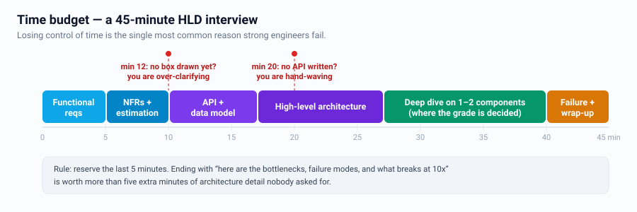
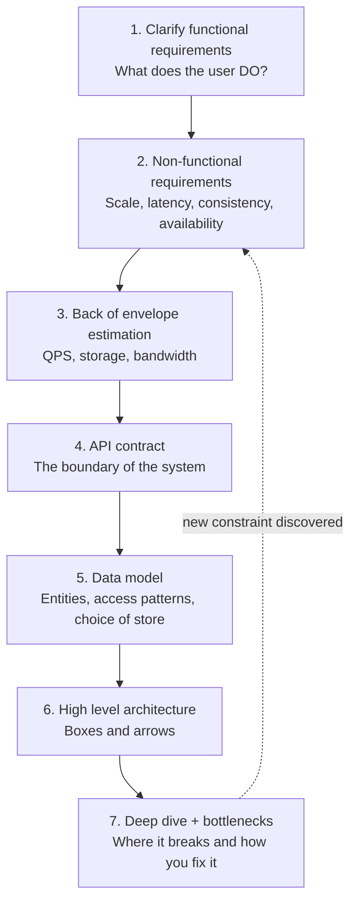
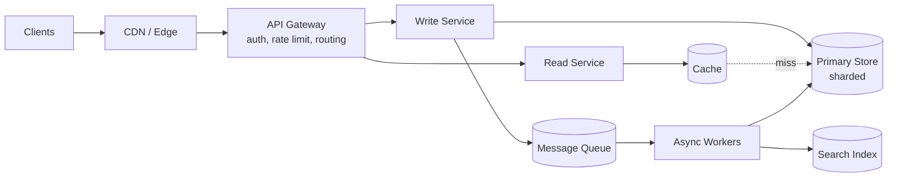
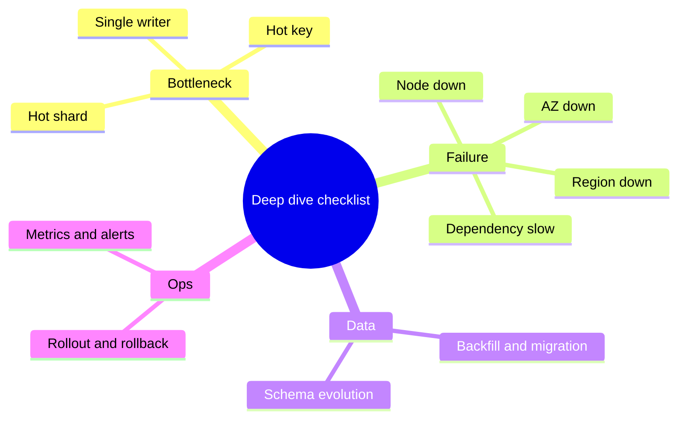

# The Interview Framework

A 45–60 minute HLD interview has a predictable shape. Losing control of time is the
single most common reason strong engineers fail.

---

## Timeboxing



**Rule of thumb:** if 12 minutes have passed and you have not drawn a box, you are
over-clarifying. If 20 minutes have passed and you have not written a single API,
you are hand-waving.

---

## The 7 steps



---

### Step 1 — Functional requirements (5 min)

Write down **3 to 5** core use cases and get explicit agreement. Everything else is
"out of scope for now, I will mention it at the end."

Template:
```
IN SCOPE
  1. User can post a message
  2. User can follow another user
  3. User sees a home timeline of followed users
OUT OF SCOPE (call out, do not build)
  - DMs, ads, moderation, analytics dashboards
```

> **Senior signal:** you *negotiate* scope instead of accepting everything.
> "Ads and moderation would each be their own design; I'll assume they're separate
> services and focus on the read path, which is the hard part here."

---

### Step 2 — Non-functional requirements (5 min)

This is where the design is actually decided. Ask about:

| Dimension | Question to ask | What it changes |
|---|---|---|
| Scale | DAU? Reads/writes per day? | Sharding, caching, fan-out strategy |
| Read:write ratio | 100:1 or 1:1? | Read replicas, precompute vs on-demand |
| Latency | p99 target for the core action | Cache, CDN, geo, sync vs async |
| Consistency | Is stale data acceptable? For how long? | SQL vs NoSQL, quorum, replication mode |
| Availability | 99.9% or 99.99%? | Multi-AZ, multi-region, failover story |
| Durability | Can we ever lose a record? | Replication factor, WAL, ack settings |
| Data retention | 30 days or forever? | Tiering, archival, cost |
| Access pattern | Point lookup? Range? Full text? | Choice of database and index |

> **Senior signal:** you convert vague words into numbers.
> Interviewer: "it should be fast." You: "Let's target p99 < 200 ms for the feed read
> and allow up to 5 s of staleness for the write to become visible — does that work?"

---

### Step 3 — Estimation (3 min)

See [Requirements & estimation](02-requirements-and-estimation.md). Do it fast and
round aggressively. The number itself matters less than what you *conclude* from it.

Always end estimation with a **conclusion sentence**:
> "So ~10 K write QPS and 1 M read QPS, and 40 TB/year. That means a single DB won't
> hold the write volume — I'll shard — and the read path must be cache-served."

---

### Step 4 — API contract (5 min)

Define the boundary before internals. It forces clarity.

```
POST /v1/posts            {text, mediaIds}          -> {postId}
GET  /v1/feed?cursor=&limit=20                      -> {items[], nextCursor}
POST /v1/users/{id}/follow                          -> 202
```

Mention: auth (bearer token / userId from token, **never** from body), pagination
(cursor, not offset), idempotency key on writes, and versioning.

---

### Step 5 — Data model (5 min)

List entities, their access patterns, and *then* choose the store.

```
Post(post_id PK, author_id, text, created_at, media_ids)
   access: get by post_id; list by author_id ordered by created_at desc
Follow(follower_id, followee_id, created_at)
   access: list followees of a user; list followers of a user  -> two tables/indexes
```

> Choose the database **after** writing the access patterns, and say why.

---

### Step 6 — High level architecture (10 min)

Draw left to right: client → edge → service → data. Keep it to 8–12 boxes.



Narrate the **request path**, not the boxes: "A write comes in, gateway authenticates,
write service validates and persists to the sharded store, then emits an event; workers
consume it to update the cache and the search index."

---

### Step 7 — Deep dive & failure (13 min)

Pick the component that is (a) hardest and (b) most interesting. Usually one of:
fan-out strategy, sharding key, cache invalidation, exactly-once processing, or the
real-time delivery path.

Then proactively cover:



---

## Sentences that carry the interview

- "Let me restate the requirements to make sure we agree."
- "Before I choose a database, let me list the access patterns."
- "The trade-off here is X vs Y; I'm choosing X because the requirement said Z."
- "This is the bottleneck. Here's how I'd detect it and here's how I'd fix it."
- "If I had more time I'd also cover ___ — do you want me to go there or deeper here?"

---

## Anti-patterns

| Anti-pattern | Fix |
|---|---|
| Jumping to Kafka/Redis in minute 2 | Derive the need from a requirement first |
| Drawing 30 boxes | 8–12 boxes; add detail only in deep dive |
| Silent drawing | Narrate the request path continuously |
| "We'll use microservices" with no boundaries | Name the services and their data ownership |
| Ignoring the interviewer's hint | Any question they ask twice is a hint — go there |
| No numbers | Every claim gets a rough number attached |
