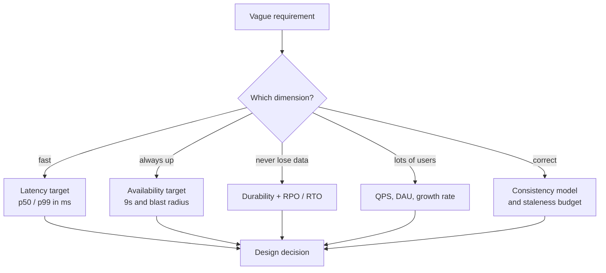
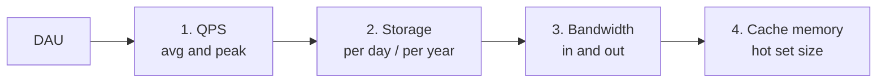

# Requirements Gathering & Back-of-Envelope Estimation

Estimation is not about being right. It is about **deriving a design constraint from a
number** in under three minutes.

---

## Part 1 — Turning vague requirements into design drivers



### The requirement → decision table

| They say | You ask | Design consequence |
|---|---|---|
| "Real time" | "Sub-second, or a few seconds?" | WebSocket/SSE push vs polling |
| "Fast search" | "Prefix, full text, or exact?" | Trie/Redis vs Elasticsearch vs B-tree |
| "Can't lose orders" | "RPO = 0? Sync replication acceptable?" | Sync replica, WAL, outbox pattern |
| "Global users" | "Read-local or write-local?" | Geo-replication, CRDTs, region pinning |
| "Handles spikes" | "Peak-to-average ratio?" | Queue buffering, autoscale, load shedding |
| "Analytics" | "Real-time or T+1?" | Stream processing vs batch warehouse |

---

## Part 2 — The numbers you must know cold

### Time
```
1 day      = 86,400 s   ≈ 10^5 s
1 month    ≈ 2.6 M s
1 year     ≈ 31.5 M s   ≈ 3 x 10^7 s
```
**Killer shortcut:** `1 M requests/day ≈ 12 QPS`. So `1 B/day ≈ 12,000 QPS`.

### Size
```
1 char (ASCII)        1 B
UUID                  16 B binary / 36 B string
Timestamp             8 B
Typical row/record    ~100 B - 1 KB
Tweet-like post       ~300 B
Thumbnail             ~10 KB
Web page              ~1 MB
Photo                 ~1-5 MB
1 min of 1080p video  ~50 MB
```

### Powers of two
```
2^10 = KB   |  2^20 = MB   |  2^30 = GB   |  2^40 = TB   |  2^50 = PB
```

### Latency (order of magnitude, memorize the ratios)
```
L1 cache                     0.5 ns
Main memory                  100 ns
SSD random read              100 us      (~1000x memory)
Round trip in same DC        0.5 ms
Disk seek (HDD)              10 ms
Round trip US -> EU          ~150 ms
```

### Single-machine capacities (safe interview defaults)
```
Modern server              64-256 GB RAM, 8-64 cores
Redis node                 ~100 K ops/s   (up to 1 M with pipelining)
PostgreSQL / MySQL node    ~5-10 K writes/s, ~50 K reads/s (cached)
Cassandra node             ~10-50 K writes/s
Kafka broker               ~100 MB/s+ per broker, millions msg/s per cluster
NGINX / LB                 ~100 K+ concurrent connections
App server                 ~1-5 K RPS for simple JSON, ~10 K conns for WebSocket
```

---

## Part 3 — The 4-number drill

For every problem, compute these four. Nothing else.



### 1. QPS
```
write QPS = DAU x writes_per_user_per_day / 86,400
read  QPS = write QPS x read:write ratio
peak QPS  = avg QPS x 2 to 5      (use 3x unless told otherwise)
```

### 2. Storage
```
storage/day  = write QPS x 86,400 x bytes_per_record
storage/year = storage/day x 365
replicated   = storage x replication_factor (usually 3)
```

### 3. Bandwidth
```
ingress = write QPS x avg request size
egress  = read  QPS x avg response size
```

### 4. Cache size (hot set)
Apply the **80/20 rule**: 20% of data serves 80% of requests.
```
cache size = daily_read_volume x 0.2
```
Then: `nodes = cache size / usable RAM per node` (assume ~64 GB usable).

---

## Worked example — Twitter-like service

**Given:** 200 M DAU, each user posts 2 tweets/day, reads 100 tweets/day.
Tweet ≈ 300 B of text; 10% of tweets have a 1 MB image.

<details>
<summary>Work it out yourself first, then expand</summary>

**Writes**
```
400 M tweets/day  ->  400 M / 10^5 = 4,000 write QPS
peak = 3x          =  12,000 write QPS
```

**Reads**
```
200 M x 100 = 20 B reads/day -> 20,000 M / 10^5 = 200,000 read QPS
peak = 600,000 read QPS
read:write = 50:1  -> READ HEAVY -> cache + precompute the read path
```

**Storage**
```
text  : 400 M x 300 B          = 120 GB/day   -> ~44 TB/year
media : 40 M  x 1 MB           = 40 TB/day    -> ~14.6 PB/year
=> media dominates by 300x -> blob store + CDN, NOT the database
=> with 3x replication: ~44 PB/year of media. Needs lifecycle tiering.
```

**Bandwidth**
```
ingress ~ 40 TB/day / 86,400 ≈ 460 MB/s
egress  ~ 200 K QPS x ~5 KB   ≈ 1 GB/s of API + far more media via CDN
=> CDN is mandatory, not optional
```

**Cache**
```
hot set = 20% of daily reads' distinct tweets. Assume 20% of 400 M new
tweets are hot = 80 M x 300 B ≈ 24 GB of text -> trivially cacheable.
=> Cache the *timelines*, which are bigger, not just the tweets.
```

**Conclusions to say out loud**
1. 50:1 read heavy → precompute timelines (fan-out on write) + cache.
2. 12 K peak write QPS → single RDBMS won't do; shard by user_id.
3. Media 300x larger than text → object storage + CDN; DB stores only URLs.
4. Egress > 1 GB/s → CDN and aggressive client-side caching.

</details>

---

## Part 4 — Availability math

| SLA | Downtime/year | Downtime/month | What it implies |
|---|---|---|---|
| 99% | 3.65 days | 7.2 h | Single node, manual recovery |
| 99.9% | 8.8 h | 43 min | Multi-AZ, automated failover |
| 99.99% | 52 min | 4.3 min | Multi-AZ + redundancy everywhere, no manual steps |
| 99.999% | 5.3 min | 26 s | Multi-region active-active, cell architecture |

**Serial dependencies multiply:**
`A(99.9%) → B(99.9%) → C(99.9%)` gives `0.999^3 = 99.7%`.
This is *the* argument for reducing synchronous dependency chains, adding
fallbacks/caches, and making non-critical calls async.

**Redundancy adds nines:** two independent 99% components in parallel →
`1 - 0.01^2 = 99.99%`.

---

## Part 5 — Estimation traps

| Trap | Reality |
|---|---|
| Using average load only | Design for peak; state the peak multiplier |
| Forgetting replication factor | Multiply storage by 3 |
| Forgetting indexes | Indexes can be 10–50% of table size |
| Forgetting metadata/overhead | Add ~20% for row overhead, headers, protocol |
| Treating media like rows | Media goes to blob storage; only the URL is a row |
| Ignoring growth | State the horizon: "sized for 2 years at 50% YoY" |
| Precision theatre | 86,400 → 10^5. Nobody wants long division |
