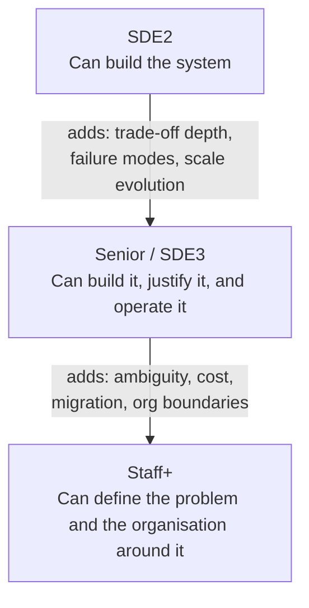
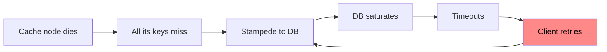
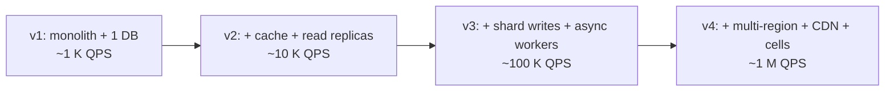

# SDE2 vs Senior: What Is Actually Graded

Both levels get the same question. The **bar** is different, not the problem.

---

## The level ladder

---

## Signal-by-signal comparison

| Dimension | SDE2 bar | Senior bar |
|---|---|---|
| **Requirements** | Gathers requirements when prompted | Drives scoping, pushes back, names what is *out* of scope and why |
| **Estimation** | Can compute QPS/storage if asked | Computes unprompted and **derives a decision** from each number |
| **Architecture** | Correct, standard components, data flows properly | Same, plus explains why each component exists and what happens without it |
| **Data store choice** | Picks a reasonable DB | Lists access patterns first, compares 2 options, states the loss |
| **Trade-offs** | Mentions CAP, mentions consistency | Quantifies: "5 s staleness costs us X, gains us Y; here's the fallback" |
| **Failure** | Handles a node going down | Cascading failure, partial failure, retry storms, thundering herd, poison messages, backpressure |
| **Bottlenecks** | Identifies one when asked | Identifies proactively and names the *next* bottleneck after the fix |
| **Evolution** | Designs for the stated scale | Shows the design at 10x and 100x, and what breaks first |
| **Data lifecycle** | Stores data | Migration, backfill, schema evolution, retention, GDPR delete |
| **Operations** | Mentions monitoring | Names specific metrics/alerts/SLOs, rollout strategy, rollback plan |
| **Cost** | Rarely mentions | Ballparks cost and picks cheaper option when it's good enough |
| **Communication** | Answers well | Manages time, checks in, offers choices, recovers from being wrong gracefully |

---

## The five things that most reliably separate the levels

### 1. Deriving instead of reciting

- SDE2: "We'll add Redis for caching."
- Senior: "Read:write is 50:1 and 20% of keys serve 80% of traffic, so a ~30 GB
  cache gets us ~90% hit rate and drops DB read QPS from 200 K to 20 K — which one
  sharded Postgres fleet can serve. The cost is up to 60 s of staleness on profile
  edits, which the product accepts."

### 2. Naming the failure mode *before* being asked

Senior response: *"That retry loop is the real risk. I'd add request coalescing /
single-flight on cache miss, jittered exponential backoff, a circuit breaker, and
consistent hashing so one node's death only invalidates 1/N of the keyspace."*

### 3. Showing the scale evolution

Always be able to answer "what does this look like at 100x?"

And name what breaks at each boundary: connection limits → write throughput →
cross-shard queries → cross-region latency and consistency.

### 4. Owning data over time

Senior engineers get asked: *"You need to change the shard key. Now what?"*
Have an answer: dual-write, backfill, shadow-read verify, cut over, clean up.
See [Distributed systems patterns](../02-patterns/02-distributed-systems-patterns.md#online-schema--shard-migration).

### 5. Cost and simplicity

The strongest senior move is often **removing** a component:
> "We could use Kafka here, but the volume is 200 QPS and consumers are in the same
> service. A DB-backed outbox table with a poller is simpler, gives us transactional
> guarantees for free, and costs nothing to operate. I'd move to Kafka when we need
> multiple independent consumers or exceed ~5 K events/s."

---

## Scoring rubric (self-assess your mock interviews)

| Score | Meaning |
|---|---|
| 1 | Missed core requirements; design doesn't work |
| 2 | Works at small scale; major gap at stated scale |
| 3 | **SDE2 hire.** Correct, standard design; trade-offs on request |
| 4 | **Senior hire.** Proactive trade-offs, failure modes, evolution, ops |
| 5 | Staff. Reframes the problem, cost/org aware, teaches the interviewer something |

Grade yourself on: Scoping · Estimation · Architecture · Data · Trade-offs ·
Failure · Ops · Communication.

---

## Common failure reasons by level

**SDE2 rejections**
- Never wrote an API or data model
- Chose a database with no reason
- Design doesn't actually meet the stated QPS
- Went silent for long stretches

**Senior rejections**
- Design is correct but "textbook" — no depth when pushed
- Cannot explain *why not* the alternative
- No failure/operational story
- Over-engineered: 12 microservices and Kafka for 100 QPS
- Defensive when challenged instead of reasoning openly
