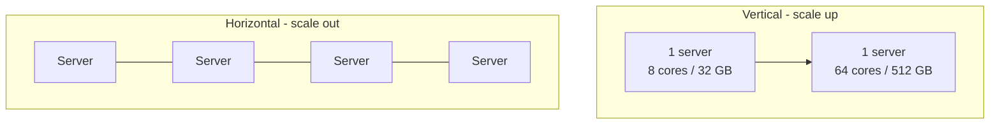
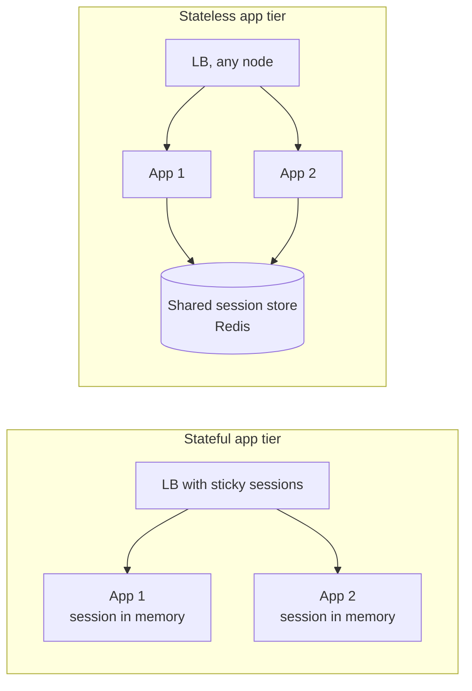
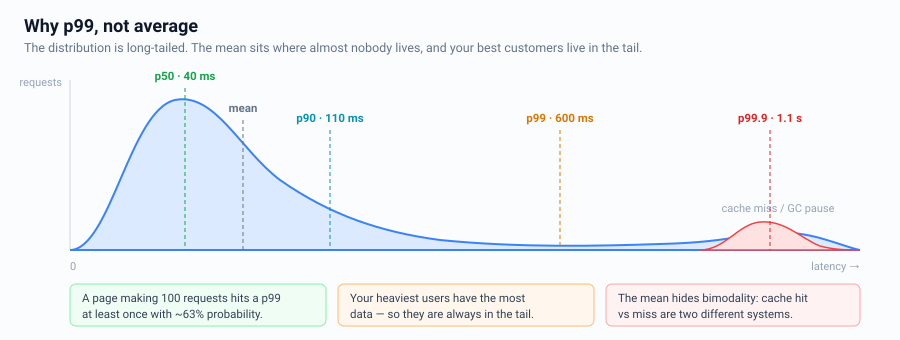
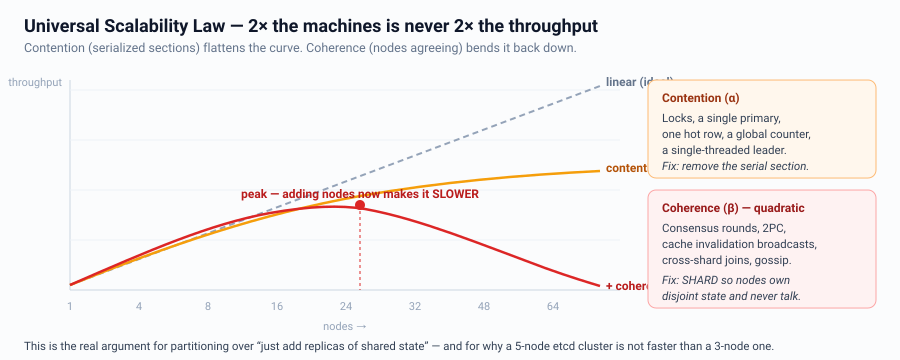
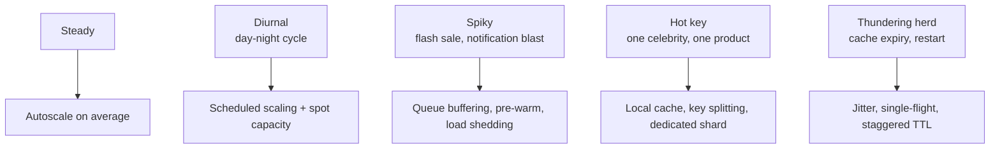
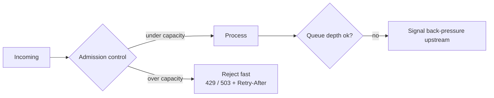

# Scalability & Performance Fundamentals

The vocabulary everything else is built on.

---

## Vertical vs Horizontal scaling

| | Vertical | Horizontal |
|---|---|---|
| Complexity | Trivial | High: distribution, consistency, partial failure |
| Ceiling | Hard hardware limit | Effectively unbounded |
| Availability | Single point of failure | Redundant by construction |
| Cost curve | Super-linear at the top end | Roughly linear |
| Best for | Databases early on, low-traffic systems | Stateless app tier, always |

**Interview line:** *"I'll scale the stateless tier horizontally from day one and scale
the database vertically until ~X QPS, then shard. Vertical scaling buys real time and
avoids premature complexity."*

---

## Stateless vs Stateful

Statelessness is what makes autoscaling, rolling deploys, and instant failover possible.
Push state into: a cache, a database, or the client (signed JWT).

**Where state must live somewhere:** WebSocket connections, in-progress uploads,
leader roles. Handle those with a connection registry, resumable uploads, and a
coordination service respectively.

---

## Latency vs Throughput

- **Latency** — time for one request. Measured at percentiles.
- **Throughput** — requests per second the system sustains.

They trade off: batching raises throughput and raises latency. Adding parallelism
raises throughput; adding queueing raises latency under load.

### Always talk in percentiles

p99 matters more than average because:
- A user making 100 requests per page-load almost certainly hits a p99.
- Your heaviest users (most valuable) have the most data → slowest requests.
- Averages hide bimodal behaviour (cache hit vs miss).

**Tail latency amplification:** a request fanning out to 100 services, each with a
1% chance of being slow, is slow ~63% of the time. Fixes: hedged requests, fan-out
reduction, timeouts + partial results.

---

## Little's Law — the most useful formula in HLD

$$L = \lambda \times W$$

*Concurrency = arrival rate × time in system*

**Uses:**
- Threads needed: `10,000 RPS × 0.05 s = 500 concurrent requests` → size the pool.
- DB connections: `2,000 QPS × 0.01 s = 20 connections`. (Now explain why the team's
  500-connection pool is *causing* the outage.)
- Queue depth: if consumers process 1 K/s and producers push 1.2 K/s, the queue grows
  forever — you need backpressure or more consumers.

---

## The Universal Scalability Law (why 2x machines ≠ 2x throughput)

Two penalties limit scaling:
1. **Contention** — serialized sections (locks, a shared counter, one hot row).
2. **Coherence** — nodes must agree (consensus, cache invalidation broadcasts, 2PC).

Coherence cost is *quadratic*, so past a point adding nodes makes things **slower**.
This is why you shard (partition state so nodes don't coordinate) rather than
just adding replicas of shared state.

---

## Amdahl's Law

Speedup is capped by the serial fraction. If 5% of the request is inherently serial,
you can never be more than 20x faster no matter the parallelism. Find the serial part:
usually a lock, a single primary, a global sequence generator, or a single-threaded
leader.

---

## Load patterns you must design for

---

## Back-pressure and load shedding

When the system is overloaded, doing *less* work is correct.

Rules:
- **Bounded queues only.** An unbounded queue converts a throughput problem into an
  unbounded latency problem, then an OOM.
- **Fail fast beats timing out.** A rejected request costs nothing; a timed-out
  request consumed full resources and still failed.
- **Shed by priority.** Drop analytics before checkout.

---

## Where performance actually comes from

Ordered by typical payoff:

1. **Don't do the work** — cache, precompute, CDN, conditional requests (ETag/304).
2. **Do it later** — async/queue anything not needed for the response.
3. **Do it closer** — edge/CDN, colocate compute with data, connection reuse.
4. **Do less of it** — pagination, projection (select only needed columns), compression,
   avoid N+1, batch.
5. **Do it in parallel** — fan-out reads, shard writes.
6. **Do it faster** — better index, better algorithm, better hardware.

---

## Interview checklist

- [ ] Stated stateless app tier + where state lives
- [ ] Quoted p99, not average
- [ ] Used Little's Law once (pools, queues, or connections)
- [ ] Named the serial bottleneck
- [ ] Described behaviour under overload (shedding/back-pressure)
- [ ] Named the *next* bottleneck after the current fix
