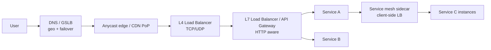
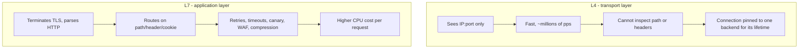
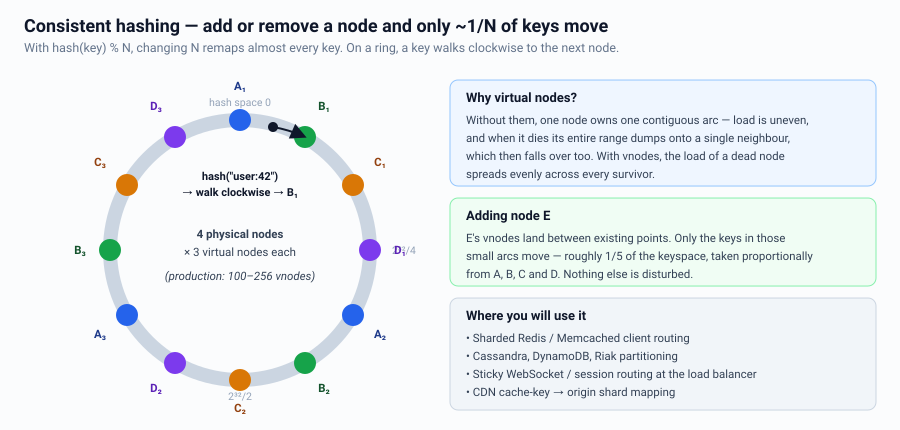
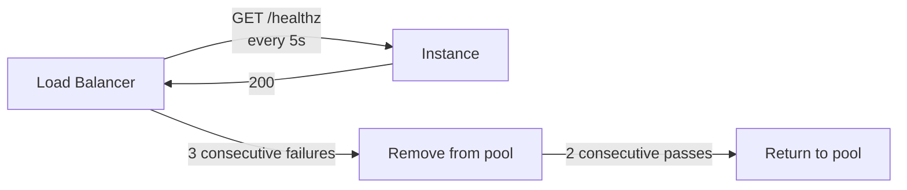
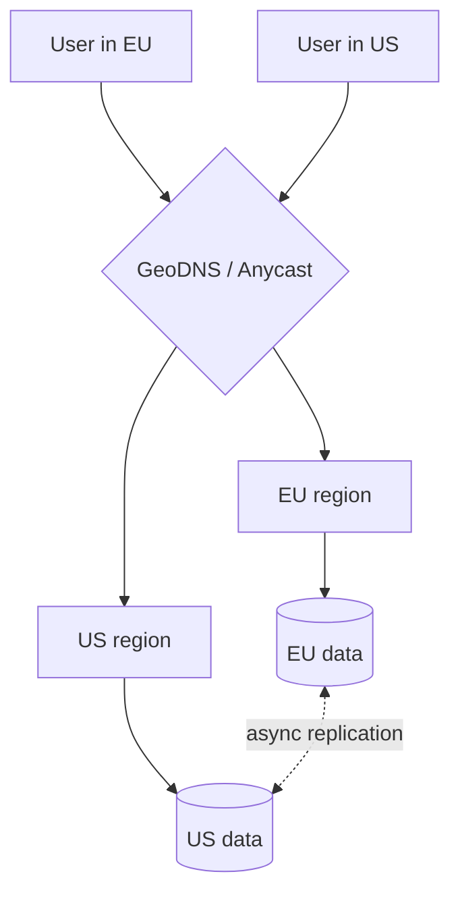
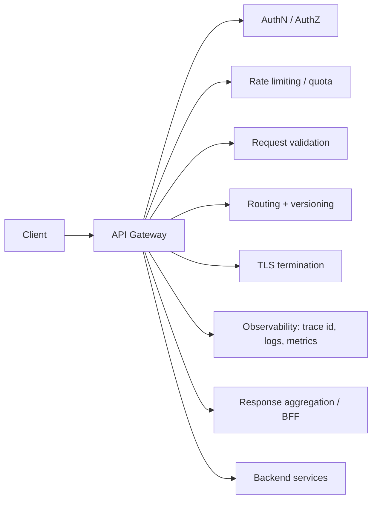

# Load Balancing & Traffic Management

---

## Where load balancing happens

| Layer | Example | Decides on | Use for |
|---|---|---|---|
| DNS / GSLB | Route 53, NS1 | Client geo, health | Region selection, disaster failover |
| Anycast | Cloudflare, CloudFront | BGP routing | DDoS absorption, nearest PoP |
| L4 | NLB, IPVS, Maglev | IP + port | Raw throughput, non-HTTP, TLS passthrough |
| L7 | ALB, NGINX, Envoy | Path, header, cookie, method | Routing, canary, auth, rate limit, retries |
| Client-side | gRPC LB, Envoy sidecar | Live per-endpoint stats | Internal service-to-service, no extra hop |

**Interview tip:** DNS-level LB is *not* a failover mechanism you can rely on for
seconds-level recovery — clients and resolvers cache records past the TTL. For fast
failover use health-checked L4/anycast, not DNS.

---

## L4 vs L7

---

## Algorithms

| Algorithm | How | When |
|---|---|---|
| Round robin | Next in list | Homogeneous backends, uniform requests |
| Weighted RR | Proportional to capacity | Mixed instance sizes, canary % |
| Least connections | Fewest active conns | Long-lived / variable-duration requests |
| Least response time | Latency-aware | Heterogeneous backend performance |
| **Power of two choices** | Pick 2 at random, choose the less loaded | Best default at scale — near-optimal with almost no coordination |
| IP / consistent hash | Hash of key → backend | Cache affinity, session stickiness, sharded backends |

> **Power of two random choices** is a great senior-level name-drop: it avoids the
> herd effect of "always pick the least loaded" while getting most of the benefit.

---

## Consistent hashing

The mechanism behind sharded caches, sharded databases, and sticky routing.

**Why:** with `hash(key) % N`, changing N remaps ~all keys. With consistent hashing,
adding/removing a node remaps only ~`1/N` of keys.

**Virtual nodes:** each physical node owns many points on the ring so load is even
and removal spreads across all remaining nodes instead of dumping onto one neighbour.
Typical: 100–256 vnodes per physical node.

**Where it shows up:** Memcached/Redis client sharding, Cassandra/DynamoDB partitioning,
CDN cache-key routing, sticky WebSocket routing.

---

## Health checks

- **Shallow (liveness):** is the process alive? Cheap, frequent.
- **Deep (readiness):** can it serve? Checks DB/cache connectivity.
  **Danger:** if all instances deep-check the same failing DB, the LB removes the entire
  fleet and turns a degraded system into a total outage.
  → Use **outlier detection / panic mode**: if more than X% of hosts are unhealthy,
  ignore health checks and send traffic anyway.
- Also implement **graceful shutdown**: fail readiness → drain connections → exit.

---

## Sticky sessions

Avoid if possible (breaks statelessness, causes uneven load, breaks deploys).
Legitimate uses: WebSocket connections, in-progress multipart uploads, local cache
affinity. Implement with consistent hashing rather than a cookie when you can.

---

## Global traffic management

| Topology | Description | Trade-off |
|---|---|---|
| Active–passive | One region serves, other on standby | Simple; wasted capacity; RTO in minutes |
| Active–active, read-local | Writes to home region, reads anywhere | Fast reads; stale reads; write latency for far users |
| Active–active, write-anywhere | Both accept writes | Needs conflict resolution — CRDTs, LWW, or partitioned key ownership |
| Cell-based | Many independent slices, users pinned to a cell | Small blast radius; routing layer complexity |

**Cell architecture** is a strong senior topic: partition the entire stack (not just
the DB) into cells of N users. A bad deploy or poison workload takes down one cell,
not the fleet. Used by AWS, Slack, Salesforce.

---

## API Gateway responsibilities

Keep **business logic out** of the gateway. It should be a cross-cutting-concerns
layer, not a service. When per-client shaping is needed, use a **BFF**
(Backend-For-Frontend) per client type: web, mobile, partner API.

---

## Interview checklist

- [ ] Named which LB layer and why (L4 vs L7)
- [ ] Chose an algorithm and justified it
- [ ] Explained consistent hashing if anything is sharded
- [ ] Covered health checks + graceful drain
- [ ] Said what happens when a whole AZ/region fails
- [ ] Kept the app tier stateless so any LB choice works
