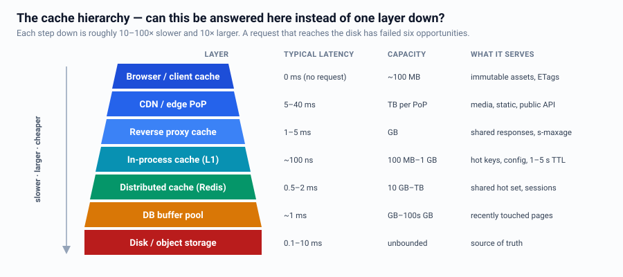
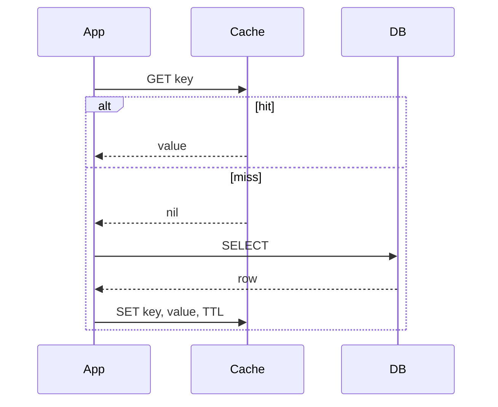
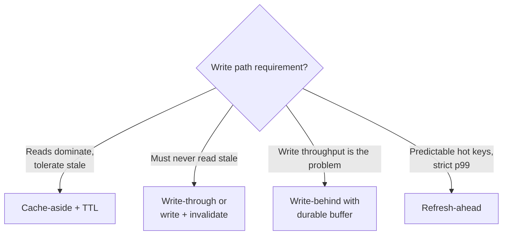
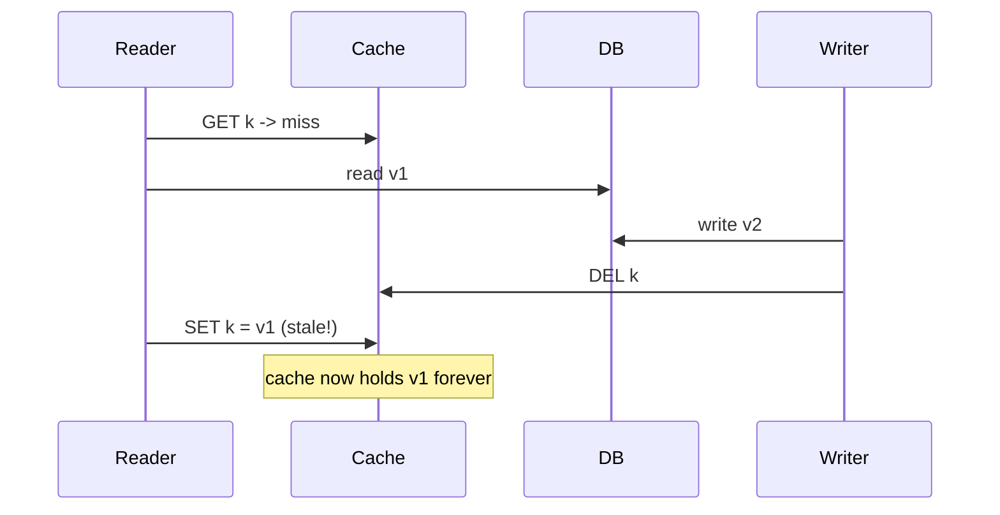
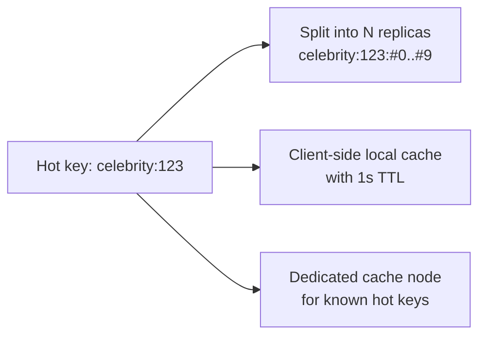

# Caching

Caching is the highest-leverage move in most designs — and the most common source of
subtle bugs. Know both halves.

---

## The cache hierarchy



Each layer up is ~10–100x faster and ~10x smaller. Ask at every layer: *can this
request be answered here instead of one layer down?*

---

## Caching patterns

### Cache-aside (lazy loading) — the default


+ Only cached data is what's actually requested; cache failure is survivable.
− First request per key is slow; risk of stampede; app owns the invalidation logic.

### Read-through
Cache library/proxy loads from DB on miss. Same shape, logic lives in the cache layer.

### Write-through
Write to cache **and** DB synchronously. Cache always fresh; write latency increases;
caches data that may never be read.

### Write-behind (write-back)
Write to cache, flush to DB asynchronously. Very fast writes; **data loss if the cache
node dies before flush**. Use only for tolerable-loss data (counters, view counts) or
with a durable buffer.

### Refresh-ahead
Proactively refresh hot keys before TTL expiry. Removes tail latency for hot data;
wasted refreshes for keys that go cold.



---

## Eviction policies

| Policy | Keeps | Good for |
|---|---|---|
| LRU | Recently used | General purpose default |
| LFU | Frequently used | Stable popularity, resists scan pollution |
| **W-TinyLFU** | Frequency sketch + window | Best modern default (Caffeine) |
| FIFO | Insertion order | Simple, streaming data |
| TTL-only | Time-bounded | Correctness-driven expiry |
| Random | — | Surprisingly decent, used by Redis `allkeys-random` |

Redis `maxmemory-policy`: `allkeys-lru` for a pure cache, `volatile-ttl` when the same
instance also holds non-evictable data, `noeviction` when it is a datastore (then you
must size for the working set).

---

## Invalidation — the hard part

> "There are only two hard things in Computer Science: cache invalidation and naming things." — Phil Karlton

| Strategy | How | Notes |
|---|---|---|
| TTL | Expire after N seconds | Simplest. Staleness = TTL. Always set one as a backstop. |
| Write-invalidate | Delete key on write | Race-prone (see below); pair with short TTL |
| Write-update | Overwrite key on write | Same races; wasteful for cold keys |
| Versioned keys | `user:123:v7` | No deletion needed; old versions age out; needs a version source |
| Event-driven | CDC / outbox → invalidation consumer | Decoupled, works across services; eventual |

### The classic race



**Mitigations:** short TTL as a backstop, delayed double-delete, versioned keys, or
`SET` with a compare-and-set on a version token.

---

## The three cache failure modes (name these in an interview)

```mermaid
flowchart TD
    subgraph P1["Cache Penetration"]
        A1["Query for a key that does NOT exist"] --> A2["Every request hits DB"]
        A2 --> A3["Fix: cache negative results with short TTL<br/>+ Bloom filter of existing keys"]
    end
    subgraph P2["Cache Breakdown / Hot key expiry"]
        B1["One very hot key expires"] --> B2["Thousands of concurrent misses hit DB"]
        B2 --> B3["Fix: single-flight lock, refresh-ahead,<br/>logical expiry, never expire hot keys"]
    end
    subgraph P3["Cache Avalanche"]
        C1["Many keys expire at once OR cache cluster restarts"] --> C2["DB collapses"]
        C2 --> C3["Fix: TTL jitter, staggered warmup,<br/>circuit breaker, multi-layer cache"]
    end
```



### Single-flight / request coalescing
```
on miss:
  if acquire_lock(key, ttl=5s):        # only one loader
      value = load_from_db()
      set(key, value, ttl + jitter)
      release_lock(key)
  else:
      return stale_value or wait_briefly_and_retry()
```

### Logical (soft) expiry
Store `{value, expires_at}` with a long physical TTL. On read, if `now > expires_at`,
return the stale value immediately **and** trigger an async refresh. Users never wait;
the DB gets exactly one refresh request.

---

## Hot key / hot shard mitigation


Local (in-process) caching with a very short TTL is usually the cheapest fix: it caps
distributed-cache QPS for that key at `num_app_instances / ttl`.

---

## Sizing & metrics

```
hit_rate = hits / (hits + misses)
effective_latency = hit_rate x cache_lat + (1 - hit_rate) x db_lat
```
Example: 95% hit, 1 ms cache, 50 ms DB → `0.95(1) + 0.05(50) = 3.45 ms`.
Drop to 90% hit and it becomes 5.9 ms — **a 5-point hit-rate drop nearly doubles
latency**. That is why cache-node loss is dangerous, and why consistent hashing matters.

**Metrics to name:** hit rate, evictions/s, memory used vs max, p99 latency,
key-space misses, connected clients, replication lag.

---

## HTTP caching (free wins, often forgotten)

```
Cache-Control: public, max-age=31536000, immutable   # hashed static assets
Cache-Control: private, no-cache                     # per-user HTML
Cache-Control: public, s-maxage=60, stale-while-revalidate=300
ETag: "abc123"        -> client sends If-None-Match -> 304 Not Modified
```
`stale-while-revalidate` at the CDN is logical expiry for the web. Mention it.

---

## When NOT to cache

- Write-heavy data with low read ratio (cache churns, hit rate stays low)
- Data requiring strict read-your-writes with no tolerance for staleness — or use
  read-your-writes routing to the primary instead
- Very large objects that evict everything else (put them in blob storage + CDN)
- When the DB query is already sub-millisecond and cheap

---

## Interview checklist

- [ ] Justified the cache with the read:write ratio
- [ ] Stated the pattern (cache-aside etc.) and the TTL
- [ ] Stated the staleness budget the product accepts
- [ ] Named penetration / breakdown / avalanche and a mitigation each
- [ ] Said what happens when the cache is completely down (can the DB survive?)
- [ ] Sized the cache and estimated the hit rate
