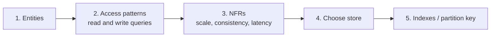
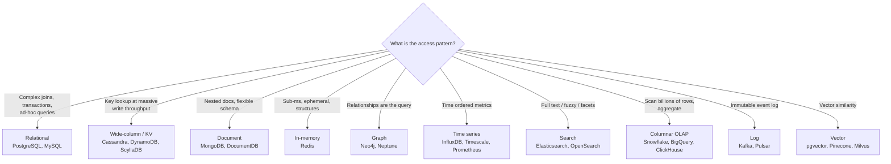
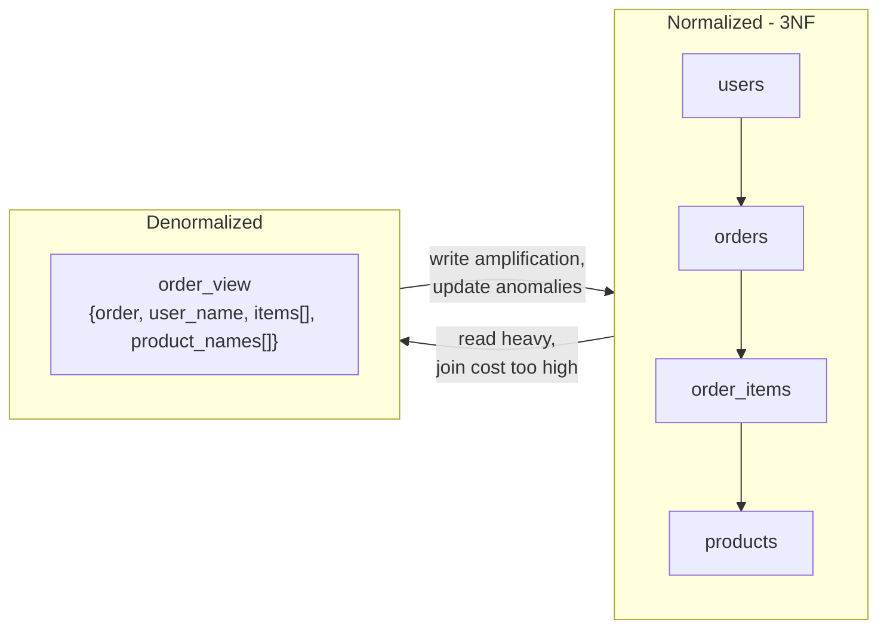
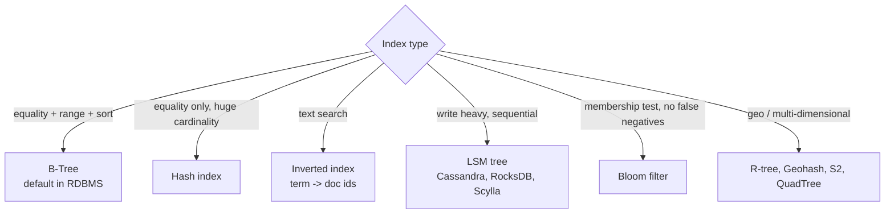
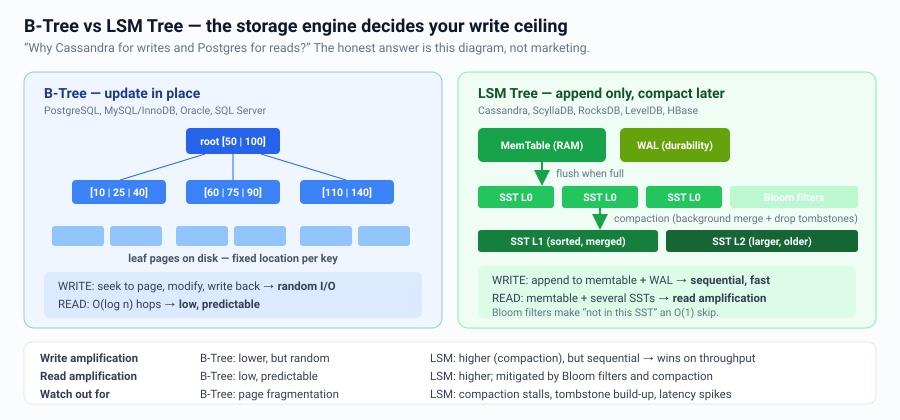

# Databases & Data Modeling

The database choice is the highest-stakes decision in an HLD interview. Never pick
first and justify later.

---

## The correct order



Write the access patterns literally:
```
AP1  get user by id                       -> point lookup, 100 K QPS
AP2  list orders of a user, newest first  -> range scan, 5 K QPS
AP3  search products by free text         -> inverted index, 2 K QPS
AP4  total revenue by region last month   -> aggregation, 10 QPS, T+1 ok
```
AP1/AP2 → KV or relational. AP3 → search engine. AP4 → OLAP warehouse.
**Three stores, one system — that's normal, and saying so is a senior signal.**

---

## The database landscape



### Quick comparison

| Store | Strength | Weakness | Reach for it when |
|---|---|---|---|
| PostgreSQL | ACID, joins, JSONB, extensions, honest | Single-writer scaling; sharding is manual | **Default.** Anything under ~10 K writes/s |
| MySQL | Same, huge ops ecosystem, Vitess for sharding | Weaker feature set than PG | Existing MySQL org, Vitess-scale sharding |
| Cassandra / Scylla | Linear write scaling, multi-DC, no SPOF | No joins, query-first modeling, eventual | Massive time-ordered writes; messages, events |
| DynamoDB | Managed, predictable p99, auto-scale | Cost at scale, rigid access patterns, 400 KB item cap | Serverless, well-known key access |
| MongoDB | Flexible docs, easy start | Schema drift; historically weak on distributed txn | Content/catalog with varied shape |
| Redis | Sub-ms, rich types, pub/sub, streams | Memory-bound, durability is best-effort | Cache, counters, leaderboards, rate limits, locks, queues |
| Elasticsearch | Full-text, facets, aggregations | Not a source of truth; near-real-time only | Search and log analytics |
| ClickHouse / BigQuery | Billions-of-row aggregates in seconds | Not for point writes/updates | Dashboards, analytics, reporting |
| S3 / blob | Infinite, cheap, durable (11 nines) | High latency, no query | Media, backups, data lake, large payloads |

---

## SQL vs NoSQL — how to actually answer

Do not say "SQL doesn't scale." Say:

> "A single Postgres primary handles ~10 K writes/s and hundreds of GB comfortably.
> We need 50 K writes/s of append-only time-ordered data with no joins, and we need
> multi-region writes. That's exactly Cassandra's shape. If we were at 5 K writes/s
> with relational queries, I'd stay on Postgres — it's simpler and gives us
> transactions for free."

| Choose relational when | Choose NoSQL when |
|---|---|
| Multi-entity transactions matter (money, inventory) | Access is a single partition key lookup |
| Query patterns will change / ad-hoc reporting | Write throughput exceeds a single node |
| Strong consistency and constraints required | Eventual consistency is acceptable |
| Data volume fits a shardable RDBMS | Petabyte scale / multi-region active-active |
| Team is small (ops burden matters) | Predictable p99 at any scale is required |

**NewSQL / distributed SQL** (Spanner, CockroachDB, TiDB, Aurora, Yugabyte) — SQL
semantics with horizontal scaling. Great senior answer for "I want ACID *and* scale";
cost is higher latency for cross-shard transactions and price.

---

## Modeling: normalized vs denormalized



| | Normalized | Denormalized |
|---|---|---|
| Writes | One place, cheap, consistent | Fan-out writes, must keep in sync |
| Reads | Joins at query time | Single read |
| Storage | Minimal | Duplicated |
| Schema change | Easy | Backfill everything |

**Rule:** normalize by default in OLTP; denormalize deliberately for a proven hot read
path, and be explicit about how you keep copies in sync (event/CDC pipeline).

---

## NoSQL modeling is query-first

Relational: model the data, then query it. Wide-column: model the **query**, then
store the data that way — one table per access pattern.

```
# AP: "get messages in a chat, newest first, paginated"
Table messages_by_chat
  PARTITION KEY  chat_id
  CLUSTERING KEY message_id (timeuuid) DESC
  columns: sender_id, text, attachments

# AP: "get all chats a user is in"
Table chats_by_user
  PARTITION KEY  user_id
  CLUSTERING KEY last_message_at DESC
```
Duplication is expected. Consistency between the two tables is your job (batch write,
or an event pipeline).

### DynamoDB single-table design
```
PK              SK                    attributes
USER#123        PROFILE               name, email
USER#123        ORDER#2024-01-05#987  total, status
ORDER#987       ITEM#456              qty, price
```
One query on `PK=USER#123, SK begins_with ORDER#` returns a user's orders sorted by
date. GSIs give you alternate access patterns.

---

## Indexing essentials



**B-Tree vs LSM — a very common senior question:**



| | B-Tree | LSM Tree |
|---|---|---|
| Writes | In-place update, random I/O | Sequential append to memtable → SST flush |
| Write amplification | Lower | Higher (compaction), but sequential |
| Read amplification | Low, predictable | Higher — may check several SSTs (Bloom filters help) |
| Space | Fragmentation | Better compression |
| Used by | Postgres, MySQL/InnoDB | Cassandra, RocksDB, LevelDB, Scylla, HBase |

Rules of thumb for indexes:
- Composite index column order matters: **equality columns first, then range/sort.**
- A **covering index** (includes selected columns) avoids the table lookup entirely.
- Every index slows writes and costs storage. Budget them.
- Low-cardinality columns (boolean, status) are poor standalone index candidates.

---

## Transactions & isolation


| Level | Prevents | Still allows |
|---|---|---|
| Read Committed | Dirty reads | Non-repeatable reads, phantoms |
| Repeatable Read | + non-repeatable reads | Phantoms (in some engines) |
| Snapshot Isolation | + phantoms | Write skew |
| Serializable | Everything | — (costs concurrency) |

Postgres default = Read Committed. MySQL/InnoDB default = Repeatable Read.

**Write skew** is the trap worth knowing: two transactions each read a state, each
decides its write is fine, and together they violate an invariant (e.g. "at least one
doctor on call"). Fix with `SELECT ... FOR UPDATE`, serializable isolation, or a
materialized conflict row.

**Optimistic vs pessimistic locking**
```sql
-- Optimistic: no locks, detect conflict at write time. Best for low contention.
UPDATE items SET qty = qty - 1, version = version + 1
WHERE id = 42 AND version = 7;   -- 0 rows affected => retry

-- Pessimistic: lock upfront. Best for high contention / long transactions.
SELECT * FROM items WHERE id = 42 FOR UPDATE;
```

---

## Connection management

Databases have hard connection limits (Postgres ~100–500 useful connections).
`200 app instances × 20-connection pool = 4000 connections` will kill the DB.
→ Use a **connection pooler** (PgBouncer, ProxySQL, RDS Proxy) in transaction-pooling
mode. Size the pool with Little's Law, not by guessing.

---

## Interview checklist

- [ ] Listed access patterns before choosing a store
- [ ] Named the specific database and one alternative, with the trade-off
- [ ] Gave the primary key / partition key **and said why it distributes evenly**
- [ ] Called out the indexes needed for each access pattern
- [ ] Stated the isolation/consistency level for critical writes
- [ ] Mentioned connection pooling if there are many app instances
- [ ] Used more than one store type if the access patterns genuinely differ
