# Replication, Partitioning & Consistency

Three separate mechanisms that people constantly conflate:

- **Replication** = same data on multiple nodes → availability + read scale.
- **Partitioning (sharding)** = different data on different nodes → write + storage scale.
- **Consistency** = what a reader is guaranteed to observe.

Real systems use all three together.

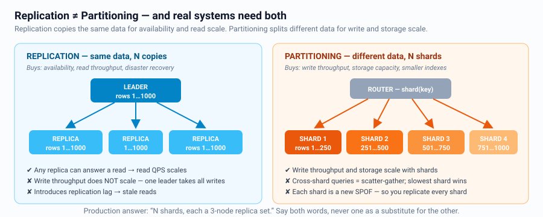

---

## Replication

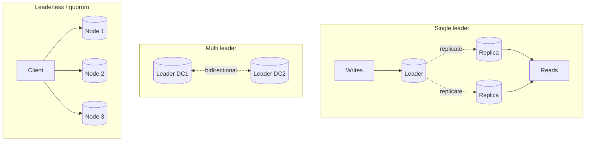

| Topology | Pros | Cons | Examples |
|---|---|---|---|
| Single leader | Simple, no write conflicts | Leader is a write bottleneck & SPOF; failover window | Postgres, MySQL, MongoDB |
| Multi leader | Local writes per region, survives partition | **Write conflicts** need resolution | Multi-DC MySQL, CouchDB |
| Leaderless | No failover, tunable, always writable | Read repair, anti-entropy, eventual | Cassandra, DynamoDB, Riak |

### Sync vs async replication

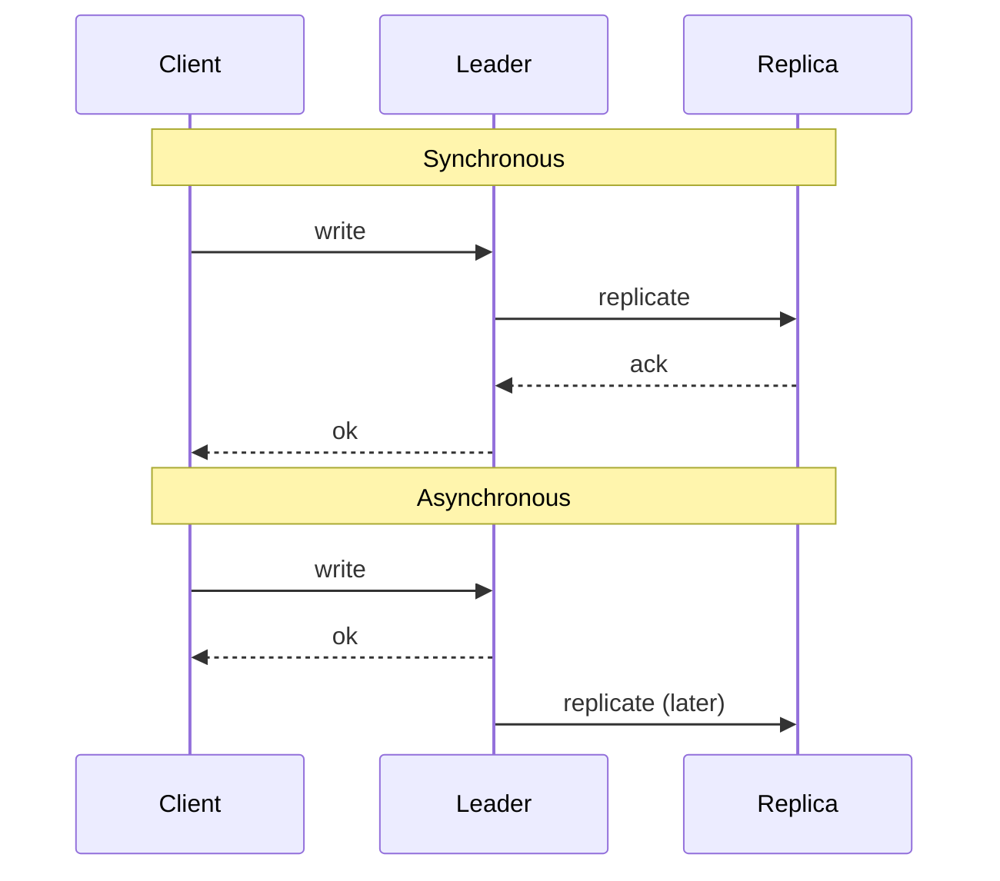

| | Sync | Async | Semi-sync |
|---|---|---|---|
| Durability | No data loss on leader failure | Can lose recent writes | Wait for 1 of N replicas |
| Latency | Slowest replica sets your latency | Fast | Middle ground |
| Availability | Replica down blocks writes | Unaffected | Degrades gracefully |

**Say this:** *"For payments I'd use semi-synchronous replication — RPO of zero for
committed writes — and accept the extra ~2 ms. For the activity feed, async is fine."*

### Replication lag problems (and fixes)

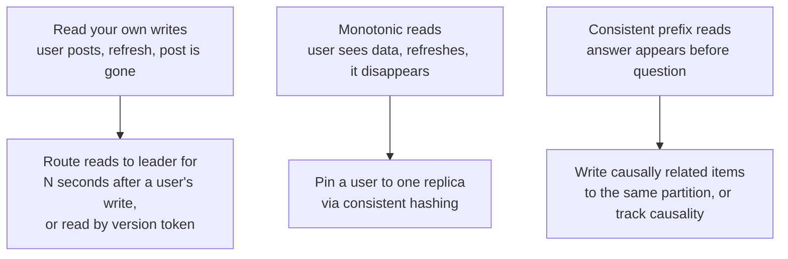

### Failover checklist
Detect (health check + timeout) → elect new leader (consensus, not "the one with the
highest IP") → reroute clients → old leader must **not** accept writes when it returns.

- **Split brain:** two leaders accept writes. Prevent with quorum-based election and
  fencing tokens (monotonically increasing epoch numbers rejected by storage if stale).
- Unacknowledged writes on the old leader are typically discarded — say this out loud.

---

## Partitioning (sharding)

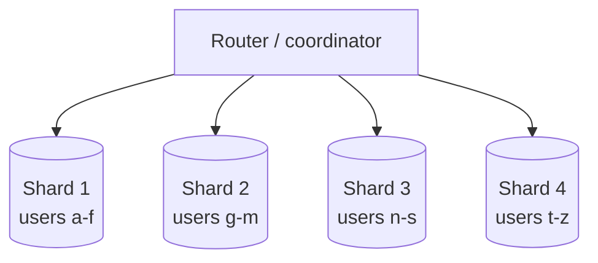

### Strategies

| Strategy | How | Pros | Cons |
|---|---|---|---|
| **Range** | Key ranges per shard | Efficient range scans | Hot spots (sequential IDs, timestamps) |
| **Hash** | `hash(key) % N` or consistent hash | Even distribution | No range queries; resharding pain (use consistent hashing) |
| **Directory / lookup** | Explicit shard map in a service | Total flexibility, easy rebalance | Lookup service is a SPOF & extra hop |
| **Geographic** | By region | Data residency, low latency | Uneven, cross-region queries hard |
| **By tenant** | One shard per customer | Isolation, easy per-tenant ops | Huge tenants need their own strategy |

### Choosing a shard key — the highest-value decision

A good shard key is:
1. **High cardinality** — many distinct values.
2. **Evenly distributed** — no value dominates.
3. **Present in most queries** — otherwise every query is a scatter-gather.
4. **Stable** — changing it means moving data.

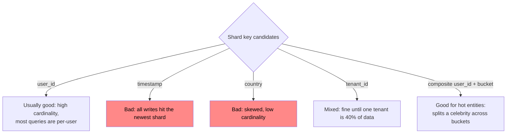

### The hard parts of sharding

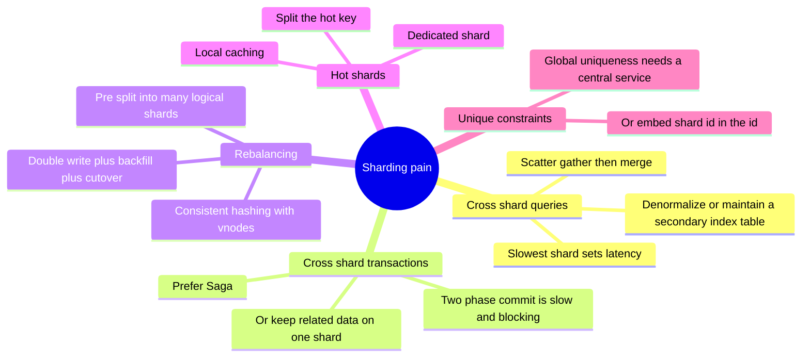

**Pre-splitting trick:** create 1024 *logical* shards up front and map them to N
*physical* nodes. Rebalancing = moving logical shard ownership, no rehashing. This is
how Vitess, Citus, and many in-house systems work — a strong senior answer.

### Global ID generation


```
Snowflake ID (64 bits): [1 unused][41 timestamp ms][10 machine id][12 sequence]
 -> time-sortable, no coordination, 4096 ids/ms/node, ~69 years of range
```
Alternatives: UUIDv7 (time-ordered, no coordination, 128 bits), DB ticket server with
step ranges, ULID. Plain UUIDv4 is fine for uniqueness but **destroys B-Tree locality**
on insert — mention that.

---

## CAP, PACELC and consistency models

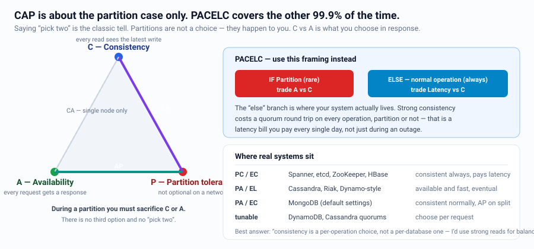

### CAP — state it correctly

During a **network partition**, you must choose Consistency or Availability. When there
is no partition, you get both. CAP is about the partition case only.

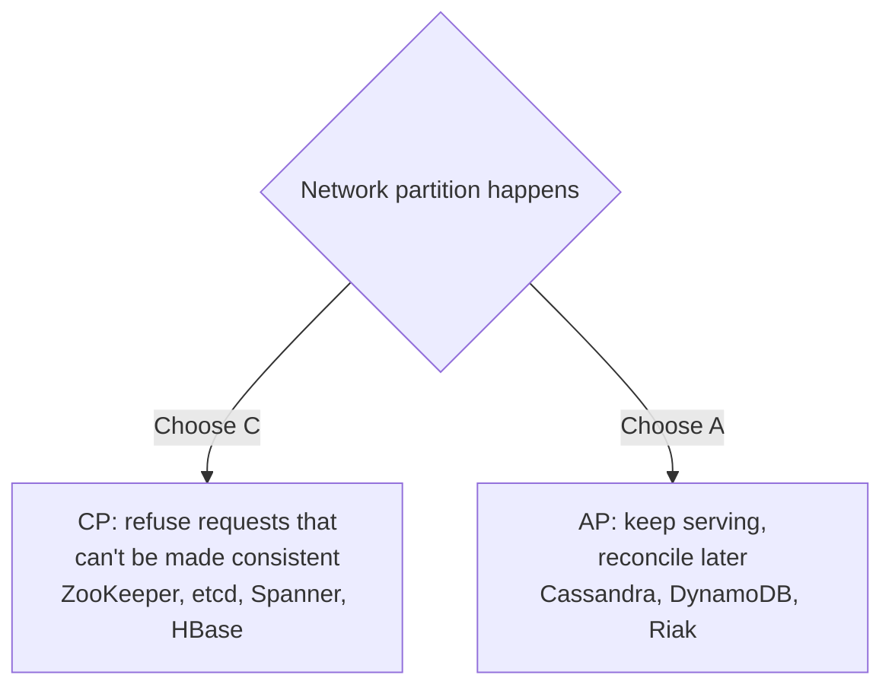

### PACELC — the better framing (use this to sound senior)

> **If Partition** → trade Availability vs Consistency.
> **Else** (normal operation) → trade Latency vs Consistency.

That "else" branch is where systems actually live 99.9% of the time. Spanner is
PC/EC (consistent always, pays latency). Cassandra is PA/EL (available and fast,
eventually consistent). DynamoDB is PA/EL by default, PC/EC with strongly consistent
reads.

### Consistency spectrum

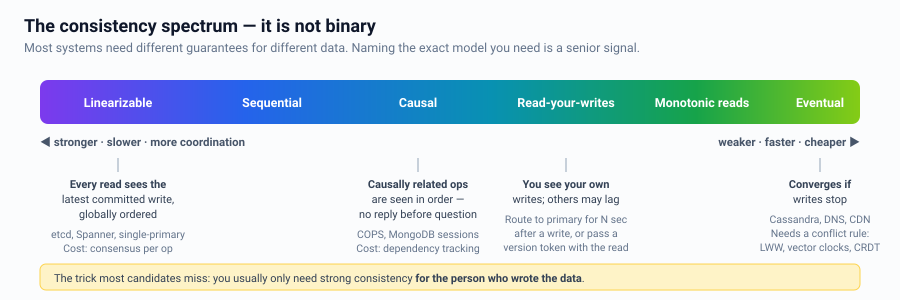

| Model | Guarantee | Cost |
|---|---|---|
| Linearizable | Every read sees the latest committed write, globally | Consensus per operation; high latency |
| Causal | Causally related ops seen in order | Dependency tracking; cheap-ish |
| Read-your-writes | You see your own writes | Session pinning or version tokens |
| Monotonic reads | Time never goes backwards for a reader | Sticky replica |
| Eventual | Converges if writes stop | Cheapest; needs conflict resolution |

### Quorum

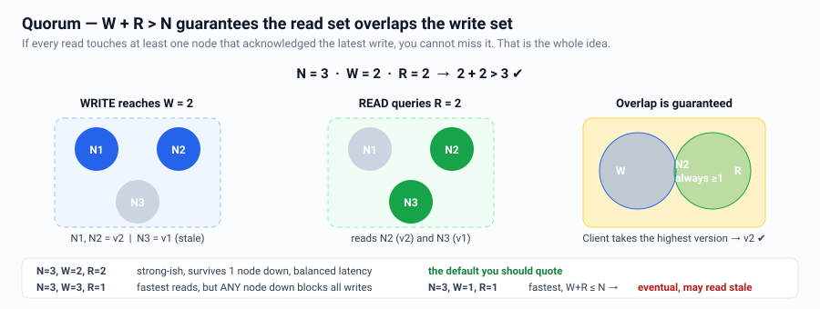

```
W + R > N  =>  read quorum overlaps write quorum => you read the latest write
N = replicas,  W = write acks required,  R = replicas read
N=3, W=2, R=2  -> strong-ish, tolerates 1 node down       (common default)
N=3, W=3, R=1  -> fast reads, writes fail if any node down
N=3, W=1, R=1  -> fastest, eventual consistency
```

### Conflict resolution
- **Last-Write-Wins** — simple, silently loses data, needs synced clocks. Fine for
  caches and presence, not for shopping carts.
- **Vector clocks / version vectors** — detect concurrency, return siblings to the app.
- **CRDTs** — data types that merge deterministically (counters, sets, sequences).
  The right answer for collaborative editing and offline-first apps.
- **Application merge** — e.g. union the shopping carts (Dynamo's classic example).

---

## Consensus, briefly

Raft / Paxos give you a linearizable replicated log via majority quorum. You almost
never implement it — you **use** it: etcd, ZooKeeper, Consul for leader election,
config, service discovery, distributed locks.

Key facts to state:
- Needs a majority: a 5-node cluster tolerates 2 failures. Use odd numbers.
- Writes cost at least one round trip to a majority — don't put it on a hot path.
- **Distributed locks are not safe without fencing tokens** (a lock can expire while
  the holder is GC-paused). Always pair the lock with a monotonically increasing token
  that the storage layer validates.

---

## Interview checklist

- [ ] Separated replication (availability) from partitioning (scale)
- [ ] Chose sync/async replication and justified it with an RPO
- [ ] Named the shard key and argued distribution + query alignment
- [ ] Named what breaks: cross-shard queries, hot shards, rebalancing
- [ ] Used PACELC, not just CAP
- [ ] Stated the consistency model per data type — it is rarely uniform
- [ ] Explained the failover and split-brain story
