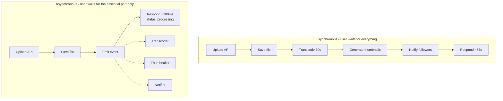
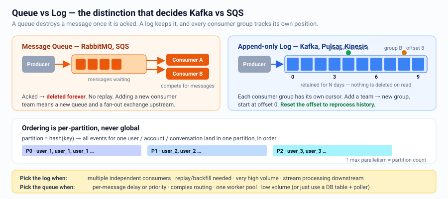
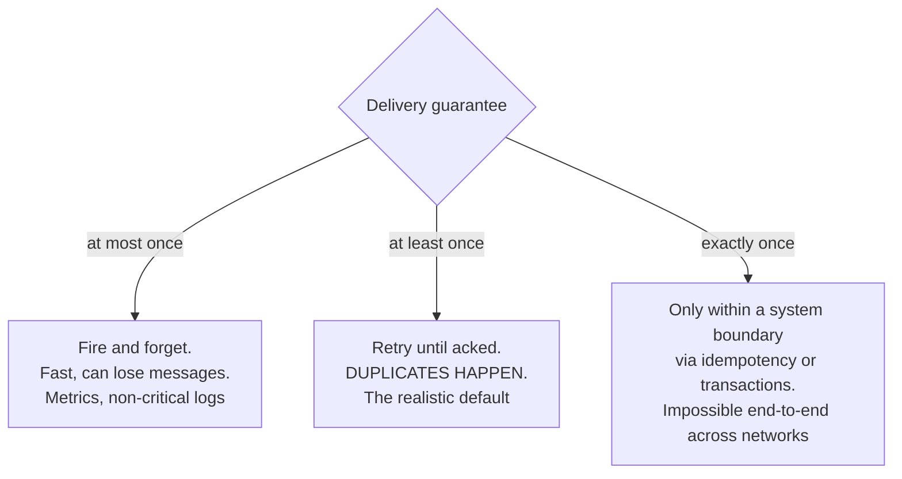
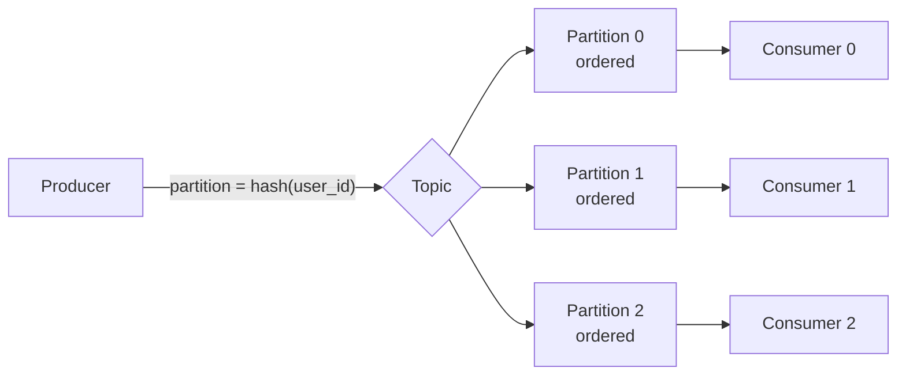
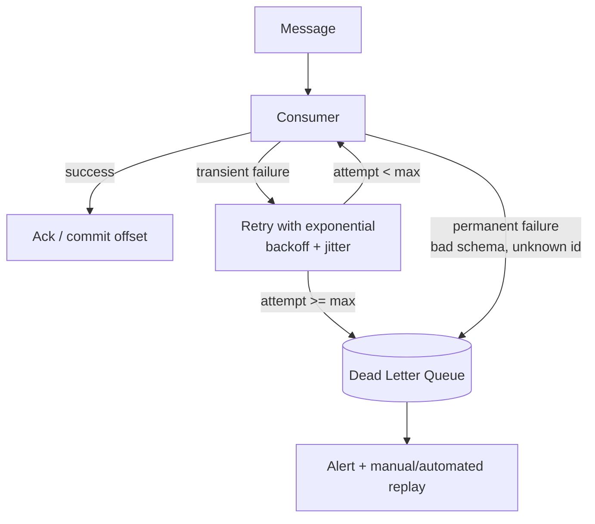
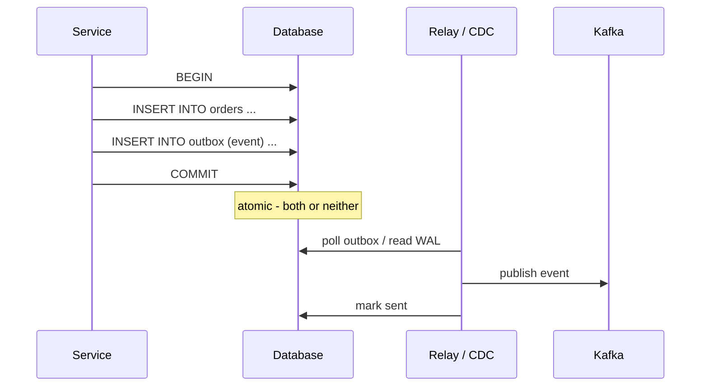
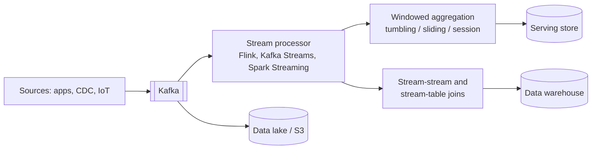
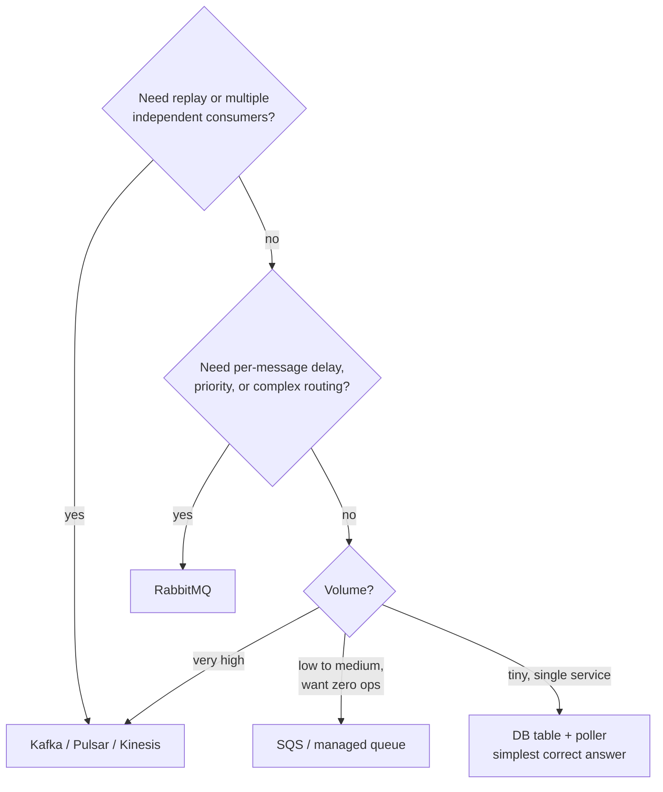

# Async Messaging, Queues & Streams

Asynchrony is how you decouple, absorb spikes, and keep the request path fast.

---

## Why go async



Benefits: latency, spike absorption (buffering), failure isolation, independent
scaling, retries.
Costs: eventual consistency, ordering complexity, duplicate handling, harder debugging,
another system to operate.

**Test for "should this be async?"**
> Does the user need this to have completed before they get a response?
> If no → async. If it must be *durable* before responding → write it durably first,
> then process async.

---

## Queue vs Log (the key distinction)



| | Queue | Log |
|---|---|---|
| Message lifetime | Deleted after ack | Retained by time/size; replayable |
| Consumers | Compete for messages | Independent groups, each with its own offset |
| Ordering | Usually none (FIFO queues exist) | Strict order **within a partition** |
| Throughput | High | Very high (sequential disk, batching) |
| Fan-out to N teams | Need N queues + a topic exchange | Native — just add a consumer group |
| Replay / reprocess | No | Yes — reset offset. Huge operational win |
| Per-message delay/priority | Native | Not native |
| Use for | Task distribution, work queues, RPC-ish jobs | Event streaming, CDC, analytics, event sourcing |

**Say this:** *"I'll use Kafka because three separate teams need the same events and we
want replay for backfills. If it were just a single background worker doing email
sends, SQS or a DB-backed queue would be simpler and cheaper."*

---

## Delivery semantics



> **The correct senior answer:** *"There is no exactly-once delivery. There is
> at-least-once delivery plus idempotent processing, which gives exactly-once
> **effect**. That is what I'll build."*

### Idempotency toolkit
```
1. Natural idempotency:   SET status='paid'    (not  balance = balance - 10)
2. Dedup table:           INSERT INTO processed(message_id) ... ON CONFLICT DO NOTHING
3. Idempotency key:       client-supplied key stored with the result; replay returns it
4. Conditional write:     UPDATE ... WHERE version = N   (optimistic concurrency)
5. Upsert with a version: only apply if incoming version > stored version
```

---

## Ordering

Global ordering does not scale. Order **within a key**:



Rules:
- Choose the partition key = the entity whose order matters (`user_id`, `account_id`,
  `chat_id`).
- **Max useful parallelism = number of partitions.** Over-provision partitions early;
  increasing them later rehashes keys and breaks ordering.
- Out-of-order arrival is still possible after retries → make consumers tolerate it
  (version checks, LWW on a sequence number).

---

## Failure handling



Essentials:
- **Visibility timeout / lease** must exceed p99 processing time, else you get
  duplicate concurrent processing.
- **Poison message** = one bad message blocking a partition forever. Cap retries, then
  DLQ. Always alert on DLQ depth — an unmonitored DLQ is a silent data-loss bug.
- **Retry topics with increasing delay** (5 s → 1 min → 10 min) avoid head-of-line
  blocking in Kafka, where you cannot ack out of order.
- **Consumer lag** is the #1 metric. Alert on lag *and* lag growth rate.

---

## The Outbox pattern (dual-write problem)

**Problem:** you must update the DB *and* publish an event. Two systems, no shared
transaction. A crash between them causes divergence.



The relay is at-least-once → consumers must be idempotent. Implement the relay with
**CDC** (Debezium reading the WAL) or a simple poller. This is one of the highest-value
patterns to know: it turns a distributed-transaction problem into a local transaction.

The mirror image is the **Inbox pattern**: consumers record processed message IDs in
the same transaction as their state change.

---

## Stream processing



Concepts worth naming:
- **Event time vs processing time** — always aggregate on event time; late events are
  normal (mobile offline, retries).
- **Watermarks** — how long you wait for late data before closing a window.
- **Windows** — tumbling (fixed, non-overlapping), sliding (overlapping), session
  (gap-based, good for user activity).
- **Backfill** — replay from the log to recompute after a bug fix. This is why logs
  beat queues for analytics.

### Lambda vs Kappa
```
Lambda: batch layer (accurate, slow) + speed layer (fast, approximate) -> merged view
        Cost: two codebases computing the same thing.
Kappa:  one streaming pipeline; reprocess by replaying the log.
        Cost: needs long retention and a capable stream processor. Usually preferred now.
```

---

## Choosing a broker



Don't forget **Redis Streams** (lightweight, consumer groups, good when Redis is
already there) and **Temporal/Cadence** when the real need is a durable long-running
*workflow* rather than a message bus.

---

## Interview checklist

- [ ] Justified async from a latency or decoupling requirement
- [ ] Chose queue vs log and said why
- [ ] Stated at-least-once + idempotent consumers explicitly
- [ ] Gave the partition key when ordering matters
- [ ] Covered retries, backoff, DLQ, poison messages
- [ ] Used the outbox pattern wherever DB write + event publish coexist
- [ ] Named consumer lag as the key metric
