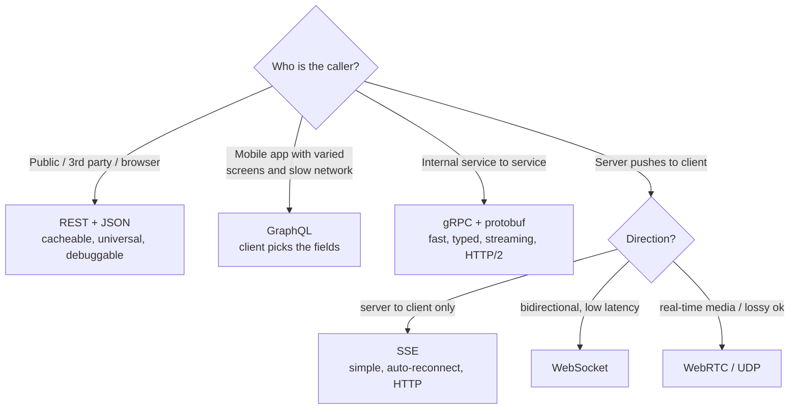
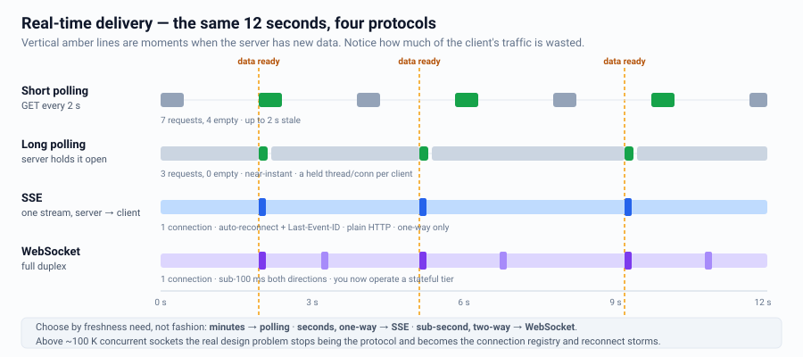
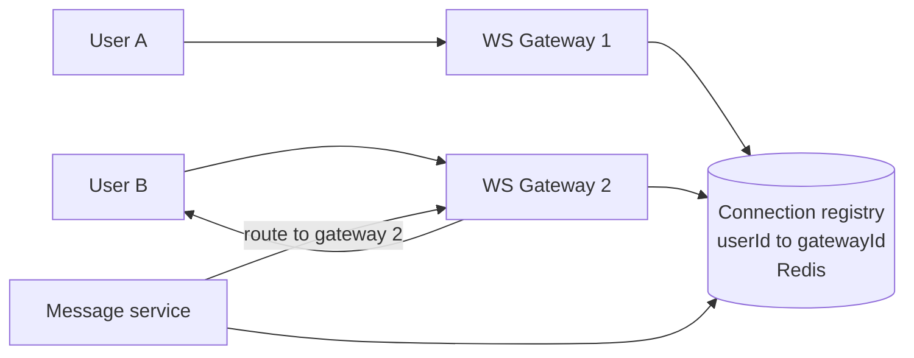
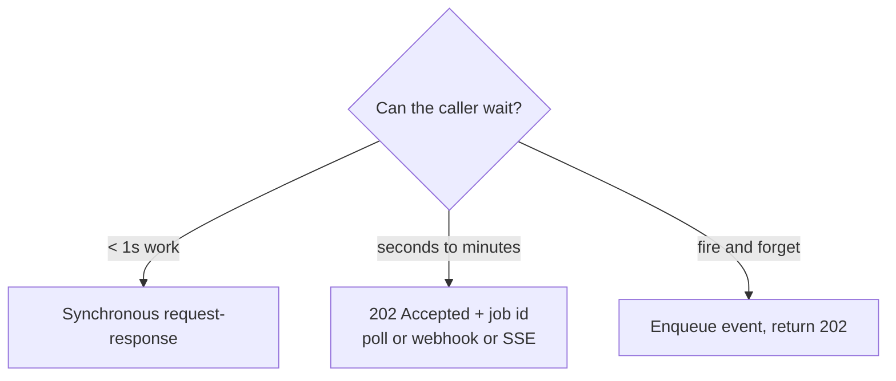
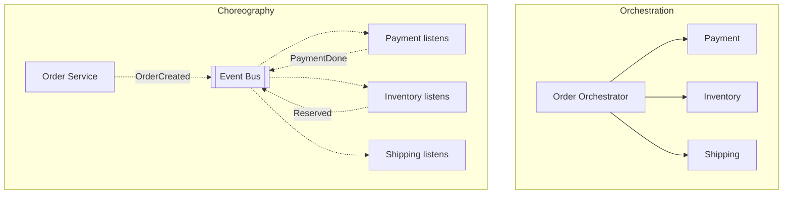
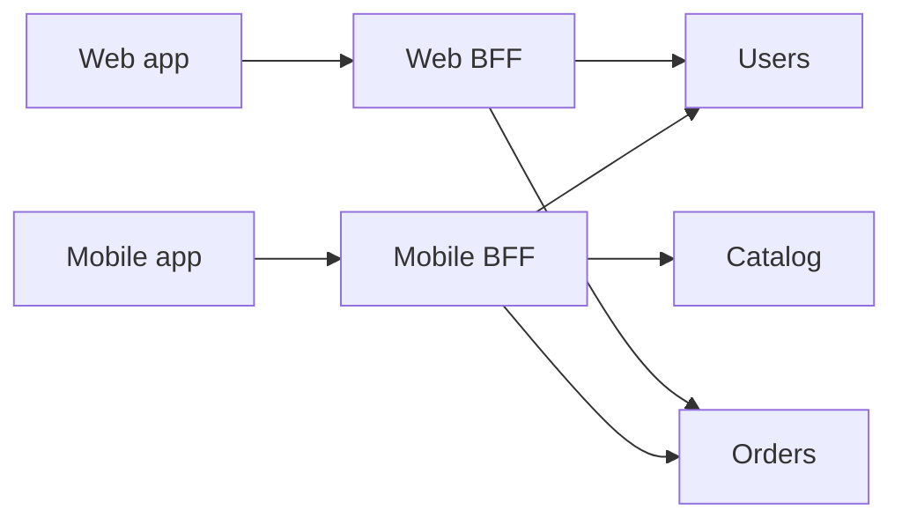
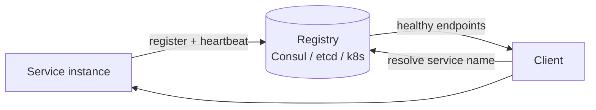

# API Design & Service Communication

The API is the contract. Interviewers use it to check whether you actually understand
the problem.

---

## Protocol selection



| Protocol | Payload | Strengths | Weaknesses |
|---|---|---|---|
| REST/JSON | Text | Universal, cacheable, easy to debug | Over/under-fetching, chatty |
| gRPC | Protobuf | 5–10x smaller/faster, streaming, codegen, typed | Not browser-native (needs grpc-web), binary is harder to debug |
| GraphQL | JSON | One round trip, no over-fetching, schema | N+1 resolvers, hard to cache at HTTP layer, query cost control needed |
| WebSocket | Any | Full duplex, low latency | Stateful connections, scaling and reconnection complexity |
| SSE | Text | Trivial, works over HTTP, auto-reconnect | One-way, connection limits on HTTP/1.1 |
| Webhook | JSON | Push to third parties | You must retry, sign, and handle their downtime |

---

## Real-time delivery: pick correctly



For WebSockets at scale, the real design problem is **connection routing**:


Also address: heartbeats/ping-pong, reconnect with resume token + missed-message
backfill, graceful gateway drain on deploy, and the fact that a gateway node holds
~10–100 K connections so you size by *connections*, not QPS.

---

## REST design essentials

```
GET    /v1/users/{id}                 200 / 404
GET    /v1/users/{id}/orders?cursor=&limit=20
POST   /v1/orders                     201 + Location header
PATCH  /v1/orders/{id}                200
DELETE /v1/orders/{id}                204
```

**Non-negotiables to mention:**

| Concern | Answer |
|---|---|
| Versioning | URI path `/v1/` (simplest) or `Accept: application/vnd.api+json;v=1`. Never break v1. |
| Pagination | **Cursor-based**, not offset. Offset is O(n) deep and skips/duplicates on concurrent writes. |
| Idempotency | `Idempotency-Key` header on POST; store key → response for 24 h |
| Errors | Consistent envelope: `{code, message, requestId, details}`; correct HTTP status |
| Filtering/sorting | Whitelist fields; never interpolate into SQL |
| Partial responses | `?fields=id,name` to reduce payload |
| Rate limits | Return `X-RateLimit-Remaining`, `Retry-After` |
| Long operations | 202 Accepted + `Location: /jobs/{id}` for polling, or a webhook |
| Bulk | `POST /v1/orders:batchCreate` with per-item status, to avoid chattiness |

### Cursor pagination
```
GET /feed?limit=20
-> { items: [...], nextCursor: "eyJ0cyI6MTcwMDAwMDAwMCwiaWQiOiI5OTgifQ" }
   cursor encodes (created_at, id) of the last item -> WHERE (created_at, id) < (?, ?)
```
Sign or opaque-encode the cursor so clients can't tamper with it.

---

## Sync vs async APIs



---

## Service-to-service patterns

### Orchestration vs choreography



| | Orchestration | Choreography |
|---|---|---|
| Flow visibility | Explicit, in one place | Emergent, hard to trace |
| Coupling | Orchestrator knows everyone | Services know only events |
| Change cost | Change one component | Change many subscribers |
| Debugging | Easy | Needs distributed tracing |
| Best for | Business-critical workflows with compensation (checkout) | Loosely related reactions (send email, update analytics) |

### API composition / BFF


A BFF aggregates and shapes responses per client. Guard it with per-dependency
timeouts, parallel fan-out, and **partial responses** — one slow dependency must not
fail the whole page.

---

## Service discovery


Client-side discovery (client picks an instance, e.g. gRPC + Envoy) avoids a network
hop and enables smarter load balancing. Server-side (a VIP/LB per service) is simpler.

---

## Contract & compatibility

- **Backward compatible changes:** add optional fields, add new endpoints, add enum
  values *only if* clients tolerate unknown values.
- **Breaking:** removing/renaming a field, changing a type, tightening validation,
  changing default behaviour.
- **Expand–migrate–contract:** add the new field → write both → migrate readers →
  remove the old field. Ship this over three releases; never in one.
- Protobuf: never reuse a field number; use `reserved`.

---

## Interview checklist

- [ ] Wrote 3–5 concrete endpoints with request/response shapes
- [ ] Chose a protocol per hop and justified it
- [ ] Cursor pagination, not offset
- [ ] Idempotency key on state-changing writes
- [ ] Timeouts + retries + partial responses for fan-out
- [ ] Versioning and backward-compatibility strategy
- [ ] Auth: identity comes from the token, never from a client-supplied user id
