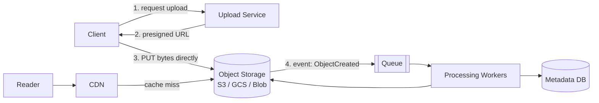
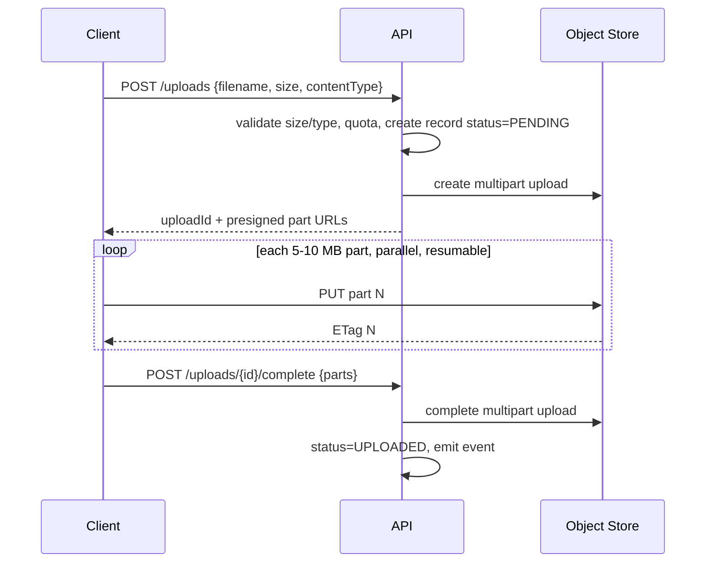
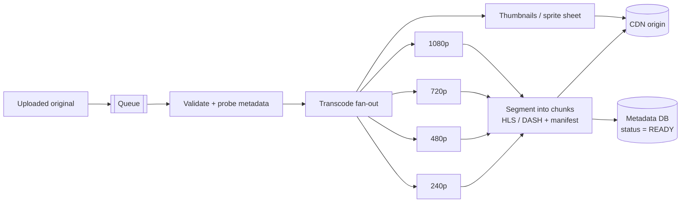
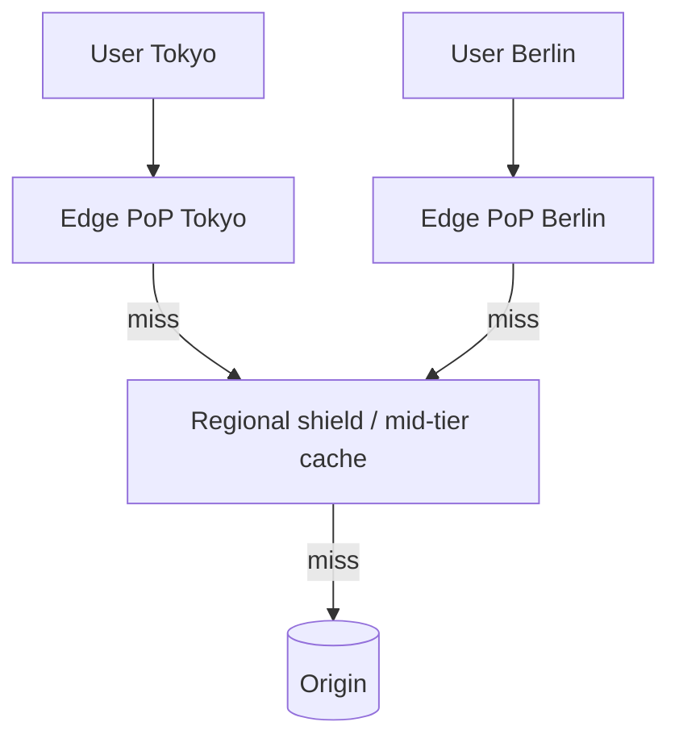
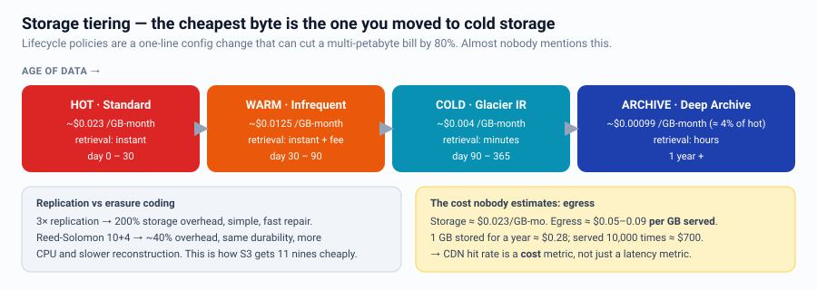
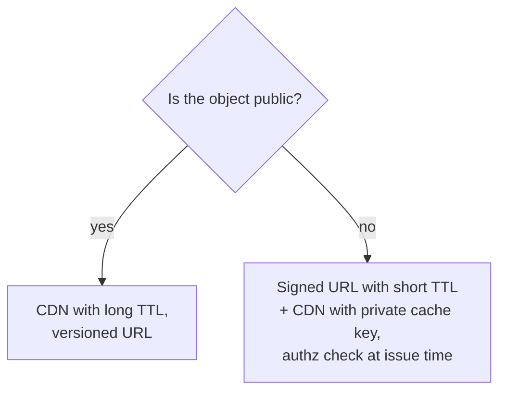

# Blob Storage, CDN & Media Pipelines

Whenever the problem mentions images, video, files, or documents, this is the whole
answer: **metadata in the database, bytes in object storage, delivery via CDN.**

---

## The universal media architecture



**The presigned-URL move is the key insight:** bytes never pass through your API
servers. Your service only issues a short-lived, scoped credential. This removes the
biggest bandwidth and memory bottleneck from your app tier — always say it.

---

## Object storage vs file system vs database

| | Object store (S3) | Block/File (EBS, NFS) | Database BLOB |
|---|---|---|---|
| Scale | Effectively unlimited | Volume-limited | Bloats the DB, kills backups |
| Durability | ~11 nines | Depends | Depends |
| Access | HTTP GET/PUT, whole object | POSIX, random access | SQL |
| Cost | Cheapest | Medium | Most expensive |
| Use for | Media, backups, logs, data lake | Shared working dirs, legacy apps | **Almost never for large blobs** |

Rule: put a URL in the database, not the bytes. Exception: small blobs (< ~64 KB) where
transactional consistency with the row matters.

---

## Uploads at scale



Cover these:
- **Multipart/chunked** upload → resumable on flaky networks, parallel parts.
- **Deduplication** by content hash (SHA-256) → same file stored once, instant "upload".
- **Validation server-side** — never trust client-declared content type; sniff magic
  bytes; enforce max size at the presign policy level.
- **Virus/abuse scanning** in the async pipeline before the object becomes public.
- **Lifecycle for orphans**: abort incomplete multipart uploads after N days.

---

## Media processing pipeline



Talking points:
- **Split by segment, not by file** — a 2-hour video is chunked and transcoded in
  parallel across many workers, then stitched. Turns hours into minutes.
- **DAG of tasks** with per-step retries and idempotent outputs keyed by
  `(assetId, profile, segment)`.
- **Adaptive bitrate streaming (HLS/DASH)**: the client switches renditions based on
  measured bandwidth. This is why you transcode multiple resolutions.
- **Priority queues** — a 15-second clip should not wait behind a feature film.
- **Cost control**: transcode popular renditions eagerly, rare ones lazily on first
  request.

---

## CDN



**What a CDN buys you:** lower latency (physically closer), origin offload (95%+ of
bytes), DDoS absorption, TLS termination at the edge, and often edge compute.

| Mode | How | Use |
|---|---|---|
| Pull | Edge fetches from origin on first miss | Default; self-healing |
| Push | You upload to the CDN | Large files, predictable releases |

### Cache-control at the edge
```
static assets with hashed names   Cache-Control: public, max-age=31536000, immutable
API responses that can be stale   Cache-Control: public, s-maxage=60, stale-while-revalidate=600
per-user content                  Cache-Control: private, no-store
```
- **Cache key** matters: including cookies or all query params destroys your hit rate.
  Normalize/whitelist query params.
- **Invalidation** is slow and rate-limited on most CDNs → prefer **versioned URLs**
  (`/static/app.9f2a1c.js`, `/img/123?v=7`). Purge only in emergencies.
- **Shield/tiered caching** prevents 200 edge PoPs from all stampeding the origin.
- **Signed URLs / signed cookies** for private media, with short expiry.
- **Origin protection**: origin should only accept traffic from the CDN.

### The cold-start / thundering herd at the edge
A new viral video is a miss at every PoP simultaneously. Mitigations: tiered caching,
request coalescing at the edge, and pre-warming for known events (product launch,
live sports).

---

## Storage cost & tiering


Also mention: **egress is usually the dominant cost**, not storage — which is another
argument for a high CDN hit rate. And erasure coding vs replication: 3x replication
costs 200% overhead; Reed-Solomon (e.g. 10+4) gives similar durability at ~40%.

---

## Delivery of user-specific vs public content


For private content, do the authorization when **issuing** the signed URL, not on
every byte — otherwise you lose the CDN entirely.

---

## Interview checklist

- [ ] Metadata in DB, bytes in object storage — stated explicitly
- [ ] Presigned URLs so uploads bypass app servers
- [ ] Multipart/resumable upload for large files
- [ ] Async processing pipeline with idempotent, retryable steps
- [ ] CDN with a cache-control and invalidation strategy (versioned URLs)
- [ ] Signed URLs for private content
- [ ] Lifecycle/tiering for cost, and an egress cost comment
