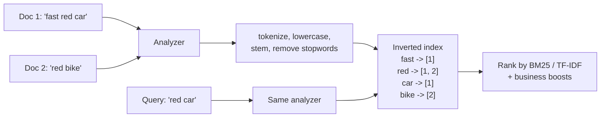
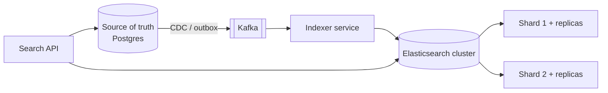
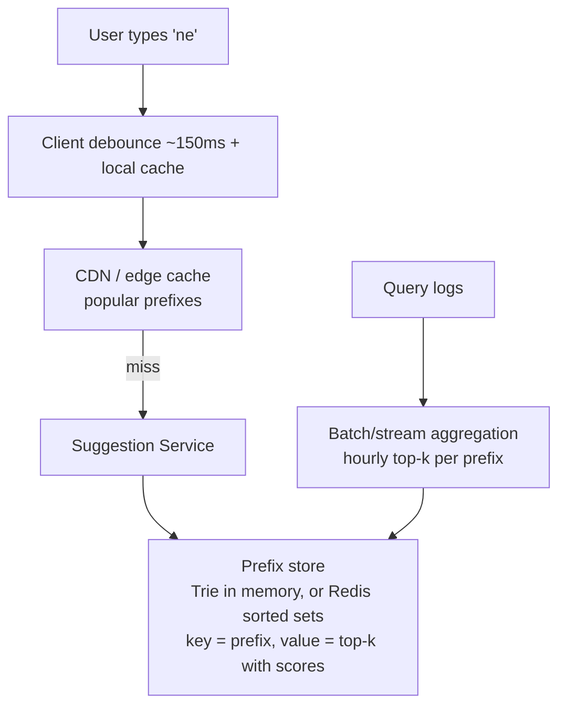
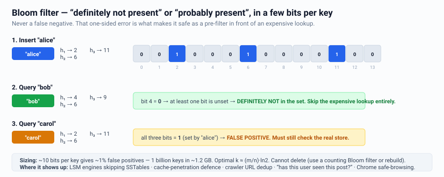
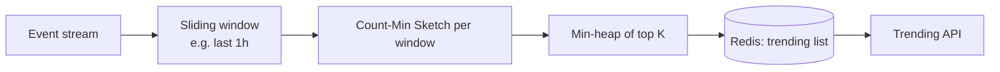
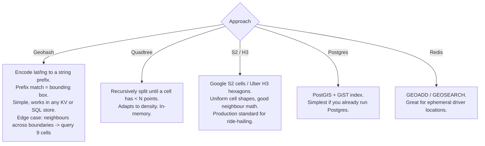
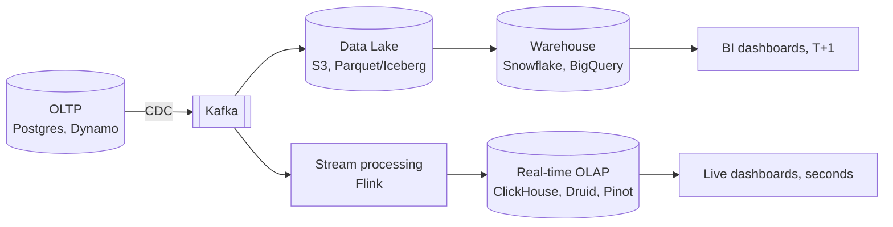
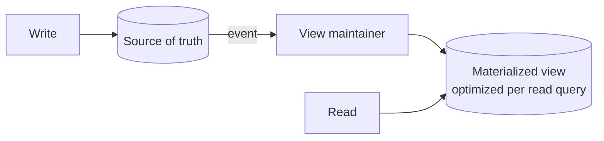

# Search, Indexing & Analytics

Whenever you hear "search", "autocomplete", "recommendations", "trending", or
"dashboard", you are leaving OLTP territory.

---

## The inverted index

Key point: **the same analyzer must run at index time and query time**, otherwise
"Running" never matches "run".

Ranking = relevance score (BM25) + boosts (recency, popularity, personalization,
business rules). In an interview, say relevance is a *pipeline*: retrieve candidates
cheaply, then re-rank the top N expensively (possibly with an ML model).

---

## Search architecture

Rules:
- **Search engine is never the source of truth.** It is a derived, rebuildable index.
- Keep it in sync via CDC/events; be able to **reindex from scratch** (this saves you
  in production and is a great thing to volunteer).
- Elasticsearch is *near*-real-time — documents are searchable after a refresh
  (default 1 s). State that as your staleness budget.
- Shard count is fixed at index creation → use index aliases + reindex to change it.
  Use time-based indices for logs (`logs-2026-07-28`) with ILM rollover.

### When you don't need Elasticsearch
- Exact/prefix match on one column → a B-tree index in your existing DB.
- Moderate full-text needs → Postgres `tsvector` + GIN index. Simpler, transactional,
  one less system. **A very strong "avoid over-engineering" answer.**
- Reach for ES when you need: relevance scoring, fuzzy/typo tolerance, faceting,
  multi-field boosting, or log analytics at volume.

---

## Autocomplete / typeahead

Design points:
- **Precompute top-k per prefix.** Do not rank at query time.
- Cap prefix length (e.g. 1–6 chars); longer prefixes fall back to search.
- Latency budget ~50–100 ms end-to-end; this is a caching problem more than a search
  problem.
- Update frequency: hourly/daily batch is fine for most; use a streaming top-k
  (Count-Min Sketch) for trending.
- Personalization: blend a global top-k with a small per-user history list client-side.

---

## Trending / top-k at scale

Exact top-k over billions of events needs too much memory. Use sketches:

| Sketch | Answers | Memory | Error |
|---|---|---|---|
| **Bloom filter** | "Have I seen this?" | Tiny | False positives, no false negatives |
| **Count-Min Sketch** | "Roughly how many times?" | Tiny | Overestimates |
| **HyperLogLog** | "How many *unique*?" | ~12 KB for billions | ~2% |
| **t-digest / DDSketch** | "What's p99?" | Small | Bounded relative error |

Say: *"I'd use a Count-Min Sketch with a sliding window and a min-heap for top-k —
approximate is acceptable for trending, and it fits in memory."*

---

## Geospatial search ("find nearby X")

Typical "nearby drivers" design: drivers publish location every 3–5 s → Redis geo
index sharded by cell → rider query reads the rider's cell + 8 neighbours → filter
and rank. Keep the *current* location in Redis (ephemeral) and the *history* in a
time-series/columnar store.

---

## OLTP vs OLAP

| | OLTP | OLAP |
|---|---|---|
| Query shape | Point read/write of a few rows | Scan + aggregate millions of rows |
| Storage | Row-oriented | **Column-oriented** (only reads needed columns, compresses 10x) |
| Latency | ms | seconds |
| Concurrency | Very high | Low–medium |
| Examples | Postgres, MySQL, DynamoDB | Snowflake, BigQuery, Redshift, ClickHouse |

**Never run analytics on your production OLTP primary.** Say this explicitly: it is a
classic real-world incident and interviewers like hearing it. Route to a replica at
minimum, a warehouse properly.

**Real-time OLAP** (ClickHouse/Druid/Pinot) is the answer when the requirement is
"dashboards updating within seconds over billions of events" — a good differentiator
from candidates who only know batch.

---

## Materialized views & precomputation

This is the general form of feed precomputation, leaderboards, counters, and
dashboards: **move work from read time to write time** when reads dominate.
Trade-off: staleness + storage + the need to rebuild views after a bug.

---

## Interview checklist

- [ ] Said whether the DB's own index is enough before adding a search cluster
- [ ] Search index is derived from a source of truth, kept in sync by CDC/events
- [ ] Stated the index staleness budget
- [ ] Used precomputation/top-k for autocomplete and trending
- [ ] Named a sketch (HLL / CMS / Bloom) where approximation is fine
- [ ] Separated OLTP from OLAP and named the pipeline between them
- [ ] Can rebuild any derived index from scratch
