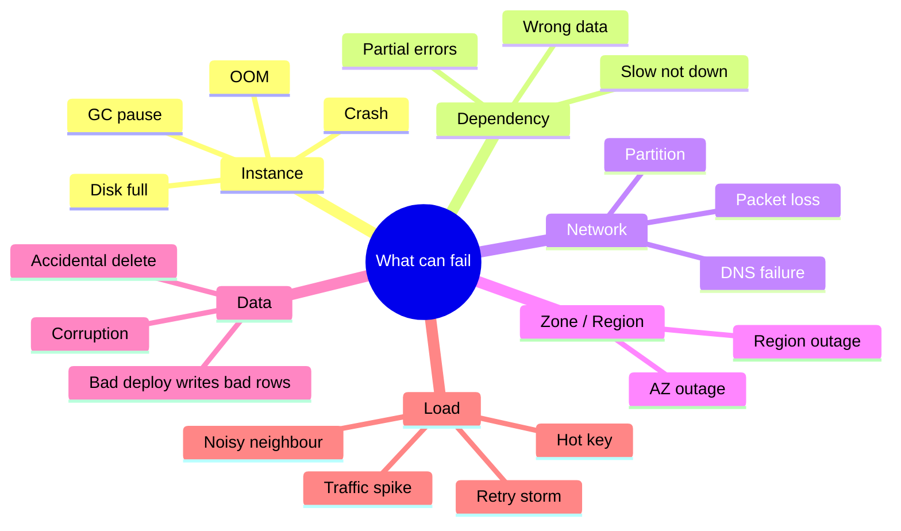
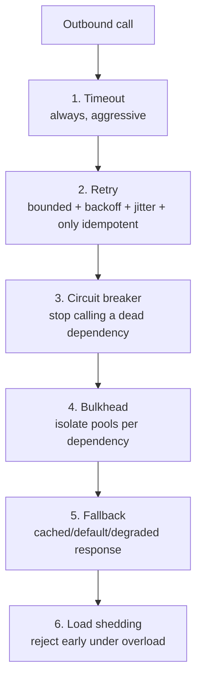
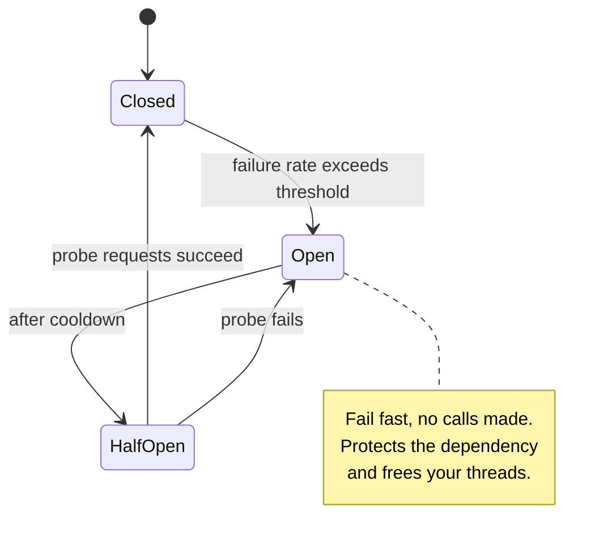
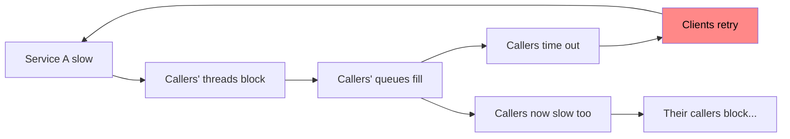
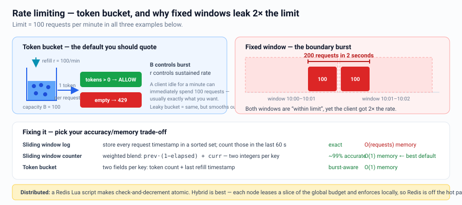
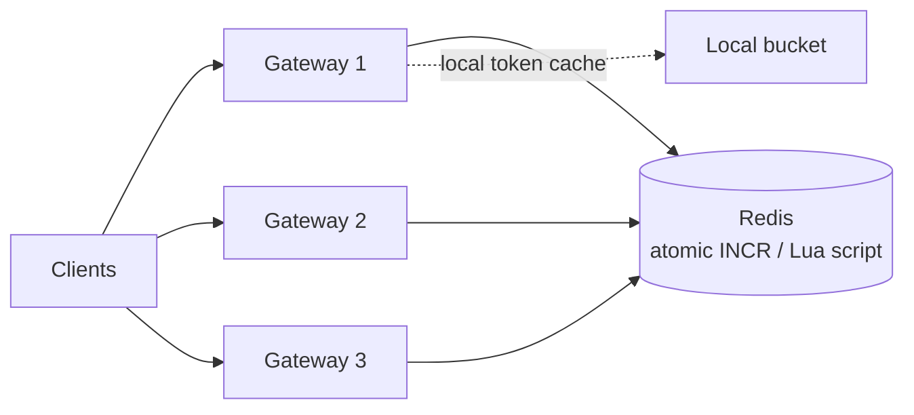
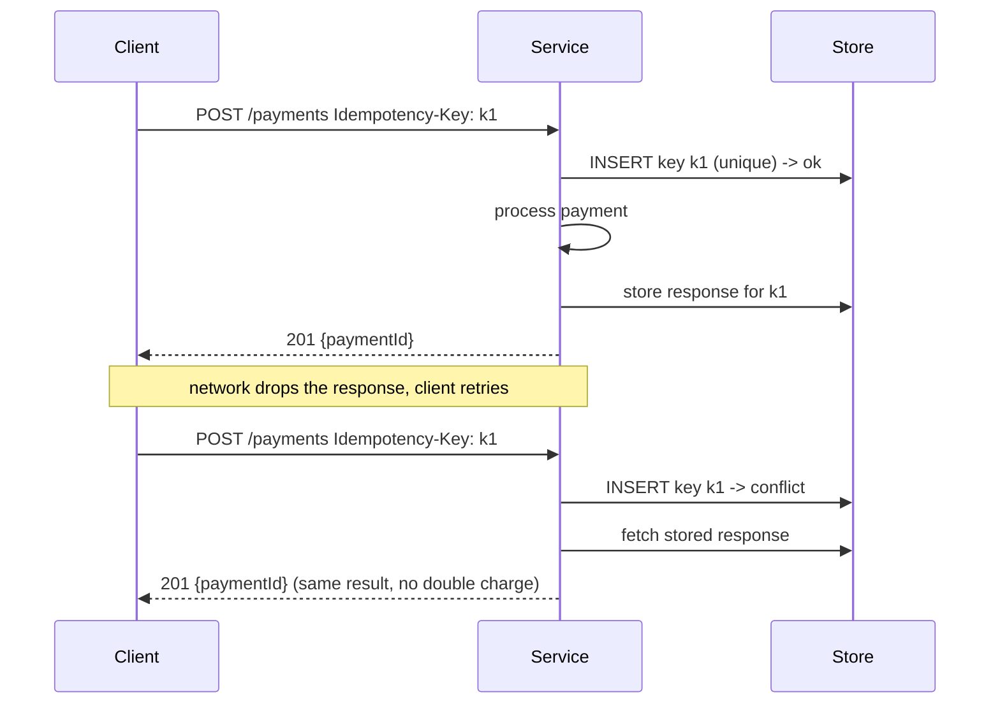
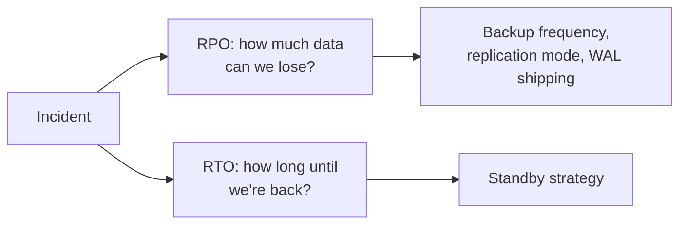

# Reliability, Resiliency & Rate Limiting

This section is the single biggest differentiator between an SDE2 and a Senior answer.

---

## Failure is the normal case



> **"Slow is the new down."** A dependency returning errors fast is easy. A dependency
> at 30 s latency exhausts your thread pool and takes *you* down. Design for slow.

---

## The resiliency toolkit



### 1. Timeouts
Every network call gets one. Set it from the **p99 of the dependency**, not a round
number. Budget them: if your SLA is 300 ms and you make 3 sequential calls, they can't
each have a 200 ms timeout. Propagate a **deadline** downstream so nobody does work
whose result will be discarded.

### 2. Retries
```
delay = min(cap, base * 2^attempt) * random(0.5, 1.5)   # exponential + full jitter
```
- Retry **only** idempotent operations, or use an idempotency key.
- Cap attempts (2–3). Retries multiply load exactly when the system is struggling.
- **Retry amplification:** 3 layers each retrying 3x = 27x load. Retry at **one**
  layer only — usually the outermost that has context.
- **Retry budget / token bucket:** allow retries only up to ~10% of total requests.

### 3. Circuit breaker



### 4. Bulkhead
Separate connection/thread pools per dependency so a slow recommendation service
cannot consume every thread needed for checkout. Name it — few candidates do.

### 5. Graceful degradation
Rank features by criticality and define the degraded mode up front:
```
Feed page:  posts (critical)  |  recommendations (drop)  |  ad slots (drop)
            unread counts (serve stale)  |  avatars (serve default)
```

### 6. Load shedding & prioritization
Under overload, reject cheap-and-early rather than timing out expensively. Shed by
priority tier and return `429`/`503` with `Retry-After`.

---

## Cascading failure & the retry storm



Break the loop with: circuit breakers, bounded queues, load shedding, jittered
backoff, retry budgets, and **fail-fast** semantics.

---

## Rate limiting

### Why
Protect capacity, enforce fair use, monetize tiers, mitigate abuse/DDoS, control cost.

### Algorithms



**Token bucket in one line:** bucket holds `B` tokens, refills at `r` tokens/sec, each
request takes one; empty bucket → reject. `B` controls burst tolerance, `r` controls
sustained rate.

### Distributed rate limiting



The trade-off:
- **Centralized (Redis)** — accurate, but adds latency and a dependency on the hot path.
  Use a Lua script for atomicity. Fail **open** (allow) if Redis is down, usually.
- **Local per-node** — zero latency, but the effective limit is `N × limit`.
- **Hybrid (best):** each node leases a slice of the global budget from Redis
  periodically and enforces locally. Approximate but fast and resilient.

### Dimensions to limit on
`user id`, `API key`, `IP` (careful: NAT/CGNAT shares IPs), `endpoint`,
`tenant`, and *cost-weighted* limits (a heavy query costs 10 tokens).

Always return `429` with `Retry-After` and `X-RateLimit-*` headers so good clients
can behave.

---

## Idempotency (the reliability primitive)


Handle the in-flight case: if `k1` exists but has no stored response yet, return
`409 Conflict` / `425 Too Early` rather than processing twice.

---

## Availability engineering

| Technique | Effect |
|---|---|
| Multi-AZ deployment | Survives a datacenter failure |
| Redundancy N+2 | Survives failure during maintenance |
| **Cell architecture** | Bounds blast radius to a fraction of users |
| Shuffle sharding | Two tenants rarely share the same full set of nodes |
| Static stability | Keep serving with cached/stale config when the control plane is down |
| Health check + auto-replace | Removes bad nodes without humans |
| Canary + auto-rollback | Bad deploys hit 1% of traffic |

**Static stability** is a top-tier senior concept: the data plane must keep working
when the control plane fails. E.g. pre-provision capacity so failover doesn't require
launching new instances during the outage.

---

## Disaster recovery



| Strategy | RTO | Cost |
|---|---|---|
| Backup & restore | Hours | $ |
| Pilot light (minimal standby) | ~10s of minutes | $$ |
| Warm standby (scaled-down live) | Minutes | $$$ |
| Active–active | ~0 | $$$$ |

Backups are worthless until restore is tested. Say: *"I'd run a scheduled restore
drill and measure actual RTO."* Also protect against logical corruption — replication
faithfully replicates your `DELETE FROM users`. You need point-in-time recovery and
immutable/versioned backups.

---

## Interview checklist

- [ ] Every external call has a timeout and a fallback
- [ ] Retries are bounded, jittered, idempotent, and at one layer only
- [ ] Circuit breaker + bulkhead named for critical dependencies
- [ ] Behaviour under overload described (shed, degrade, prioritize)
- [ ] Rate limiting: algorithm, dimension, distributed strategy, failure mode
- [ ] Idempotency keys on money/state-changing writes
- [ ] AZ and region failure story with RPO/RTO
- [ ] Blast radius reduction mentioned (cells / shuffle sharding)
