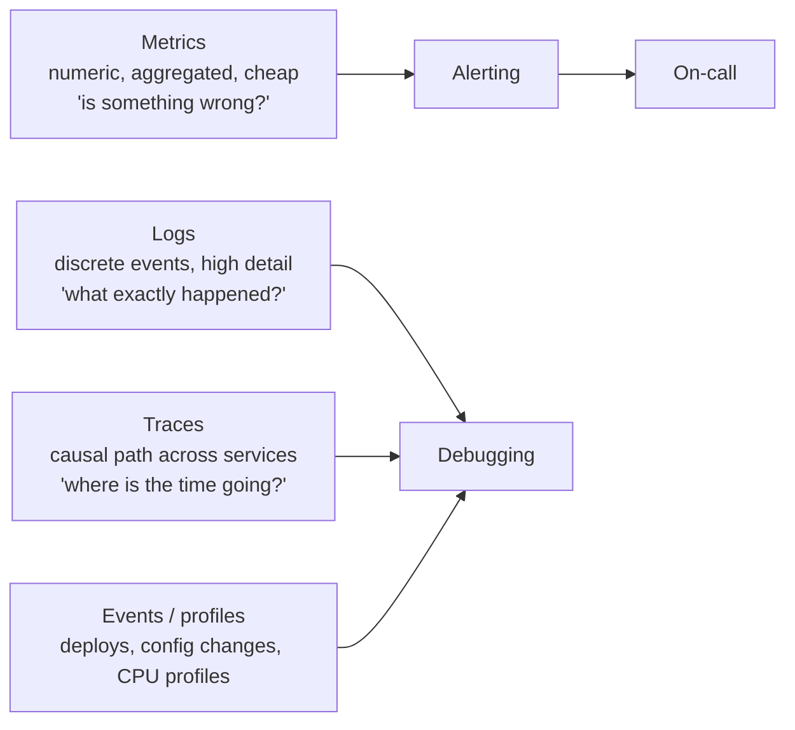
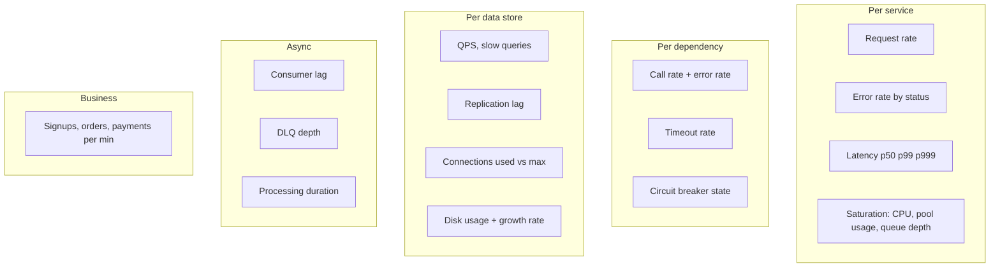
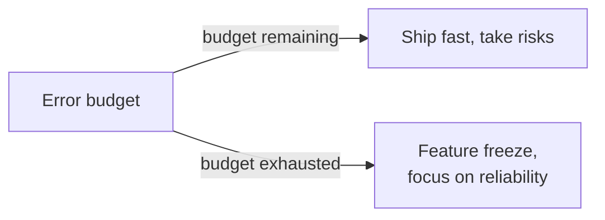
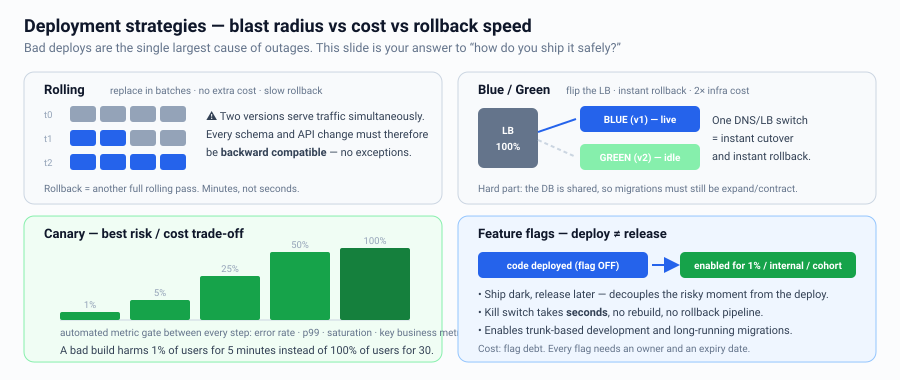
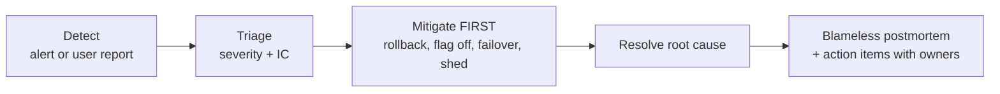

# Observability, Deployment & Operations

Most candidates stop at "we'll add monitoring." Two extra minutes here reliably moves
you from SDE2 to Senior.

---

## The three pillars (plus one)



| | Cardinality | Cost | Retention |
|---|---|---|---|
| Metrics | Low (beware label explosion) | Cheap | Long (13 months) |
| Logs | High | Expensive at volume | Short (7–30 days), sample |
| Traces | High | Expensive | Sampled (1–10%, plus all errors) |

**Correlation is the point:** a `trace_id` propagated through every hop and stamped
into every log line is what makes the three pillars usable together. Say
"W3C `traceparent` header propagated via OpenTelemetry."

---

## What to measure

### The RED method (for services)
- **R**ate — requests/sec
- **E**rrors — failed requests/sec, by class
- **D**uration — latency distribution (p50/p90/p99)

### The USE method (for resources)
- **U**tilization, **S**aturation, **E**rrors — for CPU, memory, disk, network,
  connection pools, queues.

### The four golden signals
Latency · Traffic · Errors · Saturation.



**Business metrics catch what technical metrics miss.** "Orders per minute dropped 40%"
detects a broken checkout button that returns HTTP 200. Mention this.

---

## SLI / SLO / Error budget

```
SLI  = the measurement           e.g. % of requests < 300 ms and non-5xx
SLO  = the target                e.g. 99.9% over a rolling 28 days
SLA  = the contractual promise   (with penalties) - always looser than the SLO
Error budget = 100% - SLO        e.g. 0.1% = ~43 min/month of allowed badness
```



**Alert on symptoms, not causes.** Alert on "checkout error rate > 1% for 5 min",
not "CPU > 80%". Use **multi-window burn-rate alerts** (fast burn: page; slow burn:
ticket) to avoid alert fatigue. Every page must be actionable and have a runbook.

---

## Deployment strategies



**Decouple deploy from release with feature flags** — the single most useful
operational statement you can make. It lets you ship dark, ramp gradually, and kill a
bad feature in seconds without a rollback.

### Migrations must be backward compatible
Two versions run simultaneously during any rolling deploy, so:
```
Expand   : add nullable column / new table; new code writes both, reads old
Migrate  : backfill in batches with throttling; switch reads to new
Contract : stop writing old; drop the column in a later release
```
Never combine a schema change and a code change that depends on it in one deploy.

---

## Infrastructure & config

- **Infrastructure as code** (Terraform) — reproducible environments, reviewable changes.
- **Immutable infrastructure** — replace, never patch in place.
- **Dynamic config** — separate from deploys, but **validate and canary config changes
  too**; config pushes cause as many outages as code.
- **Secrets** in a vault/KMS with rotation, never in env files in the repo.
- **Autoscaling** on the right signal: queue depth or in-flight requests beats CPU for
  I/O-bound services. Scale out fast, scale in slowly. Set a floor for warm capacity.

---

## Testing in production (safely)

| Technique | What it gives |
|---|---|
| Shadow / dark traffic | Send a copy of prod traffic to the new system; compare, don't serve |
| Dual read + diff | Verify a new store matches the old before cutover |
| Synthetic monitoring | Continuous scripted user journeys, catches issues before users |
| Chaos engineering | Inject latency/failures; verify the resiliency you claimed actually works |
| Load / soak tests | Find the knee of the curve before Black Friday does |
| Game days | Practice the runbook with humans |

---

## Incident response



Say **"mitigate before diagnosing"** — restore service, then investigate. And
"blameless postmortem" — systems fail, not people.

Track: MTTD (detect), MTTR (recover), change failure rate, deploy frequency
(the DORA metrics).

---

## Multi-tenancy operations

- Per-tenant quotas and rate limits to stop noisy neighbours.
- Per-tenant metrics so you know *who* is affected.
- Isolation tiers: shared pool → dedicated shard → dedicated stack for enterprise.

---

## Interview checklist

- [ ] Named specific metrics (RED/USE), not "we'll monitor it"
- [ ] Defined an SLO and an error budget for the core user journey
- [ ] Distributed tracing with a propagated trace id
- [ ] Alerting on symptoms with runbooks
- [ ] Deployment strategy: canary + feature flags + rollback plan
- [ ] Backward-compatible schema migration plan (expand/migrate/contract)
- [ ] Said how you'd verify the design in prod (shadow traffic, load test, chaos)
