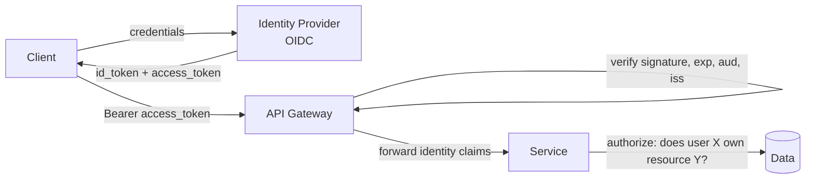
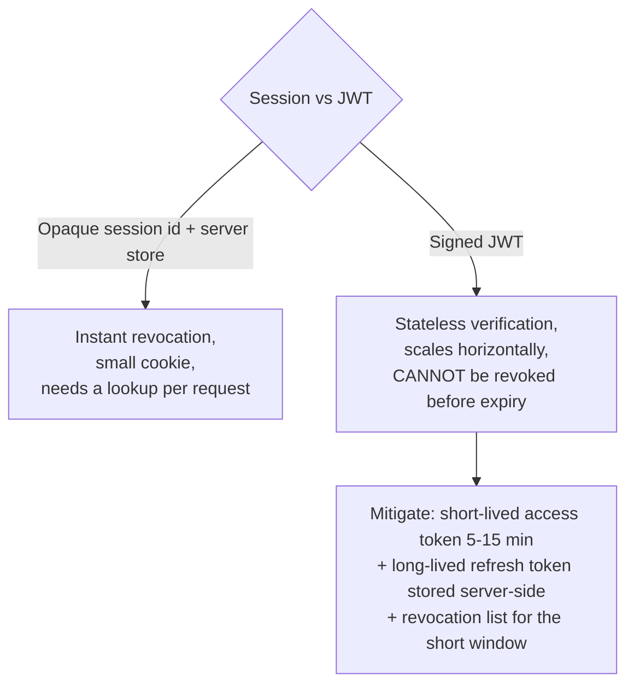
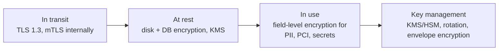
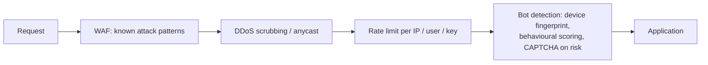
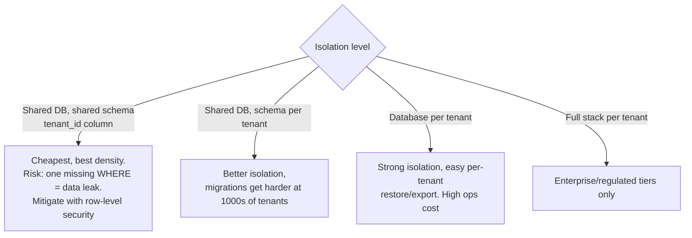

# Security, Auth & Multi-Tenancy

You will not be asked to design a security system, but omitting security entirely is a
visible gap. Thirty focused seconds per area is enough.

---

## AuthN vs AuthZ

- **Authentication** — who are you? (login, tokens, MFA)
- **Authorization** — what may you do? (roles, policies, ownership checks)

**The rule that matters:** the caller's identity comes from the **verified token**,
never from a request body or a client-supplied `userId` parameter. Getting this wrong
is IDOR — the most common real-world API vulnerability.

---

## Token strategy

Checklist:
- Access token short-lived; refresh token rotating (detect reuse → revoke the family).
- Store web tokens in `HttpOnly; Secure; SameSite=Lax` cookies, not `localStorage`.
- Validate `iss`, `aud`, `exp`, `nbf`, and the signing algorithm (**reject `alg: none`**
  and reject algorithm substitution). Use JWKS with key rotation.
- **OAuth2 / OIDC** for third-party access: authorization code flow **with PKCE** for
  public clients; client credentials for service-to-service.
- **mTLS** or short-lived SPIFFE-style identities for internal service-to-service auth
  — "the network is not a trust boundary" (zero trust).

---

## Authorization models

| Model | Shape | Use when |
|---|---|---|
| RBAC | user → roles → permissions | Most apps; simple, cacheable |
| ABAC | policy over attributes (dept, region, time) | Rules depend on context |
| ReBAC | graph of relationships (Zanzibar-style) | Sharing/nesting: docs, folders, orgs |
| ACL | per-object list | Small, explicit sharing |

For "who can see this document" style problems (Google Drive, Notion), **Google
Zanzibar** is the reference architecture: a relationship tuple store
`(object, relation, user)` with fast, consistent-enough checks and snapshot tokens
(zookies) to avoid the "new ACL, stale check" race. Name-dropping this is a strong
senior signal.

Always enforce authorization **server-side, at the data access layer** — a
tenant/owner predicate on every query, not a UI check.

---

## The OWASP essentials in HLD terms

| Risk | Design-level mitigation |
|---|---|
| Broken access control (IDOR) | Ownership/tenant check on every read and write; deny by default |
| Injection (SQL/NoSQL/command) | Parameterized queries; never concatenate user input; whitelist sortable columns |
| Cryptographic failures | TLS 1.2+ everywhere including internal hops; AES-256 at rest; argon2/bcrypt for passwords |
| Insecure design | Threat model the flows; rate limit; idempotency; least privilege |
| Security misconfiguration | Private subnets, least-privilege IAM, no public buckets, disable debug endpoints |
| Vulnerable components | SCA scanning, patch SLAs, pinned dependencies |
| Auth failures | MFA, lockout/backoff on login, no user enumeration in error messages |
| SSRF | Deny-list internal ranges + metadata endpoint; fetch through an egress proxy |
| Logging failures | Audit log for security events; **never log secrets, tokens, PII, card data** |

Also mention where relevant: **CSRF** (SameSite cookies + tokens), **XSS**
(output encoding + CSP), and **file upload** risks (content-type sniffing, size caps,
scanning, serve user content from a separate origin/domain).

---

## Data protection

- **Tokenization** for card/SSN data — keep the sensitive value in a narrow vault
  service and pass tokens everywhere else; shrinks your compliance scope dramatically.
- **PII classification** so you know what to encrypt, mask in logs, and delete.
- **Crypto-shredding** for GDPR erasure: encrypt each user's data with a per-user key
  and delete the key — solves "delete from immutable logs and backups". Excellent
  answer when asked about right-to-be-forgotten in an event-sourced system.
- Data residency: EU data in EU regions → affects your partitioning strategy.

---

## Abuse & bot protection

Layer defenses: edge (volumetric) → gateway (per-identity limits) → app (business
rules like "max 3 password resets/hour"). Prefer risk-based challenges over blanket
CAPTCHAs.

---

## Multi-tenancy

Cross-cutting requirements: per-tenant quotas and rate limits (noisy neighbour),
per-tenant metrics, per-tenant encryption keys for regulated customers, and a
**tenant-aware data access layer** that makes it impossible to write a query without a
tenant predicate.

---

## Compliance touchpoints (know they exist)

| Regime | Design impact |
|---|---|
| GDPR / DPDP | Right to access & erasure, consent, data residency, DPA with vendors |
| PCI-DSS | Never store CVV; tokenize PAN; segment the cardholder environment |
| HIPAA | PHI encryption, access audit logs, BAAs |
| SOC 2 | Access reviews, change management, audit logging |

---

## Interview checklist

- [ ] Identity from a verified token; authorization enforced server-side per object
- [ ] Token lifetime + revocation strategy stated
- [ ] TLS in transit, encryption at rest, secrets in a KMS/vault
- [ ] Rate limiting / WAF / abuse protection at the edge
- [ ] PII handling: classification, masking in logs, deletion story
- [ ] Multi-tenancy isolation level chosen and justified
- [ ] Audit logging for sensitive actions
