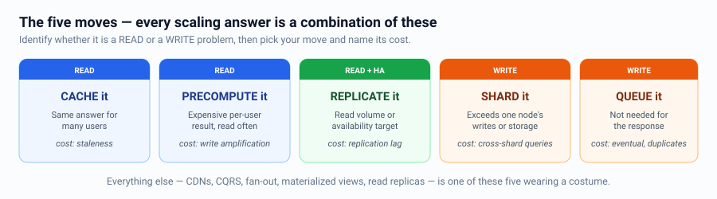
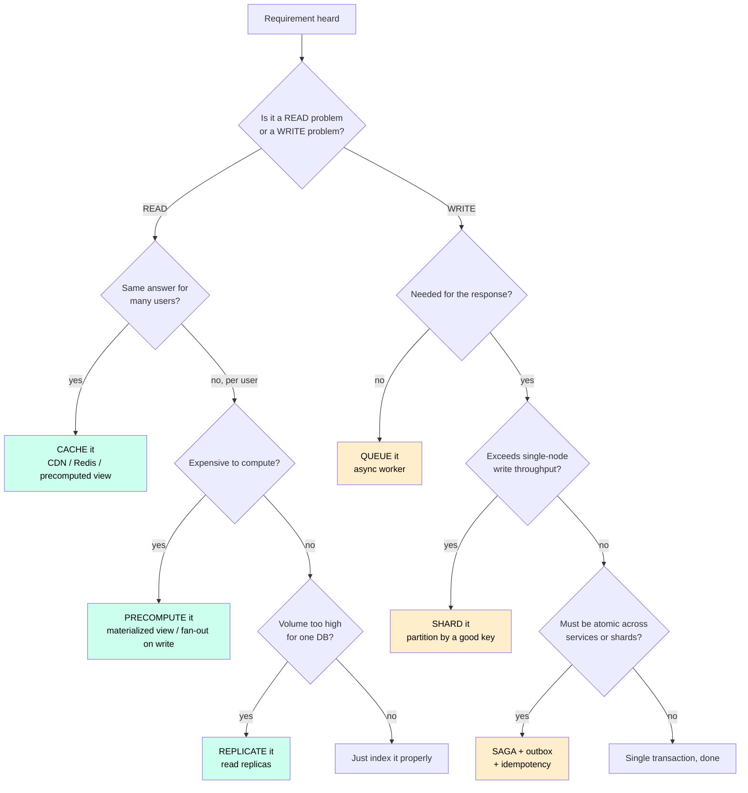
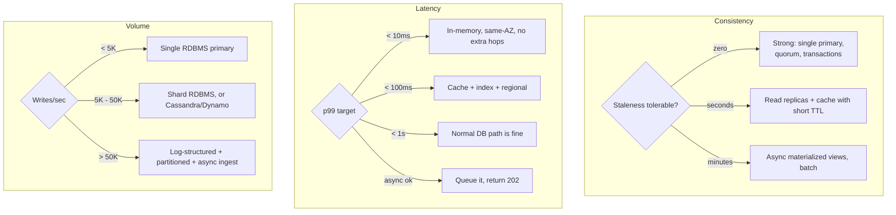
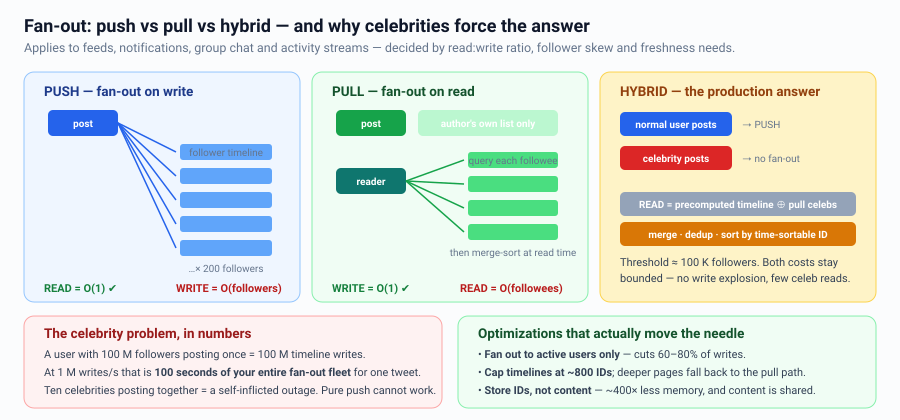
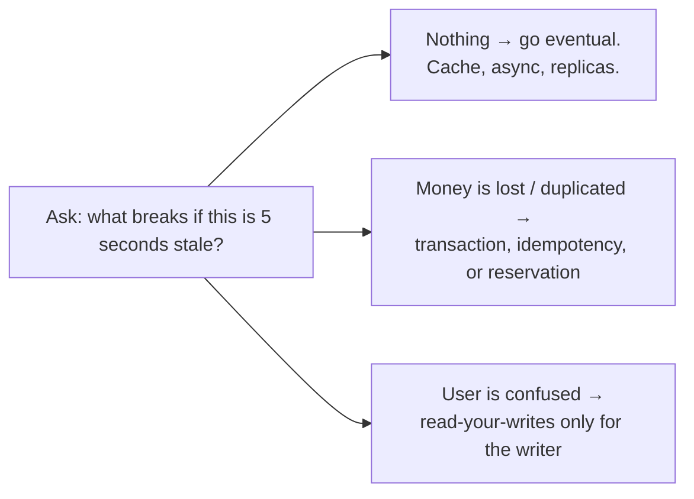
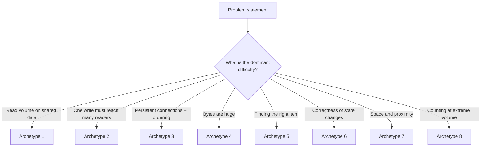
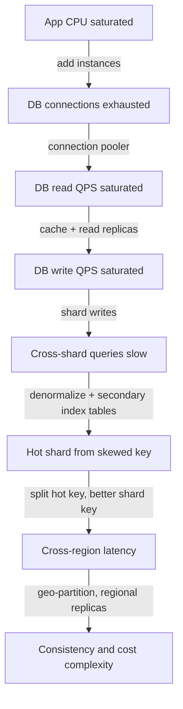

# Pattern Selection Guide — How to Know What to Apply

This is the core of the repo. Concepts are useless until you can **map a requirement
to a mechanism in seconds**.

Every scaling problem is solved by one of five moves:



---

## The master decision flow



> **The five moves:** cache it · precompute it · replicate it · shard it · queue it.
> Every scaling answer is a combination of these. Everything else is detail.

---

## Signal → Pattern lookup table

Keep this in your head. When you hear the phrase on the left, the middle column should
fire automatically.

### Scale & performance signals

| You hear... | Reach for | Because |
|---|---|---|
| "Read heavy, 100:1" | Cache + read replicas + CDN | Reads are cheap to duplicate |
| "Write heavy" | Sharding, LSM store (Cassandra), queue buffering | Writes need partitioned ownership |
| "Both heavy" | CQRS: separate write and read models | Different stores optimized differently |
| "Millions of users, one feed" | Fan-out on write + precomputed timeline | Move work to write time |
| "Celebrity / hot key" | Hybrid fan-out, key splitting, local cache | One key can exceed a node |
| "Global users, low latency" | CDN, geo-replication, regional read replicas | Speed of light is fixed |
| "Traffic spikes 10x" | Queue buffering, autoscale, load shedding, pre-warm | Absorb rather than scale instantly |
| "Expensive aggregation" | Precompute + materialized view, or OLAP store | Don't scan at read time |
| "Must be sub-100 ms p99" | In-memory store, precompute, edge, remove hops | Every network hop is ~1 ms+ |
| "Petabytes of data" | Object storage + columnar + tiering | Cost dominates |

### Correctness & consistency signals

| You hear... | Reach for | Because |
|---|---|---|
| "Must not double charge" | Idempotency keys + dedup table | Networks retry |
| "Money / inventory / booking" | ACID transaction, or Saga with compensation | Invariants matter |
| "Two users grab the last item" | Optimistic locking or conditional write | Detect the race |
| "Update DB and publish event" | **Transactional outbox** | Dual-write problem |
| "Across microservices atomically" | Saga (orchestrated) + idempotent steps | 2PC doesn't scale |
| "User must see their own write" | Read-your-writes: route to primary, or version token | Replica lag |
| "Order matters" | Partition by entity key; sequence numbers | Global order doesn't scale |
| "Eventually consistent is fine" | Async replication, event-driven views | Cheapest option — take it |
| "Offline / collaborative editing" | CRDTs or OT | Concurrent writes must merge |
| "Exactly once" | At-least-once + idempotent consumer | Exactly-once delivery is a myth |

### Availability & failure signals

| You hear... | Reach for | Because |
|---|---|---|
| "Can't go down" | Multi-AZ, redundancy, health checks, no SPOF | Availability = redundancy |
| "99.99%+" | Multi-region, cells, static stability, auto-failover | No manual steps allowed |
| "Third-party dependency" | Timeout + circuit breaker + fallback + cache | You don't control them |
| "One bad tenant/user" | Rate limits, quotas, bulkheads, shuffle sharding | Blast radius |
| "Bad deploy" | Canary + feature flags + auto-rollback | Deploy risk is the top outage cause |
| "Can't lose data" | Sync/semi-sync replication, WAL, RPO=0, backups + restore drills | Durability is a choice |
| "Recover from corruption" | Point-in-time recovery, immutable backups, event log | Replication copies mistakes |

### Feature-shape signals

| You hear... | Reach for |
|---|---|
| "Search / full text / typo tolerance" | Inverted index → Elasticsearch (or Postgres FTS if small) |
| "Autocomplete / typeahead" | Precomputed top-k per prefix, Trie/Redis, edge cached |
| "Trending / top-k / unique counts" | Count-Min Sketch, HyperLogLog, sliding windows |
| "Nearby / within X km" | Geohash / S2 / H3 / PostGIS, Redis GEO |
| "Real-time updates" | WebSocket + connection registry, or SSE; pub/sub fan-out |
| "Notifications / email / push" | Queue + workers + per-channel providers + retry/DLQ + preferences |
| "Upload photos/videos" | Presigned URLs → object storage → async pipeline → CDN |
| "Recommendations / feed ranking" | Offline candidate generation + online re-ranking, feature store |
| "Scheduled / delayed job" | Delay queue, time-bucketed table + poller, or a scheduler service |
| "Analytics dashboards" | CDC → lake → warehouse (T+1) or ClickHouse/Druid (real-time) |
| "Payment" | Idempotency, ledger with double-entry, outbox, reconciliation job |
| "Rate limit / quota" | Token bucket in Redis + local lease |
| "Distributed unique IDs" | Snowflake / UUIDv7 |
| "Who can access what" | RBAC, or ReBAC/Zanzibar for sharing graphs |
| "Undo / audit / history" | Event sourcing or an append-only audit table |

---

## Deciding by requirement dimension



---

## Choosing a fan-out strategy (the classic decision)

Applies to feeds, notifications, chat groups, and activity streams.



Decision inputs: read:write ratio, follower-count distribution (power law?), active-user
fraction, and freshness requirement. Say all four out loud.

---

## Choosing between "make it consistent" and "make it fast"


Note the third branch: often you only need strong consistency **for the person who
wrote the data**, and eventual consistency for everyone else. That is much cheaper.

---

## Recognizing the problem archetype

Most interview questions are one of eight archetypes. Identify it in the first two
minutes and you already know 70% of the design.

| Archetype | Examples | Core challenges | Key patterns |
|---|---|---|---|
| **1. High-volume KV/ID mapping** | URL shortener, pastebin, key-value store | ID generation, read scale, hot keys | Base62/Snowflake, cache, shard by hash |
| **2. Social feed / fan-out** | Twitter, Instagram, LinkedIn feed, notifications | Fan-out strategy, celebrity problem, ranking | Hybrid fan-out, precomputed timelines, cache |
| **3. Real-time bidirectional** | Chat, collaborative editing, multiplayer, live comments | Connection state, delivery guarantees, ordering, presence | WebSocket gateway + registry, per-conversation partitioning, CRDT/OT |
| **4. Large media** | YouTube, Netflix, Dropbox, Google Photos | Upload reliability, transcoding, delivery cost | Presigned upload, chunked pipeline, CDN, ABR streaming |
| **5. Search & discovery** | Search engine, autocomplete, product catalog, recommendations | Index freshness, relevance, latency | Inverted index, CDC pipeline, precomputed top-k, two-stage ranking |
| **6. Transactional / money** | Payments, ticket booking, e-commerce checkout, ad bidding | Exactly-once effect, invariants, reconciliation | Idempotency, ledger, saga, reservation with TTL, optimistic locking |
| **7. Geospatial / matching** | Uber, food delivery, Yelp nearby, dating apps | Location index, matching latency, supply-demand | Geo cells (S2/H3), Redis geo, dispatch service, matching queue |
| **8. Metering / analytics at scale** | Rate limiter, ad click counting, metrics system, log search | Cardinality, approximation, write throughput | Token bucket, sketches, time-series/columnar store, stream processing |



---

## The "what breaks next" ladder

After every fix, name the next bottleneck. This is what senior candidates do.



---

## Anti-pattern detector — when NOT to apply a pattern

| Pattern | Don't use when | Simpler alternative |
|---|---|---|
| Microservices | Small team, one bounded context, < 100 K users | Modular monolith |
| Kafka | < few K events/s, one consumer, same service | DB outbox table + poller, or SQS |
| Sharding | Data fits one node, writes < 5 K/s | Vertical scale + read replicas |
| Cache | Low read:write ratio, tiny cheap queries | Just index it |
| Elasticsearch | Simple prefix/exact search | DB index or Postgres FTS |
| Event sourcing | No audit/temporal requirement | Audit log table |
| CQRS | Read and write models are the same shape | One model |
| Multi-region active-active | No latency or DR requirement demands it | Multi-AZ + async DR region |
| Service mesh | < 10 services | Libraries + a load balancer |
| GraphQL | One client, stable screens | REST |

> Saying *"we could do X, but for this scale Y is simpler and here's when I'd migrate"*
> scores higher than reaching for the most complex tool.

---

## 90-second drill (practise this)

For any prompt, produce this in 90 seconds:

```
Archetype          : #2 social feed / fan-out
Dominant constraint: read heavy 100:1, 200M DAU, p99 < 200ms
Five moves used    : precompute (timelines), cache (Redis), shard (by user_id),
                     queue (fan-out workers), replicate (read replicas)
Hardest sub-problem: celebrity fan-out -> hybrid push/pull
Consistency        : eventual, 5s staleness budget; read-your-writes for the author
What breaks at 10x : fan-out worker throughput, timeline cache memory
```
