# Building Blocks Catalogue

The reusable sub-systems that appear inside larger designs. Interviewers often ask for
one of these *as* the whole question.

---

## The reference architecture (everything in one picture)

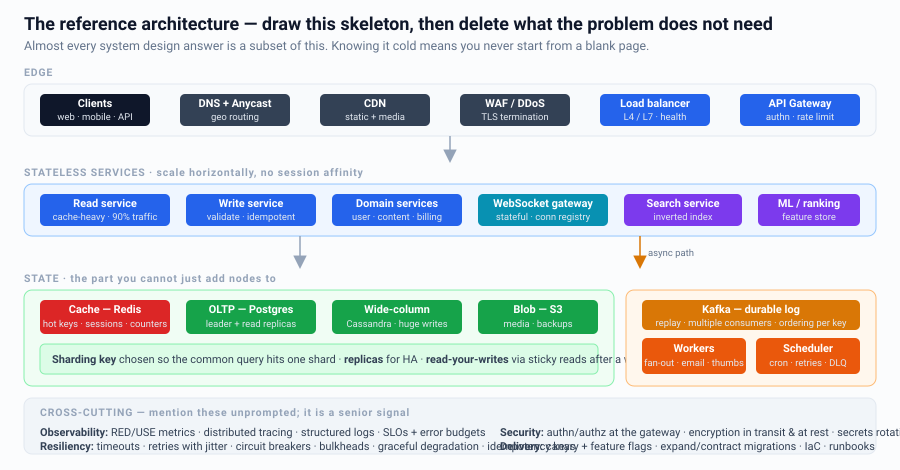

Memorize this shape. Almost every design is a subset of it. In an interview, draw only
the boxes your requirements justify — and be able to say why each one is there.

---

## 1. ID Generator

| Option | Sortable | Coordination | Size | Notes |
|---|---|---|---|---|
| DB auto-increment | Yes | Central | 8 B | SPOF, doesn't shard |
| DB ticket server + ranges | Yes | Light | 8 B | Each node leases 1000 ids |
| UUIDv4 | No | None | 16 B | Kills B-tree locality |
| **UUIDv7 / ULID** | Yes | None | 16 B | Modern default |
| **Snowflake** | Yes | Machine id only | 8 B | `[41b time][10b node][12b seq]` |

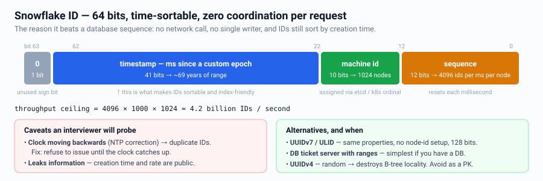

Snowflake caveats to mention: clock skew/NTP going backwards (halt or use a logical
clock), node-id assignment (ZooKeeper/etcd or k8s ordinal), and that time-sortable IDs
leak creation time and volume — use an opaque public id if that matters.

---

## 2. Rate Limiter

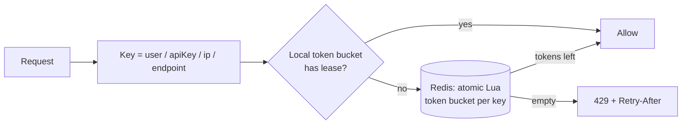
Decisions to state: algorithm (token bucket), storage (Redis with Lua for atomicity),
granularity (per user + per endpoint), distributed strategy (local lease + central
budget), and failure mode (fail open for availability, fail closed for abuse-critical
endpoints).

---

## 3. Notification Service

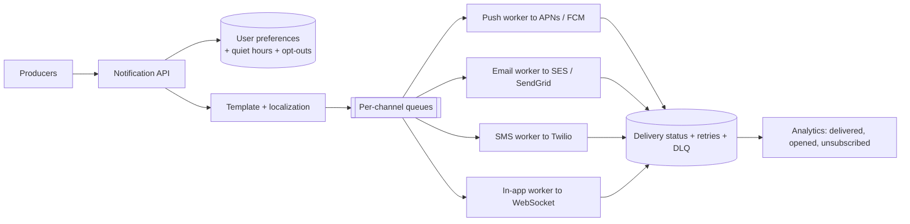
Talking points: dedup/idempotency (never send twice), rate limiting per user
(notification fatigue), digest/batching, provider failover, priority lanes (OTP beats
marketing), device-token invalidation, and compliance (unsubscribe, quiet hours).

---

## 4. Distributed Lock / Leader Election

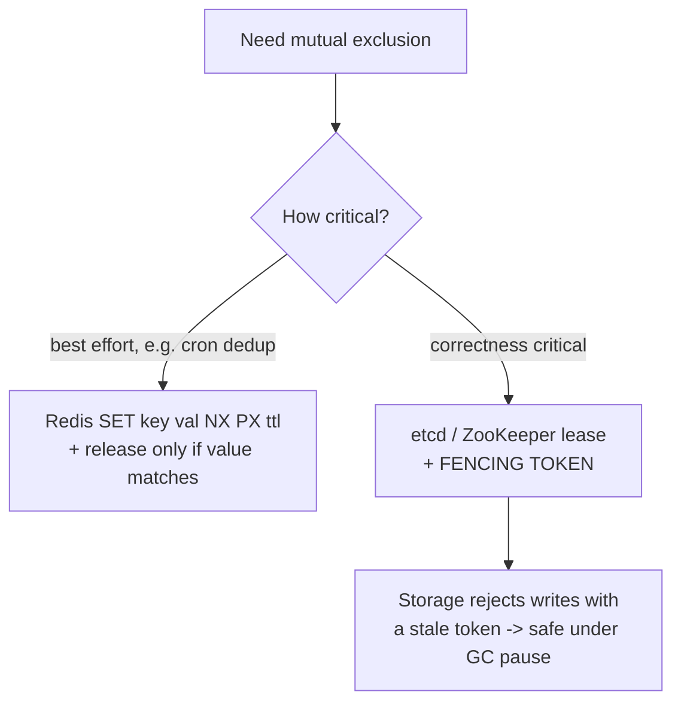
The classic failure: process holds the lock, GC-pauses past the TTL, another process
acquires it, then the first wakes up and writes. **Only fencing tokens fix this.**
Better still: design so you don't need a lock (partition ownership, idempotency,
conditional writes).

---

## 5. Scheduler / Delayed Jobs

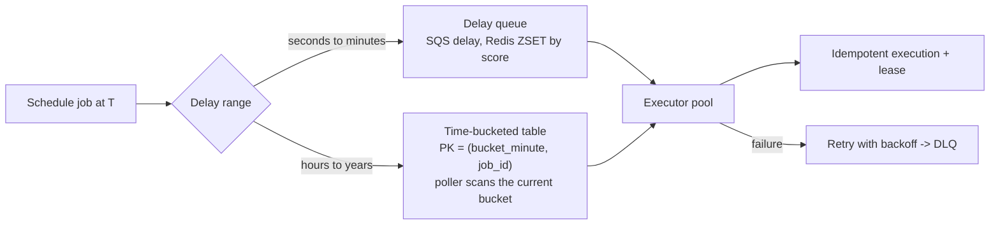
Cover: at-least-once execution → idempotency; leases so two workers don't run the same
job; clock skew; thundering herd at round times (jitter the schedule); and cancellation.

---

## 6. Counter / Metrics Aggregator

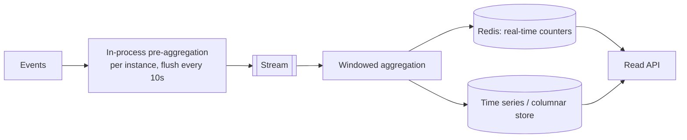
Never `UPDATE counter SET n = n+1` on a hot row — it serializes. Options: pre-aggregate
in-process, sharded counters (`counter:{id}:{0..15}` summed on read), Redis `INCR`,
or a stream aggregation. For approximate uniques use HyperLogLog.

---

## 7. Feature Flag / Config Service

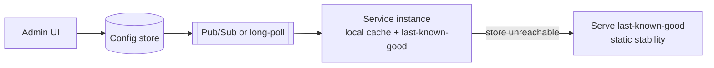
Requirements: sub-second propagation, targeting rules (% rollout, user cohort), audit
trail, and — critically — the service must keep working when the config store is down.

---

## 8. Audit Log / Event Store

Append-only, immutable, tamper-evident (hash chain), with a defined retention policy.
Serves compliance, debugging, and replay. If you also need to *rebuild state* from it,
you are doing event sourcing — see the next document.

---

## 9. Deduplication Service

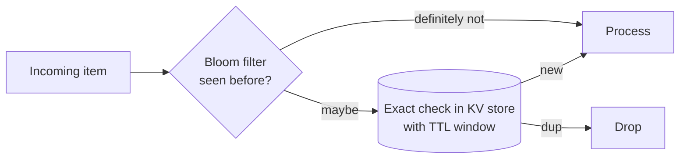
Bloom filter as a cheap pre-filter; exact store for confirmation. Bound memory with a
time window (you rarely need to dedup forever).

---

## 10. WebSocket / Presence Gateway

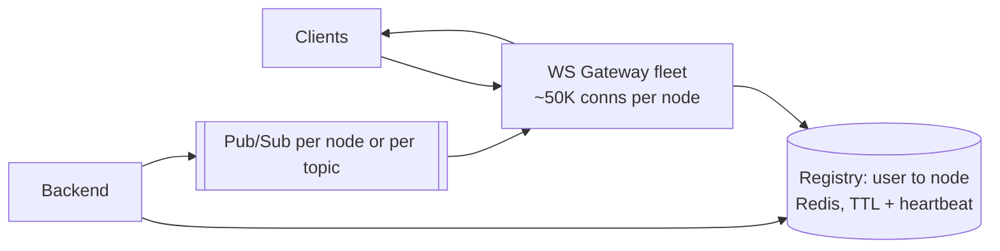
Handle: heartbeats and dead-connection cleanup, reconnect with a resume cursor to
backfill missed messages, graceful drain on deploy (connections must be re-established
gradually, not all at once), and presence as a TTL key refreshed by heartbeat.

---

## 11. Sequencer / Ordering Service

Needed for chat message ordering, collaborative editing, and event replay. Options:
per-conversation monotonic sequence in the DB (`UPDATE ... RETURNING seq+1`), Kafka
partition offsets, or Lamport/vector clocks when there is no single writer.

---

## 12. Payments / Ledger

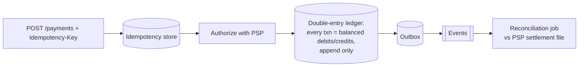
Non-negotiables: idempotency keys, an append-only double-entry ledger (never mutate
balances; derive them), a state machine for payment status, webhooks from the PSP
being unordered and duplicated, and a daily reconciliation job. Money questions are
graded on correctness, not throughput.

---

## Practice: which blocks does each problem need?

| Problem | Blocks |
|---|---|
| URL shortener | ID generator, cache, KV store, rate limiter, analytics counter |
| Twitter | ID gen, fan-out workers, timeline cache, blob+CDN, search, notification |
| Uber | Geo index, WS gateway, matching service, scheduler, ledger |
| Google Docs | WS gateway, sequencer/CRDT, snapshot store, presence |
| Ticketmaster | Reservation with TTL, optimistic locking, queue/waiting room, ledger |
| Metrics system | Counter aggregator, time-series store, stream processor, alerting |
