# Distributed Systems Patterns

Named patterns with the problem they solve. Using the right name at the right moment is
a strong seniority signal — as long as you can also say when *not* to use it.

---

## Pattern map

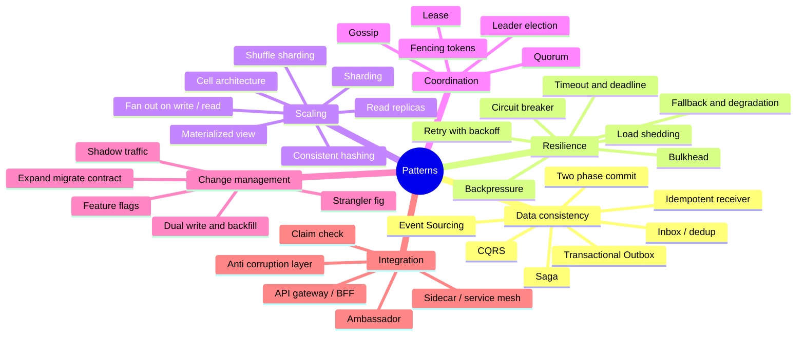

---

## Saga — distributed transactions without 2PC

**Problem:** an order spans Payment, Inventory, and Shipping. There is no shared
transaction.

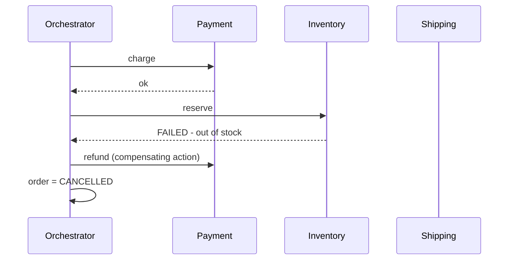

- **Orchestrated** — a central coordinator drives steps. Visible, testable, easy to
  debug. Preferred for business-critical flows.
- **Choreographed** — services react to each other's events. Loosely coupled, but the
  flow exists only in people's heads.

Requirements: every step needs a **compensating action**, every step must be
**idempotent** and **retryable**, and you accept **no isolation** — intermediate states
are visible (an order can briefly be "paid but not reserved"). Handle that in the UI
with explicit statuses.

**When not to use:** if all the data lives in one database, just use a transaction.

### Why not Two-Phase Commit?
2PC gives atomicity but the coordinator is a SPOF, participants hold locks through the
whole protocol (blocking), and it doesn't survive partitions well. Acceptable inside a
single database cluster; a poor fit across services at scale.

---

## Transactional Outbox + CDC

Covered in [messaging](../01-core-concepts/06-async-messaging-and-streams.md#the-outbox-pattern-dual-write-problem).
The one-liner: *"Write the event to an outbox table inside the same DB transaction, and
have a relay publish it. This converts a dual-write into a local transaction."*

The **Inbox** mirror: consumers record `message_id` in the same transaction as their
state change, giving exactly-once *effect*.

---

## Event Sourcing

**Store the events, derive the state.**

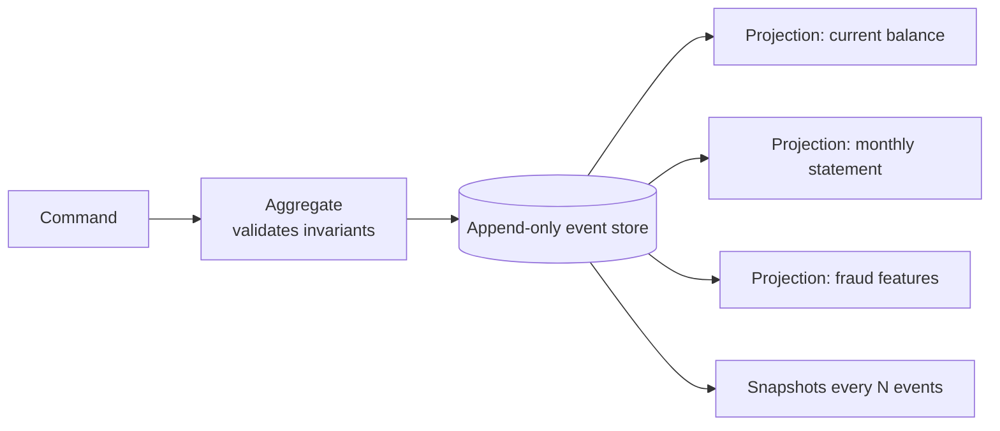

Gains: complete audit trail, time travel, new projections from historical data, natural
fit for event-driven integration.
Costs: **high complexity**, eventual consistency of read models, schema evolution of
events forever, no easy ad-hoc queries, GDPR deletion is hard (use crypto-shredding),
and replay time grows without snapshots.

**Use when:** audit/temporal requirements are first-class (finance, ledgers, compliance,
order lifecycles). **Otherwise: don't.** An audit table is usually enough — saying that
shows judgment.

---

## CQRS — Command Query Responsibility Segregation

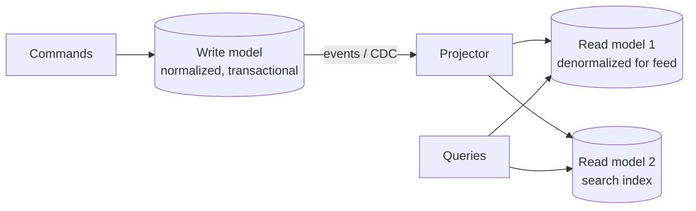

Use when read and write workloads have genuinely different shapes or scale
(10,000:1 read ratio, or reads need denormalized/aggregated views). Cost: eventual
consistency between models, and the operational burden of keeping projections correct
and rebuildable.

CQRS does **not** require event sourcing. They are frequently and wrongly bundled.

---

## Cell Architecture & Shuffle Sharding

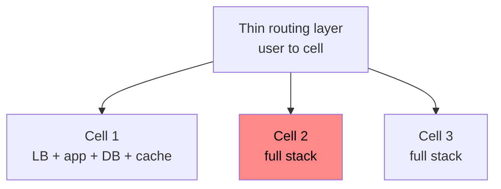
A failure in Cell 2 affects 1/N of users. Deploys go cell by cell. The routing layer
must be extremely simple and highly available (it's the only shared component).

**Shuffle sharding:** assign each tenant a random *subset* of nodes. With 8 nodes and
2 per tenant there are 28 combinations, so a poison tenant that kills its 2 nodes
affects very few others. Cheap, powerful isolation for multi-tenant systems.

---

## Strangler Fig — migrating a legacy system

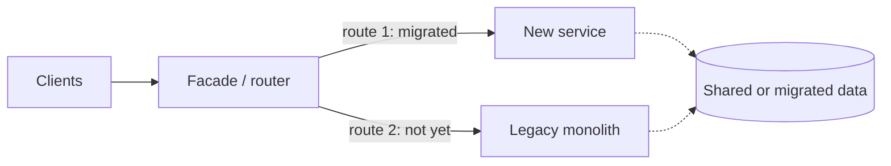
Route by endpoint, incrementally moving traffic; the legacy system shrinks until it can
be deleted. The alternative — a big-bang rewrite — is the classic failure story.

---

## Online Schema & Shard Migration

The question senior candidates get asked: *"Your shard key is wrong. Migrate with zero
downtime."*

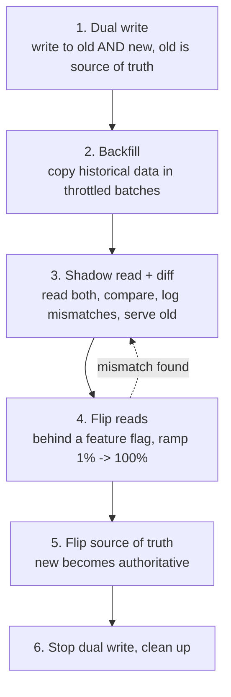
Mention: every step is reversible, backfill must be throttled to protect production,
and you need a reconciliation job that keeps running after cutover.

---

## Claim Check

Message brokers dislike large payloads. Store the blob in object storage and put a
reference in the message.

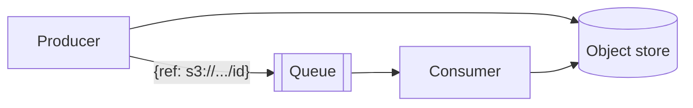

---

## Anti-Corruption Layer

A translation layer between your domain model and an external/legacy system, so their
bad model does not leak into yours. Common in payment gateway, CRM, and legacy
integrations.

---

## Sidecar & Service Mesh

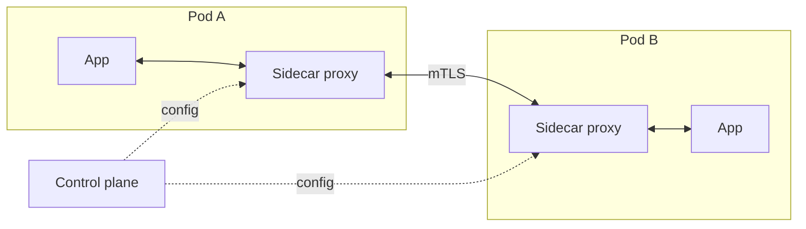
Moves retries, timeouts, circuit breaking, mTLS, and telemetry out of application code
and makes them uniform across languages. Cost: an extra hop, more moving parts, and
real operational complexity. **Not worth it below ~10 services.**

---

## Reservation / Two-Phase Booking

For seats, inventory, and rides: reserve with a TTL, then confirm.

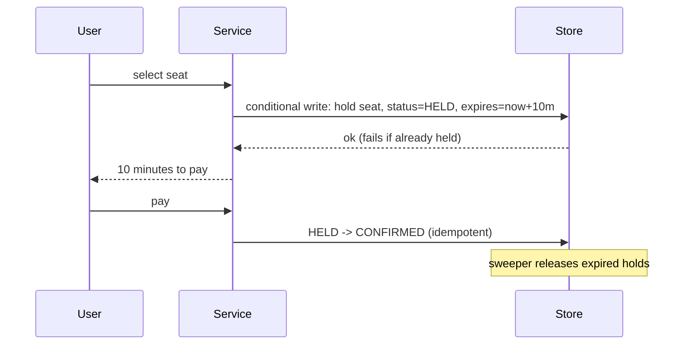
Key details: the hold must be a **conditional/atomic** write, expiry needs a sweeper
(or lazy expiry on read), and confirmation must be idempotent.

---

## Backpressure & Bounded Queues

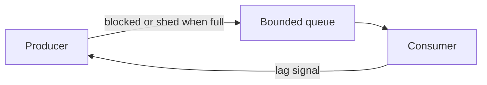
Unbounded queues turn overload into latency, then into an OOM. Always bound, and
decide what happens when full: block the producer, drop oldest, drop newest, or reject.

---

## Quick reference: pattern → problem

| Pattern | Solves |
|---|---|
| Saga | Multi-service transaction without locks |
| Outbox / Inbox | Dual-write between DB and broker |
| Idempotent receiver | Duplicate delivery |
| Fencing token | Lock held by a paused process |
| Circuit breaker | Failing dependency wasting resources |
| Bulkhead | One dependency starving all threads |
| Backpressure | Producer faster than consumer |
| Consistent hashing | Rebalancing without remapping everything |
| Materialized view / CQRS | Expensive reads |
| Fan-out on write | Slow personalized reads |
| Cell / shuffle sharding | Blast radius |
| Strangler fig | Legacy migration |
| Dual write + backfill | Schema/shard/store migration |
| Claim check | Large messages |
| Anti-corruption layer | External model pollution |
| Reservation | Concurrent claims on scarce inventory |
