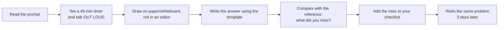

# Case Studies — Index & Reusable Template

---

## Worked case studies in this repo

| # | Problem | Archetype | Teaches |
|---|---|---|---|
| [01](01-url-shortener.md) | URL shortener | KV / ID mapping | ID generation, read-heavy caching, analytics |
| [02](02-news-feed.md) | News feed / Twitter timeline | Fan-out | Push vs pull, celebrity problem, precomputation |
| [03](03-chat-messaging.md) | Chat / messaging | Real-time | WebSockets, delivery guarantees, ordering, presence |
| [04](04-rate-limiter.md) | Distributed rate limiter | Metering | Token bucket, approximate distributed counting, fail-open |
| [05](05-ride-hailing.md) | Ride-hailing (Uber) | Geospatial | H3 index, write-heavy location, batched matching, CAS leases |
| [06](06-ticket-booking.md) | Ticket booking (Ticketmaster) | Transactional | Waiting room, hold + TTL, hot partition, CP over AP |
| [07](07-video-streaming.md) | Video streaming (YouTube) | Media pipeline | Chunked transcoding, ABR, multi-CDN, cost per GB |
| [08](08-file-sync-storage.md) | File sync (Dropbox) | Media + sync | Content-addressed blocks, delta sync, conflict resolution |
| [09](09-notification-system.md) | Notification system | Fan-out | Channel isolation, dedup, provider failover, campaigns |
| [10](10-payment-system.md) | Payment system & ledger | Transactional | Idempotency, double-entry ledger, sagas, reconciliation |
| [11](11-ad-click-aggregation.md) | Ad click event aggregation | Stream processing | Event time & watermarks, exactly-once effect, late events, lambda |
| [12](12-stock-broker.md) | Stock broker / trading app | Transactional + real-time | Order lifecycle, holds & buying power, tick conflation, market open burst |
| [13](13-leaderboard.md) | Real-time leaderboard | Ranking | Sorted sets, score-range sharding, rank vs percentile, ties, windowed resets |
| [14](14-pastebin.md) | Pastebin | KV + blob | Metadata/blob split, CDN for bandwidth, expiry & deletion, abuse handling |

Read them in any order, but **01 → 02 → 03** first: they cover the three archetypes
that appear most often as the *base* of a question. After that, pick by whichever
archetype you feel weakest in.

## Practise these next (same template)

| Problem | Archetype | Key challenge to nail |
|---|---|---|
| Web crawler | Pipeline | Frontier queue, politeness, dedup, traps |
| Distributed cache | Storage | Consistent hashing, eviction, replication |
| Google Docs | Real-time | OT vs CRDT, presence, snapshots |
| Search autocomplete | Search | Precomputed top-k, trie, edge caching |
| Metrics/monitoring system | Metering | Time-series storage, downsampling, cardinality — closest to [11](11-ad-click-aggregation.md) |
| Instagram / photo sharing | Media + feed | Blob pipeline, feed, discovery |
| Distributed job scheduler | Coordination | At-least-once execution, leases, time buckets |
| Yelp / proximity service | Geospatial | Static geo data vs the dynamic case in [05](05-ride-hailing.md) |
| Key-value store | Storage | Quorum, gossip, Merkle trees, hinted handoff |
| Stock exchange / order book | Transactional | Deterministic matching, sequencing, low latency — the venue side of [12](12-stock-broker.md) |

Most of these are recombinations of the fourteen worked studies. Before designing one from
scratch, ask *"which worked study is this closest to, and what is genuinely different?"*

---

## The reusable template

Copy this for every practice problem. Fill it in under 45 minutes.

````markdown
# <System>

## 1. Requirements
### Functional (in scope)
1.
2.
3.
### Out of scope
-
### Non-functional
| Dimension | Target |
|---|---|
| DAU / scale | |
| Read:write ratio | |
| Latency p99 | |
| Consistency | |
| Availability | |
| Durability / retention | |

## 2. Estimation
- Write QPS = ...  (peak = 3x)
- Read QPS  = ...
- Storage/day, /year (x3 replication)
- Bandwidth in/out
- Cache size (20% hot set)
**Conclusions:** (what each number forces you to do)

## 3. Core entities & API
List the 4-7 nouns the system is about, before designing anything:
Entity — what it is — is it durable or derived/ephemeral?
(The durable-vs-derived split usually tells you the architecture.)

POST/GET ... -> ...

## 4. The naive design, and why it breaks
The design a competent engineer would build without the scale numbers — usually one table
and one synchronous request path. Write it out honestly (pseudo-code or SQL), then:

| What breaks | The number that breaks it | Consequence |

Every row must cite a number from §2, not a vague "it won't scale".
Then state the reframe(s): the shift in thinking each break forces, linking forward to the
section that solves it. Finish with **the instinct to resist** — the plausible-but-wrong
fix ("add a cache", "wrap it in a transaction", "add an index") and precisely why it fails.

## 5. Data model
Entity(pk, fields) — access patterns — store choice — index/shard key

## 6. High-level architecture
```mermaid
flowchart LR
```
Narrate the write path, then the read path.

## 7. Deep dives
- Hardest sub-problem + 2 alternatives + choice + trade-off
- Bottleneck + fix
- Failure modes: node / AZ / region / dependency / hot key
- Consistency model per data type

## 8. Scale evolution
10x: what breaks, what changes
100x: what breaks, what changes

## 9. Operations
Metrics · SLOs · alerts · deploy · migration

## 10. Trade-offs summary
| Decision | Chose | Alternative | Why |

## 11. Rapid-fire probe answers
| Probe | Answer |
(write the 8-12 questions an interviewer would push back with, and a one-line
defence for each — this is the part you actually get graded on)
````

---

## How to practise effectively



Rules that actually make practice work:
1. **Out loud.** Silent practice does not train the skill being tested.
2. **Timed.** Time management is half the grade.
3. **Constrain yourself.** Alternate: "no cache allowed", "single region only",
   "10x the scale" — this builds flexibility rather than a memorized script.
4. **Keep a miss list.** After each session write down the 3 things you forgot. Review
   it before the next session. It converges fast.
5. **Defend, don't recite.** Have a friend ask "why not X?" for every choice.

---

## Use the probe tables as a drill

Every worked case study ends with a **Rapid-fire probe answers** table — the follow-up
questions an interviewer actually asks once your design is on the board. The design
itself is table stakes; these exchanges are where the grade is decided.

Two ways to use them:
1. **Cover the answer column** and respond out loud before reading. If you can't answer
   in about 20 seconds, you don't own that decision yet.
2. **Reverse it:** read only the answer and reconstruct the question. This trains you to
   recognise *which* trade-off an interviewer is fishing for when they ask something
   vaguely.

The pattern behind almost every probe is the same: they name a case your design didn't
explicitly cover and see whether you reason from your own constraints or start
improvising a new architecture.
