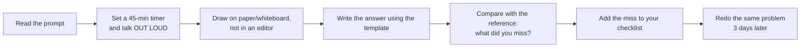

# Case Studies — Index & Reusable Template

---

## Worked case studies in this repo

| # | Problem | Archetype | Teaches |
|---|---|---|---|
| [01](01-url-shortener.md) | URL shortener | KV / ID mapping | ID generation, read-heavy caching, analytics |
| [02](02-news-feed.md) | News feed / Twitter timeline | Fan-out | Push vs pull, celebrity problem, precomputation |
| [03](03-chat-messaging.md) | Chat / messaging | Real-time | WebSockets, delivery guarantees, ordering, presence |

## Practise these next (same template)

| Problem | Archetype | Key challenge to nail |
|---|---|---|
| Rate limiter | Metering | Token bucket, distributed counters, fail-open |
| Web crawler | Pipeline | Frontier queue, politeness, dedup, traps |
| Distributed cache | Storage | Consistent hashing, eviction, replication |
| YouTube / Netflix | Media | Transcoding pipeline, ABR, CDN economics |
| Google Drive / Dropbox | Media + sync | Chunking, dedup, delta sync, conflict resolution |
| Uber / Lyft | Geospatial | Geo index, matching, surge, trip state machine |
| Ticketmaster | Transactional | Reservation TTL, waiting room, thundering herd |
| Payment system | Transactional | Idempotency, ledger, reconciliation, PSP webhooks |
| Notification system | Fan-out | Multi-channel, preferences, retries, dedup |
| Google Docs | Real-time | OT vs CRDT, presence, snapshots |
| Search autocomplete | Search | Precomputed top-k, trie, edge caching |
| Ad click aggregation | Metering | Stream processing, exactly-once effect, late events |
| Metrics/monitoring system | Metering | Time-series storage, downsampling, cardinality |
| Instagram / photo sharing | Media + feed | Blob pipeline, feed, discovery |
| Leaderboard | Metering | Redis sorted sets, sharded ranking, ties |
| Distributed job scheduler | Coordination | At-least-once execution, leases, time buckets |
| Yelp / proximity service | Geospatial | Geohash/quadtree, static vs dynamic data |
| Key-value store | Storage | Quorum, gossip, Merkle trees, hinted handoff |

---

## The reusable template

Copy this for every practice problem. Fill it in under 45 minutes.

````markdown
# <System>

## 1. Requirements
### Functional (in scope)
1.
2.
3.
### Out of scope
-
### Non-functional
| Dimension | Target |
|---|---|
| DAU / scale | |
| Read:write ratio | |
| Latency p99 | |
| Consistency | |
| Availability | |
| Durability / retention | |

## 2. Estimation
- Write QPS = ...  (peak = 3x)
- Read QPS  = ...
- Storage/day, /year (x3 replication)
- Bandwidth in/out
- Cache size (20% hot set)
**Conclusions:** (what each number forces you to do)

## 3. API
POST/GET ... -> ...

## 4. Data model
Entity(pk, fields) — access patterns — store choice — index/shard key

## 5. High-level architecture
```mermaid
flowchart LR
```
Narrate the write path, then the read path.

## 6. Deep dives
- Hardest sub-problem + 2 alternatives + choice + trade-off
- Bottleneck + fix
- Failure modes: node / AZ / region / dependency / hot key
- Consistency model per data type

## 7. Scale evolution
10x: what breaks, what changes
100x: what breaks, what changes

## 8. Operations
Metrics · SLOs · alerts · deploy · migration

## 9. Trade-offs summary
| Decision | Chose | Alternative | Why |
````

---

## How to practise effectively



Rules that actually make practice work:
1. **Out loud.** Silent practice does not train the skill being tested.
2. **Timed.** Time management is half the grade.
3. **Constrain yourself.** Alternate: "no cache allowed", "single region only",
   "10x the scale" — this builds flexibility rather than a memorized script.
4. **Keep a miss list.** After each session write down the 3 things you forgot. Review
   it before the next session. It converges fast.
5. **Defend, don't recite.** Have a friend ask "why not X?" for every choice.
