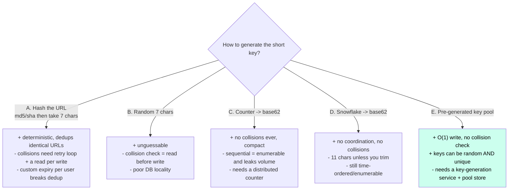
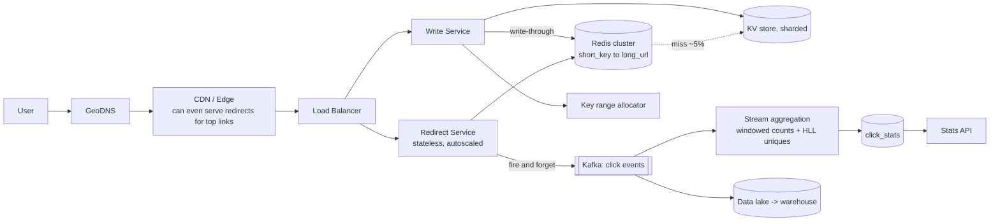

# Case Study 1 — URL Shortener

**Archetype:** high-volume key-value mapping. The "easy" question that separates
candidates on estimation, ID design, and cache strategy.

---

## 1. Requirements

**Functional (in scope)**
1. Create a short URL from a long URL; optional custom alias; optional expiry.
2. Redirect a short URL to the original.
3. Basic click analytics per link.

**Out of scope:** user accounts/teams, link editing, malware scanning (mention it),
QR codes.

**Non-functional**

| Dimension | Target |
|---|---|
| Scale | 100 M new URLs/day, 10 B redirects/day |
| Read:write | ~100:1 → **read dominated** |
| Latency | Redirect p99 < 50 ms (it is on the user's critical path) |
| Availability | 99.99% for redirects; 99.9% for creation |
| Consistency | Redirect must work immediately after creation (read-your-writes) |
| Retention | Default 5 years, configurable expiry |

---

## 2. Estimation

```
Writes: 100 M/day  = 100/10^5      = ~1,150 QPS   (peak 3x = ~3.5 K)
Reads : 10 B/day   = 10,000/10^5   = ~115,000 QPS (peak 3x = ~350 K)

Record: short_key 7 B + long_url ~200 B + metadata ~100 B ≈ ~300 B
Storage/day  = 100 M x 300 B = 30 GB/day
Storage/5yr  = ~55 TB  -> x3 replication = ~165 TB

Cache: ~85% of daily reads land on a hot set of ~20 M keys x 300 B ≈ 6 GB
       -> the entire hot set fits in memory on 2-3 nodes. Cache is the whole game.

Key space: 62^7 = ~3.5 trillion -> 100 M/day for ~95 years. 7 chars is enough.
```

**Why 6 GB of cache survives 55 TB of data**

The obvious objection: data keeps arriving at 100 M/day, so how does a fixed 6 GB cache
help? Because the two numbers answer different questions — 55 TB is *how many links
exist*, 6 GB is *how many distinct links get requested in a window*. The corpus grows
linearly forever; the working set is a sliding window that stays roughly flat:

- **Power-law popularity** — a viral link takes millions of hits while the median link
  takes single digits. The top ~20 M keys carry most of the traffic whether there are
  1 B or 180 B links behind them.
- **Time decay** — a short link's life is *shared -> burst over hours/days -> dead*. Each
  day's 100 M new links push into the LRU while yesterday's cool out. The hot set
  churns; it does not accumulate.

After 5 years the cache holds **~0.01% of the corpus** (20 M of ~180 B keys). The other
99.99% is correctly never touched and sits on cheap disk.

The payoff is not latency — it is not having to size the storage tier for peak read QPS:

```
Peak reads = 350 K QPS

no cache   -> 350 K QPS against 55 TB   (provision for IOPS -> huge node count)
90% hits   ->  35 K QPS to the DB       (10x fewer nodes)
95% hits   -> 17.5 K QPS
99% hits   ->  3.5 K QPS                (same order as the write load)
```

Storage is then sized by **capacity** (165 TB) rather than **throughput** — a much
cheaper problem. Misses still meet SLA (a KV point lookup is ~5-10 ms against a 50 ms
p99 budget), so a miss costs money, not correctness. Returns are logarithmic: 6 GB ->
12 GB might move you 95% -> 96.5%, which is why cache size need not track corpus growth.
If the hot set does grow, scale that tier horizontally with consistent hashing — 6 GB ->
100 GB is still only a handful of nodes.

**Conclusions**
1. 350 K peak read QPS with a 6 GB hot set → **cache-first architecture**, DB is a
   fallback.
2. 3.5 K peak write QPS → beyond a comfortable single primary at durability targets →
   shard, or use a KV store.
3. 165 TB → not a single node → sharded KV (DynamoDB/Cassandra) or sharded RDBMS.
4. Analytics at 10 B events/day must be **async** — never on the redirect path.

---

## 3. Core entities & API

**Core entities**

| Entity | What it is | Notes |
|---|---|---|
| **Link** | The mapping itself: `shortKey → longUrl`, `expiresAt`, `ownerId`, `isActive` | The only entity on the redirect path — keep it small enough to cache entirely |
| **Owner** | Optional account that created the link | Scopes quotas, custom aliases, and analytics access |
| **ClickEvent** | One append-only record per redirect: time, country, referrer, UA class | Written asynchronously; **never** read on the hot path |

The entity list is deliberately tiny, and that's the insight: this system is one hot
lookup plus a firehose of write-only events, and those two belong in different stores.

**Interface**

```
POST /v1/urls
  { longUrl, customAlias?, expiresAt? }        Idempotency-Key: <uuid>
  -> 201 { shortUrl, shortKey, expiresAt }
  -> 409 if customAlias taken

GET /{shortKey}
  -> 302 Found, Location: <longUrl>, Cache-Control: private, max-age=0
  -> 404 if unknown, 410 if expired

GET /v1/urls/{shortKey}/stats?from=&to=
  -> { clicks, byDay[], byCountry[], byReferrer[] }
```

**301 vs 302:** use **302** (temporary). A 301 is cached by browsers forever, which
kills your analytics and prevents expiry/revocation from working. This is a favourite
follow-up question.

---

## 4. The naive design, and why it breaks

Say this out loud first. It takes ninety seconds, it proves you can size a system, and it
turns every later decision into a **response to a measured failure** rather than a pattern
you recited.

```
One MySQL instance, one table:
  urls(id BIGINT AUTO_INCREMENT PK, short_key VARCHAR(7), long_url TEXT, created_at)

Create:   INSERT, then short_key = base62(id)
Redirect: SELECT long_url WHERE short_key = ?   -> 302
Analytics: INSERT INTO clicks(...) on every redirect
```

This is genuinely correct. It is also wrong in four independent ways, and the numbers from
§2 tell you exactly where:

| What breaks | The number that breaks it | Consequence |
|---|---|---|
| **Read throughput** | 350 K peak redirect QPS vs ~10-20 K QPS for one primary | Off by more than an order of magnitude. No amount of tuning closes a 20x gap |
| **Storage** | 165 TB at 5 years with replication | Doesn't fit on one node, and the index stops fitting in RAM long before the data does |
| **Sequential keys** | `base62(AUTO_INCREMENT)` | Keys are enumerable: a competitor can walk your entire corpus, and consecutive IDs leak your exact daily volume |
| **Synchronous analytics** | 10 B click inserts/day on the redirect path | Doubles write load and puts a non-essential write in front of the user's redirect |

Each fix is one of the sections that follows: obfuscated counter ranges kill the
enumeration problem ([§5](#5-key-generation--the-core-design-decision)), a sharded KV store
absorbs the storage ([§6](#6-data-model)), a cache in front of it absorbs the reads
([§7](#7-architecture)), and analytics moves onto a queue.

**The instinct to resist:** "just add read replicas." Replicas help, but 350 K QPS needs
~20-30 of them, each carrying a full 165 TB copy, and they add replication lag to a system
that promises read-your-writes. The hot set is 6 GB — caching is simply the better tool,
and knowing *why* replicas are the wrong lever here is the point of the exercise.

---

## 5. Key generation — the core design decision



**Choice: counter-based with pre-allocated ranges, then obfuscated.**

```
1. A ticket service (or ZooKeeper/etcd) hands each app instance a range, e.g. [3M, 4M).
2. Instance increments locally  -> zero coordination per request.
3. Obfuscate before encoding: encrypt the counter with a fixed key (Feistel/skip32)
   -> IDs are unique, non-sequential, non-enumerable.
4. base62 encode -> 7 characters.
```
This gives no collision checks, no read-before-write, uniqueness by construction, and
non-guessable keys. Losing a range on instance crash just burns some key space — with
3.5 trillion keys, who cares.

Custom aliases go through a **conditional write** (`INSERT ... IF NOT EXISTS`) in a
separate namespace so they can't collide with generated keys (e.g. reserve a prefix or
check the pool).

---

## 6. Data model

| Table | Key | Other fields | Store, and why |
|---|---|---|---|
| **urls** | PK `short_key` | `long_url`, `created_at`, `expires_at`, `owner_id`, `is_active` | KV store (DynamoDB / Cassandra). Hash-partitioned — every access is a point lookup |
| **clicks_raw** | PK `(short_key, bucket_hour)`<br>CK `click_id` | `ts`, `ip_country`, `referrer`, `user_agent_class` | Append-only, time-partitioned — or skip the table and write straight to Kafka → lake |
| **click_stats** | PK `(short_key, day)` | `clicks`, `uniques` (HLL), `top_countries` | Pre-aggregated so the stats API never scans raw events |

`short_key` is a near-perfect shard key: extremely high cardinality, uniformly random,
and present in 100% of queries. Say this explicitly — it is exactly what the
interviewer wants to hear about shard key selection.

It is also unusual in getting all three free: 62^7 ≈ 3.5T distinct values, exactly one
row per value (so max partition size is one row), random by construction, and it's the
only thing the redirect path ever looks up. Most systems have to trade one away — see
[choosing a shard key](../01-core-concepts/05-replication-partitioning-consistency.md#choosing-a-shard-key--the-highest-value-decision)
for the failure mode behind each property.

---

## 7. Architecture



**Redirect path (the hot path):**
`Edge → LB → Redirect Service → Redis (95% hit, ~1 ms) → 302`.
On miss: KV point lookup (~5 ms), populate cache with a jittered TTL.
The click event is published asynchronously and **never blocks the redirect** — if
Kafka is down, we log locally and keep redirecting.

**Write path:** allocate key from the local range → conditional write to KV →
write-through to cache (gives immediate read-your-writes) → return.

---

## 8. Deep dives

### Service boundaries — why Redirect and Write share a store
"Shouldn't each microservice own its database?" That rule is about **bounded contexts,
not process count**. Redirect and Write are two deployments of *one* context — the link
aggregate — split by workload rather than by domain:

| | Microservice decomposition | Read/write split (used here) |
|---|---|---|
| Split along | Domain boundary | Workload profile |
| Data model | Different per service | **Identical** |
| Motivation | Team autonomy, independent evolution | Different QPS, SLA, scaling curve |
| Coupling via | API / events | Shared store, deliberately |

The split is earned by 350 K vs 3.5 K peak QPS and 99.99% vs 99.9% availability:
co-deploying means a write-path deploy or leak takes down redirects, and autoscaling on
read traffic provisions write capacity you never use. That separates **compute** — it
says nothing about separating data.

Separating the *data* would break a stated requirement. Read-your-writes means a
redirect must return what the create just wrote; two stores means replication lag
between them. The write-through to cache on the write path is precisely the mechanism
that delivers it, not accidental coupling.

**The real service boundary here is link management vs. click analytics** — different
model (time-series events vs. a KV mapping), different consistency (approximate, HLL
uniques), different scale (10 B events/day). That one *does* get its own store and is
coupled through **Kafka, not shared tables**, which is exactly why analytics can be
entirely down while redirects keep serving.

Trade-off to name out loud: both services share a schema, so a migration coordinates
across two deployments. Mitigate with a shared data-access library and one team owning
the link aggregate — cheap, because it genuinely is one team and one aggregate.

### Cache strategy
- **Cache-aside + write-through on create** so a new link is instantly redirectable.
- TTL ~24 h with jitter; hot links effectively never expire because they're re-read.
- Negative caching for 404s with a short TTL (30 s) — otherwise scanners hammering
  random keys become a **cache penetration** attack on your KV store. Add a Bloom
  filter of existing keys for extra protection.
- Consistent hashing across Redis nodes so losing one node costs 1/N of the hit rate,
  not all of it.

### Hot key
One viral link can exceed a single Redis node's capacity. Fix with an **in-process LRU
cache** in the Redirect Service with a 1–5 s TTL. With 200 instances, that caps Redis
QPS for that key at ~40/s regardless of traffic. Cheapest possible fix.

### Analytics without killing the redirect
10 B click events/day = ~115 K events/s.
- Batch events in-process and flush to Kafka every 100 ms.
- Stream-aggregate into per-(link, hour) counters; use HyperLogLog for unique visitors.
- Exact counts are not required → approximation is a legitimate, cheaper choice.

### Why raw events go to the lake, not just `click_stats`
`click_stats` is a **one-way door**: it answers `(short_key, day) -> clicks, uniques,
top_countries` and nothing else. The raw event carries `ts`, `ip_country`, `referrer`,
`user_agent_class`; the rollup carries none of it, and an HLL can be unioned but never
sliced along a dimension it was not keyed on. Two consequences force keeping raw:

- **New questions arrive later.** A metric requested in six months can be backfilled
  across years of history from the lake. With rollups only you start collecting today
  and have no past.
- **The aggregation will have a bug** — timezone bucketing, double-counting on consumer
  restart, HLL precision. Raw events let you replay and recompute correct history;
  without them the wrong numbers are permanent, because Kafka retention is ~7 days.

Then the ones that show up at scale: billing disputes over click counts, fraud detection
(needs raw IP/timing patterns that rollups erase), and ML training data.

**Lake and warehouse are stages, not alternatives:**

| | Data lake | Warehouse |
|---|---|---|
| Contains | Raw events, near-verbatim | Modeled, cleaned, joined tables |
| Storage | Object store + Parquet/Iceberg | Columnar analytical DB |
| Schema | On read | On write |
| Role | Immutable source of truth | Query surface for analysts |

Land raw first and build the warehouse from it via ETL, so a modeling mistake stays
recoverable. The volume justifies the tiering: `10 B/day x ~50 B Parquet ≈ 500 GB/day
≈ 180 TB/yr` — fine on object storage, absurd in a serving store.

**Why not serve analytics from `click_stats`?** Different workloads: the Stats API needs
point lookups in ms, analysts need full scans and joins over billions of rows. One store
for both means a runaway `GROUP BY` degrades the customer-facing API.

**Why this costs the redirect path nothing:** both sinks are independent Kafka consumer
groups with their own offsets. The lake pipeline can be down for a day and simply replays
from the retained log — the redirect path never knows.

### Expiry & deletion
Lazy expiry on read (check `expires_at`, return 410) plus a background sweeper for
storage reclamation. TTL support in DynamoDB/Cassandra does this natively.

### Abuse
Malicious/phishing URLs: async scan against a safe-browsing list; a blocklist checked
at redirect time from a small in-memory set; rate limit creation per IP/account.

---

## 9. Failure modes

| Failure | Behaviour |
|---|---|
| Redis cluster down | Redirects fall through to KV. Latency 1 ms → 5–10 ms, KV must be provisioned for the fallback burst, or shed non-critical traffic. **Have this answer ready.** |
| KV shard down | That shard's keys 503. Multi-AZ replicas with automatic failover; reads can be served from replicas |
| Kafka down | Redirects continue; click events buffered on disk locally, replayed later. Analytics is degraded, core function is not |
| Key allocator down | Instances keep serving from their current range; allocate large ranges so the outage window is survivable (**static stability**) |
| Region down | GeoDNS/anycast fails over; KV replicated cross-region async; a few seconds of recent writes may be missing |

---

## 10. Scale evolution

- **10x reads (3.5 M QPS):** push redirects to the CDN/edge for the top 1% of links
  (they serve the vast majority of traffic); edge KV (Cloudflare Workers KV) as a
  second tier.
- **10x writes (35 K QPS):** already sharded by `short_key`; just add shards. The key
  allocator is range-based so it doesn't become a bottleneck.
- **Multi-region:** the mapping is immutable after creation → **trivially replicable**.
  Use active-active with async replication; the only conflict risk is custom aliases,
  which you resolve by making alias creation go through a single region or a
  consensus-backed uniqueness check.

---

## 11. Trade-offs summary

| Decision | Chose | Alternative | Why |
|---|---|---|---|
| Key generation | Counter ranges + obfuscation | Hash of URL | No collision checks, no read-before-write, unguessable |
| Store | Sharded KV | RDBMS | Pure point lookups at 350 K QPS; no joins needed |
| Redirect code | 302 | 301 | Preserves analytics, allows expiry/revocation |
| Analytics | Async + approximate (HLL) | Sync exact counters | Never slow down the redirect; exactness isn't required |
| Event retention | Raw events to the lake *and* rollups | Rollups only | Aggregation is a one-way door — new metrics and reprocessing after a pipeline bug both need raw history |
| Cache | Redis + in-process L1 | Redis only | Handles hot keys and reduces network hops |
| Consistency | Read-your-writes via write-through | Full strong consistency | Mapping is immutable, so eventual is fine elsewhere |
| Service split | Read/write split over a shared store | A database per service | One bounded context split by workload; read-your-writes needs the shared store. The real boundary (analytics) *is* split |

---

## 12. Rapid-fire probe answers

| Probe | Answer |
|---|---|
| "Why 302 and not 301?" | A 301 is cached by browsers indefinitely, so you never see the second click — that kills analytics and makes expiry and revocation unenforceable |
| "Why not just hash the long URL?" | Collisions force a read-before-write on every create, and hashing dedups URLs that need *different* expiry or ownership. Counter ranges avoid both |
| "Is 7 characters enough?" | 62⁷ ≈ 3.5 trillion. At 100 M/day that is ~95 years. Yes |
| "Sequential IDs are guessable — so?" | Competitors can enumerate your links and infer your volume. Encrypt the counter (Feistel/skip32) before base62: unique by construction, unguessable |
| "Redis dies. What happens?" | Redirects fall through to the KV store; p99 goes ~1 ms → 5–10 ms. The KV tier must be provisioned for that fallback burst, or you shed non-critical traffic |
| "Someone scans random short keys." | Cache penetration — every miss hits the KV store. Negative-cache 404s for ~30 s and put a Bloom filter of existing keys in front |
| "Why keep raw events if you already have `click_stats`?" | Aggregation is irreversible — the rollup can't answer a question it wasn't keyed on, and an HLL can't be sliced. Raw history is what lets you backfill a new metric and recompute after an aggregation bug; Kafka only retains ~7 days |
| "Shouldn't each service own its database?" | That rule is about bounded contexts, not process count. Redirect and Write are one context split by workload (100:1 traffic, different SLAs), and read-your-writes *requires* the shared store. The real boundary is link management vs. click analytics — and that one is split properly: own store, coupled via Kafka |
| "One link goes viral and melts a Redis shard." | In-process L1 cache with a 1–5 s TTL. With 200 instances that caps Redis at ~40 req/s for that key regardless of traffic |
| "Do you need transactions anywhere?" | Only for custom aliases (`INSERT ... IF NOT EXISTS`). Generated keys are unique by construction and the mapping is immutable |
| "How do you make this multi-region active-active?" | The mapping is immutable after creation, so it replicates trivially. The only conflict is custom aliases — route those through one region or a consensus-backed uniqueness check |
| "Analytics must be exact." | Push back: at 10 B events/day, exact unique counts cost far more than they're worth. HyperLogLog gives ~2% error at a fraction of the cost |
