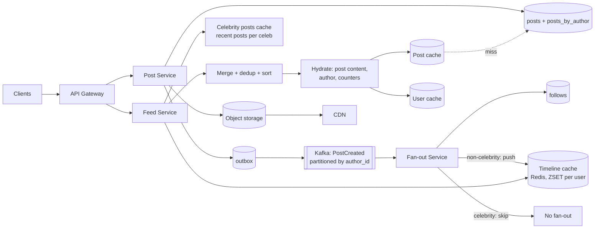
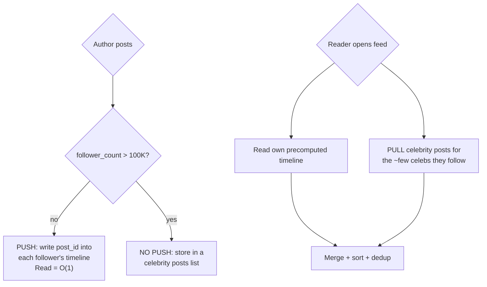

# Case Study 2 — News Feed / Twitter Timeline

**Archetype:** fan-out. The most common HLD question, and the one where the
**celebrity problem** is the real interview.

---

## 1. Requirements

**Functional (in scope)**
1. Post a tweet (text + optional media).
2. Follow / unfollow a user.
3. Home timeline: posts from people you follow, reverse-chronological, paginated.
4. User timeline: a specific user's own posts.

**Out of scope:** DMs, ads, ML ranking (mention it as an extension), moderation,
trending, search.

**Non-functional**

| Dimension | Target |
|---|---|
| Scale | 200 M DAU, 400 M posts/day, 20 B timeline reads/day |
| Read:write | ~50:1 → **heavily read dominated** |
| Latency | Timeline read p99 < 200 ms; post write p99 < 500 ms |
| Freshness | A post appears in followers' feeds within ~5 s |
| Availability | 99.99% for reads; timeline reads must degrade gracefully |
| Consistency | Eventual, **except** read-your-writes for the author |

---

## 2. Estimation

```
Writes: 400 M/day  = 400/10^5    = ~4,000 QPS   (peak 3x = 12 K)
Reads : 20 B/day   = 20,000/10^5 = ~200,000 QPS (peak 3x = 600 K)

Post record: id 8 B + author 8 B + text 300 B + meta ~100 B ≈ ~400 B
Posts storage: 400 M x 400 B = 160 GB/day -> ~58 TB/yr -> x3 = ~175 TB/yr
Media: 10% of posts x 1 MB = 40 TB/day  -> object storage + CDN, NOT the DB

Fan-out volume: avg 200 followers x 400 M posts = 80 B timeline writes/day
                = ~1 M timeline writes/sec  <-- THE hard number
Timeline cache: 200 M users x 800 recent post ids x 8 B = ~1.3 TB
                (store IDs only, hydrate posts from a separate cache)
```

**Conclusions**
1. 50:1 read ratio → **precompute timelines** (fan-out on write).
2. 1 M timeline writes/s of fan-out → must be async, batched, and sharded.
3. Storing full posts per timeline would be 400x bigger → **store post IDs only**.
4. Media dominates storage → blob + CDN.
5. A user with 100 M followers cannot be fanned out → **hybrid**.

---

## 3. Core entities & API

**Core entities**

| Entity | What it is | Notes |
|---|---|---|
| **User** | Profile plus counters | `followerCount` is what classifies an account as a celebrity, which changes its fan-out path |
| **Post** | Authored content: text, media refs, `createdAt` | Immutable once published; the ID is time-sortable so timelines merge without a join |
| **FollowEdge** | `(followerId, followeeId)` | Stored in **both** directions — fan-out needs followers-of-X, the UI needs following-of-X |
| **TimelineEntry** | A post **ID** in a materialised per-user timeline | Storing IDs rather than post copies is what keeps 100 M-follower fan-out affordable |
| **Media** | Blob in object storage, referenced by ID | Never inlined into a feed row |

Note that `TimelineEntry` is a *derived* entity — it can be rebuilt from posts and follow
edges. That is what makes the push/pull hybrid safe to change later.

**Interface**

```
POST /v1/posts        { text, mediaIds[] }   Idempotency-Key
  -> 201 { postId, createdAt }

GET  /v1/feed?cursor=<opaque>&limit=20
  -> { items: [{postId, authorId, text, mediaUrls, stats, createdAt}], nextCursor }

POST /v1/users/{id}/follow      -> 202
GET  /v1/users/{id}/posts?cursor=&limit=20
```
Cursor encodes `(created_at, post_id)` of the last item — never offset pagination on a
feed that changes constantly.

---

## 4. The naive design, and why it breaks

```
On feed load:
  SELECT post_id FROM posts
   WHERE author_id IN (SELECT followee_id FROM follows WHERE follower_id = ?)
   ORDER BY created_at DESC LIMIT 20
```

One query, no precomputation, no staleness, no fan-out workers. It is the **pull model**,
and for a small social app it is genuinely the right answer — say that, because a candidate
who reaches for Kafka on a 10 K-user product is also failing the interview.

It breaks at the scale in §2:

| What breaks | The number that breaks it | Consequence |
|---|---|---|
| **Read amplification** | Average user follows ~200 accounts | Every feed load is a 200-way scatter, merge and sort — at 600 K peak QPS that's 120 M partition reads/s |
| **Latency on the critical path** | p99 target < 200 ms | The merge is bounded by the *slowest* of 200 shard reads, so tail latency compounds instead of averaging out |
| **Wasted work** | Reads outnumber writes 50:1 | The same merge is recomputed on every refresh even when nothing changed. You pay 50x for work whose answer didn't move |
| **No cache purchase** | Feed is unique per user | You can't cache the *result* usefully at the edge, because no two users share a feed |

**The fix and its own failure.** Invert it: precompute each user's timeline at write time
(**push / fan-out-on-write**), so a read is one sequential fetch of an already-sorted list.
That converts 50 reads of work into 1 write of work — correct for the 50:1 ratio.

But push has a failure mode just as sharp: **one post by a 100 M-follower account becomes
100 M writes.** A single celebrity tweet can saturate the entire fan-out fleet and delay
every ordinary user's post behind it.

So neither pure model survives, which is the actual thesis of this problem: **push for the
long tail, pull for celebrities, merge at read time.**
[§7](#7-deep-dive-fan-out-strategy) works through the choice and
[§8](#8-the-celebrity-problem-in-depth) works through the celebrity case in detail.

---

## 5. Data model

| Table | Key | Other fields | Store, and why |
|---|---|---|---|
| **posts** | PK `post_id` | `author_id`, `text`, `media_ids`, `created_at`, `reply_to` | Sharded KV / Cassandra. Snowflake IDs, so `post_id` is time-sortable |
| **posts_by_author** | PK `author_id`<br>CK `post_id DESC` | — | Cassandra. A user's own timeline is one single-partition scan |
| **followees_by_user** | PK `follower_id`<br>CK `followee_id` | — | "Who do I follow" — the UI query |
| **followers_by_user** | PK `followee_id`<br>CK `follower_id` | — | "Who follows me" — the fan-out query |
| **timeline** | key `timeline:{user_id}` | `[post_id, ...]`, score = `post_id` | Redis LIST or ZSET, capped at ~800 entries. Time-sortable IDs make the score free |
| **social_graph_meta** | PK `user_id` | `follower_count`, `is_celebrity` (derived) | Promote above 100 K followers, demote below 80 K — hysteresis prevents mode flapping ([§8.3](#83-the-transition-problem-the-question-that-catches-people-out)) |

`follows` needs **both directions** stored — a very common miss. Fan-out needs
"who follows me"; the UI needs "who do I follow".

---

## 6. Architecture



**Write path:** validate → write post + outbox in one transaction → return 201 (fast).
Relay publishes `PostCreated` → fan-out workers push the post ID into each
non-celebrity follower's Redis timeline.

**Why an outbox instead of publishing to Kafka directly?** Writing the post to the DB and
publishing the event are two systems, and there is no atomic operation across them. If
you publish first and the DB write fails, followers see a post that doesn't exist; if you
write first and the publish fails, the post exists but never reaches a single timeline —
and the author sees their own post while nobody else ever does, which is the harder bug to
detect. Writing the post and an `outbox` row in **one local transaction** makes the event
as durable as the post itself; a relay then tails the outbox and publishes at-least-once.
Fan-out is idempotent (pushing the same post ID into a timeline is a set operation), so
a duplicate publish is harmless. Same reasoning as the outbox in
[payments](10-payment-system.md) — the difference is that here a lost event costs
engagement, not money.

**Read path:** fetch `timeline:{user}` IDs from Redis → fetch the user's followed
celebrities' recent post IDs → merge-sort by post ID (time-sortable) → take top 20 →
hydrate content from the post cache → return.

---

## 7. Deep dive: fan-out strategy




| | Push only | Pull only | Hybrid |
|---|---|---|---|
| Read latency | Excellent | Poor: O(followees) queries | Excellent |
| Write cost | O(followers) — catastrophic for celebrities | O(1) | Bounded |
| Storage | 1.3 TB of timelines | None | ~Same as push |
| Freshness | Instant once fanned out | Always current | Instant + current |

**Additional optimizations to mention:**
- **Only fan out to active users** (logged in within 30 days). This typically cuts
  fan-out volume by 60–80% — the single biggest cost saving. Inactive users get their
  timeline built on demand at next login.
- **Cap the timeline at ~800 entries** (`ZREMRANGEBYRANK`) — nobody scrolls further;
  deeper pages fall back to a pull query.
- **Batch fan-out writes**: group followers into batches of ~500 and use Redis
  pipelining, so 1 M writes/s is achievable with a modest worker fleet.
- **Partition Kafka by author_id** so one author's posts fan out in order.
- Fan-out is **at-least-once** → use a ZSET (set semantics), which makes duplicate
  inserts idempotent for free.

---

## 8. The celebrity problem, in depth

Saying "I'll use a hybrid" is where most candidates *stop*. It is where a good
interviewer *starts*. Every question below is one you should expect.

### 8.1 Why it's actually a problem — put numbers on it

```
Ordinary user:  200 followers      -> 200 timeline writes per post. Invisible.
Large account:  100 M followers    -> 100 M timeline writes per post.

At ~50 K Redis writes/s per fan-out worker (pipelined, batches of 500):
  100 M / 50 K = 2,000 worker-seconds for ONE post.
  With 100 workers dedicated to it: ~20 s before the last follower sees it.
  Meanwhile those workers are not fanning out anyone else's posts.

Worse: a celebrity posting 10 times in an hour = 1 B timeline writes,
which is more fan-out work than ~2.5 M ordinary users' posts combined.
```

Two distinct failures, and you should name both:
1. **Latency** — the last follower is minutes behind the first. The feed is no longer
   "5 s fresh".
2. **Noisy neighbour** — one author monopolises the shared fan-out fleet, so
   *everyone else's* posts get delayed too. This is the more serious one, and it's the
   argument for isolating celebrity traffic onto its own worker pool/queue even before
   you decide to skip fan-out.

### 8.2 "Why 100 K? What about a user with 99,999 followers?"

The honest answer: **the threshold is not a property of the user, it's a cost
comparison**, and you should derive it rather than assert it.

```
push cost  ≈ follower_count x write_cost
pull cost  ≈ reader_count_who_open_feed x merge_cost

Push when:  followers x P(follower reads soon)  <  cost of everyone pulling you
```

Practical consequences worth stating:
- The right threshold falls out of **your follower-count distribution**. Social graphs
  are power-law: a threshold anywhere in the 10 K–1 M range captures a tiny number of
  accounts but most of the fan-out volume. That flatness is *why* the exact number
  doesn't matter much — say that, because it defuses the question.
- Make it a **runtime-tunable config**, not a constant. You will change it during
  incidents.
- A cleaner formulation: rank accounts by `followers x post_rate` and treat the top
  N accounts as celebrities, so a low-follower/high-frequency bot is also caught.

### 8.3 The transition problem (the question that catches people out)

An account crosses the threshold. Its old posts were **pushed** into timelines; its new
posts are **pulled**. Now:
- A reader could see a post **twice** (once from their pushed timeline, once from the
  celebrity pull) → merge must **dedup by post_id**. The ZSET scored by post_id makes
  this free.
- An account that drops *below* the threshold has posts that were never pushed. If you
  now stop pulling them, those posts **silently vanish** from feeds. This is a real
  data-loss-shaped bug.

Fixes to state explicitly:
- **Never retroactively rewrite timelines** on a threshold change — too expensive.
- Keep pulling from an account for a **grace window** (e.g. the timeline depth, ~800
  posts or 7 days) after it drops below the threshold, so nothing disappears.
- Add **hysteresis**: promote to celebrity at 100 K, demote only below 80 K. Without
  it, an account hovering at the boundary flaps between modes on every follower churn,
  producing inconsistent feeds and cache thrash.
- Store the mode **on the post, not just the author** (`post.was_fanned_out`), so the
  reader always knows whether a given post is already in their timeline. This turns an
  ambiguous global question into a per-post fact.

### 8.4 The read side has its own celebrity problem

Hybrid moves cost from write to read — so bound the read.

```
Reader follows 5 celebrities   -> 5 extra cache reads. Fine.
Reader follows 500 celebrities -> 500 reads per feed load. NOT fine.
```

A user who follows thousands of large accounts is common (that's how many people use
Twitter). Mitigations:
- **Cap the pull set**: pull from the top K celebrities by recency/affinity, not all of
  them. The feed is ranked and truncated to 20 items anyway — most of those 500 would
  contribute nothing.
- **Batch the pull**: one multi-get over `celeb_recent:{id}` keys, not 500 round trips.
- **Cache the merged result** per reader for a few seconds. During a spike, thousands of
  readers of the same celebrity produce identical merges.

### 8.5 It's really a per-(author, reader) decision

The sharpest version of the answer: push/pull isn't a property of the author at all.
It's a property of the **edge**.

| Author | Reader | Decision |
|---|---|---|
| Ordinary | Active | **Push** — cheap, and it'll be read |
| Ordinary | Inactive | **Skip** — build on next login |
| Celebrity | Active *and* follows few celebs | **Push** — read latency matters, cost is bounded |
| Celebrity | Inactive / follows many celebs | **Pull** |

So a celebrity may still be fanned out to their most-engaged followers while everyone
else pulls. This "**partial fan-out**" is what real systems converge on, and offering it
unprompted is a strong senior signal — it shows you see the binary as a simplification
rather than a rule.

### 8.6 Celebrity post storage

```
celeb_recent:{author_id}   Redis ZSET, score = post_id (time-sortable)
                           capped at ~200 entries, TTL 7 days
```
Small, hot, read by millions → replicate it widely and add an **in-process L1 cache**
with a 1–2 s TTL in the Feed Service. With 500 feed instances that caps Redis reads for
one celebrity at ~500/s no matter how viral the post is. Same hot-key move as the URL
shortener.

### 8.7 What to measure

If you can't detect it, you can't tune the threshold:

| Metric | Why |
|---|---|
| Fan-out lag p99, **broken down by author tier** | An aggregate lag number hides the celebrity tail entirely |
| Fan-out writes/s attributed per author | Finds the noisy neighbour before it pages you |
| Feed read latency vs *number of celebrities followed* | Detects the §8.4 read-side problem |
| Count of accounts near the threshold | Predicts flapping and cost cliffs |

### 8.8 Rapid-fire probe answers

| Probe | Answer |
|---|---|
| "Why not just pull for everyone?" | Read latency: O(followees) queries + merge on every feed load, at 600 K peak QPS. Push amortises that work once per post instead of once per read, and reads outnumber writes 50:1 |
| "Why not push for everyone?" | Unbounded write amplification; one post can cost 100 M writes and starve the shared fan-out fleet |
| "What if a celebrity posts during a spike?" | Their queue is isolated; no fan-out occurs; readers pull from a widely replicated, L1-cached key. The spike hits the cheapest path in the system |
| "How does the reader not see duplicates?" | Merge dedups by post_id; ZSET semantics make re-insertion idempotent |
| "A celebrity follows another celebrity — problem?" | No. Following is unrelated to fan-out cost; only *follower* count matters |
| "How fresh is a celebrity post?" | **Fresher** than a normal one — pull has no fan-out delay at all. A nice inversion worth pointing out |
| "Does the threshold need to be exact?" | No — the follower distribution is power-law, so the cost curve is flat across a wide range. It's a tunable, not a constant |

---

## 9. Other deep dives

### Read-your-writes for the author
The author must see their own post instantly even before fan-out completes. Fix: the
Feed Service merges the user's own recent posts (from `posts_by_author`, a cheap
single-partition read) into their timeline at read time.

### Follow / unfollow
Following someone with 50 K posts should not backfill 50 K entries. Instead: on follow,
insert only their most recent N posts into the timeline (or let it fill naturally
going forward). On unfollow, **do not** rewrite the timeline — filter at read time and
let entries age out. Cheap, and correct enough.

### Counters (likes, retweets, replies)
Do not `UPDATE posts SET like_count = like_count + 1` — a viral post makes that row a
serialization point. Use sharded counters in Redis (`likes:{post}:{0..15}`, summed on
read) and periodically flush to the DB. Approximate counts are acceptable for display.

### Ranked (non-chronological) feed
Two-stage: **candidate generation** (recent posts from your graph + a few from
recommendations) → **ranking** (an ML model scoring engagement using features from a
feature store) → **filtering/diversity**. Say that ranking happens at read time over
~500 candidates, with the model served from a low-latency inference service, and
features precomputed. Mentioning the two-stage structure is enough at this level.

### Timeline cache failure
If Redis loses a node, those users' timelines vanish. Fallback: rebuild on demand via
the pull path (query recent posts from followees). This is slower but correct — so the
system degrades rather than fails. Warm the cache asynchronously afterwards.

---

## 10. Failure modes

| Failure | Behaviour |
|---|---|
| Fan-out workers lag | Feed staleness grows. Alert on **consumer lag**; readers still see celebrity posts and their own. Autoscale workers on lag |
| Timeline Redis node down | Affected users get pull-path fallback; higher latency, still functional |
| Post DB shard down | Posts by those authors fail to hydrate → render a placeholder rather than failing the whole feed (**partial response**) |
| Kafka down | Posts still persist (outbox holds events); fan-out catches up after recovery |
| Celebrity posts | No fan-out at all; readers pull from a replicated, L1-cached key. Celebrity traffic also runs on an **isolated queue/worker pool** so it cannot delay ordinary fan-out (see 7.1) |
| Thundering herd on a viral post | Post cache + in-process cache; counters sharded |

---

## 11. Scale evolution

- **10x reads:** more Redis capacity and app instances; add a per-instance L1 cache for
  hot posts; move media entirely to CDN.
- **10x writes:** more Kafka partitions and fan-out workers; consider lowering the
  celebrity threshold so fewer users get fanned out.
- **Multi-region:** pin users to a home region; replicate posts asynchronously; run
  fan-out per region using a region-local copy of the graph. Cross-region followers
  see a few extra seconds of delay — acceptable given the 5 s budget.

---

## 12. Trade-offs summary

| Decision | Chose | Alternative | Why |
|---|---|---|---|
| Fan-out | Hybrid push/pull, per-edge where it pays | Pure push | Celebrities make pure push unbounded; the per-edge refinement recovers read latency for engaged followers |
| Threshold | Tunable + hysteresis (100K up / 80K down) | Fixed constant | Prevents flapping; the power-law graph makes the exact value uncritical |
| Timeline contents | Post IDs only | Full post copies | 400x less memory; content shared across timelines |
| Fan-out targets | Active users only | All followers | Cuts ~70% of write volume |
| Ordering | Snowflake IDs as sort key | Separate timestamp | Time-sortable IDs make merge-sort trivial |
| Consistency | Eventual, 5 s budget | Strong | Feeds do not need strong consistency |
| Unfollow | Filter at read time | Rewrite timeline | Rewrites are expensive and rarely observed |
| Counters | Sharded + approximate | Exact row updates | Avoids hot-row contention |

---

## 13. Rapid-fire probe answers

Celebrity-specific probes are in [8.8](#88-rapid-fire-probe-answers). These cover the rest.

| Probe | Answer |
|---|---|
| "Why store post IDs instead of the posts?" | ~400x less memory (1.3 TB vs ~500 TB), and one post's content is shared across every timeline it appears in instead of being copied |
| "Why not offset pagination?" | The feed shifts constantly, so `OFFSET` skips or repeats items. Cursor on `(created_at, post_id)` is stable |
| "The author posts but doesn't see it in their own feed." | Fan-out is async. The Feed Service merges the user's own recent posts from `posts_by_author` at read time — a cheap single-partition read — to give read-your-writes |
| "User follows someone with 50 K posts." | Don't backfill. Insert only their most recent N posts, or let the timeline fill going forward |
| "User unfollows someone." | Don't rewrite the timeline. Filter at read time and let the entries age out of the 800-entry cap |
| "Why store the follow graph in both directions?" | Fan-out needs "who follows me" (`followers_by_user`); the UI needs "who do I follow". Neither query can be served by the other table |
| "A timeline Redis node dies." | Those users' timelines are gone. Rebuild on demand via the pull path — slower but correct. The system degrades rather than fails; warm the cache afterwards |
| "Fan-out is at-least-once — do users see duplicates?" | No. The timeline is a ZSET keyed by post_id, so re-insertion is idempotent for free |
| "Why cap timelines at 800 entries?" | Nobody scrolls further. Deeper pages fall back to a pull query, which is rare enough to be cheap |
| "How would you add ML ranking?" | Two-stage: candidate generation (graph + recommendations, ~500 items) then ranking at read time via a low-latency inference service with precomputed features |
| "A post goes viral — the like counter is a hot row." | Never `UPDATE ... SET count = count + 1`. Sharded Redis counters (`likes:{post}:{0..15}`) summed on read, flushed periodically. Approximate display counts are fine |
