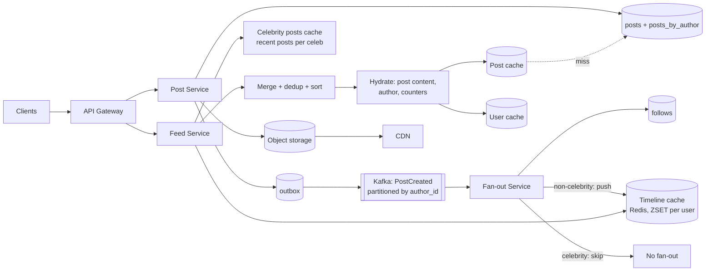
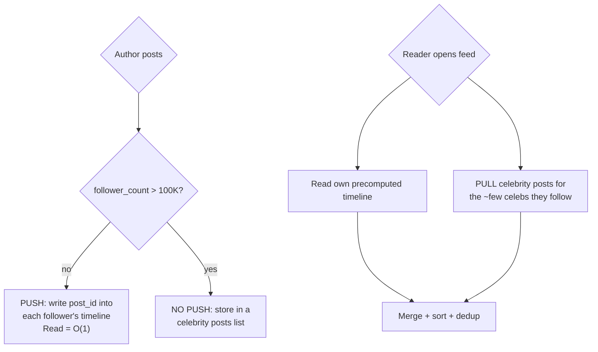

# Case Study 2 — News Feed / Twitter Timeline

**Archetype:** fan-out. The most common HLD question, and the one where the
**celebrity problem** is the real interview.

---

## 1. Requirements

**Functional (in scope)**
1. Post a tweet (text + optional media).
2. Follow / unfollow a user.
3. Home timeline: posts from people you follow, reverse-chronological, paginated.
4. User timeline: a specific user's own posts.

**Out of scope:** DMs, ads, ML ranking (mention it as an extension), moderation,
trending, search.

**Non-functional**

| Dimension | Target |
|---|---|
| Scale | 200 M DAU, 400 M posts/day, 20 B timeline reads/day |
| Read:write | ~50:1 → **heavily read dominated** |
| Latency | Timeline read p99 < 200 ms; post write p99 < 500 ms |
| Freshness | A post appears in followers' feeds within ~5 s |
| Availability | 99.99% for reads; timeline reads must degrade gracefully |
| Consistency | Eventual, **except** read-your-writes for the author |

---

## 2. Estimation

```
Writes: 400 M/day  = 400/10^5    = ~4,000 QPS   (peak 3x = 12 K)
Reads : 20 B/day   = 20,000/10^5 = ~200,000 QPS (peak 3x = 600 K)

Post record: id 8 B + author 8 B + text 300 B + meta ~100 B ≈ ~400 B
Posts storage: 400 M x 400 B = 160 GB/day -> ~58 TB/yr -> x3 = ~175 TB/yr
Media: 10% of posts x 1 MB = 40 TB/day  -> object storage + CDN, NOT the DB

Fan-out volume: avg 200 followers x 400 M posts = 80 B timeline writes/day
                = ~1 M timeline writes/sec  <-- THE hard number
Timeline cache: 200 M users x 800 recent post ids x 8 B = ~1.3 TB
                (store IDs only, hydrate posts from a separate cache)
```

**Conclusions**
1. 50:1 read ratio → **precompute timelines** (fan-out on write).
2. 1 M timeline writes/s of fan-out → must be async, batched, and sharded.
3. Storing full posts per timeline would be 400x bigger → **store post IDs only**.
4. Media dominates storage → blob + CDN.
5. A user with 100 M followers cannot be fanned out → **hybrid**.

---

## 3. API

```
POST /v1/posts        { text, mediaIds[] }   Idempotency-Key
  -> 201 { postId, createdAt }

GET  /v1/feed?cursor=<opaque>&limit=20
  -> { items: [{postId, authorId, text, mediaUrls, stats, createdAt}], nextCursor }

POST /v1/users/{id}/follow      -> 202
GET  /v1/users/{id}/posts?cursor=&limit=20
```
Cursor encodes `(created_at, post_id)` of the last item — never offset pagination on a
feed that changes constantly.

---

## 4. Data model

```
posts                (sharded KV / Cassandra)
  PK: post_id (Snowflake -> time-sortable)
  author_id, text, media_ids, created_at, reply_to

posts_by_author      (Cassandra)
  PK: author_id   CK: post_id DESC          -> user timeline, single-partition scan

follows              (sharded, two tables because two access patterns)
  followees_by_user: PK follower_id, CK followee_id
  followers_by_user: PK followee_id, CK follower_id   -> needed for fan-out

timeline             (Redis: LIST or ZSET per user, capped at ~800 entries)
  key: timeline:{user_id}   value: [post_id, ...]  score = post_id (time-sortable)

social_graph_meta
  user_id, follower_count, is_celebrity (derived, threshold ~100K)
```
`follows` needs **both directions** stored — a very common miss. Fan-out needs
"who follows me"; the UI needs "who do I follow".

---

## 5. Architecture



**Write path:** validate → write post + outbox in one transaction → return 201 (fast).
Relay publishes `PostCreated` → fan-out workers push the post ID into each
non-celebrity follower's Redis timeline.

**Read path:** fetch `timeline:{user}` IDs from Redis → fetch the user's followed
celebrities' recent post IDs → merge-sort by post ID (time-sortable) → take top 20 →
hydrate content from the post cache → return.

---

## 6. Deep dive: fan-out strategy




| | Push only | Pull only | Hybrid |
|---|---|---|---|
| Read latency | Excellent | Poor: O(followees) queries | Excellent |
| Write cost | O(followers) — catastrophic for celebrities | O(1) | Bounded |
| Storage | 1.3 TB of timelines | None | ~Same as push |
| Freshness | Instant once fanned out | Always current | Instant + current |

**Additional optimizations to mention:**
- **Only fan out to active users** (logged in within 30 days). This typically cuts
  fan-out volume by 60–80% — the single biggest cost saving. Inactive users get their
  timeline built on demand at next login.
- **Cap the timeline at ~800 entries** (`ZREMRANGEBYRANK`) — nobody scrolls further;
  deeper pages fall back to a pull query.
- **Batch fan-out writes**: group followers into batches of ~500 and use Redis
  pipelining, so 1 M writes/s is achievable with a modest worker fleet.
- **Partition Kafka by author_id** so one author's posts fan out in order.
- Fan-out is **at-least-once** → use a ZSET (set semantics), which makes duplicate
  inserts idempotent for free.

---

## 7. Other deep dives

### Read-your-writes for the author
The author must see their own post instantly even before fan-out completes. Fix: the
Feed Service merges the user's own recent posts (from `posts_by_author`, a cheap
single-partition read) into their timeline at read time.

### Follow / unfollow
Following someone with 50 K posts should not backfill 50 K entries. Instead: on follow,
insert only their most recent N posts into the timeline (or let it fill naturally
going forward). On unfollow, **do not** rewrite the timeline — filter at read time and
let entries age out. Cheap, and correct enough.

### Counters (likes, retweets, replies)
Do not `UPDATE posts SET like_count = like_count + 1` — a viral post makes that row a
serialization point. Use sharded counters in Redis (`likes:{post}:{0..15}`, summed on
read) and periodically flush to the DB. Approximate counts are acceptable for display.

### Ranked (non-chronological) feed
Two-stage: **candidate generation** (recent posts from your graph + a few from
recommendations) → **ranking** (an ML model scoring engagement using features from a
feature store) → **filtering/diversity**. Say that ranking happens at read time over
~500 candidates, with the model served from a low-latency inference service, and
features precomputed. Mentioning the two-stage structure is enough at this level.

### Timeline cache failure
If Redis loses a node, those users' timelines vanish. Fallback: rebuild on demand via
the pull path (query recent posts from followees). This is slower but correct — so the
system degrades rather than fails. Warm the cache asynchronously afterwards.

---

## 8. Failure modes

| Failure | Behaviour |
|---|---|
| Fan-out workers lag | Feed staleness grows. Alert on **consumer lag**; readers still see celebrity posts and their own. Autoscale workers on lag |
| Timeline Redis node down | Affected users get pull-path fallback; higher latency, still functional |
| Post DB shard down | Posts by those authors fail to hydrate → render a placeholder rather than failing the whole feed (**partial response**) |
| Kafka down | Posts still persist (outbox holds events); fan-out catches up after recovery |
| Celebrity posts | No fan-out at all — the hybrid design already handles this |
| Thundering herd on a viral post | Post cache + in-process cache; counters sharded |

---

## 9. Scale evolution

- **10x reads:** more Redis capacity and app instances; add a per-instance L1 cache for
  hot posts; move media entirely to CDN.
- **10x writes:** more Kafka partitions and fan-out workers; consider lowering the
  celebrity threshold so fewer users get fanned out.
- **Multi-region:** pin users to a home region; replicate posts asynchronously; run
  fan-out per region using a region-local copy of the graph. Cross-region followers
  see a few extra seconds of delay — acceptable given the 5 s budget.

---

## 10. Trade-offs summary

| Decision | Chose | Alternative | Why |
|---|---|---|---|
| Fan-out | Hybrid push/pull | Pure push | Celebrities make pure push unbounded |
| Timeline contents | Post IDs only | Full post copies | 400x less memory; content shared across timelines |
| Fan-out targets | Active users only | All followers | Cuts ~70% of write volume |
| Ordering | Snowflake IDs as sort key | Separate timestamp | Time-sortable IDs make merge-sort trivial |
| Consistency | Eventual, 5 s budget | Strong | Feeds do not need strong consistency |
| Unfollow | Filter at read time | Rewrite timeline | Rewrites are expensive and rarely observed |
| Counters | Sharded + approximate | Exact row updates | Avoids hot-row contention |
