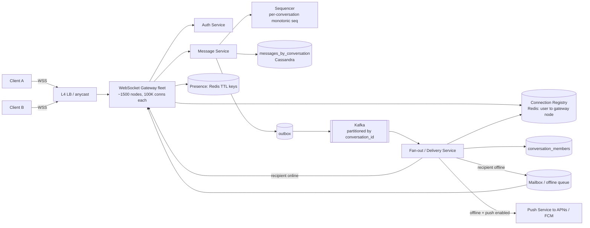
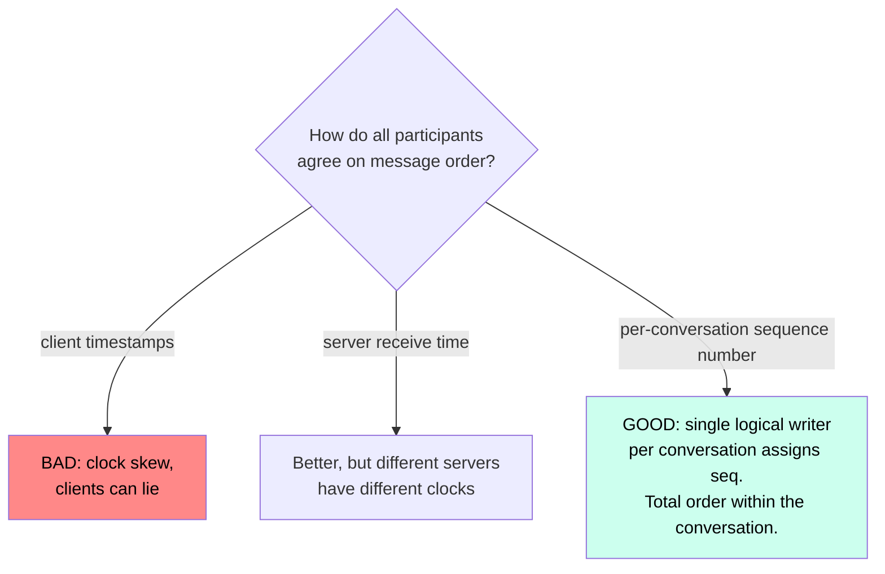
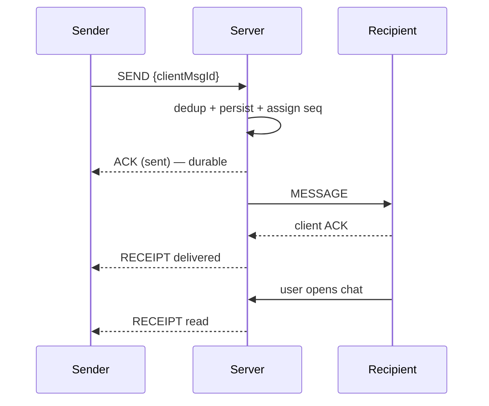

# Case Study 3 — Chat / Messaging (WhatsApp-style)

**Archetype:** real-time bidirectional. Tests connection management, delivery
guarantees, and ordering — areas most candidates handle weakly.

---

## 1. Requirements

**Functional (in scope)**
1. 1:1 messaging and group messaging (up to 500 members).
2. Delivery receipts: sent → delivered → read.
3. Online/last-seen presence.
4. Offline users receive messages when they reconnect; message history is retrievable.

**Out of scope:** voice/video calls (WebRTC — mention it), E2E encryption details
(mention Signal protocol), media (reuse the blob+CDN pattern), search.

**Non-functional**

| Dimension | Target |
|---|---|
| Scale | 500 M DAU, 50 B messages/day, 100 M concurrent connections |
| Latency | Message delivery p99 < 200 ms when both online |
| Ordering | **Consistent order within a conversation** for all participants |
| Delivery | Exactly-once *effect*; never lose an accepted message |
| Availability | 99.99% |
| Retention | 1 year of history |

---

## 2. Estimation

```
Messages: 50 B/day = 50,000/10^5 = ~580,000 QPS  (peak 3x = ~1.7 M/s)
Message record: ~200 B  ->  50 B x 200 B = 10 TB/day -> ~3.6 PB/year (x3 = ~11 PB)

Connections: 100 M concurrent.
  A tuned WS gateway node holds ~100 K connections
  -> 100 M / 100 K = ~1,000 gateway nodes (plus headroom -> ~1,500)

Fan-out: 1:1 = 1 recipient; groups of 500 -> a group message = 500 deliveries.
  Assume 20% group traffic at avg 50 members -> effective fan-out ~10x
  -> ~5.8 M deliveries/sec average
```

**Conclusions**
1. Connection count, not QPS, sizes the gateway fleet → need a **connection registry**.
2. 1.7 M writes/s, append-only, time-ordered → **Cassandra-shaped**, not RDBMS.
3. 11 PB → tiering: recent messages hot, older messages in cheap storage.
4. Group fan-out is the write-amplification problem, exactly like feeds.

---

## 3. API

```
WebSocket  wss://chat.example.com/v1/connect?token=...
  client -> server: SEND      { clientMsgId, conversationId, body, ts }
  server -> client: ACK       { clientMsgId, messageId, seq, serverTs }
  server -> client: MESSAGE   { messageId, seq, conversationId, senderId, body }
  server -> client: RECEIPT   { messageId, userId, state: DELIVERED|READ }
  both:             PING / PONG   (every 30 s)

REST (fallback + history)
  GET  /v1/conversations?cursor=
  GET  /v1/conversations/{id}/messages?afterSeq=&limit=50
  POST /v1/conversations/{id}/messages   (HTTP fallback when WS is unavailable)
```
`clientMsgId` is the **idempotency key**: a client retrying after a lost ACK must not
create a duplicate message.

---

## 4. Data model

```
messages_by_conversation                (Cassandra)
  PARTITION KEY: (conversation_id, bucket)     bucket = month, to bound partition size
  CLUSTERING KEY: seq DESC                      -> ordered reads, single-partition
  columns: message_id, sender_id, body, created_at, client_msg_id

conversation_meta
  conversation_id, type, member_count, last_seq, last_message_at

conversation_members
  PK conversation_id, CK user_id       -> fan-out target list

conversations_by_user                   (inbox list)
  PK user_id, CK last_message_at DESC  -> chat list ordering

user_delivery_state
  PK (user_id, conversation_id)  last_delivered_seq, last_read_seq
  -> receipts and unread counts are DERIVED from this, not stored per message

offline_queue / mailbox                 (Redis or Cassandra)
  PK user_id -> pending message refs for disconnected users

connection_registry                     (Redis)
  key user:{id}:conns -> {gatewayNodeId, connId, expiresAt}   TTL refreshed by heartbeat
```

**Bucketing the partition key by month is essential** — an unbounded partition per
conversation eventually becomes a hot, oversized partition. Mentioning this shows real
Cassandra experience.

Storing `last_read_seq` per user instead of a read flag per message turns O(messages)
state into O(1) — a great optimization to volunteer.

---

## 5. Architecture



**Send path:**
1. Client sends over WS with `clientMsgId`.
2. Gateway forwards to Message Service.
3. Message Service dedups on `clientMsgId`, assigns `seq` from the per-conversation
   sequencer, persists to Cassandra, writes to the outbox — **then ACKs the sender**.
   The ACK means *durably stored*, not *delivered*.
4. Kafka event (partitioned by `conversation_id` → per-conversation ordering).
5. Delivery Service looks up each member in the registry: online → push to their
   gateway; offline → mailbox + mobile push notification.

**Reconnect path:** client reconnects with its `lastSeq` per conversation → server
streams everything after that → no gaps, no duplicates.

---

## 6. Deep dive: ordering



Implementation: partition conversations across Message Service nodes so **one node owns
the sequence for a given conversation** (consistent hashing + a lease). It does an
atomic increment (Cassandra lightweight transaction, Redis `INCR`, or an in-memory
counter backed by a lease). Kafka partitioning by `conversation_id` preserves that order
through delivery.

Global cross-conversation ordering is neither needed nor achievable — say so.

---

## 7. Deep dive: delivery guarantees



- Transport is **at-least-once**; `clientMsgId` (send) and `messageId` (receive) make
  it idempotent → exactly-once effect.
- If the sender's ACK is lost, the client retries with the same `clientMsgId`; the
  server returns the original `messageId`.
- Recipients that never ACK stay in the mailbox and are re-delivered on reconnect.
- The three states map to three distinct events; never conflate "stored" with
  "delivered".

---

## 8. Deep dive: connections & presence

**Gateway scaling:** each node holds ~100 K connections. Sizing is by memory and file
descriptors, not CPU. Use L4 load balancing (L7 adds no value for a long-lived socket)
and keep gateways **stateless apart from the sockets** so any node can serve any user.

**Graceful deploy:** you cannot restart 1,500 gateways at once — 100 M clients would
reconnect simultaneously and melt the auth service. Drain node by node with a
`RECONNECT` control frame carrying a **randomized delay**, so reconnects are spread out.
This "reconnect storm" answer is a strong senior signal.

**Presence:** `presence:{userId}` Redis key with a 45 s TTL refreshed by the 30 s
heartbeat. Broadcasting every status change to every contact is O(contacts) and
expensive — instead, **subscribe only to the contacts currently visible in the client's
UI**. Last-seen is written on disconnect with a debounce.

---

## 9. Failure modes

| Failure | Behaviour |
|---|---|
| Gateway node dies | ~100 K clients reconnect with jittered backoff to other nodes; registry entries expire by TTL; undelivered messages come from the mailbox |
| Registry (Redis) down | Fall back to broadcasting on a per-user pub/sub topic, or treat everyone as offline and use the mailbox + push. Degraded, not broken |
| Kafka lag | Delivery is delayed; messages are already durable. Alert on consumer lag |
| Cassandra shard down | Writes fail for those conversations → return a "not sent" state to the client so it retries; do **not** ACK |
| Client offline for weeks | Mailbox capped; beyond the cap the client does a history sync via REST with `afterSeq` |
| Group of 500 | Fan-out is 500 registry lookups + pushes — batch by gateway node so you send one framed batch per node instead of 500 individual sends |

---

## 10. Scale evolution & extensions

- **10x connections:** gateways scale linearly; the registry becomes the bottleneck →
  shard Redis by user ID and cache the mapping at the delivery service.
- **Multi-region:** pin users to a home region; route cross-region conversations through
  a region-to-region relay. Keep the conversation's sequencer in a single home region to
  preserve ordering.
- **E2E encryption:** the server stores ciphertext only; keys are exchanged via the
  Signal (X3DH + Double Ratchet) protocol. Consequences to mention: no server-side
  search, no server-side content moderation, and multi-device key management becomes a
  real design problem.
- **Media:** presigned upload to blob storage, send only the reference in the message
  (**claim check pattern**).

---

## 11. Trade-offs summary

| Decision | Chose | Alternative | Why |
|---|---|---|---|
| Transport | WebSocket | Long polling | 100 M concurrent, sub-200 ms bidirectional |
| Store | Cassandra | RDBMS | 1.7 M writes/s, append-only, time-ordered, no joins |
| Ordering | Per-conversation sequencer | Client/server timestamps | Only a single logical writer gives a true total order |
| Delivery | At-least-once + idempotency keys | "Exactly once" | Exactly-once delivery doesn't exist over a network |
| Read state | `last_read_seq` per user | Per-message read flags | O(1) instead of O(messages) |
| Partitioning | `(conversation_id, month)` | `conversation_id` only | Bounds partition size for busy groups |
| Presence | TTL keys + UI-scoped subscriptions | Broadcast to all contacts | O(contacts) fan-out per status change is unaffordable |

---

## 12. Rapid-fire probe answers

| Probe | Answer |
|---|---|
| "How do all participants agree on message order?" | A server-assigned monotonic sequence number **per conversation**. Order is a property of the conversation, not of global time |
| "Why not order by client timestamp?" | Client clocks are skewed, wrong, and user-settable. Never derive correctness from them |
| "How do you find which gateway holds a user's connection?" | A connection registry in Redis (`user → gateway node`) with a TTL, written on connect and refreshed by heartbeat |
| "A gateway node dies with 100 K connections." | Clients reconnect (with jittered backoff, or you get a reconnect storm) and land on other nodes; registry entries expire by TTL. Messages queued meanwhile are delivered on reconnect |
| "Recipient is offline." | The message is durably stored before the ack. On reconnect the client sends its `last_seq` and pulls everything after it |
| "Can you guarantee exactly-once delivery?" | No — not across an unreliable client link. At-least-once transport plus client-side dedup on `message_id` gives exactly-once *effect* |
| "Why WebSockets over long-polling?" | 100 M concurrent connections: WebSockets avoid per-request handshake overhead and support server push. Long-poll is the fallback for restrictive networks |
| "Read receipts for a 500-member group." | Store `last_read_seq` per member, not a flag per message. O(1) per member instead of O(messages), and the receipt UI only needs a count |
| "Presence for a user with 5,000 contacts." | Don't broadcast. Presence is a TTL key; clients subscribe only to the contacts currently visible on screen |
| "Does E2E encryption change the design?" | Server-side search, moderation, and content-based dedup become impossible; ordering and delivery are unaffected because they only need metadata |
| "Why partition by `(conversation_id, month)`?" | `conversation_id` alone gives unbounded partitions for busy groups. Adding a time bucket keeps partitions scannable |
