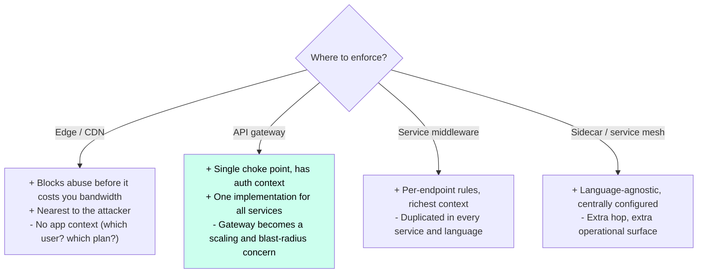
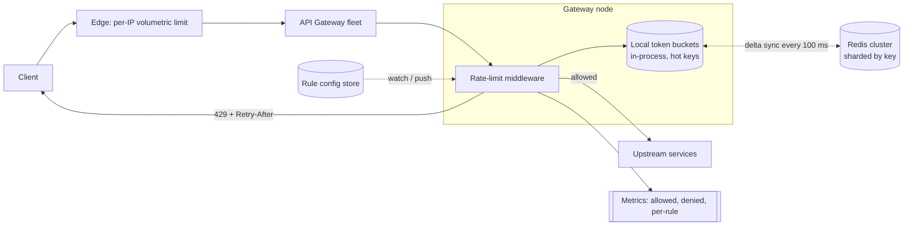

# Case Study 4 — Distributed Rate Limiter

**Archetype:** metering. A deceptively small problem that exposes whether you
understand distributed counters, clock skew, and — most importantly — what to do when
your own limiter breaks.

---

## 1. Requirements

**Functional (in scope)**
1. Limit requests per **key** (API key, user ID, IP, or tenant) against configurable
   rules, e.g. `1000 req/min per API key`, `10 req/s per IP on /login`.
2. Multiple simultaneous rules per request (per-user **and** per-endpoint **and**
   per-tenant); the most restrictive wins.
3. Reject with `429` + standard headers so clients can back off intelligently.
4. Rules are changeable at runtime without redeploying.

**Out of scope:** billing/quota accounting (related but different — quotas are monthly
and must be exact), WAF/bot detection, DDoS scrubbing (that belongs upstream at the
edge).

**Non-functional**

| Dimension | Target |
|---|---|
| Scale | 1 M req/s across the fleet, 100 M distinct keys |
| Added latency | **p99 < 2 ms** — it sits in front of every request |
| Accuracy | Approximate is fine (±1%); never *under*-count badly |
| Availability | Must be **more** available than the service it protects |
| Failure mode | **Fail open** for availability-critical paths, fail closed for abuse-critical paths |

The latency and failure-mode rows are the whole interview. Say them early.

---

## 2. Estimation

```
1 M req/s x (1-3 rules per request) = ~2 M counter ops/s

Counter state: key (~40 B) + counter + window metadata ≈ ~100 B
Active keys in a 1-minute window: say 10 M  ->  10 M x 100 B = ~1 GB
  -> the entire working set fits in memory on a small Redis cluster.

If every check is a network round trip to Redis:
  2 M ops/s / ~100 K ops/s per Redis node = ~20 nodes, and +0.5-1 ms per request.
```

**Conclusions**
1. State is tiny (~1 GB) but op rate is huge → **memory-resident, sharded by key**.
2. A synchronous network hop per request is the dominant cost → push work into the
   **local process** and only synchronise periodically.
3. Redis being down must not take down the API → **local fallback + fail-open**.

---

## 3. Algorithm choice


| Algorithm | Memory/key | Burst handling | Accuracy | Verdict |
|---|---|---|---|---|
| **Fixed window counter** | 1 int | Allows **2x burst** at the boundary | Poor | Only for coarse limits |
| **Sliding window log** | O(N) timestamps | Exact | Perfect | Too expensive at 1 M req/s |
| **Sliding window counter** | 2 ints | Smooths the boundary | ~99% | Great default |
| **Token bucket** | 2 floats (tokens, ts) | **Configurable burst** — the feature you want | Good | **Choice for APIs** |
| **Leaky bucket (queue)** | queue | Smooths output, adds latency | Good | For shaping traffic to a fragile downstream |

**Choice: token bucket**, because burst allowance is a product requirement, not a bug —
clients legitimately send a burst then go quiet. It stores only `(tokens, last_refill)`
and refills lazily on read, so there is no background timer:

```
now = now_ms()
tokens = min(capacity, tokens + (now - last_refill) * refill_rate)
last_refill = now
if tokens >= 1: tokens -= 1; ALLOW
else: DENY, retry_after = (1 - tokens) / refill_rate
```

Use **sliding window counter** where burst must be strictly forbidden (e.g. login
attempts).

---

## 4. Where does it run?



**Answer: layered, not one place.**
- **Edge:** crude per-IP volumetric limits — cheap, absorbs the dumb attacks.
- **Gateway:** the real per-key business rules (this is the system we're designing).
- **Service:** limits on specific expensive endpoints only.

Saying "defence in depth, each layer catches what the previous one can't afford to"
is a senior-level answer.

---

## 5. The distributed counting problem

N gateway nodes share one logical limit. Three options:

### A. Centralised Redis, synchronous
Every check is an atomic Redis Lua script.

```lua
-- token bucket, atomic, single round trip
local t = redis.call('HMGET', KEYS[1], 'tokens', 'ts')
...
redis.call('HSET', KEYS[1], 'tokens', tokens, 'ts', now)
redis.call('PEXPIRE', KEYS[1], ttl)
return allowed
```
Accurate, simple, but adds a round trip to **every** request and couples your
availability to Redis.

### B. Local buckets with a fixed share (`limit / N`)
Zero latency, zero coordination. But it over-restricts badly when traffic is uneven
(load balancers are not perfectly fair) and breaks whenever N changes during a deploy
or autoscale event.

### C. Local decisions + async global reconciliation ← **choice**

```
1. Each node keeps a local token bucket per hot key.
2. Node decides IMMEDIATELY from local state -> ~0 ms added latency.
3. Every ~100 ms, nodes push their consumption delta to Redis and pull back the
   global remaining allowance, then adjust their local share proportionally to
   their own recent traffic share.
4. Cold/rare keys skip local state and go straight to Redis (cheap, low volume).
```

This is the **approximate counting / local-then-reconcile** pattern. Worst-case
overshoot is bounded by `N x (allowance consumed in one sync interval)`. With a 100 ms
interval that is a fraction of a percent — and you say exactly that number out loud.

---

## 6. Architecture



**Sharding:** hash by the limiter key so all traffic for one key lands on one Redis
shard — the counter for a key must be single-homed to be meaningful. Hot keys (a
whale tenant) are absorbed by the local buckets, which is a second reason to prefer
option C.

---

## 7. Response contract

```
429 Too Many Requests
RateLimit-Limit: 1000
RateLimit-Remaining: 0
RateLimit-Reset: 37          # seconds
Retry-After: 37
```

Always return `Retry-After`. Without it, well-behaved clients retry immediately and
turn your rate limit into a **retry storm**. Also tell clients to apply
**exponential backoff with jitter** — and enforce it by making repeat offenders wait
longer (progressive penalty).

---

## 8. Deep dives

### Fail open or fail closed?
When Redis is unreachable:
- **Fail open** (allow) for normal API traffic — the limiter exists to protect you from
  overload, and denying 100% of traffic is a worse outage than serving unmetered
  traffic for a few seconds. Degrade to **local-only** limits so you're not fully
  unprotected.
- **Fail closed** for security-critical rules (login, password reset, payment
  attempts) where allowing unlimited attempts is worse than downtime for that
  endpoint.

Stating that this is a *per-rule policy*, not a global one, is a strong signal.

### Clock skew
Token bucket refill depends on wall-clock deltas across nodes. Use monotonic clocks
locally, do the authoritative refill inside Redis using **Redis's own clock** during
sync, and cap negative deltas at 0 so a clock jump backwards can't grant infinite
tokens.

### Hot key / whale tenant
One tenant at 200 K req/s would melt a single Redis shard. Local buckets already
absorb this; additionally, shard a single logical key into `key:0..key:15` sub-counters
with `limit/16` each and pick one at random (**key splitting**). Trade a little
accuracy for a lot of headroom.

### Rule configuration
Rules live in a config store (etcd/Consul/S3 + watch). Gateways cache them in memory
and hot-reload on change. **Never** put a database read on the rate-limit path.
Version rules and support a **dry-run / shadow mode** so you can see what a new rule
*would* have blocked before enforcing it — this has saved many production launches.

### Preventing the limiter from becoming the bottleneck
- No allocations per check; pre-sized maps; lock-free or striped locks.
- Bound local state with an LRU (`~100 K keys/node`), evicting cold keys to Redis.
- Budget: < 50 µs of CPU per check. Measure it and alert on it.

---

## 9. Failure modes

| Failure | Behaviour |
|---|---|
| Redis shard down | Nodes keep enforcing local limits; overshoot up to N x local allowance. Alert, don't page — the system is degraded, not broken |
| Redis fully down | Fail open with local-only limits (security rules fail closed) |
| Gateway node dies | Its local counters vanish → that node's consumed allowance is forgotten. Bounded and acceptable |
| Sync storm on restart | Deploys restart all nodes → all pull from Redis at once. **Jitter the sync interval** and stagger deploys |
| Bad rule pushed (limit = 0) | Blocks all traffic. Mitigate with rule validation, dry-run mode, staged rollout, and a fast rollback path |
| Attacker rotates IPs | Per-IP limits are useless; fall back to per-account, per-fingerprint, and edge/WAF reputation |

---

## 10. Scale evolution

- **10x traffic:** local buckets already absorb it — Redis load grows with *distinct
  keys*, not with request volume. That decoupling is the main benefit of design C.
- **10x keys (1 B):** local LRU hit rate falls, more Redis traffic. Add shards; move
  long-tail keys to a coarser algorithm (fixed window, 1 int).
- **Multi-region:** do **not** try to keep one global counter across regions —
  cross-region latency destroys the p99. Enforce per-region limits at `limit/regions`,
  or accept per-region limits as the product definition. Only truly global quotas
  (billing) get an async, eventually-consistent global tally.

---

## 11. Trade-offs summary

| Decision | Chose | Alternative | Why |
|---|---|---|---|
| Algorithm | Token bucket | Sliding window log | Burst allowance is a feature; O(1) memory |
| Coordination | Local + async reconcile | Synchronous Redis per request | Removes a network hop from every request; decouples availability |
| Accuracy | Approximate, bounded overshoot | Exact | Exactness costs a round trip; ±1% is invisible to users |
| Placement | Layered edge → gateway → service | Single choke point | Each layer blocks what the next can't afford |
| Failure policy | Fail open, per-rule override | Always fail closed | Limiter outage shouldn't become a full outage |
| Storage | Redis, sharded by key | Durable DB | State is small, ephemeral, and rebuildable |

---

## 12. Rapid-fire probe answers

| Probe | Answer |
|---|---|
| "Why token bucket over sliding window?" | Clients legitimately burst then go quiet, and burst allowance is a product feature. Token bucket stores two numbers and refills lazily — no background timer |
| "Redis is down. Do you allow or deny?" | Per-rule policy. Fail **open** with local-only limits for normal API traffic; fail **closed** for login/password-reset/payment, where unlimited attempts are worse than an outage |
| "How far can the count overshoot?" | Bounded by `N nodes × allowance consumed per sync interval`. At 100 ms sync that's a fraction of a percent — quote the number, don't hand-wave |
| "Why not just give each node `limit / N`?" | Load balancers aren't perfectly fair, so it over-restricts; and N changes on every deploy or autoscale event, silently changing the effective limit |
| "What about clock skew between nodes?" | Use monotonic clocks locally, do authoritative refill against **Redis's** clock during sync, and clamp negative deltas to zero so a backwards jump can't mint tokens |
| "One tenant sends 200 K req/s." | Local buckets absorb most of it. Beyond that, split the key into `key:0..15` sub-counters with `limit/16` each — trade a little accuracy for a lot of headroom |
| "How much latency does this add?" | Near zero on the hot path, because the decision is made from in-process state. Budget < 50 µs of CPU per check, and alert if it regresses |
| "Can you enforce one global limit across regions?" | Not without destroying p99 — cross-region round trips are 100 ms+. Enforce `limit/regions` per region, or define the limit as per-region. Only billing quotas get an async global tally |
| "Why does `Retry-After` matter?" | Without it, well-behaved clients retry immediately and your rate limit becomes a retry storm that amplifies the overload it was meant to prevent |
| "Someone pushes a rule with limit = 0." | Blocks everything. Validate rules, support shadow/dry-run mode to see what a rule *would* block, roll out in stages, and keep rollback fast |
| "Where should limiting live — edge, gateway, or service?" | All three. Edge does cheap volumetric per-IP, gateway does the business rules with auth context, services protect specific expensive endpoints. Defence in depth |
