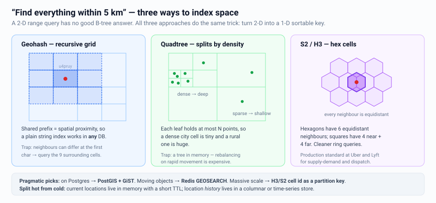
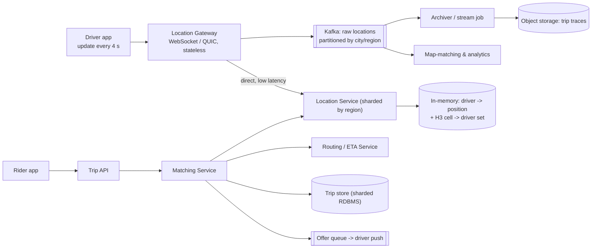
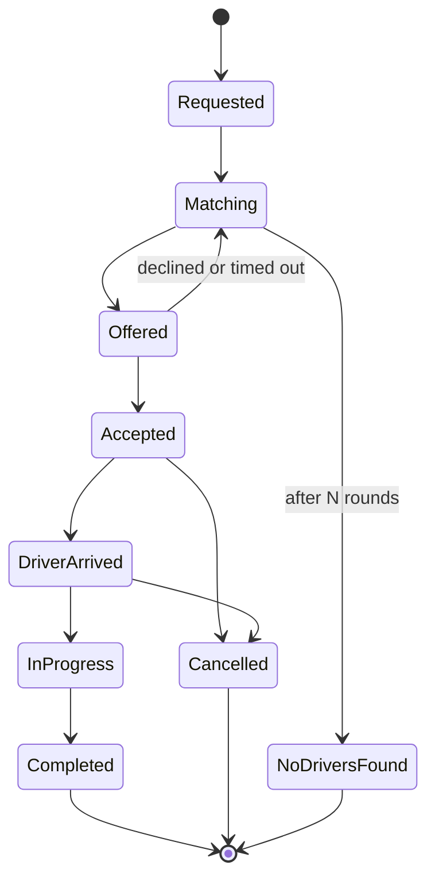

# Case Study 5 — Ride-Hailing (Uber / Lyft)

**Archetype:** geospatial + real-time matching + long-lived transactional state.
This problem is popular because it has three genuinely different sub-systems, and
weak candidates design only one of them.

---

## 1. Requirements

**Functional (in scope)**
1. Drivers stream their location continuously while online.
2. Riders request a ride from A → B; the system shows an ETA and price, then matches a
   nearby driver.
3. Matching: offer to a driver, they accept/decline, then the trip runs through a state
   machine to completion.
4. Both parties track each other live during the trip.

**Out of scope:** payments (reuse the payment case study), ratings, pooling/carpool
(mention it as a much harder routing problem), driver onboarding.

**Non-functional**

| Dimension | Target |
|---|---|
| Scale | 10 M drivers, 1 M concurrent online, 20 M trips/day |
| Location updates | Every 4 s per online driver |
| Latency | Match found p99 < 5 s; nearby-driver query p99 < 200 ms |
| Consistency | **A driver must never be double-booked** — strong here, eventual elsewhere |
| Availability | 99.99%; must degrade gracefully per-city |
| Durability | Trip and location history retained (regulatory) |

---

## 2. Estimation

```
Location writes:
  1 M online drivers / 4 s = 250,000 writes/s   (peak 3x = 750 K/s)
  Record: driver_id, lat, lng, heading, ts ≈ 50 B
  -> 250 K/s x 50 B = 12.5 MB/s = ~1 TB/day raw

Ride requests:
  20 M trips/day = 20/10^5 x 10^4... = ~230 req/s  (peak 3x-5x = ~1,200/s)
  Each request triggers ONE geo query but MANY candidate evaluations.

Current-location state:
  1 M drivers x ~100 B = 100 MB  -> trivially fits in memory. This is the key insight.
```

**Conclusions**
1. **Writes dominate reads by ~1000:1** — the opposite of most systems. This alone
   dictates the storage design.
2. Current location is 100 MB → keep it **in memory**, not in a database.
3. Location *history* is 1 TB/day → completely separate, append-only, cheap store.
   Never mix the two.
4. Trips are low volume but high value → a real transactional store with strong
   guarantees.

**Say this out loud:** "There are two location systems here — a tiny hot one for
matching and a huge cold one for history. Conflating them is the classic mistake."

---

## 3. Core entities & API

**Core entities**

| Entity | What it is | Notes |
|---|---|---|
| **Rider** | Passenger identity, payment method, current request | Simple; almost never the scaling problem |
| **Driver** | Identity, vehicle, and a **status**: `offline` / `available` / `matched` / `on_trip` | Status transitions are the contended field — two riders must never be matched to one `available` driver |
| **DriverLocation** | `(driverId, lat, lng, heading, updatedAt)` + its cell index | **Ephemeral and overwritten every 4 s.** Obsolete almost immediately, which is why it never goes in a durable DB |
| **RideRequest** | Rider's pickup/dropoff, product type, and the matching attempt state | Short-lived; becomes a Trip or expires |
| **Trip** | The durable record: rider, driver, route, timestamps, fare, status | The system of record. Immutable once completed |
| **LocationHistory** | Append-only breadcrumb trail per trip | Huge, write-only, cold. Read only for disputes and analytics |

The table splits cleanly into two halves, and naming that split is the whole framing:
**`DriverLocation` is hot, tiny, and disposable; `Trip` and `LocationHistory` are durable
and large.** They share nothing but an ID.

**Interface**

```
# Driver app
POST /v1/drivers/location        { lat, lng, heading, accuracy }   # every ~4 s, fire-and-forget
     -> 204 No Content                                            # never blocks the driver app
POST /v1/drivers/status          { status: available | offline }
POST /v1/offers/{offerId}/accept  Idempotency-Key: <uuid>
     -> 200 { tripId, pickup } | 409 offer_expired | 409 already_taken

# Rider app
POST /v1/rides                   { pickup, dropoff, productType }  Idempotency-Key: <uuid>
     -> 202 { requestId, etaSeconds, fareEstimate }                # matching is async
GET  /v1/rides/{requestId}       -> { status, driver?, etaSeconds, vehicleLocation? }
DELETE /v1/rides/{requestId}     -> cancel (may incur a fee once matched)

# Push (WebSocket / push notification), not polling
WS  driver <- { type: "offer", offerId, pickup, expiresInSeconds: 15 }
    rider  <- { type: "matched" | "driver_location" | "arrived" | "completed", ... }
```

Three interface decisions worth volunteering:
- **Location updates return `204` and are best-effort.** Acking anything more would put
  the matching system in the driver app's critical path 250 K times a second.
- **Ride creation returns `202`, not the driver.** Matching takes seconds and may retry
  several drivers; pretending it's synchronous forces a long-held request and a bad UX on
  failure.
- **Offers are pushed and expire.** A 15-second TTL on an offer is what stops one
  unresponsive driver from stalling a rider's match.

---

## 4. The naive design, and why it breaks

```sql
-- Driver app, every 4 seconds:
UPDATE drivers SET lat = ?, lng = ?, updated_at = NOW() WHERE id = ?;

-- Rider requests a ride:
SELECT id FROM drivers
 WHERE status = 'available'
   AND ST_DWithin(location, ST_Point(?, ?), 3000)   -- PostGIS, 3 km radius
 ORDER BY ST_Distance(location, ST_Point(?, ?))
 LIMIT 10;
```

PostGIS with a GiST index. This is a *good* design — for a city, or for a static dataset
like restaurants. It collapses here for one reason that has nothing to do with the query:

| What breaks | The number that breaks it | Consequence |
|---|---|---|
| **Write rate** | 1 M active drivers ÷ 4 s = **250 K location writes/s** | No relational database absorbs that. Every write also updates a spatial index, which is the most expensive index type to maintain |
| **Index churn** | Every row rewritten every 4 s | The GiST index is being continuously rebuilt for data that is **obsolete 4 seconds later**. You're paying durability costs for values with a 4-second lifetime |
| **Write amplification** | WAL + replication + vacuum on 250 K/s of updates | Storage and replication bandwidth are consumed by data nobody will ever read again |
| **Match contention** | Many riders, one nearby driver | `SELECT ... LIMIT 10` has no notion of reservation, so two riders are offered the same driver and one gets a driver who has already accepted someone else |

**The reframe that unlocks the design:** driver locations are not *data*, they are a
**continuously refreshed cache with a 4-second half-life**. Once you say that out loud,
the conclusions follow immediately — keep them in memory, don't replicate them durably,
and accept that losing them entirely is a few seconds of degraded matching rather than a
data-loss incident.

That splits the problem in two, which is the framing the whole case study rests on:
- a **hot, tiny, disposable** index for matching — in-memory, cell-keyed, ~1 M entries
  ([§5](#5-geospatial-index--the-core-decision), [§6](#6-handling-250-k-location-writess))
- a **cold, huge, append-only** breadcrumb trail for history and billing, written
  asynchronously and never read by the matching path

**The instinct to resist:** "shard PostGIS by city." Sharding fixes the throughput
arithmetic but not the fundamental mismatch — you'd still be paying full durability,
indexing and replication costs for values that expire in 4 seconds. And matching would
*still* hand the same driver to two riders, because that's a concurrency problem
([§7](#7-matching--the-hard-part)), not a storage one.

---

## 5. Geospatial index — the core decision



| Approach | Fit for this problem |
|---|---|
| **Lat/lng B-tree columns** | Two range scans then intersect — poor selectivity, dies at scale |
| **Geohash** | String prefix = bounding box → works with any KV store; **boundary problem** (neighbours can have totally different prefixes) needs the 8 neighbour cells too |
| **Quadtree** | Adapts to density beautifully; but it's a mutable tree — expensive to rebalance at 250 K writes/s |
| **H3 / S2 (hex or sphere cells)** | Uniform cell sizes, neighbours are trivially computable, no boundary pathology, hierarchical resolutions | 

**Choice: H3 at a resolution where a cell is roughly 1 km across.**

```
driver_location:  driver_id -> (lat, lng, h3_cell, heading, ts)     [hash map]
cell_index:       h3_cell   -> Set<driver_id>                        [inverted index]

Nearby query:
  1. cell = h3(rider_lat, rider_lng)
  2. cells = h3_k_ring(cell, k=1)            # 7 cells ≈ 3 km radius
  3. candidates = union of cell_index[c]
  4. if |candidates| < 10: expand k          # dense downtown vs rural
  5. filter by true haversine distance, driver status, vehicle type
  6. rank by ETA from a routing service — NOT by straight-line distance
```

**Ranking by road ETA rather than crow-flies distance** is a detail that separates
candidates: a driver 200 m away across a river is useless.

---

## 6. Handling 250 K location writes/s

The naive design ("write each update to Postgres") is the trap. Instead:



Key moves:
1. **Never write current location to durable storage on the hot path.** It's overwritten
   in 4 seconds; durability is pointless. Memory + replica is enough.
2. **Shard the Location Service by geographic region** (city). Queries are inherently
   local, so a rider in Berlin never touches the Tokyo shard. This is a rare case where
   geo-sharding is genuinely correct — usually it isn't, and you should say why it works
   here: the query has a natural locality key.
3. **Adaptive update rate:** stationary or off-shift drivers report every 30 s instead
   of 4 s. This alone can cut write volume by more than half and saves phone battery —
   a great "optimise the client, not just the server" answer.
4. Fan the raw stream to Kafka for history/analytics, entirely off the critical path.

---

## 7. Matching — the hard part

Matching is not "find the nearest driver". It's an assignment problem under
uncertainty.

### Naive: first-come-first-served, offer to nearest
Fast, simple, but globally suboptimal and vulnerable to a driver declining repeatedly.

### Better: **batched matching**
Accumulate requests for a short window (~2–5 s) per region, then solve a bipartite
assignment (Hungarian algorithm / min-cost flow) over the batch.

- Reduces total wait time and empty miles across the whole market.
- The 2–5 s delay is invisible to the rider (they already expect a "finding your
  driver" spinner).
- Naturally handles the case where two riders both want the same driver.

### Preventing double-booking
This is the one place you need **strong consistency**:

```
Offer flow:
  1. Matching picks driver D for request R.
  2. Conditional write: SET driver_state[D] = OFFERED(R) IF state == AVAILABLE
     (compare-and-swap, single-homed per driver)  -> if it fails, pick another driver.
  3. Push offer to D with a 15 s TTL.
  4. D accepts -> CAS OFFERED(R) -> ON_TRIP(R). D declines / TTL expires -> back to
     AVAILABLE, and R re-enters the next matching batch.
```

The lease/TTL is essential: a driver whose phone dies mid-offer must not be locked out
forever. **Reservation with expiry** is the reusable pattern here (same as ticket
booking).

### Surge pricing
Computed per H3 cell per few minutes from a demand/supply ratio, published to a cache
that both the pricing quote and the matcher read. It's an eventually-consistent,
approximate signal — and once a rider is quoted a price, that price is **locked** into
the trip record so later surge changes can't alter it.

---

## 8. Data model

| Table | Key | Other fields | Store, and why |
|---|---|---|---|
| **driver_state** | `driver_id` | `status`, `lat`, `lng`, `h3`, `heading`, `ts`, `current_trip` | In-memory, replicated. The source of truth for matching — it changes 250 K times/s and is worthless once stale |
| **trips** | PK `trip_id` (UUID)<br>shard by `rider_id` or city | `rider_id`, `driver_id`, `state`, `quoted_price`, `pickup`, `dropoff`, timestamps | Sharded RDBMS / Spanner-like. Money and state transitions need strong consistency |
| **trip_events** | PK `(trip_id, seq)` | `type`, `payload`, `ts` | Append-only audit log of every state transition |
| **trip_traces** | `trip_id` | `[(ts, lat, lng)]` | Object storage, columnar, partitioned by day and city. Written **after** the trip, not during |
| **driver_daily_stats** | PK `(driver_id, day)` | earnings, trips, online hours | Analytics store, async rollup |

The **trip state machine** is worth drawing:



Persist every transition as an event. Reconstructing "what happened on this trip" is a
support, billing, and legal requirement — this is a natural, justified use of **event
sourcing** for one entity rather than the whole system.

---

## 9. Deep dives

### Why geo-sharding works here (and usually doesn't)
Sharding by city gives locality (queries never cross shards), natural failure isolation
(a Tokyo outage doesn't affect Berlin), and matches regulatory boundaries. The usual
objection — hot shards — is real: New Year's Eve in one city. Mitigate by splitting hot
cities into sub-regions and by making the Location Service horizontally scalable within
a region. This is a **cell-based architecture** where the cell key is geography.

### Live trip tracking
During a trip, the rider needs the driver's position. Don't poll the Location Service
from every rider. Instead the Location Gateway publishes that driver's updates to a
per-trip topic/channel; the rider's WebSocket subscribes. One producer, one consumer,
no fan-out problem.

### ETA computation
A separate service over a road graph with live traffic. It is expensive — cache
aggressively: quantise origin/destination to H3 cells and cache cell-pair ETAs for
30–60 s. During matching you need dozens of ETAs per request, so batch them into one
call (matrix API).

### Idempotency
Riders double-tap "Request ride" on bad networks. Every request carries an
`Idempotency-Key`; the Trip API stores it with the created trip and returns the same
trip on retry. Without this you create duplicate trips and charge people twice.

### Offline / degraded mode
If the Matching Service can't reach the routing service, fall back to straight-line
distance ranking. If the surge service is down, use the last published multiplier.
**Static stability**: the system keeps working with stale data rather than failing.

---

## 10. Failure modes

| Failure | Behaviour |
|---|---|
| Location Service node dies | Its region's driver positions are lost. Drivers re-report within 4 s → self-healing. Keep a warm replica to avoid even that gap |
| Kafka down | Matching is unaffected (it reads memory, not Kafka). History/analytics buffer locally and replay |
| Trip DB shard down | Trips in that shard can't transition. Buffer transitions in a durable queue and apply on recovery; do not lose an in-progress trip |
| Driver app loses network mid-trip | Client buffers positions and uploads on reconnect; trip state advances via rider-side signals + timeouts |
| Routing/ETA down | Fall back to haversine ranking; degrade the ETA shown, don't block matching |
| Whole region down | Fail over to a neighbouring region's cell (higher latency, still functional); trips are geo-partitioned so blast radius is one city |

---

## 11. Scale evolution

- **10x location updates:** adaptive reporting rate, delta encoding, binary protocol
  (protobuf over QUIC), and drop the archival stream first if it becomes the
  bottleneck — history is the least critical data.
- **10x trips:** matching is already partitioned by region and batched; add matcher
  instances per region. The Trip DB shards by city.
- **New product (pooling):** matching becomes a multi-passenger routing problem —
  acknowledge that it changes the algorithm (insertion heuristics over existing
  routes), not the architecture.

---

## 12. Trade-offs summary

| Decision | Chose | Alternative | Why |
|---|---|---|---|
| Geo index | H3 cells + in-memory inverted index | Postgres/PostGIS | 250 K writes/s; uniform cells; no boundary pathology |
| Current location storage | In-memory, non-durable | Durable DB writes | Data is obsolete in 4 s; durability buys nothing |
| Sharding | By city/region | By driver_id hash | Queries are inherently geo-local; gives failure isolation |
| Matching | Batched assignment (2–5 s window) | Greedy nearest-first | Globally better assignment; delay is invisible |
| Driver reservation | CAS + TTL lease | Distributed lock | No double-booking, and self-heals when a phone dies |
| Trip state | Event-sourced state machine | Mutable row only | Auditability for billing, support, and regulators |
| Consistency | Strong for driver assignment, eventual everywhere else | Strong everywhere | Only one invariant genuinely needs it |

---

## 13. Rapid-fire probe answers

| Probe | Answer |
|---|---|
| "Why H3 rather than geohash?" | Geohash has the boundary problem — adjacent points can share no prefix, so you must query 8 neighbour cells and cell sizes distort with latitude. H3 cells are uniform with trivially computable neighbours |
| "Why not PostGIS?" | 250 K location writes/s. A relational spatial index cannot absorb that, and it doesn't need to — the data is obsolete in 4 seconds |
| "Do you persist every location update?" | Not on the hot path. Current position lives in memory; the raw stream goes to Kafka for history and analytics, entirely off the critical path |
| "How do you guarantee a driver isn't double-booked?" | Compare-and-swap on driver state (`AVAILABLE → OFFERED`), single-homed per driver. If the CAS fails, pick another driver. This is the one place with strong consistency |
| "Driver's phone dies mid-offer." | The offer carries a TTL lease. On expiry the driver returns to `AVAILABLE` and the rider re-enters the next matching batch. Never lock without an expiry |
| "You said geo-sharding is usually wrong — why is it right here?" | Because the query has a natural locality key: a rider in Berlin never needs Tokyo data. That's rare. It also gives per-city failure isolation |
| "New Year's Eve in one city — hot shard." | Real. Split hot cities into sub-regions and scale the Location Service horizontally within a region. It's cell-based architecture with geography as the cell key |
| "Why batch matching instead of nearest-driver-first?" | Greedy assignment is globally suboptimal and thrashes when drivers decline. A 2–5 s batch solved as bipartite assignment reduces total wait and empty miles — and the delay is hidden by the 'finding your driver' spinner |
| "Rank by distance?" | By road **ETA**. A driver 200 m away across a river is useless. Batch the ETA lookups into one matrix call and cache cell-pair ETAs for 30–60 s |
| "Rider double-taps 'Request'." | `Idempotency-Key` on the request; the Trip API returns the existing trip instead of creating a second one |
| "Surge changes while the rider is deciding." | The quoted price is locked into the trip record at quote time. Surge itself is an approximate, eventually-consistent signal per cell |
| "Routing service is down." | Fall back to straight-line ranking and a degraded ETA. Static stability — keep working on stale data rather than failing |
