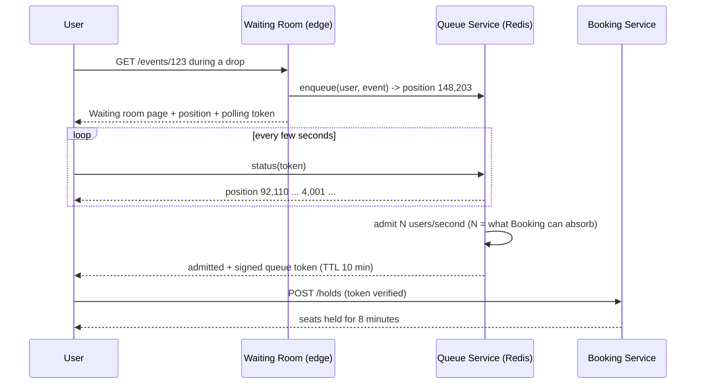
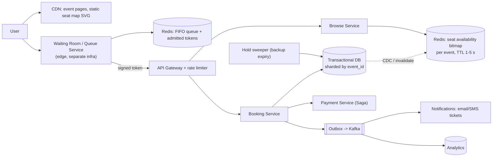

# Case Study 6 — Ticket Booking (Ticketmaster / BookMyShow)

**Archetype:** transactional with extreme contention. Almost every other case study is
"scale reads"; this one is "**do not sell the same seat twice while 2 million people
try to buy it in the same second**". Different muscle entirely.

---

## 1. Requirements

**Functional (in scope)**
1. Browse events and venues; view a seat map with real-time availability.
2. Hold selected seats for a limited time while the user pays.
3. Confirm the booking on successful payment; release the hold on failure/timeout.
4. Cancel/refund a booking.

**Out of scope:** dynamic pricing, resale marketplace, recommendations, the payment
processor internals (treat it as an external dependency).

**Non-functional**

| Dimension | Target |
|---|---|
| Scale | 100 M users; a hot event draws **2 M users in the first 10 s** |
| Read:write | ~1000:1 during a drop (everyone refreshing the seat map) |
| Latency | Seat map p99 < 300 ms; hold confirmation p99 < 1 s |
| Consistency | **Strong** for seat allocation. No double-booking, ever |
| Availability | 99.95%; correctness beats availability here |
| Fairness | Users who arrived earlier should generally win |

**The defining tension:** every other system in this repo trades consistency for
availability. Here you say the opposite out loud — *"I will sacrifice availability
before I sell one seat twice, because a double-sold seat is a legal and reputational
problem, whereas a 5-second queue is merely annoying."*

---

## 2. Estimation

```
Normal load: 100 M users, ~1% booking per day = 1 M bookings/day = ~12 QPS. Trivial.

Drop load (this is the real system):
  2 M concurrent users on ONE event
  Seat-map reads: 2 M users x ~1 refresh / 3 s = ~600,000 reads/s -- on a SINGLE event
  Hold attempts:  say 20% try to hold in the first minute = 400 K attempts / 60 s
                  = ~7,000 writes/s -- all contending on ~50,000 seat rows

Seat map payload: 50 K seats x ~20 B = ~1 MB raw -> ~50 KB compressed/bitmapped
```

**Conclusions**
1. Load is **spiky and concentrated on one key**, not spread over many. Sharding does
   not help you. This is a hot-partition problem by nature.
2. 600 K reads/s on one small object → cache/CDN it aggressively and accept staleness.
3. 7 K contended writes/s on a small row set → you need short, well-ordered
   transactions, and you need to shed load *before* it reaches the database.
4. 2 M simultaneous arrivals → **a waiting room is mandatory**. Admission control is
   the single most important design element.

---

## 3. API

```
GET  /v1/events/{id}                       -> event metadata (CDN-cached, minutes)
GET  /v1/events/{id}/seatmap               -> versioned availability bitmap (cached 1-5 s)
POST /v1/events/{id}/holds                 Idempotency-Key: <uuid>
       { seatIds:[...], queueToken }
     -> 201 { holdId, expiresAt }  | 409 { unavailableSeats:[...] }  | 429
POST /v1/holds/{holdId}/confirm            Idempotency-Key: <uuid>
       { paymentToken }
     -> 201 { bookingId, tickets[] }
DELETE /v1/holds/{holdId}                  -> release early
GET  /v1/queue/{eventId}/status            -> { position, etaSeconds, token? }
```

Every mutating call takes an `Idempotency-Key`. Users on flaky phones **will** retry,
and a duplicate booking here means a duplicate charge.

---

## 4. The waiting room (admission control)



Design points to state:
- The queue runs at the **edge**, on separate infrastructure from booking. If booking
  is saturated the queue must still answer — it's the thing protecting booking.
- Admission rate `N` is **derived from measured downstream capacity**, not guessed, and
  is adjustable live.
- The admitted token is a **signed, short-lived JWT** scoped to one event. This stops
  people from skipping the queue by hitting the booking API directly — which they
  absolutely will try.
- Position estimates can be approximate; an ETA that only moves forward is better UX
  than an exact number that jumps around.
- Fairness: a FIFO queue keyed by arrival, with per-account and per-payment-instrument
  limits to blunt bots. Full bot defence (device fingerprinting, proof-of-work,
  CAPTCHAs) is worth one sentence — it's a real part of this business.

---

## 5. Seat locking — the core mechanism

Four candidate approaches:

| Approach | Verdict |
|---|---|
| **Pessimistic DB lock** (`SELECT ... FOR UPDATE`) held during payment | ✘ Payment takes 30 s–3 min. Holding a DB transaction open that long destroys the database |
| **Optimistic concurrency** (version column, retry on conflict) | ✔ Correct, but under 7 K/s contention on the same rows the retry rate is brutal |
| **Distributed lock in Redis** (Redlock) per seat | ~ Fast, but a lock service outage or split-brain can double-book. Locks are not durable |
| **Reservation row with TTL** in the transactional DB | ✔ **Choice.** The hold *is* a durable record with an expiry, not a lock |

**Chosen design: two-phase booking via a durable hold.**

```sql
-- Phase 1: HOLD  (short transaction, milliseconds)
BEGIN;
  UPDATE seats
     SET status = 'HELD', hold_id = :hold, held_until = now() + interval '8 minutes'
   WHERE event_id = :e
     AND seat_id = ANY(:seats)
     AND (status = 'AVAILABLE'
          OR (status = 'HELD' AND held_until < now()));   -- reclaim expired holds lazily
  -- affected rows must equal requested seats, else ROLLBACK and return 409
  INSERT INTO holds(hold_id, user_id, event_id, seat_ids, expires_at, state) VALUES (...);
COMMIT;

-- Phase 2: CONFIRM  (after payment authorises)
BEGIN;
  UPDATE seats SET status = 'SOLD', booking_id = :b
   WHERE hold_id = :hold AND status = 'HELD' AND held_until >= now();
  -- if 0 rows: the hold expired -> compensate (void/refund the authorisation)
  INSERT INTO bookings(...);
COMMIT;
```

Why this is the right answer:
- The transaction is **short** — it never spans a network call to the payment
  processor.
- The hold is **durable**: a service restart doesn't lose it, unlike a Redis lock.
- Expiry is **lazy** (reclaimed by the next writer's `WHERE` clause) with a background
  sweeper as backup. Lazy expiry means correctness doesn't depend on a cron job
  running on time.
- All seats for one event live on **one shard** (`shard by event_id`), so this is a
  single-node transaction — no 2PC, no distributed consensus.

### Payment and the hold can disagree — use a Saga
Payment is an external system, so the confirm step is a distributed transaction in
disguise:

```
authorise payment  ->  confirm seats  ->  issue tickets
       |                     |
       |                     +-- fails / hold expired -> VOID the authorisation (compensate)
       +-- fails -> release the hold immediately
```
Authorise first, **capture only after** the seats are confirmed. If capture succeeds
but ticket issuance fails, retry issuance — never refund automatically, because the
user does have a valid booking. Record every step in an outbox so nothing is lost
between services.

---

## 6. Architecture



**Read path:** seat map is served from a Redis-cached **bitmap** (1 bit or 2 bits per
seat, ~50 KB for 50 K seats), refreshed every 1–5 s and served through the CDN with a
short TTL. It is explicitly **stale**, and the UI says so: seats are only truly yours
after a successful hold. This is the standard, honest answer — real-time
seat-level accuracy for 2 M viewers is not worth the cost.

**Write path:** admitted token → rate limiter → Booking Service → single-shard
transaction.

---

## 7. Data model

```
events(event_id PK, venue_id, starts_at, on_sale_at, status)          -- shard key
seats (event_id, seat_id) PK, section, row, price_tier,
       status ENUM(AVAILABLE|HELD|SOLD), hold_id, held_until, booking_id, version
holds (hold_id PK, event_id, user_id, seat_ids[], expires_at, state)
bookings(booking_id PK, event_id, user_id, seat_ids[], payment_id, state, created_at)
booking_events(booking_id, seq, type, payload)     -- audit / saga log
idempotency(key PK, user_id, request_hash, response, created_at)
```

**Shard key = `event_id`.** Every booking transaction touches exactly one event, so
transactions stay local. The downside is that a mega-event is a hot shard — accept it
and give big events **dedicated capacity** (their own shard, pre-warmed caches, higher
admission control). This is a cell-based answer: isolate the elephant so it can't
trample the mice.

---

## 8. Deep dives

### Why not just "sell out of Redis"?
It is much faster, and some real systems do use an in-memory allocator per event. But a
Redis failover can lose the last few seconds of writes, and a lost `SOLD` write means a
double sale. If you propose it, pair it with an append-only durable log of allocations
so state is rebuildable. Mentioning both the speed win and the durability hole is a
strong answer.

### General admission (no assigned seats)
Different problem: a single counter of remaining tickets. Contention on one counter at
7 K/s is solved by **splitting the inventory** into K buckets (`10 000` seats → 20
buckets of `500`), routing each request to a random bucket, and rebalancing when a
bucket empties. Approximate, wildly more scalable, and no seat identity to preserve.

### Preventing hold abuse
Cap holds per user/IP/payment method per event, expire aggressively (5–10 min), and
require the queue token. Otherwise scalpers hold the entire venue and re-hold on a
loop.

### Idempotency in depth
Store `(idempotency_key → response)` in the same transaction that creates the booking.
A retry then returns the original response instead of creating a second booking. Key
must be scoped to the user so keys can't collide or be replayed by others.

### Overbooking (airlines, not concerts)
Some domains deliberately oversell by a modelled no-show rate. Worth one sentence: it
turns a hard invariant into a business-tunable risk, and it changes the design from
"never exceed capacity" to "never exceed capacity × factor, with a compensation
process".

---

## 9. Failure modes

| Failure | Behaviour |
|---|---|
| Queue service down | **Close the gates** — reject new entrants rather than let 2 M users hit booking directly. Fail closed |
| Booking DB shard down | That event can't sell. Show "temporarily unavailable"; holds survive because they're durable. Failover to a synchronous replica |
| Payment provider down | Holds are still valid; retry with backoff, extend the hold once, then release and apologise. Have a secondary PSP |
| Confirm succeeds, response lost | Client retries with the same Idempotency-Key → returns the original booking, no duplicate |
| Capture succeeds, ticket issuance fails | Retry issuance from the outbox; the user is a legitimate customer. Alert if it exceeds SLA |
| Hold sweeper stops | Nothing breaks — lazy expiry in the `WHERE` clause already reclaims seats. The sweeper is a backstop, not the mechanism |
| Cache serves stale "available" | User attempts a hold and gets a clean `409`. The seat map is advisory by design |

---

## 10. Scale evolution

- **10x concurrent users on a drop:** the waiting room absorbs it — that's its entire
  purpose. Scale the queue (it's just a Redis list + token signing), not the database.
- **10x events:** trivially horizontal — shard by `event_id`.
- **One 10x-bigger event:** the single hot shard is the limit. Options: dedicated
  hardware per mega-event, partition the venue into sections handled by separate
  allocators, or switch that event to bucketed general admission.
- **Global events:** keep the authoritative inventory for an event **in one region**
  (inventory is not something to replicate multi-master) and put the waiting room and
  read caches at the edge worldwide.

---

## 11. Trade-offs summary

| Decision | Chose | Alternative | Why |
|---|---|---|---|
| Concurrency control | Durable hold row with TTL | `SELECT FOR UPDATE` during payment | Never hold a DB transaction across an external call |
| Lock durability | Transactional DB | Redis distributed lock | A lost lock means a double sale |
| Load shedding | Waiting room with admission control | Autoscale and hope | 2 M in 10 s cannot be autoscaled into; you must meter arrivals |
| Seat map freshness | Stale, cached 1–5 s | Real-time per-seat push | 600 K reads/s on one object; `409` on hold is a fine correction |
| Sharding | By `event_id` | By `user_id` | Keeps every booking transaction single-shard |
| Payment coupling | Saga: authorise → confirm → capture | One distributed transaction | External systems can't join your transaction |
| CAP stance | **CP** for inventory | AP | Double-selling is worse than a short outage |

---

## 12. Rapid-fire probe answers

| Probe | Answer |
|---|---|
| "Why not `SELECT ... FOR UPDATE` while the user pays?" | Payment takes 30 s to 3 minutes. Holding a database transaction open that long exhausts connections and locks — it will take the database down under load |
| "Why not a Redis distributed lock per seat?" | Locks aren't durable. A failover or split-brain loses the lock and you sell the seat twice. The hold must be a durable row |
| "The seat map is stale — isn't that a bug?" | It's a deliberate trade. 600 K reads/s on one object can't be real-time. The map is advisory; the authoritative answer is the hold attempt, which returns a clean `409` |
| "Why a waiting room instead of autoscaling?" | 2 M arrivals in 10 s cannot be autoscaled into — instances take minutes to warm and the database is the real constraint. You must meter arrivals, not chase them |
| "Can users skip the queue by calling the API directly?" | The booking API requires a signed, short-lived token scoped to that event, issued only on admission. They will try this, so it must be enforced server-side |
| "The hold sweeper job stops running." | Nothing breaks. Expiry is lazy — the next writer's `WHERE` clause reclaims expired holds. The sweeper only reclaims storage; correctness never depends on a cron job |
| "One mega-event makes a single hot shard." | Accept it and isolate it: dedicated shard and capacity for big events, pre-warmed caches, tighter admission. Isolate the elephant so it can't trample the mice |
| "General admission — no assigned seats?" | Different problem: one counter, not N rows. Split inventory into K buckets of `capacity/K`, route randomly, rebalance as buckets empty. Approximate but vastly more scalable |
| "Payment succeeded but the hold expired." | Compensate: void the authorisation. That's why you **authorise** first and **capture** only after seats are confirmed — the saga's compensating action is cheap |
| "Confirm succeeded but the response was lost." | The client retries with the same `Idempotency-Key` and gets the original booking back. The key and response are written in the same transaction as the booking |
| "Why is this CP when everything else you designed is AP?" | Because the failure modes differ in kind. A stale feed is invisible; a double-sold seat is a refund, a lawsuit, and a headline. Choose per-system, not by habit |
| "Scalpers hold the whole venue." | Cap holds per user / IP / payment instrument per event, expire holds in 5–10 minutes, and require the queue token. Bot defence (fingerprinting, proof-of-work) is a real part of this business |
