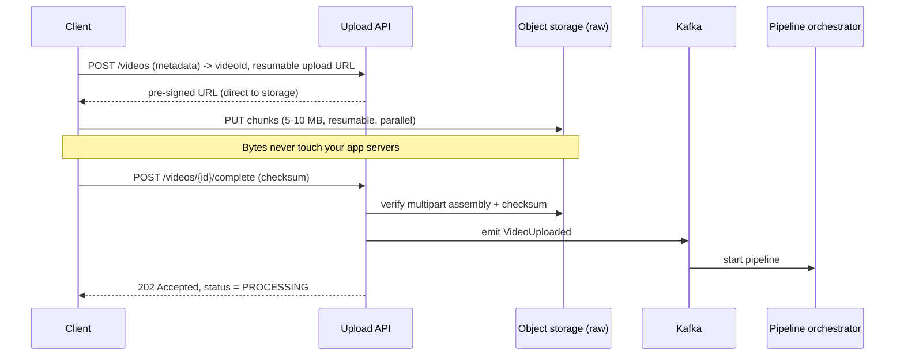
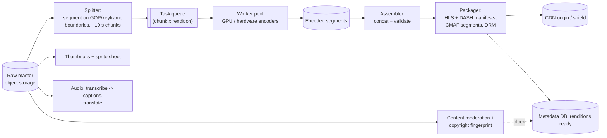
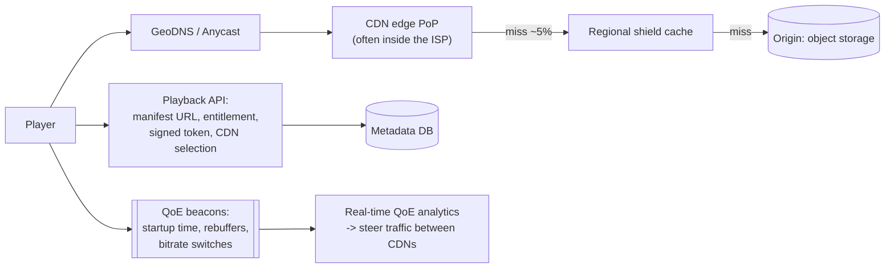

# Case Study 7 — Video Streaming (YouTube / Netflix)

**Archetype:** media pipeline + CDN economics. The distinguishing skill here is that
almost none of the interesting work happens in your request path — it happens in an
**asynchronous pipeline** and in **someone else's network**.

---

## 1. Requirements

**Functional (in scope)**
1. Upload a video (up to several GB, on unreliable connections, resumable).
2. Transcode into multiple resolutions/bitrates and package for adaptive streaming.
3. Play back smoothly worldwide with adaptive quality and fast start.
4. Metadata: title, thumbnails, view counts, search/browse.

**Out of scope:** recommendations (a system in its own right), live streaming
(mention how it differs), DRM internals, monetisation.

**Non-functional**

| Dimension | Target |
|---|---|
| Scale | 500 M DAU, 1 B watch-hours/day, 500 h of video uploaded/minute |
| Read:write | Overwhelmingly read; one upload can be watched millions of times |
| Latency | **Time-to-first-frame p99 < 1 s**; rebuffer ratio < 0.5% |
| Availability | 99.99% playback; upload can be 99.9% |
| Durability | 11 nines for masters — a lost original is unrecoverable |
| Cost | Egress bandwidth is the dominant cost line. Design for it explicitly |

---

## 2. Estimation

```
Uploads: 500 h/min = 30,000 h/hour. At ~1 GB/h source -> ~30 TB/hour = ~720 TB/day
  Transcoded renditions (6 ladders + audio) typically 1.5-2x the source
  -> ~1.5 PB/day of new storage. Yes, petabytes per day. Say the number.

Playback bandwidth:
  1 B watch-hours/day / 86,400 s = ~11.6 M concurrent streams
  Average bitrate ~3 Mbps  ->  11.6 M x 3 Mbps = ~35 Tbps sustained (peak 2-3x)

  35 Tbps is not something you serve from an origin. At ~$0.02/GB commercial egress,
  35 Tbps ≈ 380 PB/day ≈ $7.6 M/day. THIS is why you own/peer your own CDN.

Transcoding compute:
  30,000 h/hour of video x ~6 renditions. Real-time-ish per core -> ~180,000 core-hours
  per hour -> tens of thousands of machines, or hardware encoders (much cheaper/watt).
```

**Conclusions**
1. 35 Tbps → **the CDN is the architecture**. Origin serves ~0.1% of bytes.
2. 1.5 PB/day → tiered object storage with lifecycle policies is mandatory.
3. Transcoding is embarrassingly parallel → **chunk it and fan it out**, don't transcode
   files whole.
4. Cost per delivered GB is the metric the business cares about. Bring it up
   unprompted — it's a senior signal.

---

## 3. Core entities & API

**Core entities**

| Entity | What it is | Notes |
|---|---|---|
| **Video** | The logical asset: title, description, owner, visibility, status | What a user thinks they uploaded. Exists long before it is playable |
| **Upload** | A resumable upload session: `uploadId`, target URL, received byte ranges | Separate from `Video` because uploads fail, resume, and get abandoned |
| **Rendition** | One `(resolution, codec, bitrate)` output — `1080p/h264`, `720p/av1` | The unit of transcoding work and of storage cost. One video fans out to ~10 |
| **Segment** | A few seconds of one rendition, plus its keyframe boundary | **Independently transcodable and independently cacheable** — this one entity is why both the pipeline and the CDN scale |
| **Manifest** | HLS/DASH playlist listing renditions and segment URLs | What the player actually fetches first; ABR switching happens entirely inside it |
| **ViewEvent** | Append-only playback telemetry: position, buffer, bitrate, errors | Massive volume, write-only, never on the playback path |

**Segment is the entity that does the work.** Because segments are keyframe-aligned and
immutable, transcoding parallelises across a fleet, players switch bitrate mid-stream, and
every byte is cacheable forever at the edge. If you name only one entity, name that one.

**Interface**

```
# Upload (bytes never pass through the API tier)
POST /v1/videos                   { title, description, visibility }
     -> 201 { videoId, uploadUrl, uploadId }      # pre-signed, resumable
PUT  <uploadUrl>                  Content-Range: bytes 0-8388607/524288000
POST /v1/videos/{id}/complete     { uploadId }
     -> 202 { status: "processing" }              # transcoding is async

# Status & playback
GET  /v1/videos/{id}
     -> { status: uploading|processing|ready|failed,
          availableRenditions: [...], manifestUrl, thumbnailUrl }
GET  /v1/videos/{id}/manifest.m3u8               # CDN-cached, short TTL
GET  <cdn>/{videoId}/{rendition}/{segment}.ts    # CDN-cached, immutable, long TTL

# Telemetry (batched, fire-and-forget)
POST /v1/videos/{id}/events   { sessionId, events: [{ t, position, bitrate, buffer }] }
     -> 202
```

The interface encodes three of the design's core decisions before you've drawn a single
box:
- **`uploadUrl` is pre-signed** — multi-GB bodies go straight to object storage.
- **`complete` returns `202 processing`, not `200 ready`** — transcoding takes minutes, so
  the API must expose an asynchronous lifecycle rather than pretend it's instant.
- **Manifest and segments have opposite cache TTLs** — the manifest changes as renditions
  publish progressively; segments never change, so they're immutable and cached forever.

---

## 4. The naive design, and why it breaks

```
Upload:   POST /videos (multipart, 5 GB body) -> app server -> write to S3
Store:    the original MP4, as uploaded, one file
Playback: <video src="https://s3.../original.mp4">
```

Store what you were given, serve it back. Every failure below is a *different* reason this
can't work, which is why this problem decomposes into a pipeline rather than a single fix:

| What breaks | The number that breaks it | Consequence |
|---|---|---|
| **Upload through the app tier** | 5 GB bodies, 500 K uploads/day | Each upload pins a connection and buffers gigabytes; app servers become stateful and can't be redeployed without killing uploads |
| **One rendition for everyone** | A 4K source vs a phone on 3 Mbps mobile | The phone must download 25 Mbps of video over a 3 Mbps link. It buffers forever, and there is nothing lower to fall back to |
| **No adaptive switching** | Bandwidth varies *during* playback | A single file has one bitrate. When the network degrades mid-video the only options are stall or stop — you cannot switch down |
| **Serving from origin** | ~150 PB/day egress | Object-storage egress at that volume is financially absurd, and a viewer 300 ms away gets 300 ms added to every seek |
| **Serial transcoding** | A 2-hour 4K source | Transcoding on one machine to one output takes hours. Multiply by ~10 renditions and publishing takes a day |

**The unlock is one entity: the segment.** Cut the video into a few seconds of
**keyframe-aligned** footage, and every problem above becomes tractable at once — which is
rare enough that it's worth naming explicitly:

- Segments transcode **independently and in parallel**, so a 2-hour video finishes in
  minutes on a fleet instead of hours on a box ([§6](#6-transcoding-pipeline--the-heart-of-the-system)).
- Because segment boundaries are identical across renditions, a player can **switch
  bitrate between segments** mid-stream — that's all adaptive bitrate is ([§7](#7-playback-path)).
- Segments are **immutable**, so they cache at the edge forever, which is what makes CDN
  delivery both cheap and correct.
- Playback can start as soon as the *first* segments of *one* rendition are ready, rather
  than waiting for the whole pipeline.

And uploads bypass the app tier entirely via pre-signed URLs, so bytes never touch a
server you have to operate.

**The instinct to resist:** "transcode on demand, per viewer." It sounds efficient — no
storage for renditions nobody watches. But view counts follow a power law: a popular video
would be transcoded thousands of times to serve the same bytes, and the first viewer of
every video waits for an encoder. Pre-transcoding trades cheap storage for expensive CPU
and latency, which is the right direction. Reserve on-demand transcoding for the long tail
of rarely watched, rarely re-encoded formats.

---

## 5. Upload path



Key points:
- **Pre-signed direct-to-storage upload.** Never proxy multi-GB bodies through your API
  tier. This is the single most important upload decision.
- **Resumable, chunked** (~5–10 MB): mobile networks drop; retry only the failed chunk.
- **202 + async status**, with a websocket/poll for progress. The user gets a shareable
  link before processing finishes.
- **Deduplicate** by content hash — re-uploads of the same file skip transcoding
  entirely.

---

## 6. Transcoding pipeline — the heart of the system



Design points:
1. **Split into ~10 s chunks on keyframe boundaries**, then transcode chunks in
   parallel. A 1-hour video becomes 360 independent tasks × 6 renditions = 2,160 tasks
   that finish in minutes instead of hours. Keyframe alignment is what makes the pieces
   re-concatenable and makes adaptive switching seamless.
2. **DAG orchestration** (Temporal/Airflow-style) with per-task retries. A single chunk
   failure retries that chunk, not the video.
3. **Priority queues:** a 30-second clip from a large creator should not queue behind a
   4-hour upload from a new account. Multi-tier queues by expected watch volume.
4. **Publish progressively:** release the 480p rendition as soon as it's ready so the
   video is watchable while 4K is still encoding.
5. **Per-title / per-scene encoding:** choose the bitrate ladder from the content's
   complexity (an animation needs far less bitrate than a sports clip). This is a real,
   large cost saving and a great detail to mention.

---

## 7. Playback path



### Adaptive bitrate (ABR)
The manifest lists renditions; the **client** measures throughput and buffer level and
picks the next segment's quality. Put the responsibility on the client because only it
knows its real conditions.
- Start at a low rendition for a **fast first frame**, then ramp up.
- Switching is seamless only because segments are keyframe-aligned across renditions.

### Cache strategy
- Segments are **immutable and content-addressed** → cache forever, no invalidation
  problem. This is why media CDNs get 95%+ hit rates.
- **Popularity is extremely skewed:** a tiny fraction of the catalogue is most of the
  traffic. Pre-position (push) predicted-popular content to edges before release —
  Netflix's Open Connect model — instead of waiting for cache misses.
- **Tiered caching** (edge → regional shield → origin) so a cold object doesn't cause N
  edges to each hit origin. Also use **request coalescing** so 10,000 simultaneous
  misses become one origin fetch.

### Storage tiering


Masters go to archive tier after processing (needed only for re-encodes). Popular
renditions sit in hot storage; the long tail moves to infrequent-access. Lifecycle
policies do this automatically, and it is where a very large share of the storage bill
is saved.

---

## 8. Data model

```
videos(video_id PK, uploader_id, title, description, status, duration,
       created_at, visibility)                       -- sharded by video_id
renditions(video_id, rendition_id) PK, codec, resolution, bitrate,
       manifest_url, size_bytes, state
watch_events -> Kafka -> columnar warehouse          -- never a row per view in the OLTP DB
view_counts(video_id, count)                          -- approximate, async aggregated
```

**View counts deserve a callout.** 1 B watch-hours/day means an enormous event volume.
Don't increment a row per view. Stream the events, aggregate in windows, and write
periodic snapshots. Counts are eventually consistent and approximate for large numbers —
which is exactly what real products do ("1.2 M views"). This is the same
**approximate-counting** move as the URL shortener's analytics.

---

## 9. Deep dives

### Why is time-to-first-frame the metric?
Startup delay correlates directly with abandonment. It's driven by DNS + TLS +
manifest fetch + first segment download. Fixes: connection reuse/QUIC, prefetching the
manifest on hover, starting at a low bitrate, keeping the first segment short, and
edge PoPs physically close to users.

### Multi-CDN
Use two or three CDNs and steer per-request based on **measured QoE** per (CDN, ISP,
region). This gives leverage on price, resilience to one CDN's outage, and better
performance than any single provider. The QoE beacon loop is what makes it possible —
mention the feedback loop, not just "we use multiple CDNs".

### Live streaming (how it differs)
Same pipeline, but latency-bounded: shorter segments (1–2 s) or LL-HLS/CMAF chunked
transfer, no ability to pre-position content, transcoding must keep up in real time,
and DVR/rewind requires writing the live segments to storage as they're produced.

### Moderation and copyright
Fingerprint audio/video against a reference database during processing; block or
demonetise before publish. It's asynchronous but must complete **before** the video is
publicly listed — a pipeline gate, not an afterthought.

### Thumbnails and previews
Generate a sprite sheet of frames for scrubbing previews during processing. Cheap to
produce once, served as a normal cached image — and a nice example of doing work once
at write time to make every read cheap.

---

## 10. Failure modes

| Failure | Behaviour |
|---|---|
| Transcode worker dies | Task lease expires, another worker picks up that chunk. Idempotent by chunk ID |
| Poison video (crashes the encoder) | Retry twice, then dead-letter with a diagnostic dump. Never let one file stall the queue |
| Pipeline backlog spikes | Priority queues protect high-value uploads; autoscale workers on queue depth; publish low renditions first |
| One CDN degrades | QoE beacons detect it within seconds; steer traffic to another CDN |
| Origin overloaded on a viral release | Shield tier + request coalescing + pre-positioning. Origin should never see edge-scale traffic |
| Object storage region fails | Renditions replicated cross-region; masters in archive with cross-region replication |
| Metadata DB down | Playback of already-loaded manifests continues; new starts fail. Cache manifests at the edge to shrink the blast radius |

---

## 11. Scale evolution

- **10x viewers:** almost entirely a CDN capacity/peering problem, not an application
  problem. That decoupling is the point of the design.
- **10x uploads:** worker fleet scales horizontally on queue depth; move to hardware
  encoders for cost/watt; tighten per-title encoding to reduce output bytes.
- **New region:** deploy edge PoPs and a regional shield; replicate hot renditions;
  keep the control plane (metadata, uploads) in fewer regions.
- **Cost pressure:** better codecs (AV1) cut bitrate ~30% at the price of far more
  encode compute — encode once, serve millions of times, so the trade is usually worth
  it. Quantify that trade in the interview.

---

## 12. Trade-offs summary

| Decision | Chose | Alternative | Why |
|---|---|---|---|
| Upload | Pre-signed direct-to-storage, resumable chunks | Proxy through API servers | Never move GB through your app tier |
| Transcoding | Chunk-level parallel fan-out | Whole-file encode | Minutes instead of hours; per-chunk retries |
| Publishing | Progressive (low renditions first) | Wait for all renditions | Watchable sooner; better perceived latency |
| Delivery | Multi-CDN with QoE-based steering | Single CDN | Cost leverage, resilience, better p99 |
| Cache | Immutable content-addressed segments | Mutable URLs + invalidation | Eliminates invalidation entirely; 95%+ hit rate |
| Popular content | Pre-positioned push to edges | Pull on first miss | Avoids origin thundering herd on releases |
| View counts | Async, approximate | Synchronous exact counter | Event volume is enormous; exactness has no product value |
| Storage | Tiered with lifecycle policies | All hot | Long tail is rarely accessed; archive is ~20x cheaper |

---

## 13. Rapid-fire probe answers

| Probe | Answer |
|---|---|
| "Why not upload through your API servers?" | Multi-GB bodies through the app tier burn bandwidth, memory, and connection slots for no benefit. Pre-signed URLs send bytes straight to object storage |
| "Why chunk the transcode instead of encoding the file?" | A 1-hour video becomes ~360 chunks × 6 renditions = 2,160 independent tasks. Minutes instead of hours, and a failure retries one chunk rather than the whole video |
| "Why must chunks split on keyframes?" | So the encoded pieces concatenate cleanly, and so the player can switch renditions mid-stream without artefacts. ABR depends on aligned boundaries |
| "Who decides the bitrate — client or server?" | The client. Only it knows its actual throughput and buffer level. The server just publishes the ladder in the manifest |
| "How do you invalidate the CDN when a video changes?" | You don't. Segments are immutable and content-addressed, so they're cached forever. That's how media CDNs reach 95%+ hit rates — the invalidation problem is designed away |
| "Why multiple CDNs?" | Cost leverage, resilience to one provider's outage, and better p99 — steered per-request using QoE beacons measured per (CDN, ISP, region). The feedback loop is the interesting part, not the redundancy |
| "A big release goes live and origin melts." | Shouldn't happen: regional shield tier, request coalescing so 10 K misses become one origin fetch, and pre-positioning predicted-popular content to edges before release |
| "Why is time-to-first-frame the headline metric?" | It correlates directly with abandonment. Fixes: QUIC/connection reuse, prefetch the manifest, start at a low rendition, keep the first segment short |
| "A video crashes the encoder every time." | Retry twice, then dead-letter with a diagnostic dump. One poison file must never stall the queue |
| "Small creator's clip stuck behind a 4-hour upload." | Priority queues tiered by expected watch volume, plus progressive publish — release 480p as soon as it's ready rather than waiting for 4K |
| "How is live streaming different?" | Latency-bounded: 1–2 s segments or LL-HLS, real-time encoding with no ability to fall behind, no pre-positioning possible, and DVR requires persisting live segments as they're produced |
| "Are view counts exact?" | No, and they shouldn't be. Stream the events and aggregate in windows — products display "1.2 M views" precisely because exactness has no user value at that scale |
| "Why is AV1 worth the encode cost?" | ~30% bitrate reduction for much more CPU. You encode once and serve millions of times, so the egress saving dominates. Quantify it rather than asserting it |
