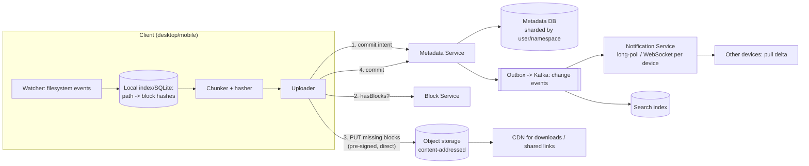

# Case Study 8 — File Sync & Storage (Dropbox / Google Drive)

**Archetype:** media + bidirectional sync. What makes this hard is not storage — it's
that **N devices mutate the same state offline and then reconcile**. Conflict
resolution is the interview.

---

## 1. Requirements

**Functional (in scope)**
1. Upload/download files; files sync automatically across a user's devices.
2. Offline edits sync when a device reconnects.
3. Version history and restore.
4. Sharing a file/folder with other users, with permissions.

**Out of scope:** real-time collaborative editing (that's the Google Docs/CRDT
problem — mention the difference), full-text search inside documents, mobile-specific
selective sync details.

**Non-functional**

| Dimension | Target |
|---|---|
| Scale | 500 M users, ~100 M DAU, 3 devices each; average 50 GB stored/user |
| Read:write | ~2:1 (sync makes it far more write-heavy than typical systems) |
| Latency | Change visible on other devices p99 < 5 s when online |
| Consistency | Eventual across devices; **strong for metadata within a user's account** |
| Durability | 11 nines. Losing a user's file is unforgivable |
| Efficiency | Only changed bytes should cross the network |

---

## 2. Estimation

```
Storage: 500 M users x 50 GB = 25 EB logical.
  Cross-user dedup on common files (installers, shared decks, media) typically
  removes a large fraction -> call it 30-50% saved. Physical maybe ~12-15 EB.

Uploads: 100 M DAU x ~20 changed files/day = 2 B file events/day
  = 2,000/10^5 -> ~23,000 events/s  (peak 3x = ~70 K/s)

If each edit re-uploaded the whole file (avg 1 MB): 23 K/s x 1 MB = 23 GB/s.
With block-level delta sync, typical change is a few 4 MB blocks or less
  -> an order of magnitude less bandwidth. This is the core optimisation.

Metadata: 500 M users x ~5,000 files = 2.5 T rows -> definitely sharded.
```

**Conclusions**
1. **Split metadata from content.** Metadata is small, relational, and needs
   transactions; content is huge, immutable, and belongs in object storage. Almost
   every good decision in this design follows from that split.
2. Delta sync at the **block** level is mandatory — never re-upload whole files.
3. Content-addressed blocks give you dedup and cheap version history for free.
4. 2.5 T metadata rows → shard by `user_id` (or namespace), never by file.

---

## 3. The central abstraction: content-addressed blocks

```
File  = ordered list of block hashes
Block = 4 MB chunk, key = SHA-256(content), stored ONCE globally, immutable

document.pdf (10 MB) -> [ h1, h2, h3 ]
edit page 2          -> [ h1, h2', h3 ]      # only h2' is uploaded
```

Everything falls out of this:

| Property | Why it comes free |
|---|---|
| **Delta sync** | Client hashes blocks locally, asks "which of these do you not have?", uploads only the misses |
| **Dedup** | Identical block from any user is stored once (`SHA-256` collision risk is negligible) |
| **Version history** | A version is just a different list of hashes — old blocks are still there. Cheap |
| **Integrity** | The hash *is* the checksum; corruption is detectable by construction |
| **Immutability** | Blocks are never mutated → trivially cacheable and replicable |

### Fixed-size vs content-defined chunking
Fixed 4 MB chunks are simple, but inserting one byte at the start of a file shifts every
boundary and invalidates **all** blocks. **Content-defined chunking** (rolling hash /
Rabin fingerprint, variable ~1–8 MB blocks with boundaries chosen by content) survives
insertions and shifts. Use content-defined chunking; being able to explain *why* the
naive scheme fails on insertion is a strong differentiator.

### Dedup and privacy
Global cross-user dedup leaks information (an attacker can test whether a file exists
by observing upload speed). Mitigate with per-account dedup for sensitive tiers, or
add server-side randomisation. Worth one sentence — it shows security thinking.

---

## 4. Architecture



**Upload sequence:** chunk → hash → ask which blocks are missing → upload only those
(direct to storage via pre-signed URLs) → **commit the metadata last**. Metadata commit
is the atomic point at which the new version exists; if the client dies mid-upload,
orphan blocks are garbage-collected and no partial version is ever visible.

**Sync sequence:** metadata commit emits a change event via the outbox → Notification
Service pushes "your namespace changed, cursor X" to the user's other devices → each
device pulls the delta since its own cursor → downloads missing blocks → applies
locally.

Notice the notification carries **only a cursor, not the change itself**. Devices then
pull. This keeps the push path tiny and makes it idempotent — a duplicate or lost
notification is harmless because the cursor pull is authoritative.

---

## 5. Data model

```
namespaces(ns_id PK, owner_id, type)                       -- a user's root, or a shared folder
files(ns_id, file_id) PK, path, name, is_dir, parent_id,
      current_version, deleted, modified_at                 -- shard by ns_id
versions(file_id, version) PK, block_hashes[], size,
      modified_by, created_at, device_id
blocks(hash PK, size, refcount, storage_location)           -- global, separate store
cursors(device_id PK, ns_id, cursor)                        -- per-device sync position
acl(ns_id, principal, role)                                 -- sharing
journal(ns_id, seq PK, file_id, op, version)                -- ordered change log per namespace
```

**The journal is the sync engine.** Each namespace has a monotonically increasing
sequence; a device's cursor is a position in it. "Give me everything after seq 8412"
is one indexed range scan, and it is exactly what makes sync resumable, idempotent, and
cheap.

**Shard by `ns_id`**: all of a user's metadata and the whole journal for that namespace
live on one shard, so sequence assignment and the delta query are single-shard
operations. A shared folder is its own namespace — that's how a folder shared by 100
people avoids being duplicated 100 times.

---

## 6. Conflict resolution — the real interview question

Two devices edit the same file offline. There is no "correct" answer, only a defensible
one.

| Strategy | Behaviour | Fit |
|---|---|---|
| **Last-write-wins** | Highest timestamp survives | ✘ **Silently destroys work.** Also depends on client clocks |
| **Conflicted copy** | Keep both: `report.docx` and `report (Alice's conflicted copy).docx` | ✔ **Choice.** Never loses data; the human resolves it |
| **Operational transform / CRDT** | Merge edits semantically | For collaborative editors, not opaque binary files |
| **Locking** | Only one editor at a time | Kills offline usability; fine for niche enterprise cases |

**Choice: version-vector detection + conflicted copies.**

```
Each version records the parent version it was based on.
On commit:
  if incoming.parent == current_version   -> fast-forward, accept
  else                                    -> DIVERGENCE
     -> keep the server version as canonical
     -> materialise the client's version as a new file "<name> (conflicted copy)"
     -> notify the user
```

Say clearly: *"For opaque files, the system cannot merge safely, so the only honest
option is to preserve both and surface it to the user. Last-write-wins looks simpler
but its failure mode is silent data loss, which is unacceptable."* That sentence is the
whole point of the problem.

For text-like formats you can attempt a three-way merge using the common ancestor
version (which you have, because of version history), falling back to a conflicted copy
if it fails.

---

## 7. Deep dives

### Garbage collection of blocks
Blocks are shared across users and versions, so deleting a file must not delete its
blocks. Maintain a **refcount** (or run periodic mark-and-sweep, which is safer at this
scale). Always sweep with a grace period and never delete a block that was written
recently — a race between "upload block" and "GC decides it's unreferenced" is a
data-loss bug waiting to happen.

### Move and rename
Renaming a 10 GB folder must not re-upload anything. Because content is
content-addressed and metadata is a separate tree, a rename is a **single metadata
row update**. Point this out — it's a concrete payoff of the metadata/content split.

### Large-file upload reliability
Blocks are individually retryable and idempotent (the hash is the identity, so
re-uploading is a no-op). Uploads are naturally resumable with no special resume
protocol beyond "which blocks do you have?".

### Bandwidth and battery on clients
Batch small changes with a short debounce (don't sync on every keystroke of an
auto-saving app), back off on metered connections, compress before upload, and cap
parallel transfers. Sync clients are judged on resource usage as much as speed.

### Sharing and permissions
A shared folder becomes its own namespace with its own journal and ACL. Members mount
it into their tree. Permission checks happen at the **metadata** layer; block downloads
are authorised with short-lived signed URLs so object storage never needs your ACL
logic.

### Cold storage tiering
Most bytes are never read again after a few months. Move cold blocks to archive tiers,
keeping metadata hot so listing a folder is always fast and only the actual download of
a cold file is slow (with a "restoring…" state).

---

## 8. Failure modes

| Failure | Behaviour |
|---|---|
| Client dies mid-upload | No metadata commit → no version exists. Orphan blocks are GC'd. Resume by re-checking which blocks exist |
| Notification lost | Harmless — the device's periodic cursor poll catches up. Push is an optimisation, polling is the guarantee |
| Metadata shard down | That user can't sync; other users unaffected (blast radius = one shard). Failover to a synchronous replica |
| Object storage partial outage | Downloads of affected blocks fail; retry across replicas/regions. Uploads buffer client-side |
| Two devices commit simultaneously | Sequence assignment is single-shard and serialised; the loser sees a divergence and creates a conflicted copy |
| Clock skew on clients | Never used for correctness — ordering comes from the server-assigned journal sequence, not timestamps |
| Corrupted block | Hash mismatch detected on read → fetch from another replica; background scrubber verifies hashes continuously |

---

## 9. Scale evolution

- **10x users:** metadata shards horizontally by namespace; blocks are already in
  object storage which scales independently. Nothing structural changes — that's the
  sign of a good partitioning choice.
- **10x file events:** the notification fan-out is per-device; batch and coalesce events
  (one "namespace changed" per second per device is enough, since the payload is just a
  cursor).
- **Huge shared folders (100 K files, 500 members):** the namespace journal becomes hot.
  Sub-partition the namespace by subtree, and switch large-folder clients to selective
  sync so they don't materialise everything.
- **Multi-region:** keep a namespace's metadata authoritative in one region (sequence
  assignment needs a single writer); replicate blocks globally since they're immutable
  and cacheable anywhere.

---

## 10. Trade-offs summary

| Decision | Chose | Alternative | Why |
|---|---|---|---|
| Storage split | Metadata DB + content-addressed object store | One database | Different sizes, access patterns, and consistency needs |
| Chunking | Content-defined, variable ~4 MB | Fixed-size blocks | Survives insertions; fixed chunking invalidates the whole file |
| Sync unit | Blocks, not files | Whole-file upload | Order-of-magnitude bandwidth reduction |
| Sync protocol | Journal + per-device cursor | Diff the full tree each time | O(changes) instead of O(files); resumable and idempotent |
| Notification | Push a cursor, device pulls | Push the change payload | Idempotent, tiny payload, tolerant of lost messages |
| Conflicts | Conflicted copies | Last-write-wins | LWW silently loses user work |
| Ordering | Server-assigned sequence | Client timestamps | Client clocks are untrustworthy |
| Sharding | By namespace | By file | Keeps sequence assignment and delta queries single-shard |
