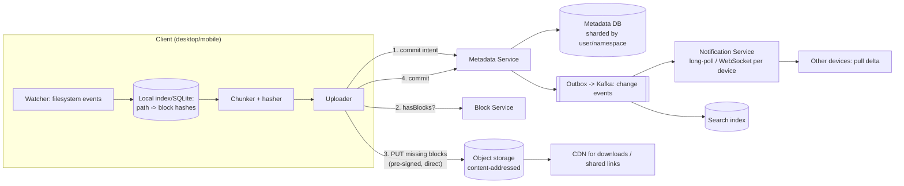

# Case Study 8 — File Sync & Storage (Dropbox / Google Drive)

**Archetype:** media + bidirectional sync. What makes this hard is not storage — it's
that **N devices mutate the same state offline and then reconcile**. Conflict
resolution is the interview.

---

## 1. Requirements

**Functional (in scope)**
1. Upload/download files; files sync automatically across a user's devices.
2. Offline edits sync when a device reconnects.
3. Version history and restore.
4. Sharing a file/folder with other users, with permissions.

**Out of scope:** real-time collaborative editing (that's the Google Docs/CRDT
problem — mention the difference), full-text search inside documents, mobile-specific
selective sync details.

**Non-functional**

| Dimension | Target |
|---|---|
| Scale | 500 M users, ~100 M DAU, 3 devices each; average 50 GB stored/user |
| Read:write | ~2:1 (sync makes it far more write-heavy than typical systems) |
| Latency | Change visible on other devices p99 < 5 s when online |
| Consistency | Eventual across devices; **strong for metadata within a user's account** |
| Durability | 11 nines. Losing a user's file is unforgivable |
| Efficiency | Only changed bytes should cross the network |

---

## 2. Estimation

```
Storage: 500 M users x 50 GB = 25 EB logical.
  Cross-user dedup on common files (installers, shared decks, media) typically
  removes a large fraction -> call it 30-50% saved. Physical maybe ~12-15 EB.

Uploads: 100 M DAU x ~20 changed files/day = 2 B file events/day
  = 2,000/10^5 -> ~23,000 events/s  (peak 3x = ~70 K/s)

If each edit re-uploaded the whole file (avg 1 MB): 23 K/s x 1 MB = 23 GB/s.
With block-level delta sync, typical change is a few 4 MB blocks or less
  -> an order of magnitude less bandwidth. This is the core optimisation.

Metadata: 500 M users x ~5,000 files = 2.5 T rows -> definitely sharded.
```

**Conclusions**
1. **Split metadata from content.** Metadata is small, relational, and needs
   transactions; content is huge, immutable, and belongs in object storage. Almost
   every good decision in this design follows from that split.
2. Delta sync at the **block** level is mandatory — never re-upload whole files.
3. Content-addressed blocks give you dedup and cheap version history for free.
4. 2.5 T metadata rows → shard by `user_id` (or namespace), never by file.

---

## 3. Core entities & API

**Core entities**

| Entity | What it is | Notes |
|---|---|---|
| **Namespace** | A sync root: a user's own tree, or a shared folder | The unit of sharding, of journal sequencing, and of ACLs. Everything hangs off it |
| **File** | A node in the tree: `parent_id`, `name`, `is_dir`, `current_version` | Pure metadata — contains no bytes, which is why renaming a 10 GB folder is one row update |
| **Version** | An immutable snapshot: an ordered list of block hashes + `parent_version` | Version history is nearly free because versions share blocks |
| **Block** | A content-addressed chunk, `SHA-256(content)` → bytes, stored once globally | **The entity the whole design rests on.** Immutable, dedupable, and its ID is its checksum |
| **Device** | A client instance syncing one or more namespaces | Holds a cursor per namespace, not one per device |
| **JournalEntry** | `(ns_id, seq) → file_id, op, version` — the ordered change log | The sync protocol *is* reading this log from a cursor |

**File and Block are deliberately disconnected.** Metadata is small, relational and
transactional; blocks are enormous, immutable and live in object storage. Almost every
other decision in this design is a consequence of keeping those two entities apart.

**Interface**

```
# Sync protocol (the important one — this is not a CRUD API)
GET  /v1/namespaces/{ns}/delta?cursor=<opaque>
     -> { entries: [{ seq, fileId, path, op, version, blockHashes[] }],
          nextCursor, hasMore }                # resumable, idempotent, O(changes)

# Upload: ask first, send only what's missing
POST /v1/blocks/probe        { hashes: [h1, h2, h3] }
     -> { missing: [h2] }                      # h1 and h3 already exist globally
PUT  <presigned-url>/{hash}                    # direct to object storage, retryable
POST /v1/namespaces/{ns}/commit
     { fileId, path, parentVersion, blockHashes[] }   Idempotency-Key: <uuid>
     -> 201 { version, seq }                   # fast-forward accepted
     -> 409 { conflict: true, serverVersion }  # divergence -> client makes a conflicted copy

# Download
GET  /v1/files/{fileId}/versions/{v}  -> { blockHashes[], size }
GET  <presigned-url>/{hash}           -> block bytes (CDN-cacheable, immutable)

# Change notification (carries a cursor, never a payload)
WS   <- { type: "namespace_changed", nsId, cursor }
```

Four interface choices carry the design:
- **`probe` before upload** is what makes delta sync and cross-user dedup work; the client
  never sends bytes the server already has.
- **`commit` takes `parentVersion`**, which is how divergence is detected. Without it the
  server can't distinguish a fast-forward from a conflict, and you silently get
  last-write-wins.
- **`delta` is cursor-based, not a tree diff.** Cost is O(changes), not O(files), and an
  interrupted sync resumes from the last cursor with no special resume protocol.
- **The notification carries only a cursor.** A lost or duplicated notification is
  harmless because the pull is authoritative — push is an optimisation, polling is the
  guarantee.

---

## 4. The naive design, and why it breaks

```
Watcher sees a file change
  -> PUT /files/{path}  (upload the WHOLE file)
  -> server stores it at s3://user-bucket/{path}
  -> every other device polls: "list my files, compare modified_at, download newer ones"
Conflicts: highest modified_at wins
```

This is Dropbox as most people first imagine it, and it fails on all four axes at once:

| What breaks | The number that breaks it | Consequence |
|---|---|---|
| **Whole-file upload** | 2 B file events/day × ~1 MB avg = **23 GB/s** | Adding one line to a 50 MB presentation re-uploads 50 MB. Bandwidth is dominated by bytes that didn't change |
| **Polling with a tree diff** | 500 M users × 5,000 files | Every sync lists the entire tree to find the handful of changes. Cost is O(files) when the answer is O(changes) — and for a 100 K-file folder it's brutal |
| **No dedup** | Same installer, deck or photo across millions of accounts | You store every copy. The 25 EB logical figure becomes 25 EB physical instead of ~half that |
| **Last-write-wins** | Two devices editing offline | **Silent data loss**, decided by whichever client's clock was further ahead. The user is never told their work was destroyed |

The first three are efficiency problems. The fourth is a correctness problem, and it's the
one the interview is actually about — an efficiency bug costs money, a conflict bug
destroys a user's work and they never find out.

**Three reframes, in order of importance:**

1. **A file is a list of content-addressed blocks, not a byte stream.** Then "what changed"
   is a set difference over hashes: the client asks which blocks the server lacks and
   uploads only those. Dedup, version history and integrity checking all fall out of the
   same decision ([§5](#5-the-central-abstraction-content-addressed-blocks)).
2. **Sync is reading a journal from a cursor, not diffing a tree.** "Everything after seq
   8412" is one indexed range scan whose cost is proportional to *changes*, and it's
   resumable and idempotent for free ([§6](#6-data-model)).
3. **Conflicts must be surfaced, not resolved.** For opaque binary files the system cannot
   merge safely, so the only honest option is to keep both versions and let the human
   decide ([§7](#7-conflict-resolution--the-real-interview-question)).

**The instinct to resist:** "use fixed-size 4 MB chunks." It's simpler and it does fix the
bandwidth arithmetic — until someone inserts a byte at the *front* of a file, every
subsequent boundary shifts, and all blocks are invalidated. Content-defined chunking costs
a rolling hash and survives insertion, which is exactly the case that makes fixed chunking
look fine in a benchmark and terrible in practice.

---

## 5. The central abstraction: content-addressed blocks

```
File  = ordered list of block hashes
Block = variable-size chunk (~1-8 MB, avg ~4 MB), key = SHA-256(content),
        stored ONCE globally, immutable

document.pdf (10 MB) -> [ h1, h2, h3 ]
edit page 2          -> [ h1, h2', h3 ]      # only h2' is uploaded
```

Everything falls out of this:

| Property | Why it comes free |
|---|---|
| **Delta sync** | Client hashes blocks locally, asks "which of these do you not have?", uploads only the misses |
| **Dedup** | Identical block from any user is stored once (`SHA-256` collision risk is negligible) |
| **Version history** | A version is just a different list of hashes — old blocks are still there. Cheap |
| **Integrity** | The hash *is* the checksum; corruption is detectable by construction |
| **Immutability** | Blocks are never mutated → trivially cacheable and replicable |

### Fixed-size vs content-defined chunking
Fixed 4 MB chunks are simple, but inserting one byte at the start of a file shifts every
boundary and invalidates **all** blocks. **Content-defined chunking** (rolling hash /
Rabin fingerprint, variable ~1–8 MB blocks with boundaries chosen by content) survives
insertions and shifts. Use content-defined chunking; being able to explain *why* the
naive scheme fails on insertion is a strong differentiator.

### Dedup and privacy
Global cross-user dedup leaks information (an attacker can test whether a file exists
by observing upload speed). Mitigate with per-account dedup for sensitive tiers, or
add server-side randomisation. Worth one sentence — it shows security thinking.

---

## 6. Architecture



**Upload sequence:** chunk → hash → ask which blocks are missing → upload only those
(direct to storage via pre-signed URLs) → **commit the metadata last**. Metadata commit
is the atomic point at which the new version exists; if the client dies mid-upload,
orphan blocks are garbage-collected and no partial version is ever visible.

**Sync sequence:** metadata commit emits a change event via the outbox → Notification
Service pushes "your namespace changed, cursor X" to the user's other devices → each
device pulls the delta since its own cursor → downloads missing blocks → applies
locally.

Notice the notification carries **only a cursor, not the change itself**. Devices then
pull. This keeps the push path tiny and makes it idempotent — a duplicate or lost
notification is harmless because the cursor pull is authoritative.

---

## 7. Data model

```
namespaces(ns_id) PK                                        -- a user's root, or a shared folder
      owner_id, type

files(ns_id, file_id) PK                                    -- shard by ns_id
      parent_id, name, is_dir, current_version, deleted, modified_at
      UNIQUE (ns_id, parent_id, name) WHERE NOT deleted     -- no two siblings share a name

versions(ns_id, file_id, version) PK                        -- ns_id so it lives on the file's shard
      parent_version, block_hashes[], size, modified_by, created_at, device_id

blocks(hash) PK                                             -- global, separate store
      size, refcount, storage_location

cursors(device_id, ns_id) PK                                -- one cursor PER NAMESPACE per device
      cursor

acl(ns_id, principal) PK
      role

journal(ns_id, seq) PK                                      -- seq is per-namespace, not global
      file_id, op, version, created_at
```

Four details in those keys are load-bearing, and interviewers do check them:

- **`journal` is keyed `(ns_id, seq)`, not `seq` alone.** The sequence is monotonic *per
  namespace*, which is exactly what lets a single shard assign it without global
  coordination. A globally unique `seq` would need a cluster-wide counter and buy nothing.
- **`cursors` is keyed `(device_id, ns_id)`.** A device syncs its own root *plus* every
  shared folder it has mounted, and each of those is a separate namespace with its own
  journal — so one cursor per device is not enough.
- **`versions` carries `ns_id`** so it co-locates with its file on the same shard.
  Without it, every version lookup needs a `file_id → ns_id` resolution before it can even
  be routed.
- **`versions.parent_version` is what conflict detection compares against** (see
  [§8](#8-conflict-resolution--the-real-interview-question)). Omit it and divergence is
  undetectable — you'd be back to last-write-wins by accident.

**No `path` column.** Paths are derived by walking `parent_id`. Storing the full path
denormalised would make renaming a folder an update of every descendant row — which
would contradict the whole point of the metadata/content split (see
[§9 Move and rename](#move-and-rename)). Clients cache the resolved tree locally, so the
walk happens once per sync, not once per lookup.

**The journal is the sync engine.** Each namespace has a monotonically increasing
sequence; a device's cursor is a position in it. "Give me everything after seq 8412"
is one indexed range scan, and it is exactly what makes sync resumable, idempotent, and
cheap.

**Shard by `ns_id`**: all of a user's metadata and the whole journal for that namespace
live on one shard, so sequence assignment and the delta query are single-shard
operations. A shared folder is its own namespace — that's how a folder shared by 100
people avoids being duplicated 100 times.

---

## 8. Conflict resolution — the real interview question

Two devices edit the same file offline. There is no "correct" answer, only a defensible
one.

| Strategy | Behaviour | Fit |
|---|---|---|
| **Last-write-wins** | Highest timestamp survives | ✘ **Silently destroys work.** Also depends on client clocks |
| **Conflicted copy** | Keep both: `report.docx` and `report (Alice's conflicted copy).docx` | ✔ **Choice.** Never loses data; the human resolves it |
| **Operational transform / CRDT** | Merge edits semantically | For collaborative editors, not opaque binary files |
| **Locking** | Only one editor at a time | Kills offline usability; fine for niche enterprise cases |

**Choice: version-vector detection + conflicted copies.**

```
Each version records the parent version it was based on.
On commit:
  if incoming.parent == current_version   -> fast-forward, accept
  else                                    -> DIVERGENCE
     -> keep the server version as canonical
     -> materialise the client's version as a new file "<name> (conflicted copy)"
     -> notify the user
```

Say clearly: *"For opaque files, the system cannot merge safely, so the only honest
option is to preserve both and surface it to the user. Last-write-wins looks simpler
but its failure mode is silent data loss, which is unacceptable."* That sentence is the
whole point of the problem.

For text-like formats you can attempt a three-way merge using the common ancestor
version (which you have, because of version history), falling back to a conflicted copy
if it fails.

---

## 9. Deep dives

### Garbage collection of blocks
Blocks are shared across users and versions, so deleting a file must not delete its
blocks. Maintain a **refcount** (or run periodic mark-and-sweep, which is safer at this
scale). Always sweep with a grace period and never delete a block that was written
recently — a race between "upload block" and "GC decides it's unreferenced" is a
data-loss bug waiting to happen.

### Move and rename
Renaming a 10 GB folder must not re-upload anything. Because content is
content-addressed and metadata is a separate tree, a rename is a **single metadata
row update**. Point this out — it's a concrete payoff of the metadata/content split.

### Large-file upload reliability
Blocks are individually retryable and idempotent (the hash is the identity, so
re-uploading is a no-op). Uploads are naturally resumable with no special resume
protocol beyond "which blocks do you have?".

### Bandwidth and battery on clients
Batch small changes with a short debounce (don't sync on every keystroke of an
auto-saving app), back off on metered connections, compress before upload, and cap
parallel transfers. Sync clients are judged on resource usage as much as speed.

### Sharing and permissions
A shared folder becomes its own namespace with its own journal and ACL. Members mount
it into their tree. Permission checks happen at the **metadata** layer; block downloads
are authorised with short-lived signed URLs so object storage never needs your ACL
logic.

### Cold storage tiering
Most bytes are never read again after a few months. Move cold blocks to archive tiers,
keeping metadata hot so listing a folder is always fast and only the actual download of
a cold file is slow (with a "restoring…" state).

---

## 10. Failure modes

| Failure | Behaviour |
|---|---|
| Client dies mid-upload | No metadata commit → no version exists. Orphan blocks are GC'd. Resume by re-checking which blocks exist |
| Notification lost | Harmless — the device's periodic cursor poll catches up. Push is an optimisation, polling is the guarantee |
| Metadata shard down | That user can't sync; other users unaffected (blast radius = one shard). Failover to a synchronous replica |
| Object storage partial outage | Downloads of affected blocks fail; retry across replicas/regions. Uploads buffer client-side |
| Two devices commit simultaneously | Sequence assignment is single-shard and serialised; the loser sees a divergence and creates a conflicted copy |
| Clock skew on clients | Never used for correctness — ordering comes from the server-assigned journal sequence, not timestamps |
| Corrupted block | Hash mismatch detected on read → fetch from another replica; background scrubber verifies hashes continuously |

---

## 11. Scale evolution

- **10x users:** metadata shards horizontally by namespace; blocks are already in
  object storage which scales independently. Nothing structural changes — that's the
  sign of a good partitioning choice.
- **10x file events:** the notification fan-out is per-device; batch and coalesce events
  (one "namespace changed" per second per device is enough, since the payload is just a
  cursor).
- **Huge shared folders (100 K files, 500 members):** the namespace journal becomes hot.
  Sub-partition the namespace by subtree, and switch large-folder clients to selective
  sync so they don't materialise everything.
- **Multi-region:** keep a namespace's metadata authoritative in one region (sequence
  assignment needs a single writer); replicate blocks globally since they're immutable
  and cacheable anywhere.

---

## 12. Trade-offs summary

| Decision | Chose | Alternative | Why |
|---|---|---|---|
| Storage split | Metadata DB + content-addressed object store | One database | Different sizes, access patterns, and consistency needs |
| Chunking | Content-defined, variable ~4 MB | Fixed-size blocks | Survives insertions; fixed chunking invalidates the whole file |
| Sync unit | Blocks, not files | Whole-file upload | Order-of-magnitude bandwidth reduction |
| Sync protocol | Journal + per-device cursor | Diff the full tree each time | O(changes) instead of O(files); resumable and idempotent |
| Notification | Push a cursor, device pulls | Push the change payload | Idempotent, tiny payload, tolerant of lost messages |
| Conflicts | Conflicted copies | Last-write-wins | LWW silently loses user work |
| Ordering | Server-assigned sequence | Client timestamps | Client clocks are untrustworthy |
| Sharding | By namespace | By file | Keeps sequence assignment and delta queries single-shard |

---

## 13. Rapid-fire probe answers

| Probe | Answer |
|---|---|
| "Why content-addressed blocks?" | Delta sync, cross-user dedup, cheap version history, and integrity checking all fall out of one decision. The hash *is* the identity and the checksum |
| "Why not fixed-size chunks?" | Insert one byte at the front of a file and every boundary shifts, invalidating all blocks. Content-defined chunking (rolling hash) keeps boundaries stable under insertion |
| "Two devices edit the same file offline." | Detect divergence via the parent version, keep the server version canonical, and materialise the client's as a conflicted copy. Never merge opaque binary files |
| "Why not last-write-wins? It's simpler." | Its failure mode is **silent data loss**, and it relies on client clocks. A conflicted copy is uglier but never destroys work — that trade is the whole question |
| "User renames a 10 GB folder." | One metadata row update. Nothing re-uploads, because content and metadata are separate and blocks are addressed by hash, not path |
| "Client dies mid-upload." | No metadata commit means no version exists — nothing partial is ever visible. Orphan blocks are garbage collected; resume by re-asking which blocks the server has |
| "A sync notification is lost." | Harmless. The notification carries only a cursor; the device's pull is authoritative and its periodic poll catches up. Push is an optimisation, polling is the guarantee |
| "Why not order by client timestamp?" | Clocks are unreliable. Ordering comes from the server-assigned journal sequence per namespace, which is also what makes sync resumable and idempotent |
| "How do you delete blocks safely?" | Refcount or periodic mark-and-sweep, always with a grace period, and never delete a recently written block — the race between 'upload block' and 'GC decides it's unreferenced' is a data-loss bug |
| "Does global dedup leak information?" | Yes — upload speed reveals whether a file already exists. Use per-account dedup for sensitive tiers or add server-side randomisation |
| "A folder shared with 500 people." | It's its own namespace with one journal and ACL, not 500 copies. If the journal gets hot, sub-partition by subtree and push large-folder clients to selective sync |
| "Why is this different from Google Docs?" | Docs is character-level concurrent editing — OT or CRDT on a structured document. Here files are opaque blobs, so semantic merge is impossible and conflicted copies are the honest answer |
