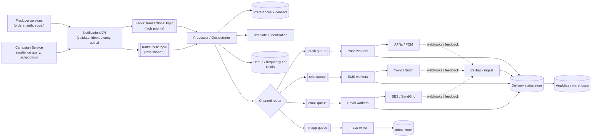
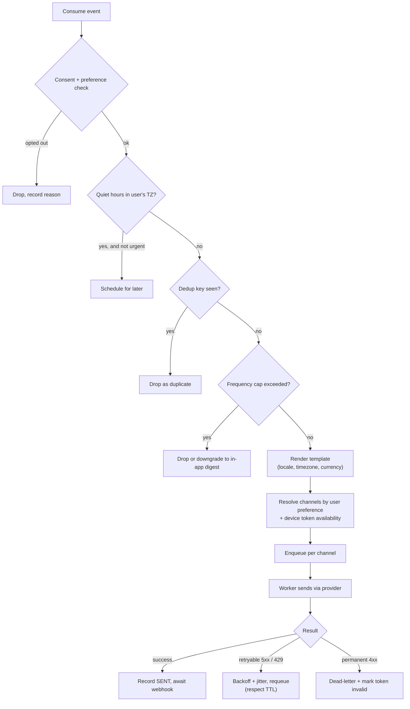

# Case Study 9 — Notification System

**Archetype:** multi-channel fan-out with unreliable third parties. This is the most
common *internal platform* design question, and it rewards candidates who think about
**deduplication, preferences, and provider failure** rather than just "put it in a
queue".

---

## 1. Requirements

**Functional (in scope)**
1. Send notifications over push (APNs/FCM), SMS, email, and in-app.
2. Templates with localisation and variable substitution.
3. User preferences: per-category opt-out, quiet hours, channel priority, frequency caps.
4. Both **transactional** (OTP, payment receipt) and **bulk/marketing** (campaign to
   50 M users) sends.
5. Delivery tracking: sent → delivered → opened/clicked.

**Out of scope:** the content/recommendation logic that decides *what* to notify about,
in-app inbox UI, GDPR export tooling (mention consent storage though).

**Non-functional**

| Dimension | Target |
|---|---|
| Scale | 500 M users; 10 B notifications/day; campaigns of 50 M in under 30 min |
| Latency | **Transactional p99 < 5 s** (an OTP at 30 s is a failed product) |
| Delivery | At-least-once delivery, **exactly-once user-visible effect** (no duplicates) |
| Availability | 99.99% for the ingestion API |
| Ordering | Not required globally; required per user for some flows |

**The defining requirement:** transactional and bulk share infrastructure but have
opposite characteristics. Say early that you will **isolate them** — a marketing
campaign must never delay an OTP. That one sentence buys you a lot of credit.

---

## 2. Estimation

```
10 B/day = 10,000/10^5 = ~115,000 notifications/s average (peak 3x = ~350 K/s)

Campaign burst: 50 M in 30 min = 50,000,000 / 1,800 = ~28,000/s on top of the baseline.

Channel mix (typical): push 70%, in-app 20%, email 8%, SMS 2%
  -> SMS = 200 M/day. At ~$0.005/SMS that is $1 M/day. Cost matters; batch and
     de-duplicate aggressively, and prefer push when the user has the app.

Storage: status record ~500 B x 10 B/day = 5 TB/day
  -> 30-day hot retention (~150 TB) then archive. Do NOT keep raw status forever.

Device tokens: 500 M users x ~2 devices = 1 B tokens x ~200 B = ~200 GB
```

**Conclusions**
1. 350 K/s peak → queue-driven, horizontally scaled workers per channel.
2. Third-party providers are the bottleneck and they rate limit you → **per-provider
   rate limiting and backpressure** are first-class components.
3. 5 TB/day of status → time-partitioned wide-column store, short hot retention.
4. Campaign bursts must be **shaped**, not dumped, or you'll starve transactional
   traffic and get throttled by providers.

---

## 3. The naive design, and why it breaks

```python
# in the request handler that triggered the notification
for user in recipients:
    if user.email: ses.send_email(user.email, subject, body)
    if user.push_token: fcm.send(user.push_token, payload)
    if user.phone: twilio.send_sms(user.phone, text)
```

Send synchronously, in a loop, inside the caller's request. Every failure below is real,
and the last one is the one that gets you a postmortem:

| What breaks | The number that breaks it | Consequence |
|---|---|---|
| **Synchronous send** | A campaign with 10 M recipients | The request times out long before the loop finishes, and the caller has no idea how far it got |
| **No retry state** | Provider 500s and transient failures | Retrying the loop re-sends to everyone already delivered; not retrying drops them. With no per-recipient record you cannot tell which |
| **Shared fate across channels** | One provider degraded | An SMS provider timing out at 30 s per call blocks the **push and email** for the same user. One vendor's bad day becomes your outage |
| **Provider rate limits** | APNs/FCM/SES quotas | Dumping 10 M sends as fast as you can gets you throttled, then temporarily blocked — the provider protects itself from you |
| **No preference check** | Unsubscribes, quiet hours | Sending to someone who opted out is a legal problem, not a bug report |
| **Bulk starves transactional** | 500 M/day, mostly marketing | **The failure that matters.** A password-reset email queues behind 10 M marketing sends and arrives 40 minutes later, by which time the user has churned |

That last row is why this system exists at all. Notifications look like one problem but are
two with **opposite** requirements: transactional messages are low-volume and latency-
critical, bulk messages are high-volume and latency-tolerant. Put them in one queue and
the high-volume one always wins, because queues are fair and your users aren't.

**Three reframes:**

1. **Accept fast, deliver asynchronously.** The API's job is to durably record an *intent*
   and return; delivery is a separate, retryable pipeline.
2. **Isolate by priority and by channel.** Separate topics for transactional vs bulk, and
   separate consumers per channel, so no queue and no vendor can starve another
   ([§4](#4-architecture)).
3. **Delivery is per-recipient-per-channel state, not a loop iteration.** Once each attempt
   is a durable row, retries, failover, dedup and "why didn't I get it?" all become
   answerable ([§6](#6-the-processing-pipeline)).

**The instinct to resist:** "just put it all on one queue with a priority field." Priority
queues sound like the fix, but a single consumer pool still shares connections, provider
rate-limit budgets and failure modes — so a bulk backlog still delays transactional traffic
through the back door. Physical isolation beats logical priority when the whole point is
blast-radius containment.

---

## 4. Architecture



**Why separate queues per channel:** each has a different rate limit, latency profile,
retry policy, and failure mode. A backed-up SMS provider must not stall push delivery.
Isolation by queue is the cheapest form of bulkheading.

**Why separate topics for transactional vs bulk:** priority. Transactional consumers
get dedicated capacity; bulk consumers are throttled to whatever is left. If you only
remember one thing about this problem, remember this.

---

## 5. Core entities & API

**Core entities**

| Entity | What it is | Notes |
|---|---|---|
| **NotificationRequest** | The inbound intent: user, category, template, data, priority | Deduped by `Idempotency-Key`; it is a *request* to notify, not a guarantee of delivery |
| **UserPreferences** | Per user per category: allowed channels, quiet hours, unsubscribes | Consulted before **every** send; an unsubscribe that isn't honoured is a legal problem |
| **Template** | Versioned, one variant per channel, rendered with the request's `data` | Versioning lets you roll back a bad copy change without a deploy |
| **DeliveryAttempt** | One row per `(notification, channel, provider)` try, with status and provider message ID | The unit of retry, of provider failover, and of the audit trail |
| **Address / DeviceToken** | Push tokens, email addresses, phone numbers per user | Invalidated by provider feedback loops — dead tokens must be pruned or they poison delivery rates |

One notification request fans out into several delivery attempts across channels and
retries. Keeping those as separate entities is what makes per-channel isolation possible.

**Interface**

```
POST /v1/notifications                         Idempotency-Key: <uuid>
{
  "userId": "u_123",
  "category": "order_shipped",        // drives preference + priority lookup
  "priority": "transactional",        // transactional | bulk
  "templateId": "order_shipped_v3",
  "data": { "orderId": "A-991", "eta": "2026-08-02" },
  "channels": ["push","email"],       // hint; preferences may override
  "dedupKey": "order_shipped:A-991",  // user-visible dedup, distinct from the retry key
  "ttlSeconds": 86400
}
-> 202 { notificationId }

POST /v1/campaigns   { audienceQuery, templateId, schedule, rateLimit }
GET  /v1/notifications/{id}   -> per-channel status timeline
PUT  /v1/users/{id}/preferences
```

Two distinct keys, and knowing the difference matters:
- **`Idempotency-Key`** protects against *your caller* retrying the HTTP request.
- **`dedupKey`** protects against *the business logic* generating the same
  notification twice from different code paths (e.g. two services both react to
  "order shipped"). Held in Redis with a TTL of hours/days.

**`ttlSeconds`** is underrated: an OTP delivered 10 minutes late is worse than not
delivered. Expired items are dropped, not retried forever.

---

## 6. The processing pipeline



Each of these gates exists because of a real production failure:
- **Consent check** — legal requirement (GDPR/TCPA); missing it is a fine, not a bug.
- **Quiet hours** — computed in the *user's* timezone, which means you need it stored.
- **Dedup** — retries and duplicate producers are inevitable at this volume.
- **Frequency cap** — the difference between a useful product and an uninstall.
- **TTL on retries** — prevents a recovered provider from flooding users with a day of
  stale notifications, which is a classic self-inflicted incident.

---

## 7. Data model

| Table | Key | Other fields | Store, and why |
|---|---|---|---|
| **device_tokens** | PK `(user_id, device_id)` | `platform`, `token`, `app_version`, `last_seen`, `valid` | Relational. `valid` is cleared when a provider reports the token dead |
| **preferences** | PK `(user_id, category)` | `channels[]`, `enabled`, `quiet_start`, `quiet_end`, `timezone`, `frequency_cap` | Relational — small, needs integrity and admin queries |
| **templates** | PK `(template_id, version, locale)` | `subject`, `body`, `channel` | Relational. Versioned and immutable, so a send can always be reproduced |
| **notifications** | PK `(user_id, created_at, notification_id)` | `category`, `dedup_key`, `ttl`, `state` | Wide-column (Cassandra / DynamoDB) — huge volume, time-ordered, native TTL, no joins |
| **deliveries** | PK `(notification_id, channel)` | `provider`, `provider_msg_id`, `state`, `attempts`, `last_error`, `sent_at`, `delivered_at`, `opened_at` | Wide-column. One row per channel attempt — the highest-volume table in the system |
| **inbox** | PK `(user_id, created_at, item_id)` | `payload`, `read_at` | In-app feed, longer retention than `notifications` |

**Shard by `user_id`** everywhere: every read is "notifications for this user", and
frequency caps and dedup are evaluated per user — so both the read path and the write-time
checks stay single-shard.

---

## 8. Deep dives

### Campaign fan-out: 50 M users in 30 minutes
Do **not** enqueue 50 M individual messages from one process.
1. Materialise the audience by running the segment query into a paginated, resumable
   cursor stored with the campaign.
2. **Fan out hierarchically:** a coordinator emits chunk tasks (`users 0–10,000`), and
   workers expand each chunk into individual messages. This parallelises expansion and
   makes the job resumable after a crash.
3. **Rate-shape** the emission with a token bucket sized to leave headroom for
   transactional traffic and to stay under provider quotas.
4. Make it **pausable and cancellable** mid-flight — a campaign with a bad link must be
   stoppable in seconds. Check a "campaign state" flag at both the chunk and message
   level.
5. Checkpoint progress so a restart doesn't re-send to the first 20 M users.

### Provider failure and multi-provider routing
Third-party providers *will* have outages. Keep two providers per channel and route by
health:
- **Circuit breaker** per provider: after N consecutive failures, open the circuit and
  shift traffic to the secondary.
- Track per-provider success rate, latency, and cost; route on a weighted policy.
- Some failures are per-recipient (invalid number/token), not provider-wide — classify
  errors correctly or you'll fail over for no reason.

### Token hygiene
APNs/FCM return feedback for uninstalled apps. Consume it and mark tokens invalid,
otherwise your delivery rate silently rots and providers start throttling you for
sending to dead tokens.

### Exactly-once user-visible effect
True exactly-once delivery is impossible across a third-party boundary. What you can
do:
- Idempotency key at ingest.
- Dedup key with TTL before send.
- Record `provider_msg_id` **before** considering it sent, so a crash between send and
  record is detectable.
- Accept that a rare duplicate is better than a rare loss for most categories, and
  invert that for categories where duplicates are harmful (payments).

### Digest and batching
Rather than 40 separate "someone liked your post" pushes, collapse into "40 people
liked your post". This is a **windowed aggregation** keyed by (user, category), and
it's both a UX win and a large cost saving on SMS/push volume.

---

## 9. Failure modes

| Failure | Behaviour |
|---|---|
| Provider down | Circuit breaker opens → secondary provider; if both down, queue with TTL and drop expired items rather than flooding later |
| Provider rate-limits us (429) | Backoff and reduce concurrency; the per-provider token bucket should have prevented it — alert on hitting it |
| Queue backlog grows | Transactional topic has dedicated consumers and is unaffected; throttle or pause bulk first. **Shed the bulk, protect the OTP** |
| Duplicate producer events | Dedup key in Redis catches them; a Redis miss causes a rare duplicate, which is acceptable and bounded |
| Preferences service down | **Fail closed for marketing** (don't send — a wrongly sent marketing message is a compliance problem) and **fail open for transactional** with a cached preference snapshot |
| Bad template deployed | Templates are versioned and immutable; campaigns pin a version; roll forward by pinning the previous version. Canary a campaign to 1% first |
| Webhook flood after outage | Callback ingest is a separate autoscaled service writing to a queue, so status updates can't back-pressure sending |

---

## 10. Scale evolution

- **10x volume:** add partitions and consumers per channel queue; the design is already
  shared-nothing per user. The real ceiling is provider quota — negotiate it or add
  providers.
- **10x campaign size:** hierarchical fan-out already parallelises; increase chunk
  workers and lengthen the delivery window. Delivery windows are a product decision, not
  just a technical one.
- **New channel (WhatsApp, web push):** add a queue + worker + provider adapter. The
  router and preferences model don't change — that's the payoff of channel isolation.
- **Multi-region:** run the pipeline per region with users pinned by home region;
  preferences replicate globally read-only. Providers are global, so failover is about
  your own capacity, not theirs.

---

## 11. Trade-offs summary

| Decision | Chose | Alternative | Why |
|---|---|---|---|
| Priority | Separate topics/consumers for transactional vs bulk | One queue with a priority field | A single queue lets a campaign starve OTPs; isolation is stronger than priority fields |
| Channel isolation | Queue + worker pool per channel | Shared worker pool | Different rate limits and failure modes; bulkheading |
| Delivery guarantee | At-least-once + dedup key | Exactly-once | Impossible across a third-party boundary; dedup gets the user-visible effect |
| Retries | Bounded, jittered backoff, TTL-capped | Retry until success | Prevents a recovered provider flooding users with stale messages |
| Campaign fan-out | Hierarchical chunks + checkpoints | Single expander process | Parallel, resumable, pausable |
| Providers | Multi-provider with circuit breakers | Single provider | Providers have outages; also gives cost leverage |
| Status storage | Wide-column, TTL 30 days, archive after | Relational, retained forever | 5 TB/day; no joins needed; cost |
| Preferences failure | Fail closed for marketing, open for transactional | One uniform policy | Compliance risk differs sharply by category |

---

## 12. Rapid-fire probe answers

| Probe | Answer |
|---|---|
| "A 50 M campaign is running and an OTP needs to go out." | Separate topics and dedicated consumer capacity for transactional traffic. A priority *field* on one shared queue isn't enough — the campaign still occupies the consumers. Isolation beats prioritisation |
| "Can you guarantee exactly-once delivery?" | Not across a third-party boundary. At-least-once plus a dedup key with TTL gives exactly-once *user-visible effect*, which is the property that actually matters |
| "What's the difference between your two keys?" | `Idempotency-Key` protects against the **caller** retrying the HTTP request. `dedupKey` protects against **business logic** generating the same notification from two code paths |
| "The SMS provider goes down." | Circuit breaker opens after N consecutive failures and traffic shifts to the secondary. Classify per-recipient errors (bad number) separately, or you'll fail over for no reason |
| "Provider recovers after an hour — what happens?" | Without TTLs, an hour of queued notifications floods users at once. Every message carries a TTL; expired ones are dropped, not delivered late |
| "How do you fan out 50 M in 30 minutes?" | Hierarchical: a coordinator emits chunk tasks (`users 0–10,000`), workers expand each chunk. Checkpointed so a restart doesn't re-send, and pausable so a bad link can be stopped in seconds |
| "Preferences service is down." | Split policy: fail **closed** for marketing — a wrongly sent message is a compliance problem — and fail **open** for transactional using a cached snapshot |
| "Why a separate queue per channel?" | Each has different rate limits, latency profiles, retry policies, and failure modes. A backed-up SMS provider must not stall push delivery. Bulkheading |
| "Delivery rates are slowly declining." | Dead device tokens. Consume APNs/FCM feedback and mark them invalid — otherwise providers start throttling you for sending to uninstalled apps |
| "User gets 40 'someone liked your post' pushes." | Windowed aggregation keyed by (user, category) collapsing to "40 people liked your post". A UX win and a large cost saving |
| "A bad template goes out to 10 M people." | Templates are versioned and immutable, campaigns pin a version, and you canary to 1% first. Roll forward by pinning the previous version |
| "Why is SMS worth optimising?" | 200 M/day at ~$0.005 is $1 M/day. Prefer push when the app is installed, and dedup aggressively. Cost is a design constraint here, not an afterthought |
