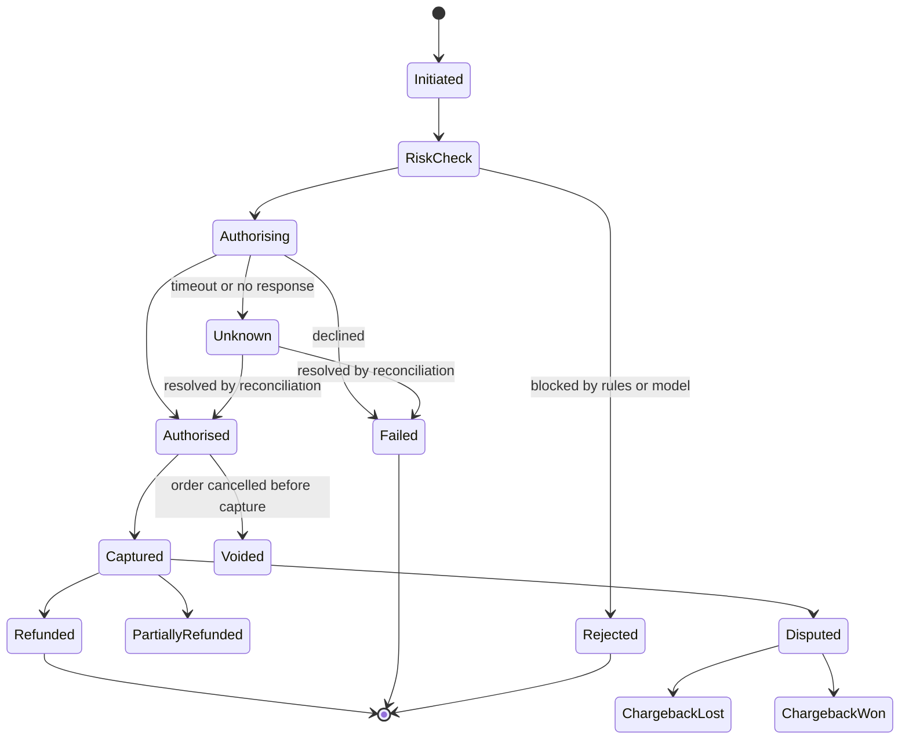
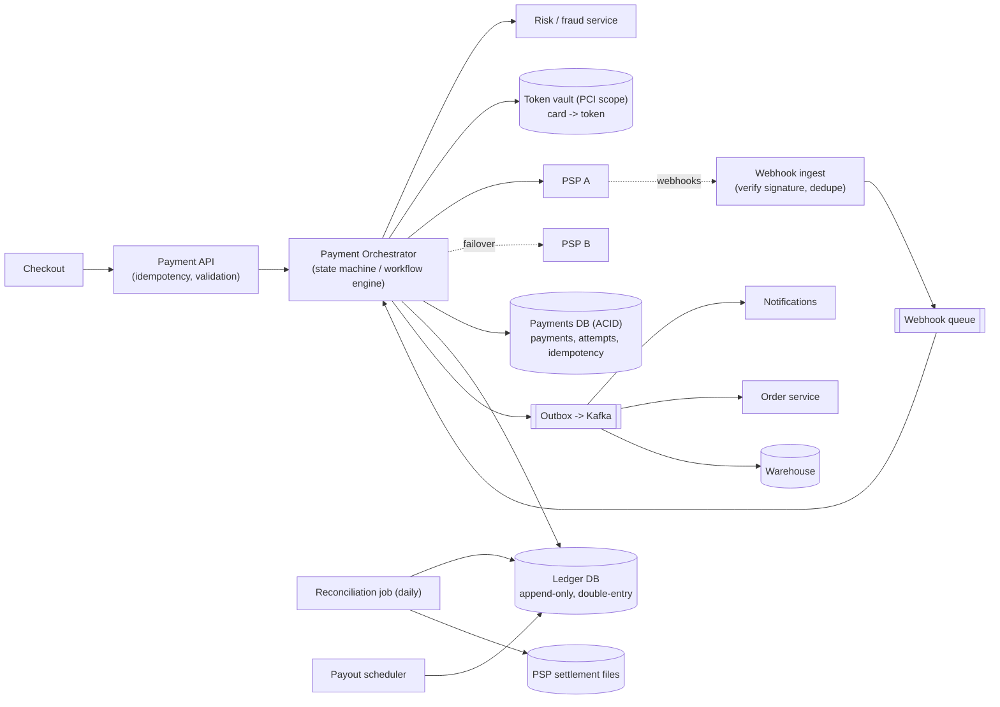

# Case Study 10 — Payment System & Ledger

**Archetype:** transactional correctness with external dependencies. Low QPS, extreme
consequences. This is the problem where **"eventually consistent" is the wrong answer**
and where senior candidates separate themselves by talking about idempotency, ledgers,
and reconciliation instead of throughput.

---

## 1. Requirements

**Functional (in scope)**
1. Charge a customer for an order via an external payment service provider (PSP).
2. Record every money movement in an auditable ledger.
3. Handle refunds (full and partial) and chargebacks.
4. Pay out to merchants/sellers on a schedule.
5. Handle asynchronous PSP webhooks (authorised, captured, failed, disputed).

**Out of scope:** being a card network or acquiring bank, fraud ML models (mention the
hook), tax calculation, FX rate sourcing.

**Non-functional**

| Dimension | Target |
|---|---|
| Scale | 10 M payments/day (~120 TPS avg, ~500 TPS peak) — **low, and that's the point** |
| Latency | Authorisation p99 < 3 s (bounded by the PSP, not by you) |
| Consistency | **Strong.** The ledger must balance at every instant |
| Availability | 99.99%; degrade to "payment pending" rather than losing a payment |
| Durability | Infinite retention; financial records are legally immutable |
| Correctness | **Zero tolerance** for double charges or lost money |

**Open with this:** *"This system has trivially low throughput. Every design decision
here is about correctness, auditability, and surviving partial failure against an
external system I don't control."* It immediately reframes the conversation to the
right axis.

---

## 2. Estimation

```
10 M payments/day = 10/10^5 x 10^4... = ~120 TPS  (peak ~500 TPS)
  -> a single well-tuned RDBMS handles this. Do NOT propose sharding on day one.

Ledger entries: double-entry means >= 2 rows per event; a payment lifecycle
  (authorise, capture, fee, payout) generates ~8-12 entries.
  10 M x 10 = 100 M rows/day x ~200 B = ~20 GB/day = ~7 TB/year, retained forever.
  -> partition by time, archive cold partitions, never delete.

Webhooks: PSPs retry aggressively; expect ~3x the payment count in inbound callbacks
  -> ~350 TPS of webhook ingest, all of which must be idempotent.
```

**Conclusions**
1. Volume is small → **choose a single-node ACID database** and say why: you get
   serialisable transactions and no distributed-transaction problem for free.
2. Ledger grows forever → time-partitioned, append-only, archived, never mutated.
3. Webhook volume exceeds payment volume → the webhook path must be idempotent and
   independently scalable.

---

## 3. The double-entry ledger

This is the core of the design, and most candidates skip it.

```
Every money movement is a BALANCED TRANSACTION: sum(debits) == sum(credits) == 0

Customer pays $100 for an order (platform fee $10):

  txn_id: t_881, type: CAPTURE
  +--------------------------+---------+---------+
  | account                  |  debit  | credit  |
  +--------------------------+---------+---------+
  | customer_receivable      |  100.00 |         |
  | merchant_payable         |         |   90.00 |
  | platform_revenue_fees    |         |   10.00 |
  +--------------------------+---------+---------+
```

Rules that make this work — state them explicitly:
- **Append-only.** You never `UPDATE` a ledger entry. A mistake is corrected by posting
  a **reversing entry**, which preserves history. Auditors require this.
- **Integer minor units.** Store `10000` cents, never `100.00` as a float. Floating
  point money is an instant red flag.
- **Currency is part of the account.** Never sum across currencies; FX is an explicit
  transaction between two accounts at a recorded rate.
- **A balance is a derived value** — `SUM(entries)` — with periodic snapshots
  (e.g. daily `balance_at_eod`) so you don't scan history to answer "what's the
  balance?".
- **Every entry carries the external reference** (`psp_txn_id`, `order_id`) so
  reconciliation is possible.

The invariant `sum(debits) - sum(credits) = 0` is enforced in the same DB transaction
that writes the entries, and re-verified continuously by a background job. If it ever
breaks, that's a page-everyone incident.

---

## 4. Idempotency — the single most important mechanism

Networks time out. Users double-click. PSPs retry webhooks. Your own queue is
at-least-once. **Every mutating operation must be safely repeatable.**

```
POST /v1/payments
Idempotency-Key: 7c1f-...-a93          # generated by the CLIENT, stable across retries
{ orderId, amount: 10000, currency: "USD", paymentMethodId }
```

```sql
BEGIN;
  INSERT INTO idempotency_keys(key, request_hash, state, created_at)
       VALUES (:key, :hash, 'IN_PROGRESS', now());
  -- unique violation -> someone else is handling or has handled this key
COMMIT;
```

Handling on conflict:

| Existing state | Same request hash? | Response |
|---|---|---|
| `IN_PROGRESS` | yes | `409 Conflict` / ask client to retry shortly — do **not** start a second charge |
| `COMPLETED` | yes | Return the **stored original response**, byte for byte |
| any | **no** | `422` — the key was reused with different parameters. This is a client bug and must be loud |

Storing the request hash is what turns idempotency from "probably fine" into
"provably correct". And critically: **pass your idempotency key down to the PSP too** —
every major PSP supports it, and it's what prevents a double charge when your retry
crosses their successful-but-unacknowledged response.

---

## 5. Payment lifecycle as a state machine



**The `Unknown` state is the whole interview.** When the PSP call times out you do not
know whether the customer was charged. You must **never** retry blindly and you must
**never** assume failure. Instead:
1. Persist the attempt with its idempotency key **before** calling the PSP
   (write-ahead intent).
2. On timeout, mark `Unknown` and schedule a **status query** against the PSP using
   your idempotency key.
3. Resolve to `Authorised` or `Failed` from the PSP's authoritative answer.
4. Anything still unresolved is caught by daily reconciliation.

Candidates who volunteer the `Unknown` state without prompting are demonstrating real
production experience.

---

## 6. Architecture



Two things worth defending:

**The transactional outbox.** The payment state change and the "PaymentCaptured" event
must be atomic. Writing to the DB and publishing to Kafka separately gives you the
dual-write problem: a crash between them means the order service never learns the
payment succeeded. Instead, insert the event into an `outbox` table **in the same
transaction**, and a relay publishes it afterwards. This is the canonical fix and you
should name it.

**Card data never touches your services.** Use PSP-hosted fields / client-side
tokenisation so raw PANs go straight from the browser to the PSP and you only ever
store a token. This collapses your PCI-DSS scope from "the whole company" to "almost
nothing", which is both a security and a cost argument.

---

## 7. Data model

```
payments(payment_id PK, order_id, customer_id, amount_minor, currency,
         state, psp, psp_payment_id, created_at, updated_at, version)
payment_attempts(attempt_id PK, payment_id, psp, request_hash,
         psp_status, error_code, created_at)         -- one row per PSP call
idempotency_keys(key PK, scope, request_hash, state, response_body, created_at)
ledger_entries(entry_id PK, txn_id, account_id, direction, amount_minor,
         currency, posted_at, ref_type, ref_id)      -- append-only, partitioned by month
accounts(account_id PK, owner_type, owner_id, currency, type)
balance_snapshots(account_id, as_of_date) PK, balance_minor
outbox(id PK, aggregate_id, type, payload, published_at)
webhook_events(psp, psp_event_id) PK, payload, received_at, processed_at
refunds(refund_id PK, payment_id, amount_minor, state, psp_refund_id)
disputes(dispute_id PK, payment_id, reason, state, due_by, evidence_ref)
```

`webhook_events` has a **unique key on `(psp, psp_event_id)`** — that single constraint
is what makes webhook processing idempotent under the PSPs' aggressive retries.

---

## 8. Deep dives

### Reconciliation — the safety net that makes everything else survivable
Every day the PSP publishes a settlement file of what they actually processed. A job
compares it against your ledger and produces a three-way break report:

| Case | Meaning | Action |
|---|---|---|
| In PSP, not in ledger | You lost a record (crash, `Unknown` never resolved) | Post the missing ledger entries; investigate |
| In ledger, not in PSP | You recorded something that didn't happen | Reverse the entry; alert |
| Amounts differ | Fees, FX, partial capture | Post the difference to a fee/FX account |

Say clearly: *"Reconciliation is not a nice-to-have. It is the mechanism that lets me
accept at-least-once processing and occasional `Unknown` states, because every
discrepancy is guaranteed to be caught within 24 hours."* That framing — using an
offline process to relax online guarantees — is exactly the senior signal.

### Refunds
A refund is a **new ledger transaction** (reversing entries), not an edit of the
original. Validate that cumulative refunds ≤ captured amount inside the transaction,
using the ledger itself as the source of truth. Partial refunds are just multiple
transactions against the same payment.

### Merchant payouts
Run on a schedule: compute each merchant's balance from the ledger, hold back a reserve
for chargeback risk, create a payout transaction, then initiate the bank transfer.
Because the ledger is the source of truth, payouts are derived — not a separate
counter that can drift.

### Multi-PSP routing
Route by cost, geography, and card type; fail over on PSP outage. Complications to
mention: each PSP has its own idempotency semantics, settlement format, and webhook
schema, so you need an **adapter per PSP** behind a common domain interface. Don't let
PSP-specific concepts leak into the ledger.

### Why not microservice-per-step with distributed transactions?
Because you'd need 2PC across services, which trades your strongest asset (a single
ACID transaction) for coordination complexity you don't need at 500 TPS. Keep payments
and the ledger in **one transactional boundary**; use a **Saga** only where an external
system is genuinely involved (PSP call, bank transfer), with explicit compensations
(void, refund).

### Consistency stance
This is a **CP** system for money. If the ledger database is unavailable, you return
"payment pending" and retry — you do **not** accept the payment optimistically and
reconcile later. Compare and contrast with the feed/URL-shortener designs where AP was
the right call; showing you choose per-system rather than by habit is the point.

---

## 9. Failure modes

| Failure | Behaviour |
|---|---|
| PSP call times out | State → `Unknown`; query PSP status by idempotency key; never blind-retry. Reconciliation is the backstop |
| Duplicate client submit | Idempotency key returns the stored original response; no second charge |
| Crash after PSP success, before DB write | Attempt row was written **before** the call, so recovery knows to query the PSP for that idempotency key |
| Duplicate webhook | Unique `(psp, psp_event_id)` makes reprocessing a no-op |
| Out-of-order webhooks (captured arrives before authorised) | State machine only accepts valid transitions; park unexpected events and re-drive after the prerequisite arrives |
| Ledger imbalance detected | Halt payouts immediately, page on-call. Money correctness beats availability |
| PSP outage | Fail over to secondary PSP; if none, queue as `pending` and inform the user honestly |
| Refund issued twice | Guarded by idempotency key + a ledger-derived cumulative-refund check inside the transaction |

---

## 10. Scale evolution

- **10x volume (5 K TPS):** still comfortable for one primary with read replicas.
  First moves: batch ledger inserts, move reporting reads off the primary, partition
  the ledger by month.
- **100x volume:** shard by `merchant_id` or `customer_id`; keep each payment's
  lifecycle and its ledger entries **inside one shard** so transactions stay local.
  Cross-shard reporting moves to the warehouse.
- **Multi-region:** keep the writer for a given account in one region — money does not
  benefit from multi-master. Replicate synchronously within a region, asynchronously
  across regions, and accept regional failover with a short RTO over active-active.
- **New markets:** multi-currency support is already modelled via per-currency accounts
  and explicit FX transactions.

---

## 11. Trade-offs summary

| Decision | Chose | Alternative | Why |
|---|---|---|---|
| Database | Single ACID RDBMS | Sharded NoSQL | 500 TPS doesn't need sharding; serialisable transactions are worth more |
| Money model | Double-entry, append-only ledger | Mutable balance column | Auditability, reversibility, provable invariant |
| Amounts | Integer minor units | Decimal/float | Float rounding on money is a correctness bug |
| Idempotency | Client key + request hash + stored response | Server-side dedup heuristics | Provable, and passes through to the PSP |
| Events | Transactional outbox | Direct publish after commit | Eliminates dual-write loss |
| External calls | Saga with explicit compensations | Distributed transaction | PSPs and banks can't join your transaction |
| Unknown outcomes | Explicit `Unknown` state + status query | Retry or assume failure | Blind retry double-charges; assuming failure loses money |
| Safety net | Daily reconciliation vs settlement files | Trust the online path | Lets you relax online guarantees safely |
| CAP stance | **CP** | AP | A wrong balance is worse than a delayed payment |
