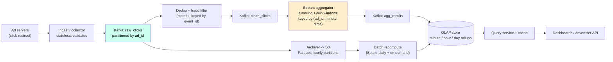
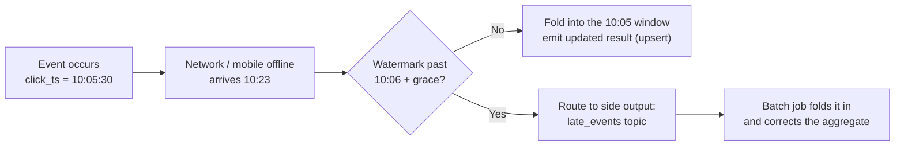
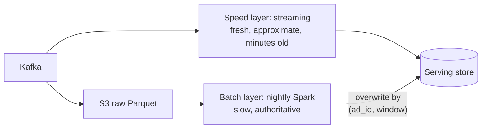

# Case Study 11 — Ad Click Event Aggregation

**Archetype:** metering / stream processing. This is the canonical **big-data pipeline**
question. It looks like "count things", but the grade comes from three words:
**late events, exactly-once, and reconciliation**. Money is computed from these counts,
so "approximately right" is not an acceptable answer here — unlike the
[rate limiter](04-rate-limiter.md), where it was.

---

## 1. Requirements

**Functional (in scope)**
1. Ingest click events: `(ad_id, click_ts, user_id, ip, country, device)`.
2. Return **aggregated click counts for the last M minutes**, grouped by `ad_id`,
   with optional filters (country, device).
3. Return **top-N most-clicked ads in the last M minutes**, optionally filtered.
4. Support **backfill / recomputation** when a bug or a late data dump is discovered.
5. Filter fraudulent and duplicate clicks before they reach billing.

**Out of scope:** ad serving and auction/bidding (a different, latency-critical system),
targeting and ML ranking, the billing system itself (we produce the *inputs* to
billing), impression tracking (same shape, higher volume — mention it, don't design it).

**Non-functional**

| Dimension | Target |
|---|---|
| Scale | 1 M click events/s peak, ~100 B events/day at the top end |
| Query latency | p99 < 1 s for dashboards over aggregated data |
| Data freshness | Aggregates visible within **a few minutes** (not seconds) |
| Correctness | **Counts drive billing** → no double-counting, no silent loss |
| Availability | Ingestion must never drop events; query path can degrade |
| Retention | Raw events 30 days (for recompute/audit), aggregates 1–2 years |

**Say this early:** *"Because these numbers are billed, I'll design for
end-to-end exactly-once **effect** — at-least-once delivery plus idempotent
deduplicated writes — and I'll keep raw events so I can always recompute."*
That single sentence frames the entire design.

---

## 2. Estimation

```
Peak write: 1 M events/s
Event size: ad_id + user_id + ts + ip + country + device ≈ ~200 B raw,
            ~50 B after columnar compression

Raw ingest/day  = 1 M/s x 86 400 x 200 B  ≈ 17 TB/day  (~5 TB compressed)
30-day raw hot store                       ≈ 150–500 TB
Aggregates: 10 M ads x 1440 min/day x ~30 B ≈ 400 GB/day at minute granularity
   -> roll up: minute (7 d) -> hour (90 d) -> day (2 y). Aggregates become tiny.

Query load: dashboards + APIs, ~thousands of QPS, all reading *aggregates*, never raw.
```

**Conclusions**
1. **Writes are 1000x reads.** The system is an ingestion pipeline with a small query
   surface bolted on — design it that way.
2. Raw storage is expensive but non-negotiable → cheap object storage (S3) in
   **Parquet**, not a database.
3. Aggregates are small → they belong in a fast OLAP store; minute-granularity is the
   base unit and everything else is a roll-up.
4. 1 M events/s cannot go straight into a database. **A log (Kafka) must absorb the
   write rate** and decouple producers from processing.

---

## 3. Core entities & API

**Core entities**

| Entity | What it is | Notes |
|---|---|---|
| **ClickEvent** | The raw fact: `event_id`, `ad_id`, `user_id`, `click_ts`, ip / country / device | Immutable and archived. `event_id` is the dedup key; `click_ts` is **event time**, not arrival time |
| **Ad / Campaign** | The dimension clicks are grouped by | Low-cardinality metadata joined at query time — never denormalised into every event |
| **AggregateBucket** | `(ad_id, window_start, dims) → count` | The materialised output and the only thing users actually query. Upserted by key, which is what makes replay safe |
| **Watermark** | Per-partition progress marker | Decides when a window may close; the pipeline's notion of "how far has time advanced" |
| **RejectedClick** | A click filtered as fraud or duplicate | Tagged and archived, never deleted — it's the evidence for an advertiser dispute |

The entity that matters most is the one candidates forget: **`AggregateBucket` is keyed,
not appended.** That single property is what turns "exactly-once" from an impossible
delivery guarantee into an achievable idempotent write.

**Interface**

```
POST /v1/events                      # from ad servers, batched, fire-and-forget-ish
  { events: [{ event_id, ad_id, user_id, click_ts, ip, device }] }
  -> 202 Accepted

GET /v1/ads/{ad_id}/clicks?from=&to=&granularity=minute|hour|day&filter=country:IN
  -> [{ bucket_start, clicks }]

GET /v1/ads/top?from=&to=&n=100&filter=country:IN
  -> [{ ad_id, clicks }]

POST /v1/admin/recompute?from=&to=&reason=   # replay a window from raw
```

Two details worth calling out unprompted:
- **`event_id` is generated by the ad server**, not the ingest tier — it is the
  idempotency key, and it must survive retries.
- The read API always takes an explicit **time window and granularity**, so the
  server can pick the right pre-aggregated table instead of scanning raw events.

---

## 4. The naive design, and why it breaks

```sql
-- on every click
INSERT INTO clicks(ad_id, user_id, click_ts, country, device) VALUES (...);

-- dashboard query
SELECT ad_id, COUNT(*) FROM clicks
 WHERE click_ts BETWEEN ? AND ? GROUP BY ad_id ORDER BY 2 DESC LIMIT 100;
```

Store every click, count on read. Correct, simple, and the standard answer until the
numbers arrive:

| What breaks | The number that breaks it | Consequence |
|---|---|---|
| **Write throughput** | 1 M inserts/s | No OLTP database accepts that. Even batched, the index maintenance alone saturates the box |
| **Query cost** | 17 TB/day of raw rows | A "last 24 hours, top 100 ads" query scans hundreds of billions of rows against a p99 target of **1 second** |
| **Repeated work** | ~1000s of QPS of dashboard reads | The same aggregate is recomputed from scratch for every viewer, even though the answer changed by a rounding error since the last one |
| **Direct-write coupling** | DB down = clicks lost | Clicks are **billable events**. Losing them isn't degraded service, it's unbilled revenue and an audit failure |

**The reframe:** you are not storing clicks to query them, you are storing them to *count*
them. Counting is a **stream** operation — do it once, incrementally, as data arrives, and
keep only the counts. Raw events still get archived, but to cheap object storage for
recompute and audit, not to a database anyone queries.

That gives the shape of the real design: a log absorbs the write rate, a stream processor
folds events into 1-minute windows, and dashboards read a tiny pre-aggregated table
([§5](#5-high-level-architecture)).

**But the naive design's replacement introduces three problems it never had**, and this is
where the interview actually lives — a `COUNT(*)` over raw rows is trivially correct, and
you just gave that up:

| New problem | Why the naive version didn't have it | Where it's solved |
|---|---|---|
| **Duplicates** | Counting rows counts each row once by definition | At-least-once delivery + dedup + upsert-keyed output ([§6](#6-deep-dive--exactly-once-honestly)) |
| **Late events** | A row inserted late still lands in the right `WHERE` range | Event time, watermarks, grace windows, side outputs ([§7](#7-deep-dive--event-time-vs-processing-time-and-late-events)) |
| **Wrong results are permanent** | Recount and you're correct again | Keep raw in S3 and recompute in batch, overwriting by key ([§11](#11-deep-dive--lambda-and-whether-you-need-it)) |

So the honest summary is: **pre-aggregation buys throughput and pays for it in
correctness machinery.** Being able to say that — and then show the machinery — is the
difference between reciting a streaming architecture and understanding why it has so many
parts.

**The instinct to resist:** "use a columnar store and skip streaming entirely." ClickHouse
really can ingest a million rows/s and scan fast. But at 17 TB/day you'd be storing raw
events forever in your most expensive tier and re-scanning them for every dashboard load,
and you'd still have no dedup or late-event story. Columnar storage belongs *behind* the
aggregation ([§9](#9-deep-dive--storage-choices)), not instead of it.

---

## 5. High-level architecture



**Write path narration:** the ad server writes the click to Kafka through a thin
stateless collector (validate schema, stamp receive time, nothing else). Kafka is the
**durable buffer and the source of truth for ordering**. Two independent consumers read
it: an archiver that lands raw Parquet in S3, and the processing chain that dedups,
filters fraud, aggregates into 1-minute tumbling windows, and emits results to an OLAP
store.

**Read path narration:** every query hits pre-aggregated rows in the OLAP store, chosen
by granularity; hot windows (last hour, top-N) are cached for seconds. Raw data is never
queried by users — only by recompute jobs.

**The line that earns credit:** *"Kafka isn't a queue here, it's a **replayable log**.
That's what makes recovery, backfill, and the lambda-style batch correction possible at
all."*

---

## 6. Deep dive — exactly-once, honestly

You cannot get exactly-once *delivery* over a network. You get **at-least-once delivery
plus an idempotent sink**, which produces an exactly-once *effect*. Interviewers listen
for exactly this distinction.

Three places duplicates enter, and the defence at each:

| Where | Cause | Defence |
|---|---|---|
| Producer → Kafka | Ack lost, producer retries | Kafka **idempotent producer** (`enable.idempotence=true`) dedups by `(producer_id, seq)` per partition |
| Kafka → processor | Consumer crashes after processing, before committing offset | **Offset commit inside the same transaction as the output write**, or an idempotent sink |
| Genuine duplicates | Client double-click, bot replay, ad server retry | Application-level dedup on `event_id` over a bounded window |

### The dedup store
Keep a **1-hour** (configurable) window of seen `event_id`s, keyed and partitioned the
same way as the stream so lookups are local:
- **RocksDB local state** in the stream processor + changelog topic for recovery, or
- **Redis with TTL** if you prefer an external store (simpler, adds a hop), or
- **Bloom filter in front** to make the common "never seen" case a memory hit; the
  false-positive rate must be handled by a real lookup, since dropping a real click is
  lost revenue.

Bounded windows mean a duplicate arriving 3 hours later slips through — that is exactly
what the **daily batch recompute over raw S3 data** catches, because it can dedup over
the whole day.

### Checkpointing
The aggregator checkpoints window state + input offsets atomically (Flink-style). On
failure it restores state *and* rewinds offsets to the same point, so the replayed
events rebuild identical windows. Emit results **keyed by `(ad_id, window_start, dims)`
with an upsert**, so re-emitting the same window is harmless. Upsert-keyed output is the
cheapest, most robust idempotency mechanism in the whole design — prefer it over trying
to make the pipeline never repeat itself.

---

## 7. Deep dive — event time vs processing time, and late events

Use **event time** (`click_ts` from the ad server), never processing time. A phone that
was offline for 20 minutes still needs its click to land in the minute it happened, or
advertiser reports change retroactively and nobody trusts the numbers.



- **Watermark:** the pipeline's assertion that "no more events older than T are
  expected". Derive it as `max_event_time_seen - allowed_lateness`, per partition, taking
  the **minimum** across partitions so one stalled partition doesn't advance the world.
- **Allowed lateness:** ~15 minutes for mobile ad traffic. Windows stay open that long
  and re-emit corrected totals on each update.
- **Beyond the grace period:** do **not** drop. Route to a `late_events` topic, and let
  the batch layer fold it in. Dropped events are lost revenue for the advertiser or
  overcharge for the buyer — both are business incidents.
- **Communicate the semantics:** mark aggregates for the last 15 minutes as
  **`provisional`** in the API and finalise them afterward. Advertisers will accept
  "numbers settle after 15 minutes"; they will not accept numbers changing silently
  forever.

**Trap to name:** a producer with a wrong clock can emit `click_ts` from the future,
which jumps the watermark and prematurely closes every open window, silently discarding
correct data. Clamp `click_ts` to `receive_time + small_skew` and alert on the clamp
rate.

---

## 8. Deep dive — aggregation topology and hot keys

Aggregate on `(ad_id, window_start, country, device)` in **1-minute tumbling windows**.
One minute is the sweet spot: fine enough to roll up into anything a user asks for,
coarse enough that state stays small.

**Two-stage aggregation** is the answer to skew:

```
Stage 1: key = (ad_id, minute, random_salt 0..N)  -> partial counts   [absorbs hot keys]
Stage 2: key = (ad_id, minute)                    -> sum of partials  [tiny volume]
```

A single viral ad can be 5% of all traffic; without salting, one Kafka partition and one
task instance melt while the rest idle. **Partition by `ad_id` normally, add the salt
only for keys detected as hot** (or always, if you prefer simplicity over a small extra
shuffle).

**Top-N:** don't sort globally. Each stage-2 task keeps a local **min-heap of size N**
per window; a final single-parallelism operator merges the per-task heaps. If exactness
for the deep tail isn't required, **Count-Min Sketch** gives approximate counts in fixed
memory — but say plainly that *billing uses the exact counter and only the leaderboard
uses the sketch*.

**Dimension explosion:** don't pre-aggregate every combination of dimensions. Store the
base cube at `(ad_id, minute, country, device)` and let the OLAP engine roll up on the
fly; materialise only the handful of combinations that dashboards actually hit.

---

## 9. Deep dive — storage choices

| Layer | Store | Why |
|---|---|---|
| Buffer / log | Kafka, ~7-day retention, partitioned by `ad_id` | Absorbs 1 M/s, replayable, decouples producers from processors |
| Raw archive | S3, Parquet, `dt=/hour=` partitions | ~$0.023/GB/mo, columnar, queryable by Spark/Athena for recompute and audit |
| Aggregates | Columnar OLAP (ClickHouse / Druid / Pinot) | Sub-second group-by/top-N over billions of rows; native time-series rollups and TTL |
| Dedup state | RocksDB (local, in-processor) or Redis TTL | Point lookups at stream rate, bounded window |
| Hot query cache | Redis, TTL ≈ window granularity | Dashboards poll the same last-hour queries constantly |

**Why not Cassandra for aggregates?** It's excellent for `SELECT ... WHERE ad_id = ?` on
a known key, but the interesting queries — top-N across all ads, group-by country, ad-hoc
filters — are analytical scans. Columnar OLAP is built for exactly that. Cassandra is a
defensible answer *if* you constrain the API to per-ad lookups; say which you're choosing
and why.

**Rollup / TTL policy:** minute rows live 7 days, then compact to hourly (90 days), then
daily (2 years). This is what keeps aggregate storage flat instead of growing linearly.

---

## 10. Deep dive — fraud and duplicate clicks

Billing on unfiltered clicks means paying for bots. A pragmatic two-tier approach:

- **Inline (cheap, deterministic):** drop known bot user-agents and datacenter IP ranges;
  cap N clicks per `(user_id, ad_id)` per minute; drop clicks whose `click_ts` precedes
  the impression or arrives implausibly fast after it (< ~1 s).
- **Offline (expensive, ML):** click-through-rate anomaly detection, IP/device
  fingerprint clustering, conversion-rate mismatch. Runs in batch and produces
  **adjustments**, not deletions.

Key design decision: filtered events are **tagged, not discarded**. Write them to a
`rejected_clicks` topic and archive them. You need the evidence for advertiser disputes,
for tuning the filter, and to reverse a bad rule that started rejecting real traffic.
"Deleting data you can't get back" is the failure mode this avoids.

---

## 11. Deep dive — lambda, and whether you need it



The nightly batch job recomputes the same windows from raw data and **overwrites** the
streaming results by primary key. It catches: very late events, dedup misses outside the
stream's window, aggregator bugs deployed for a day, and fraud rules updated after the
fact.

The honest trade-off, which is what you're really being asked:

| | Lambda (stream + batch) | Kappa (stream only, replay to fix) |
|---|---|---|
| Correctness | Batch is the authority; self-healing | Correct only if you replay, which you must operate |
| Cost | Two codebases, two engines, drift risk | One pipeline |
| When | **Money is involved** and an auditor may ask | Metrics, analytics, non-billed counters |

**Choice: lambda here**, precisely because the output is billed and must survive an
audit. Say that you'd use Kappa for an impressions dashboard. Naming *when you'd choose
the other one* is the difference between reciting a pattern and understanding it.

---

## 12. Failure modes

| Failure | Behaviour / mitigation |
|---|---|
| Aggregator crashes | Restore from last checkpoint, rewind offsets, replay. Upsert-keyed output makes reprocessing idempotent |
| Kafka partition leader loss | `acks=all`, `min.insync.replicas=2`; producers buffer and retry; brief ingest latency, no loss |
| OLAP store down | Streaming results accumulate in `agg_results` (Kafka retention is the buffer); queries serve stale cache. **Never** drop the aggregation to keep the query path alive |
| Consumer lag spike (traffic surge) | Autoscale on lag, not CPU. Kafka retention is the shock absorber — 7 days means hours of outage are recoverable |
| Bad deploy computes wrong counts | Detect via reconciliation, redeploy, replay the affected window from Kafka/S3, overwrite by key |
| Hot ad melts one partition | Salted two-stage aggregation; detect hot keys and raise the salt factor dynamically |
| Producer clock skew | Clamp `click_ts` to `receive_time + skew`, alert on the clamp rate; watermark uses the clamped value |
| Whole-region loss | Kafka MirrorMaker to a second region + S3 cross-region replication; aggregates recomputable from raw |

**Reconciliation is a first-class feature, not an afterthought:** compare
`count(raw events in S3 for hour H)` against `sum(aggregates for hour H)` every hour, and
alert when they diverge beyond a threshold. Without this check you find out about
counting bugs from an advertiser's lawyer.

---

## 13. Scale evolution

- **10x (10 M events/s):** add Kafka partitions (plan partition count generously up
  front — repartitioning changes key→partition mapping and disrupts stateful consumers),
  scale aggregator parallelism, salt more aggressively. The architecture holds; this is a
  capacity exercise.
- **100x:** push **pre-aggregation into the ad servers** — batch 1-second local counts
  before publishing, cutting event volume by 10–100x at the cost of losing per-event
  detail (so keep a sampled raw stream for fraud analysis). Consider regional pipelines
  with a global merge.
- **More dimensions requested:** resist a full cube. Add dimensions to the base
  aggregation only if they're low cardinality; high-cardinality dimensions (user_id,
  creative_id x placement) belong to on-demand queries over raw Parquet.
- **Real-time budget pacing (sub-second):** a different problem. Fast, approximate
  per-ad counters in Redis for spend control, running *alongside* the billing pipeline —
  don't try to make one system serve both freshness profiles.

---

## 14. Trade-offs summary

| Decision | Chose | Alternative | Why |
|---|---|---|---|
| Ingestion | Kafka log | Direct DB writes | Only a log absorbs 1 M/s and enables replay/backfill |
| Semantics | At-least-once + idempotent upsert | "Exactly-once" claim | Exactly-once *effect* is achievable; exactly-once delivery is not |
| Time | Event time + watermarks | Processing time | Otherwise a network delay silently rewrites advertiser reports |
| Late events | Grace window, then side output + batch fix | Drop | Dropped clicks are lost revenue and an audit failure |
| Window | 1-minute tumbling | 1-second / 1-hour | Rolls up into anything; keeps state and output volume sane |
| Architecture | Lambda (stream + nightly batch) | Kappa only | Billing needs an authoritative, auditable recomputation |
| Aggregate store | Columnar OLAP | Cassandra | Top-N and group-by are analytical scans, not key lookups |
| Raw store | S3 Parquet, 30 days | Keep in the DB | 100x cheaper; recompute and audit need raw, queries don't |
| Hot keys | Two-stage salted aggregation | Single-stage by `ad_id` | One viral ad is 5% of traffic and would melt one task |
| Fraud filtering | Tag and route aside | Delete inline | Evidence for disputes and the ability to reverse a bad rule |

---

## 15. Rapid-fire probe answers

| Probe | Answer |
|---|---|
| "Can you guarantee exactly-once?" | Not exactly-once *delivery* — that's impossible over a network. At-least-once delivery + dedup on `event_id` + upsert-keyed output gives an exactly-once **effect**, which is what billing needs |
| "An event arrives 3 hours late. What happens?" | Past the 15-minute grace window, so it goes to a `late_events` side output, is archived to S3, and the nightly batch job folds it into the correct window and overwrites the aggregate |
| "Why event time and not processing time?" | A phone offline for 20 minutes would otherwise book its click into the wrong minute, retroactively changing an advertiser's report. Event time keeps history stable |
| "How do you set the watermark?" | `max_event_time - allowed_lateness`, computed per partition and taking the **minimum** across partitions, so one stalled partition can't advance the world and close windows early |
| "A producer sends a timestamp from the future." | It would jump the watermark and prematurely close every open window. Clamp `click_ts` to `receive_time + max_skew` and alert on the clamp rate |
| "One ad is 5% of all clicks." | Two-stage aggregation: stage 1 keys on `(ad_id, minute, salt)` to spread the load, stage 2 sums the partials. Detect hot keys and raise the salt factor |
| "Do you need the batch layer at all?" | Not for a metrics dashboard — Kappa with replay is fine. Here the output is billed and auditable, so a nightly authoritative recompute that overwrites by key is worth the second codebase |
| "How do you know the numbers are right?" | Hourly reconciliation: `count(raw in S3 for hour H)` vs `sum(aggregates for hour H)`, alert on divergence. Plus canary ads with known synthetic click volumes |
| "A bug shipped and yesterday's counts are wrong." | Fix, redeploy, replay the affected window from Kafka (within retention) or S3 (beyond it). Output is keyed by `(ad_id, window_start, dims)` and upserted, so replay overwrites rather than double-counts |
| "Why not query the raw events directly?" | 17 TB/day. Sub-second dashboards need pre-aggregated minute rows; raw exists only for recompute, audit, and ad-hoc forensics |
| "Why 1-minute windows?" | Fine enough to roll up to hour/day/custom ranges, coarse enough to keep window state and emitted row volume manageable. Second-level windows multiply output 60x for value nobody queries |
| "How long do you keep everything?" | Kafka 7 days (replay buffer), raw Parquet 30 days (recompute + audit), minute aggregates 7 days → hourly 90 days → daily 2 years |
| "The OLAP store goes down." | Queries serve from cache and degrade; ingestion and aggregation keep running, with results buffered in Kafka. Never stop aggregating to protect the read path — you can't recreate the clicks, only re-serve them |
| "How do you stop paying for bot clicks?" | Cheap deterministic filters inline (bot UAs, datacenter IPs, per-user-per-ad caps, impossible click latency), ML anomaly detection offline producing adjustments. Rejected events are tagged and archived, never deleted |
| "Advertiser says our number is 2% lower than theirs." | Point to reconciliation output and the `rejected_clicks` archive: show which events were filtered and why. This is why filtered data is retained rather than dropped |
