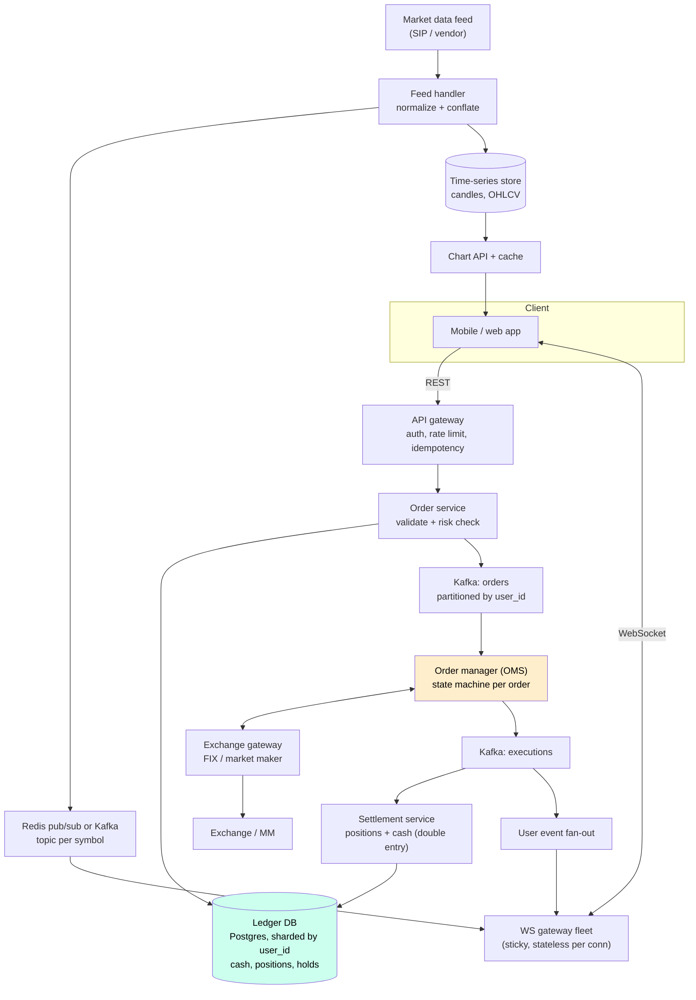

# Case Study 12 — Stock Broker / Trading App (Robinhood-style)

**Archetype:** transactional + real-time. Two systems glued together: a **correctness**
system (orders, money, positions) that looks like [payments](10-payment-system.md), and a
**fan-out** system (live prices) that looks like [chat](03-chat-messaging.md). Candidates
who design only one of the two fail. The other trap is designing a *matching engine* when
the question asked for a *broker* — a broker **routes** orders to an exchange, it does not
match them.

---

## 1. Requirements

**Functional (in scope)**
1. Users see **live prices** and a watchlist that updates in real time.
2. Place, cancel and view **orders** (market, limit; day / GTC).
3. See **portfolio**: positions, average cost, unrealised P&L, buying power.
4. Deposit / withdraw cash; settle executed trades into positions and cash.
5. Order history and statements (immutable, auditable).

**Out of scope (say why):** the matching engine itself — we route to an exchange or
market maker; margin lending risk models; options/crypto (mention that the order and
ledger model generalises); tax-lot reporting.

**Non-functional**

| Dimension | Target |
|---|---|
| Users | 20 M registered, 2 M DAU, ~200 K concurrent at the open |
| Order rate | ~2 K orders/s steady, **50 K/s burst** in the first minutes of the session |
| Market data | ~10 K symbols, up to 1 M ticks/s from the feed, fanned out to 200 K clients |
| Order latency | p99 < 200 ms user → exchange ack (this is a broker, not an HFT firm) |
| Price freshness | < 500 ms end-to-end for the retail UI |
| Consistency | **Strong** for cash, positions, orders. Eventual is fine for charts, P&L display, news |
| Availability | 99.99% during market hours; a 5-minute outage at the open is a regulatory event |
| Durability | Zero order loss. Every state transition is auditable for 7 years |

**Frame it in one line:** *"Order and money state is strongly consistent, single-writer
per account, and never lost. Market data is a best-effort, lossy, high-fanout broadcast.
I'll design them as two separate systems that meet only in the UI."*

---

## 2. Estimation

```
Orders: 50 K/s peak x ~500 B  = 25 MB/s of order writes at the bell
        2 K/s avg x 86 400    ≈ 170 M orders/day  -> ~100 GB/day with the full audit trail

Market data in:  1 M ticks/s x ~50 B ≈ 50 MB/s (a single feed handler, not a fleet)
Market data out: 200 K clients x ~20 symbols x 1 update/s x 60 B
                 ≈ 240 MB/s  -> ~2 Gbps of egress at 1 Hz per symbol

Positions: 20 M users x ~15 symbols x 200 B ≈ 60 GB — fits in memory, cacheable
Ticks for charts: 10 K symbols x 23 400 s/day x 60 B ≈ 14 GB/day raw
                  -> downsample to 1s/1m/1d candles, keep raw ~30 days
```

**Conclusions**
1. **Fan-out dominates bandwidth, not order volume.** 2 Gbps of price egress vs 25 MB/s
   of orders → the market-data path needs conflation and edge fan-out; the order path
   needs correctness, not throughput heroics.
2. **Burst ratio is 25x.** The order path must be queue-buffered and shed load
   gracefully, or the open takes you down every single day.
3. Portfolio state is small enough to be memory-resident per user → cheap strong reads.
4. Tick history is the only genuinely large dataset → time-series store with downsampling.

---

## 3. Core entities & API

**Core entities**

| Entity | What it is | Notes |
|---|---|---|
| **Account** | Owns cash, positions and orders | The **sharding key for everything transactional** — chosen so no money operation ever spans two shards |
| **Order** | Symbol, side, qty, type, TIF + a state machine | Backed by an append-only `order_events` log; the row is a projection, the log is the audit record |
| **Execution (Fill)** | A venue-reported partial or full fill: qty, price, `exec_id`, exchange timestamp | The **only** thing that moves money. Deduped by `exec_id` because venues resend |
| **Position** | `(user, symbol) → qty, avg_cost` | A projection of the ledger, rebuildable by replay — never the source of truth |
| **LedgerEntry** | Immutable double-entry row | The authority for cash. Balance is a `SUM`, not a mutable column |
| **Hold** | Buying power reserved against an open order, with a TTL | Prevents double-spend while an order is unfilled |
| **Quote / Tick** | Best bid / ask / last per symbol | Ephemeral, lossy, never durable — the opposite guarantee to everything above it |

Notice the split down the middle of this table: the first six entities are strongly
consistent and permanent, the last one is deliberately disposable. That's the two-systems
framing made concrete.

**Interface**

```
# Trading (REST, strongly consistent, idempotent)
POST /v1/orders            Idempotency-Key: <client_uuid>
     { symbol, side, type: market|limit, qty, limit_price?, tif: day|gtc }
     -> 201 { order_id, status: pending }
DELETE /v1/orders/{order_id}                 # best effort — may already be filled
GET  /v1/orders?status=&from=&to=
GET  /v1/portfolio                           # positions, cash, buying power
POST /v1/transfers  { direction, amount }    # ACH in/out

# Market data (WebSocket, lossy, high volume)
WS /v1/stream
  -> { "op": "subscribe", "symbols": ["AAPL","TSLA"], "channel": "quote|trade" }
  <- { "s":"AAPL", "b":189.42, "a":189.44, "lp":189.43, "t":1690000000123 }

# User events (same socket, but guaranteed)
  <- { "type":"order_update", "order_id":..., "status":"filled", "seq": 42 }
```

Three details to volunteer:
- **`Idempotency-Key` is mandatory on order placement.** A retry after a timeout must
  never create a second order — this is the single most expensive bug in the domain.
- **Two channels on one socket with different guarantees:** quotes may be dropped and
  conflated; `order_update` messages carry a **per-user sequence number** so the client
  can detect a gap and resync via REST.
- Cancel is **advisory**: the correct response to "cancel a filled order" is
  `409 already_filled`, not an error page.

---

## 4. The naive design, and why it breaks

```python
@app.post("/orders")
def place_order(req):
    acct = db.query("SELECT * FROM accounts WHERE id = ?", req.user)
    if acct.cash < req.qty * price:  return error("insufficient funds")
    fill = exchange.send_order(req)                    # blocks 50-500 ms
    db.execute("UPDATE accounts SET cash = cash - ? WHERE id = ?", fill.cost, req.user)
    db.execute("UPDATE positions SET qty = qty + ? WHERE ...", fill.qty)
    return fill

# and for prices:
@app.get("/quotes")
def quotes(symbols):  return {s: latest_tick[s] for s in symbols}   # client polls 1/s
```

Check funds, send to the exchange, update balances, return. Poll for prices. Both halves
fail, for unrelated reasons — which is the point of the two-systems framing:

| What breaks | The number that breaks it | Consequence |
|---|---|---|
| **Read-then-check-then-act** | Two orders from two devices in the same millisecond | Both read the same `cash`, both pass the check, both execute. The account goes negative and you've lent money you never agreed to lend |
| **Synchronous exchange call** | 50 K orders/s at the open vs ~2 K/s steady | Every in-flight order holds a request thread and a DB connection for the venue's round trip. The pool is exhausted in the first seconds of the session |
| **Crash mid-flight** | `send_order` returned, process died before the `UPDATE` | The trade **exists at the exchange** and not in your system. The customer owns shares you have no record of, and no retry can discover that safely |
| **Mutable `cash` column** | Every fill overwrites it | No audit trail. A regulator asks how a balance was reached and the answer is "it isn't recorded" |
| **Polling for quotes** | 200 K clients × 20 symbols × 1 Hz | 4 M quote lookups/s to deliver values that mostly didn't change, and still a 1-second lag |

**Four reframes:**

1. **Reserve, don't check.** Take a durable **hold** on buying power inside one
   transaction, so concurrency is resolved by the database rather than by a race between
   two reads ([§6](#6-deep-dive--placing-an-order-safely)).
2. **Accept, then work asynchronously.** Persist and acknowledge as `pending`, then let an
   OMS drive the exchange conversation. Kafka partitioned by `user_id` absorbs the 25x open
   burst *and* serialises each account to a single writer.
3. **The venue is the authority, not your process.** Because you can't make your DB and the
   exchange commit together, recovery is "ask the exchange what happened" — which requires
   a `client_order_id` sent *before* the call and an order state machine that tolerates an
   unknown outcome ([§7](#7-deep-dive--order-state-machine-and-partial-fills)).
4. **Prices are a broadcast, not a query.** One conflated stream fanned out to subscribers,
   because the answer is identical for every viewer ([§8](#8-deep-dive--market-data-fan-out)).

**The instinct to resist:** "wrap it in a transaction and add retries." Retrying an order
without an idempotency key and a venue-side `client_order_id` doesn't make it safe — it
makes duplicate trades faster. And no transaction you can open spans your database and the
exchange, so the atomicity you're reaching for doesn't exist at any isolation level.

---

## 5. High-level architecture



**Order path narration:** the app POSTs an order with an idempotency key. The order
service authenticates, validates (market hours, symbol tradable, qty sane), and performs
the **risk check + fund hold in one database transaction** — this is the only synchronous
DB write on the hot path. The order is then published to Kafka partitioned by `user_id`
and acknowledged as `pending`. The OMS consumes it, drives the order state machine, and
talks FIX to the exchange. Fills come back, land on the `executions` topic, and the
settlement service applies double-entry updates to cash and positions while the fan-out
service pushes an `order_update` to the user's socket.

**Market data narration:** one feed handler process per symbol range normalises the raw
feed, **conflates** it to a fixed publish rate, and publishes per-symbol topics. WebSocket
gateways subscribe only to symbols their connected users care about, and push to clients.
The same feed handler writes candles into a time-series store for charts.

---

## 6. Deep dive — placing an order safely

The hard requirement: **a user must never be able to spend the same dollar twice**, even
with two phones, a flaky network, and a retry loop.

```mermaid
sequenceDiagram
    participant C as Client
    participant O as Order service
    participant DB as Ledger (sharded by user)
    participant K as Kafka
    participant M as OMS
    participant E as Exchange
    C->>O: POST /orders (Idempotency-Key: K1)
    O->>DB: BEGIN; check key K1
    Note over O,DB: key exists -> return stored response, stop
    O->>DB: SELECT buying_power FOR UPDATE
    O->>DB: INSERT hold(amount), INSERT order(status=pending), INSERT idem(K1)
    O->>DB: COMMIT
    O-->>C: 201 pending
    O->>K: publish order (partition = user_id)
    M->>E: NewOrderSingle (FIX)
    E-->>M: ExecutionReport: filled 100 @ 189.43
    M->>K: publish execution
    K->>DB: settle: release hold, debit cash, credit position
    K-->>C: WS order_update(filled)
```

**Why a `hold` and not a direct debit?** The order may take seconds to fill, partially
fill, or be rejected. A hold reserves buying power immediately (so concurrent orders
can't double-spend it) while leaving the real money movement to settlement. Holds carry a
TTL and a sweeper releases orphans — the same pattern as the seat hold in
[ticket booking](06-ticket-booking.md).

**Why partition Kafka by `user_id`?** It gives a **single writer per account**, so all
orders and executions for one user are processed serially in order. Concurrency bugs on
account state disappear by construction rather than by locking discipline.

**Idempotency has three layers**, and you should name all three:
1. Client-generated `Idempotency-Key`, stored with the response, unique index in the DB.
2. `client_order_id` sent to the exchange over FIX, so a resent FIX message is rejected
   by the venue rather than duplicated.
3. Execution reports deduped by `(exec_id)` before settlement, because the venue may
   resend on session recovery.

---

## 7. Deep dive — order state machine and partial fills

```
                 ┌────────────┐
   accepted ---> │  PENDING   │ ---> REJECTED (risk / venue reject)
                 └─────┬──────┘
                       v
                 ┌────────────┐        ┌───────────────────┐
                 │  WORKING   │ -----> │ PARTIALLY_FILLED  │ --┐
                 └─────┬──────┘        └───────────────────┘   │
                       │  cancel                               v
                       v                                  ┌────────┐
                 ┌────────────┐                           │ FILLED │
                 │  CANCELED  │ <--- expired (day order)  └────────┘
                 └────────────┘
```

Rules that matter:
- **Transitions are append-only events**, not `UPDATE order SET status`. The row is a
  projection of the event log; the log is the auditable record a regulator asks for.
- **Partial fills are the normal case**, not an edge case. A 1000-share order can come
  back as 300 + 200 + 500 across three executions and three prices. Positions must
  accumulate weighted-average cost, and the UI must show `filled_qty / total_qty`.
- **Cancel races the fill.** Send a FIX cancel request, but treat the exchange's response
  as authoritative: `CANCELED`, `PARTIALLY_FILLED then canceled`, or "too late". Never
  optimistically show "canceled" before the venue confirms.
- **Terminal states are final.** Any late execution report for a terminal order is a
  reconciliation alert, not a state change.

---

## 8. Deep dive — market data fan-out

This is the same shape as a feed/chat fan-out, with one twist: **you are allowed to drop
data**, and using that permission is the whole optimisation.

| Technique | Effect |
|---|---|
| **Conflation** | Publish only the latest quote per symbol per interval (e.g. 10 Hz internally, 1–4 Hz to retail clients). A symbol updating 5 000 times/s becomes 4 messages/s. Users cannot perceive the difference; bandwidth drops 1000x |
| **Subscription-scoped push** | A gateway subscribes upstream only to the union of symbols its connections hold, so a gateway with 5 K users watching 200 distinct symbols receives 200 streams, not 10 000 |
| **Binary + delta encoding** | Send price deltas and a compact binary frame instead of JSON. 60 B → ~15 B |
| **Snapshot + stream** | On connect: one REST snapshot, then incremental updates. Never replay history on the socket |
| **Server-side batching** | Coalesce all updates for one client into a single frame per tick interval — one syscall per client per interval instead of per symbol |

**Transport:** WebSocket, because it works everywhere including corporate proxies and
mobile. SSE is simpler but one-directional (subscribe messages need the upstream channel).
Long-polling is the degraded fallback.

**Connection management:** the WS gateway fleet is stateless apart from the connection
itself; the subscription map lives in memory with the connection. On gateway loss the
client reconnects to another node, re-subscribes, and takes a fresh snapshot — no state to
migrate. Scaling is then just "add gateways", and the upstream bus is the only shared
component.

**The trap:** during a market-wide event, every user opens the app and subscribes to the
same 10 symbols at once. Protect with per-connection subscription caps, connect-rate
limiting with jittered client retry, and a pre-warmed gateway pool sized for the open.

---

## 9. Deep dive — the ledger, positions and buying power

Reuse the discipline from [payments](10-payment-system.md): **double-entry, append-only,
never mutate history.**

| Table | Shape | Notes |
|---|---|---|
| `ledger_entries` | `(id, account_id, asset, amount, direction, ref_type, ref_id, ts)` | Immutable. Sum per account = balance. `ref_id` links to the execution |
| `holds` | `(id, user_id, amount, order_id, expires_at)` | Reserves buying power; released on fill/cancel/expiry |
| `positions` | `(user_id, symbol, qty, avg_cost)` | A **cache/projection** of the entries, rebuildable |
| `orders` / `order_events` | append-only | Order state machine log |

- **Buying power = settled cash − active holds + unsettled proceeds allowed by policy.**
  Compute it from the ledger, cache it per user, invalidate on every write. Never let
  two code paths compute it differently — that's how you get negative balances.
- **Shard by `user_id`.** Every trading transaction touches exactly one user's cash and
  one position, so it stays a **single-shard transaction**. This is the design decision
  that lets you use plain Postgres instead of a distributed transaction manager. Say it
  explicitly.
- **T+1 settlement is real:** the position is yours immediately, the cash settles the
  next business day. Model `settled` vs `unsettled` cash rather than pretending money
  moves instantly, or good-faith-violation rules become unimplementable.
- **P&L display is eventually consistent** (it depends on a live price), but **quantity
  and cost basis are strongly consistent**. Splitting the guarantee by field is a senior
  answer.

---

## 10. Deep dive — the market open

The interview usually converges here: 25x traffic in a 60-second window, every day, at a
known time.

- **Pre-scale, don't autoscale.** Autoscaling reacts in minutes; the open lasts seconds.
  Scale up on a schedule at 09:00, scale down at 16:30.
- **Queue, don't reject.** Kafka absorbs the burst; the OMS drains at exchange-safe rate.
  A `pending` order that reaches the venue 300 ms late is fine; a rejected order is a
  support ticket and a regulatory complaint.
- **Shed the right load.** Under pressure, degrade *reads* first: serve stale portfolio
  values, drop chart resolution, widen quote conflation to 1 Hz. **Never** shed order
  submission or order status.
- **Isolate by criticality.** Order placement, portfolio reads, and market data run in
  separate deployments with separate pools. A chart-service meltdown must not consume the
  connections that order placement needs — bulkheads, not shared fate.
- **Halts and circuit breakers.** The venue itself can halt a symbol. Propagate
  `halted` as a first-class symbol state, reject new orders for it with a clear message,
  and leave resting orders alone.

---

## 11. Failure modes

| Failure | Behaviour / mitigation |
|---|---|
| Order ack lost, client retries | Idempotency key returns the original response. No duplicate order |
| OMS crashes after FIX send, before persisting | On restart, send a FIX **order status request** / resend request; the venue's record is authoritative. Never assume the local record is complete |
| Exchange connection drops | FIX session recovery with sequence-number resend; queue new orders meanwhile; if the outage exceeds a threshold, reject new orders with an honest "market connectivity" message rather than silently queueing forever |
| Duplicate execution report | Dedup by `exec_id` before settlement — venues legitimately resend on session recovery |
| Market data feed stalls | Detect via a staleness watchdog (no tick in N seconds on a liquid symbol), fail over to the secondary vendor, and **mark prices as stale in the UI**. Showing a frozen price as live is worse than showing no price |
| WS gateway dies | Clients reconnect with jittered backoff to another node, re-subscribe, take a fresh snapshot. Order updates missed during the gap are recovered via the per-user sequence number + REST resync |
| Ledger shard unavailable | Trading for those users halts — **fail closed**. Wrong balances are unrecoverable; an outage is merely expensive |
| Settlement bug produces wrong positions | Positions are a projection; replay `ledger_entries` to rebuild. This is why positions are never the source of truth |
| Clock skew across services | Use the **exchange's** execution timestamp for anything that is legally the trade time; local clocks only for internal telemetry |

**End-of-day reconciliation is mandatory, not optional:** compare internal positions and
cash against the clearing firm's / venue's statement file every night, and alert on any
break. Regulated brokers have this as a legal obligation; naming it shows domain
awareness.

---

## 12. Scale evolution

- **10x users:** the ledger shards linearly on `user_id` (no cross-user transactions).
  The WS fan-out tier scales horizontally; upstream bus load grows with *distinct
  symbols*, not with users, which is the point of the per-symbol topic design.
- **10x symbols (add crypto/options):** feed handlers partition by symbol range. Options
  chains explode cardinality (thousands of contracts per underlying) → subscribe per
  contract only on demand, never stream a whole chain.
- **24/7 trading (crypto):** the "market open burst" flattens but the daily maintenance
  window disappears — you now need genuinely zero-downtime deploys and online schema
  migrations.
- **Multi-region:** keep the **ledger single-region per user** (pinned to their home
  region) — cross-region consensus on money is not worth the latency. Replicate market
  data and read-only views globally. This is the classic "write-local, read-global" split.
- **Becoming an exchange yourself:** now you need a real matching engine — a single-
  threaded, deterministic, in-memory order book per symbol, sequenced by an append-only
  log, with replicas replaying the same log. Say this only if asked; it's a different
  problem.

---

## 13. Trade-offs summary

| Decision | Chose | Alternative | Why |
|---|---|---|---|
| Scope | Broker that routes orders | Build a matching engine | The question is about order lifecycle, money and fan-out; a matching engine is a different system |
| Order intake | Sync risk check + hold, then async to Kafka | Fully synchronous to the exchange | Bounds the hot path to one DB transaction and absorbs the 25x open burst |
| Partitioning | Kafka + DB shard by `user_id` | Shard by symbol | Every money transaction is single-user → single-shard transactions, no 2PC |
| Money model | Double-entry append-only ledger + holds | Mutable balance column | Auditable, rebuildable, and no lost-update race on buying power |
| Positions | Projection of the ledger | Source of truth | A settlement bug is fixed by replay, not by manual data surgery |
| Market data | Conflated, lossy, WebSocket | Every tick to every client | 1000x bandwidth reduction with no perceptible UI difference |
| Order updates | Guaranteed, sequenced, resyncable | Same best-effort channel as quotes | Missing a fill notification is a user-trust incident; missing a quote is not |
| Failure policy | Ledger unavailable → **fail closed** | Fail open, reconcile later | Wrong money is unrecoverable; downtime is merely expensive |
| Consistency | Strong for cash/qty, eventual for P&L/charts | Uniform strong consistency | Splitting by field buys scale exactly where correctness doesn't need it |
| Burst handling | Pre-scale on schedule + queue | Autoscale | The open lasts seconds; autoscaling reacts in minutes |

---

## 14. Rapid-fire probe answers

| Probe | Answer |
|---|---|
| "Are you building the matching engine?" | No — this is a broker. We route to an exchange or market maker over FIX and manage the order lifecycle, money and fan-out. I'd design a matching engine differently: single-threaded deterministic order book per symbol, sequenced by a replicated log |
| "User taps Buy twice on a flaky network." | Client-generated `Idempotency-Key` with a unique index; the second request returns the stored response. Plus `client_order_id` on the FIX message so the venue rejects a duplicate too |
| "Why a hold instead of debiting cash?" | The order may sit unfilled for seconds or partially fill. A hold reserves buying power instantly so concurrent orders can't double-spend, while settlement does the real money movement. Holds have a TTL and a sweeper |
| "Two orders submitted at the same millisecond, together exceeding buying power." | They land on the same Kafka partition (`user_id`) and the same DB shard, and the hold is taken under `SELECT ... FOR UPDATE`. Serialised by construction — the second is rejected for insufficient funds |
| "The OMS crashed right after sending to the exchange." | Never trust local state. On recovery, issue a FIX order-status/resend request; the venue is authoritative. Reconcile, then continue the state machine |
| "You get the same execution report twice." | Dedup by `exec_id` before settlement. Venues legitimately resend during session recovery — this is expected, not exceptional |
| "1 M ticks/s to 200 K clients — how?" | Conflation is the whole answer: publish only the latest quote per symbol per interval (1–4 Hz to retail), subscribe gateways only to symbols their users hold, batch per client per interval, binary deltas. Bandwidth drops ~1000x with no perceptible UI change |
| "Can you drop a price update?" | Yes, deliberately — quotes are lossy and conflated. But **not** order updates: those carry a per-user sequence number so the client detects a gap and resyncs over REST |
| "The market data vendor freezes." | Staleness watchdog per liquid symbol, fail over to the secondary feed, and mark prices stale in the UI. A frozen price rendered as live is worse than no price — users trade on it |
| "Everyone opens the app at 9:30." | Pre-scale on a schedule rather than autoscale, buffer orders in Kafka and drain at a safe rate, shed reads first (stale portfolio, coarser charts, wider conflation), and never shed order submission |
| "Ledger shard is down. Allow trading?" | Fail closed for those users. Incorrect balances are unrecoverable and a regulatory problem; a scoped outage is merely expensive |
| "How do you show P&L consistently?" | Quantity and cost basis are strongly consistent from the ledger; the market price multiplier is eventually consistent from the feed. I split the guarantee per field rather than forcing one model on both |
| "How do you know your books are right?" | Nightly reconciliation against the clearing firm's statement, plus an invariant check that `sum(ledger_entries) == positions` projection for every account. Breaks page a human |
| "Cancel arrives while the order is filling." | Send the FIX cancel, but the venue decides. Possible outcomes are canceled, partially filled then canceled, or too late. Never show "canceled" optimistically before the venue confirms |
| "What about T+1 settlement?" | Model `settled` vs `unsettled` cash explicitly. The position is available immediately; the cash isn't. Pretending money moves instantly makes good-faith-violation rules impossible to implement |
| "Where does this stop scaling?" | Not at users or orders — those shard cleanly by `user_id`. It stops at the market-data fan-out and at the exchange session throughput, which is a hard external limit you queue against rather than scale past |
