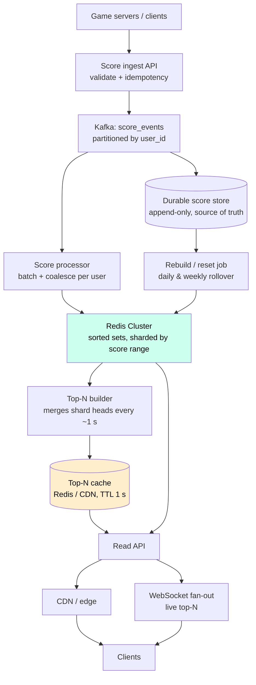

# Case Study 13 — Real-Time Leaderboard

**Archetype:** metering / ranking. The smallest-looking problem in this repo and one of
the sharpest filters. Anyone can say "Redis sorted set". The interview is decided by what
happens when you say it and the interviewer replies: *"25 million players, one key,
one shard — now what?"* The real content is **ranking at scale**, which is a fundamentally
harder operation than the top-K everyone reaches for first.

---

## 1. Requirements

**Functional (in scope)**
1. A player's score changes during play (points scored, match won) — updates land in
   real time.
2. **Top-N global leaderboard** (N = 10 / 100), refreshed live.
3. **A player's own rank**, plus a window of neighbours (± 5 around them).
4. **Multiple leaderboards**: daily, weekly, monthly, all-time; global and per-region /
   per-friend-group.
5. Leaderboards reset on a schedule; historical ones remain readable.

**Out of scope (say why):** the game itself and score *derivation* (we ingest scores,
we don't compute gameplay), matchmaking/ELO (a related but separate ranking problem),
anti-cheat detection beyond basic validation, rewards/payout.

**Non-functional**

| Dimension | Target |
|---|---|
| Players | 500 M registered, 25 M DAU, 5 M concurrent at peak |
| Score writes | ~10 K/s average, **100 K/s** during a tournament or event finish |
| Read QPS | ~1 M/s — everyone stares at the leaderboard; reads are ~100x writes |
| Latency | p99 < 100 ms for top-N and for "my rank" |
| Freshness | Top-N within ~1 s; a player's own score reflected **immediately** after their action |
| Consistency | Eventual is acceptable for rank display; **scores themselves must never be lost or double-counted** |
| Durability | Score history is the source of truth; the leaderboard is a derived index |

**Frame it in one line:** *"The leaderboard is a **materialised index**, not the source of
truth. Scores go to a durable log; the ranking structure is rebuildable. That means I can
choose an in-memory, approximate, sharded structure for ranking without risking data."*

---

## 2. Estimation

```
Writes: 10 K/s avg, 100 K/s peak x ~50 B  -> trivial bandwidth, non-trivial op rate
Reads:  1 M/s, but they are ~3 distinct queries repeated
        -> top-N is ONE answer served to millions  => cacheable at ~100% hit rate
        -> "my rank" is 25 M distinct answers      => the actual hard problem

Sorted-set memory: 25 M DAU x (user_id 8 B + score 8 B + skiplist overhead ~50 B)
                   ≈ 1.6 GB per leaderboard        -> fits in RAM comfortably
   x (daily + weekly + monthly + all-time) x 10 regions  ≈ 60 GB  -> still small

Single Redis instance: ~100 K ops/s.  Peak writes 100 K/s + rank reads
   -> one key on one shard is the ceiling. Sharding is forced by OPS, not by SIZE.
```

**Conclusions**
1. **Memory is not the constraint; single-key op throughput is.** Say this — it inverts
   the naive "we need to shard because it's too big" answer.
2. **Reads are 100x writes and hugely skewed:** top-N is one cacheable answer, "my rank"
   is 25 M different answers. Design two different read paths.
3. Data is small and rebuildable → in-memory ranking with a durable log behind it.
4. 100 K/s bursts are event-driven and predictable → buffer + batch, don't over-provision.

---

## 3. Core entities & API

**Core entities**

| Entity | What it is | Notes |
|---|---|---|
| **Player** | Identity and display info | The ranking structure stores only the ID; names are hydrated at read time |
| **ScoreEvent** | An immutable delta or absolute submission with an idempotency key | **The source of truth.** Everything else can be rebuilt from these |
| **Leaderboard** | A named, scoped, time-windowed board: `global:daily:2026-07-31`, `region:eu:weekly` | Scope + window are part of the identity, which is what makes resets a pointer flip |
| **Entry** | `(leaderboard, player) → score` | The member of the sorted set. Derived, not authoritative |
| **Histogram / TopNSnapshot** | Bucketed score distribution and the cached top-N | Derived structures that exist purely to make percentile and top-N reads O(1) |

Three of these five are **derived**. Saying that out loud early is what earns you the
right to use a fast in-memory structure for ranking later.

**Interface**

```
POST /v1/scores           Idempotency-Key: <event_uuid>
     { leaderboard_id, user_id, delta | absolute_score, occurred_at }
     -> 202 { current_score }

GET /v1/leaderboards/{id}/top?n=100            # one answer, cached hard
GET /v1/leaderboards/{id}/users/{user_id}      # -> { score, rank, percentile }
GET /v1/leaderboards/{id}/users/{user_id}/around?k=5   # neighbour window
GET /v1/leaderboards/{id}/friends?user_ids=[]  # relative leaderboard

WS  /v1/leaderboards/{id}/stream               # live top-N pushes
```

Two things worth volunteering:
- **`delta` vs `absolute_score` is a design decision, not a detail.** Deltas need
  idempotency to avoid double-counting on retry; absolute scores are naturally idempotent
  but require the caller to hold state and lose concurrent updates. Choose **delta +
  idempotency key** for incremental games, **absolute + `max()` semantics** for
  high-score games (`ZADD GT` in Redis) — the latter is idempotent *and* handles
  out-of-order arrival for free.
- **Return `percentile` alongside `rank`.** For 90% of users the exact rank
  ("#4,113,097") is meaningless and expensive; "top 18%" is cheap, stable, and better UX.
  Offering this trade unprompted is a strong signal.

---

## 4. The naive design, and why it breaks

```sql
UPDATE scores SET score = score + ? WHERE leaderboard_id = ? AND player_id = ?;

-- top 100
SELECT player_id, score FROM scores WHERE leaderboard_id = ?
 ORDER BY score DESC LIMIT 100;

-- one player's rank
SELECT COUNT(*) + 1 FROM scores WHERE leaderboard_id = ? AND score > ?;
```

A table with an index on `score`. Every query is one statement and obviously correct:

| What breaks | The number that breaks it | Consequence |
|---|---|---|
| **Rank is a scan** | 25 M rows per board | `COUNT(*) WHERE score > x` is a range scan over up to millions of index entries — **per request**, at ~1 M read QPS |
| **Repeated identical work** | Top-N is the same answer for everyone | The same `ORDER BY ... LIMIT 100` is recomputed for millions of viewers per second, and the answer barely moves |
| **Write contention** | 100 K score updates/s during an event | Every update rewrites the `score` index. The index becomes the hot spot, and updates and range scans fight over the same pages |
| **Ties are unstable** | Equal scores, no tiebreaker | Row order varies between executions, so players appear to swap places on every refresh |

**The reframe:** ranking needs a data structure that maintains sorted order
*incrementally*, so that inserting a score and asking for a rank are both O(log N) instead
of O(N). That's a **skiplist** — a Redis sorted set — where `ZADD`, `ZREVRANGE` and
`ZREVRANK` are all logarithmic, and the whole 25 M-member structure is ~1.6 GB of RAM.

**And this is where most candidates stop, which is the actual trap.** A sorted set is one
key; one key lives on one shard and therefore one CPU core, capping you at roughly 100 K
ops/s — below the peak write rate alone. So state the ceiling *before* the interviewer
finds it, because the interesting half of the problem is what happens after:

- **Sharding restores throughput but breaks rank.** Top-N survives (merge the head of each
  shard), but exact rank now needs a query on every shard. Range-partitioning by *score*
  rather than hashing by player preserves the global order that ranking depends on
  ([§6](#6-deep-dive--the-single-key-problem)).
- **Exact rank mostly shouldn't be answered at all.** "#4,113,097" is expensive and
  meaningless; "top 18%" comes from a bucketed histogram in O(1)
  ([§7](#7-deep-dive--my-rank-is-the-expensive-query)).

**The instinct to resist:** "put Redis in front of the SQL table as a cache." Caching helps
top-N, which was already the easy part, and does nothing for the 25 M *distinct* rank
queries — a cache with a near-zero hit rate on the expensive query. Redis here is not a
cache in front of the database; it's a **different data structure**, and the durable score
store behind it exists for rebuilds rather than for reads
([§9](#9-deep-dive--the-durable-store-and-rebuild)).

---

## 5. High-level architecture



**Write path:** the game server posts a score event with an idempotency key. The ingest
API validates (plausible score, known leaderboard, player not banned) and publishes to
Kafka partitioned by `user_id`, which gives a single writer per player and makes
double-counting structurally impossible. A processor consumes, **coalesces multiple
updates for the same user within a batch window** (a player scoring 20 times in 2 seconds
becomes one Redis write), and applies them to the sorted set.

**Read path — two of them, deliberately different:**
- **Top-N:** computed once per second by merging the head of every shard, then served
  from cache/CDN to millions of clients. Cost is O(1) per request regardless of traffic.
- **My rank:** hits the ranking structure directly, scoped to the requesting user.

**The line that earns credit:** *"Redis is the index, Kafka + the score store are the
truth. If Redis is wiped I replay and rebuild in minutes — so I'm free to optimise it for
speed rather than durability."*

---

## 6. Deep dive — the single-key problem

The naive design is one Redis sorted set per leaderboard:

```
ZADD   lb:global:daily <score> <user_id>       # O(log N) write
ZREVRANGE lb:global:daily 0 99 WITHSCORES      # O(log N + 100) top-100
ZREVRANK  lb:global:daily <user_id>            # O(log N) exact rank
```

This is genuinely correct and genuinely fast — and it is **one key, therefore one shard,
therefore one CPU**. Redis Cluster cannot split a single key. At ~100 K ops/s you are
capped, and the interviewer will push exactly here.

**Say what the ceiling is before being asked.** "This works to roughly 100 K ops/s and
tens of millions of members on one node. Beyond that I shard, and sharding is what makes
*rank* hard — top-N stays easy."

### Sharding options

| Approach | Top-N | Exact rank of one user | Notes |
|---|---|---|---|
| **Hash by user_id into M sets** | Merge M heads (cheap) | Requires `ZREVRANK` on **all M shards** and summing — M round trips | Even write distribution; rank cost grows with M |
| **Range-partition by score** | Read only the top shard | `count of higher shards + ZREVRANK within own shard` | Rank is 1 shard read + M cached counters. **Best for rank**, but shards drift and need rebalancing |
| **Two-tier: hot top-K set + full set** | Top-K set is tiny and fast | Falls back to the full structure | Great when 99% of reads are top-N |

**Choice: range-partition by score**, with shard boundaries recomputed periodically from
the score distribution, plus a cached `count_above[shard]` array refreshed every second.
A rank query becomes: find the user's shard, read the precomputed count of everyone in
higher shards, add their in-shard `ZREVRANK`. One shard hit, not M.

**Why this beats hashing:** ranking is inherently a *global order* question; hashing
destroys the order you need and forces a scatter-gather on the most frequent expensive
query. Range partitioning preserves order and turns most of the work into a cached
counter.

**The rebalancing cost is the honest trade-off:** score distributions are heavily skewed
and shift during an event, so boundaries go stale and one shard gets hot. Recompute
boundaries from a periodic histogram (or a sketch like t-digest) and migrate ranges in
the background — this is the same operational problem as any range-sharded store.

---

## 7. Deep dive — "my rank" is the expensive query

Top-N looks like the headline feature but it's the easy one: **one answer, cached, served
to everyone**. `ZREVRANK` for 25 M distinct users is where the load actually is.

Three ways to make it cheap, in increasing order of cleverness:

**1. Don't answer it exactly.** Percentile is enough for most of the ladder:
```
percentile = count_of_scores_above(user_score) / total_players
```
Maintain a **score histogram** (bucketed, e.g. 1000 buckets) updated on every write. A
percentile read is a prefix-sum over 1000 counters — O(1)-ish, cacheable, and completely
shard-independent. Serve exact rank only for the top ~10 000 players, where it's cheap
*and* where it's the only place users care about the precise number.

**2. Cache aggressively with short TTLs.** A rank that's 5 seconds stale is invisible to
the user but cuts backend load by orders of magnitude. Rank is the perfect candidate for
a 2–5 s TTL because it changes constantly and nobody can tell.

**3. Neighbour windows are cheap once you have the rank.** `ZREVRANGE rank-5 rank+5` is
O(log N + 10) on the user's own shard — no extra machinery needed.

**Ties matter more than people expect.** Two players with the same score must get a
stable, well-defined order or the UI flickers as users appear to swap places on every
refresh. Standard trick: **encode the tiebreaker into the score itself**:
```
composite = score * 2^30 + (2^30 - 1 - timestamp_seconds_since_epoch_offset)
```
Higher score wins; equal score → earlier achiever ranks higher. One number, one sorted
set, deterministic order, no secondary comparison. (Watch the float precision limit —
Redis scores are IEEE doubles, exact only to 2^53, so budget your bit allocation.)

---

## 8. Deep dive — time-windowed leaderboards and resets

Daily / weekly / monthly boards are not four copies of the same problem.

- **Key per window:** `lb:global:daily:2026-07-31`, `lb:global:weekly:2026-W31`. Writing a
  score does a fan-out write to each active window's key — 4 writes instead of 1. Cheap,
  and each board is independently resettable by simply letting the key expire.
- **Never "reset" by deleting live data.** Create the new window's key ahead of time and
  flip the pointer at rollover. Deleting a 25 M-member key blocks Redis; use `UNLINK`
  (async) or key expiry, never `DEL`, and never at peak.
- **Rollover is a thundering herd.** At 00:00 UTC every client refetches an empty board
  and every write creates new keys. Pre-create keys, stagger TTLs with jitter, and warm
  the top-N cache before the flip.
- **Time zones:** "daily" for whom? Either pick UTC and state it in the UI, or maintain
  per-region boards keyed on local day. Don't compute per-user local days — that's an
  unbounded number of boards.
- **Sliding windows** ("last 24 hours") are a different, much harder beast: you must
  *decay* scores as events age. Either bucket by hour and sum the last 24 buckets on read
  (24x read amplification), or accept a tumbling window and say so. Naming the difference
  between tumbling and sliding here is worth real credit.

---

## 9. Deep dive — the durable store and rebuild

Redis is the index; something else has to be the truth.

| Store | Holds | Why |
|---|---|---|
| Kafka `score_events` (7 d) | Every raw score event | Replay source for short-horizon rebuilds |
| Score store (Cassandra/DynamoDB, keyed `(leaderboard_id, user_id)`) | Current authoritative score per user per board | Point lookups, huge write rate, cheap |
| Cold archive (S3, Parquet) | Historical boards, closed windows | Audit, analytics, "your rank last season" |

**Rebuild procedure**, which you should be able to state in one breath: scan the score
store for the leaderboard, `ZADD` in pipelined batches (a few hundred K/s per node),
replay the Kafka tail from the scan's start offset to catch writes that happened during
the scan, then flip reads to the new key. 25 M members rebuilds in minutes.

**This is why the whole design is allowed to be aggressive:** Redis with no persistence,
approximate ranks, in-memory histograms — all safe because the reconstruction path is
fast and tested. State that you'd **exercise the rebuild regularly**, not just document
it; an untested recovery path is not a recovery path.

---

## 10. Deep dive — live updates and hot spots

**Pushing the leaderboard live:**
- Top-N changes constantly during an event but the *answer* is identical for every
  viewer → compute once per second, push one message to all subscribers via a fan-out
  tier. This is a broadcast problem, not a per-user problem.
- **Rate-limit the visual update** to ~1 Hz regardless of how fast scores change. Faster
  is unreadable and multiplies bandwidth by nothing.
- A player's *own* score must feel instant: **apply optimistically on the client** the
  moment their action succeeds, then reconcile with the server value. Users forgive a
  stale global board; they don't forgive their own points appearing late.

**Hot spots to name:**

| Hot spot | Fix |
|---|---|
| Top-N key read 1 M/s | Cache the serialised JSON with 1 s TTL; serve from CDN/edge. One backend read per second, total |
| A celebrity/streamer's score updated thousands/s | Coalesce per user in the batch window — one Redis write per user per window |
| Tournament finish: 100 K writes/s in 30 s | Kafka absorbs; processor drains at a fixed rate. Slight lag in the board is acceptable, dropped scores are not |
| One score-range shard goes hot during an event | Recompute range boundaries and split the hot range; this is the known cost of range partitioning |

---

## 11. Failure modes

| Failure | Behaviour / mitigation |
|---|---|
| Redis node lost | Replica promotes; if state is lost, rebuild from the score store + Kafka tail. Reads serve the cached top-N meanwhile |
| Whole Redis cluster lost | Leaderboard reads degrade to "temporarily unavailable" or a stale cached snapshot; **ingestion keeps running** into Kafka. Rebuild on recovery |
| Duplicate score event | Idempotency key on the ingest path + `user_id`-partitioned single-writer processing. With `absolute + GT` semantics duplicates are inherently harmless |
| Out-of-order events | `ZADD GT` (only raise) makes ordering irrelevant for high-score boards. For cumulative boards, order is guaranteed within a `user_id` partition |
| Processor lag during an event | Board goes stale by seconds — acceptable and visible. Autoscale on **consumer lag**, and surface "updated N seconds ago" in the UI rather than pretending it's live |
| Cheater posts an impossible score | Validate server-side against plausible bounds, rate-limit per user, flag anomalies for review, and support **retroactive removal** — which is only possible because the durable store is append-only and the index is rebuildable |
| Rollover storm at midnight | Pre-create next-window keys, jitter client refresh, pre-warm caches, never `DEL` a large key at peak |
| Score store write fails after Kafka publish | The event is still in Kafka; the processor retries. Kafka is the commit point, not the DB |

---

## 12. Scale evolution

- **10x players (250 M DAU):** memory is still fine (~16 GB/board); op rate isn't. Add
  score-range shards and lean harder on percentile-instead-of-rank for the long tail.
- **10x leaderboards (per-region, per-guild, per-season):** the count of boards, not their
  size, becomes the problem — a write fans out to every board a player belongs to. Cap
  membership (a player is in ~10 boards), and make rarely-read boards **lazily
  materialised**: keep only the durable scores and build the sorted set on first read.
- **Friend leaderboards:** don't precompute — a user has ~200 friends, so fetch their
  scores from the score store and sort in the API layer. O(200) per request beats
  maintaining N million tiny sorted sets.
- **Global multi-region:** ranking needs a global order, so pick **one home region per
  leaderboard** for writes and replicate read-only snapshots (top-N + histogram) to every
  region. Regional boards are written locally. Do not attempt cross-region consensus for
  a leaderboard — the product value doesn't justify the latency.
- **Approximate-only mode:** at extreme scale, drop exact ranks entirely below the top
  10 000 and serve percentile from a sketch. Most large games already do this.

---

## 13. Trade-offs summary

| Decision | Chose | Alternative | Why |
|---|---|---|---|
| Ranking structure | Redis sorted set (skiplist) | SQL `ORDER BY` + `ROW_NUMBER()` | O(log N) updates and rank vs a full sort/scan per query; the DB dies at 1 M read QPS |
| Truth vs index | Durable score store + Kafka; Redis is derived | Redis as system of record | Lets the index be fast, in-memory and rebuildable; also enables retroactive cheat removal |
| Sharding | Range-partition by score | Hash by `user_id` | Preserves global order, so rank is one shard read + cached counters instead of a scatter-gather across M shards |
| Rank semantics | Exact for top ~10 K, percentile below | Exact rank for everyone | Exact rank for #4 million is expensive and worthless to the user |
| Update semantics | Absolute + `GT` (high-score) / delta + idempotency key (cumulative) | Blind increment | Makes retries and out-of-order events safe by construction |
| Ties | Composite score with timestamp in the low bits | Secondary sort at read time | Deterministic order, no UI flicker, single sorted set |
| Freshness | Top-N recomputed 1 Hz, cached; own score instant | Fully real-time board | Users can't perceive sub-second board changes but do notice their own points lagging |
| Windows | Key per tumbling window, pre-created | Delete-and-reset in place | Resets become a pointer flip; deleting a 25 M-member key stalls Redis |
| Write path | Kafka + coalesced batch apply | Direct Redis write per event | Absorbs 100 K/s event bursts and collapses repeat updates per user |

---

## 14. Rapid-fire probe answers

| Probe | Answer |
|---|---|
| "Why not a SQL table with `ORDER BY score`?" | Rank needs a sorted structure maintained incrementally. SQL either sorts per query (fatal at 1 M QPS) or needs an index plus a `COUNT(*) WHERE score > x` per rank query, which is a range scan. A skiplist gives O(log N) insert *and* O(log N) rank |
| "Redis sorted set — but 25 M players is one key on one shard." | Correct, and that caps at ~100 K ops/s. I shard by **score range**, not by user hash, so global order is preserved: rank = cached count of higher shards + `ZREVRANK` within one shard. Boundaries are recomputed from a periodic histogram |
| "Why not hash-shard by user_id?" | Top-N still works by merging heads, but exact rank needs a `ZREVRANK` on every shard and a sum — a scatter-gather on the highest-QPS expensive query. Hashing destroys exactly the ordering that ranking needs |
| "How do you serve 1 M read QPS?" | Almost all of it is the *same* top-N answer: compute once per second, cache the serialised payload, serve from CDN/edge. Backend cost is one read per second regardless of traffic |
| "What's the actually expensive query?" | "My rank" — 25 M distinct answers. I serve percentile from a bucketed score histogram (prefix sum over ~1000 counters) for everyone outside the top ~10 K, cache ranks with a 2–5 s TTL, and reserve exact ranks for the top of the board |
| "Two players have the same score." | Encode the tiebreaker in the score: `score * 2^30 + inverted_timestamp`. Earlier achiever wins ties, order is deterministic, and it stays a single sorted set. Mind the 2^53 double precision limit when allocating bits |
| "A score update is retried and arrives twice." | For high-score boards, `ZADD GT` (only raise) makes duplicates and out-of-order arrival harmless. For cumulative boards, idempotency key at ingest plus `user_id`-partitioned single-writer processing |
| "Redis loses everything." | The leaderboard is a derived index. Scan the durable score store, pipeline `ZADD`s, replay the Kafka tail from the scan start offset, flip reads. Minutes for 25 M members — and I'd rehearse it, not just document it |
| "100 K writes/s when a tournament ends." | Kafka absorbs the burst; the processor coalesces multiple updates per user within a batch window into one Redis write and drains at a fixed rate. The board lags a few seconds; no score is lost |
| "How fresh is the board?" | Top-N ~1 s. A player's own score is applied optimistically on the client immediately and reconciled. Users tolerate a stale global board but never their own points lagging |
| "Daily leaderboard reset at midnight." | Pre-create the next window's key, flip a pointer, let the old key expire — never `DEL` a 25 M-member key at peak (`UNLINK` if you must). Jitter client refresh and pre-warm the cache to survive the rollover herd |
| "Last-24-hours instead of daily?" | That's a sliding window and it's genuinely harder — scores must decay as events age. Either hourly buckets summed on read (24x read amplification) or accept a tumbling window. I'd push for tumbling unless the product truly needs sliding |
| "Friend leaderboards for 200 friends?" | Don't precompute. Fetch those 200 scores from the score store and sort in the API — O(200) per request beats maintaining millions of tiny sorted sets that are read once a week |
| "Someone posts an impossible score." | Server-side plausibility bounds and per-user rate limits at ingest, anomaly flagging offline. Because the durable store is append-only and the index is rebuildable, I can remove the score retroactively and rebuild — which is impossible if Redis is your source of truth |
| "Global leaderboard across regions?" | Ranking needs one global order, so one home region owns writes and replicates read-only snapshots (top-N + histogram) everywhere. Regional boards are written locally. Cross-region consensus for a leaderboard isn't worth the latency |
| "Where does this stop scaling?" | Not at storage — a board is a couple of GB. It stops at single-key op throughput, which range sharding pushes out, and ultimately at exact-rank queries, which is why the long tail gets percentiles instead |
