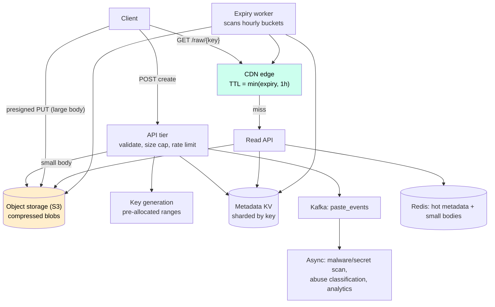

# Case Study 14 — Pastebin

**Archetype:** KV mapping + blob storage. Superficially
[the URL shortener](01-url-shortener.md) with a bigger payload — and that "bigger
payload" is the entire interview. The moment the value stops fitting comfortably in a
database row, you inherit a **metadata/blob split**, a CDN, expiry-driven deletion, and
an abuse problem. Candidates who treat it as "shortener with a `TEXT` column" get
filtered on the storage math.

---

## 1. Requirements

**Functional (in scope)**
1. Create a paste: arbitrary text (up to a limit), get back a short URL.
2. Read a paste by its key — the dominant operation.
3. **Expiry**: never / 10 min / 1 day / 1 month, and burn-after-read.
4. **Visibility**: public (listed/searchable), unlisted (link-only), password-protected.
5. Optional: custom alias, syntax language hint, raw download, edit-by-owner.

**Out of scope (say why):** collaborative real-time editing (that's
[Google Docs](00-index-and-template.md) — OT/CRDT, a different problem), full-text search
over all pastes (mention it as an add-on), diffing/versioning, code execution.

**Non-functional**

| Dimension | Target |
|---|---|
| Writes | 1 M new pastes/day (~12/s avg, ~50/s peak) |
| Reads | 100 M/day (~1.2 K/s avg, ~5 K/s peak) — **~100:1 read-heavy** |
| Paste size | p50 ~10 KB, p99 ~1 MB, **hard cap 10 MB** |
| Latency | Read p99 < 300 ms including body; metadata < 50 ms |
| Availability | 99.99% reads, 99.9% writes |
| Consistency | Read-your-writes after create; eventual elsewhere is fine |
| Durability | 11 nines for stored content (object storage) |
| Retention | Honour expiry **exactly** — expired content must become unreadable |

**Frame it in one line:** *"The read path is 100:1 and the payload averages 10 KB, so this
is a content-delivery problem with a small key-value index in front of it. I'll split
metadata from blob and put the blob behind a CDN."* That framing is the difference
between this and the URL shortener, and stating it up front saves ten minutes.

---

## 2. Estimation

```
Writes: 1 M/day  = ~12/s  (peak ~50/s)        -> trivial write QPS
Reads : 100 M/day = ~1.2 K/s (peak ~5 K/s)    -> modest QPS, but see bandwidth

Storage (the real number):
  1 M pastes/day x 10 KB avg = 10 GB/day
  x 365 = ~3.6 TB/year, x5 years = ~18 TB   (x3 replication if self-managed = 54 TB)
  Compressed (text compresses ~4-5x)        = ~4 TB for 5 years

Read bandwidth:
  1.2 K/s x 10 KB = 12 MB/s avg  (~100 Mbps)
  Peak with a viral paste: 50 K/s x 10 KB = 500 MB/s = 4 Gbps  -> CDN, not origin

Metadata: 1 M/day x ~300 B = 300 MB/day -> ~550 GB for 5 years. Tiny. Fits one
          sharded KV cluster with room to spare.

Cache: hot set is heavily skewed — ~1% of pastes get ~90% of reads.
       Hot pastes/day ≈ 10 K x 10 KB = 100 MB. Trivially cacheable.
```

**Conclusions**
1. **QPS is unremarkable; bytes are the problem.** 1000x more data per record than the
   shortener → metadata in a KV store, body in object storage.
2. **Bandwidth spikes, not request spikes, are the failure mode** — one paste on the
   front page of a news aggregator. → CDN with cache-friendly URLs.
3. Text compresses ~5x → **compress on write**, it's the cheapest win in the design.
4. Hot set is tiny (100 MB) → an in-memory cache in front of the blob store absorbs
   almost everything.
5. Expiry deletes ~as much as you write → **deletion is a first-class subsystem**, not a
   cron afterthought.

---

## 3. Core entities & API

**Core entities**

| Entity | What it is | Notes |
|---|---|---|
| **Paste** | Metadata: `key`, `blobId`, size, language, visibility, `expiresAt`, `burnAfterRead` | ~300 B, read on every request, cached aggressively |
| **Blob** | The compressed body in object storage, addressed by `blobId` | 10 KB–10 MB, served via CDN or signed URL. Never travels through the DB |
| **Owner** | Optional account holding edit/delete rights and quotas | Anonymous pastes get a delete token instead of an owner |
| **ScanResult** | Async abuse/secret-scan verdict attached to a paste | Drives quarantine without destroying the content behind the decision |

**Paste and Blob being separate entities is the entire design.** They differ by three
orders of magnitude in size, have different cache TTLs, different durability needs, and
different per-byte costs — so they get different stores.

**Interface**

```
POST /v1/pastes                    Idempotency-Key: <uuid>
  { content, expiresIn?: "10m"|"1d"|"1M"|"never", visibility: public|unlisted|private,
    password?, language?, burnAfterRead?: bool, customAlias? }
  -> 201 { key, url, rawUrl, expiresAt }
  -> 413 if body > 10 MB, 409 if alias taken

GET /v1/pastes/{key}               # metadata + body (or a signed blob URL)
  -> 200 { key, language, createdAt, expiresAt, size, content | contentUrl }
  -> 404 unknown, 410 Gone (expired/burned), 401 if password required

GET /raw/{key}                     # plain text, CDN-cacheable
POST /v1/pastes/{key}/unlock       { password } -> short-lived signed URL
DELETE /v1/pastes/{key}            # owner or delete-token
```

Details worth volunteering:
- **Large bodies bypass the API tier.** Above ~1 MB, issue a **presigned S3 URL** and let
  the client PUT directly, then confirm. Streaming 10 MB through your app servers wastes
  memory and connections for zero benefit.
- **`410 Gone`, not `404`,** for expired pastes — semantically correct and lets the client
  distinguish "never existed" from "existed and is gone". Small detail, real signal.
- **`Cache-Control` differs by visibility:** `public, max-age=...` for public pastes (CDN
  caches them), `private, no-store` for password-protected ones. Getting this wrong leaks
  private content out of a shared cache — call it out.

---

## 4. The naive design, and why it breaks

```sql
CREATE TABLE pastes (
  key        VARCHAR(8) PRIMARY KEY,
  content    TEXT,                       -- up to 10 MB, in the row
  expires_at TIMESTAMP
);
-- create: INSERT
-- read:   SELECT content FROM pastes WHERE key = ?  -> render
-- expiry: DELETE FROM pastes WHERE expires_at < NOW()   (nightly cron)
```

One table, three statements. Because the QPS here is genuinely modest — ~5 K/s peak — it's
tempting to conclude this scales fine. It doesn't, and the reasons have nothing to do with
request rate:

| What breaks | The number that breaks it | Consequence |
|---|---|---|
| **Large rows** | 10 GB/day of 10 KB-10 MB values | The DB's page cache fills with paste bodies instead of index pages, replication ships every byte to every replica, and per-byte cost is ~50x object storage |
| **Bandwidth, not QPS** | One paste linked from a busy forum: 50 K req/s × 10 KB | **4 Gbps out of your origin.** The request count is survivable; the byte count is not |
| **10 MB through the app tier** | p99 paste size | Each upload buffers megabytes in application memory and holds a connection, for a body the database shouldn't be storing anyway |
| **Expiry as a nightly `DELETE`** | ~1 M expiries/day | Between the expiry time and the cron run, **expired content is still readable** — that's a correctness bug, not a cleanup lag. And a bulk `DELETE` of a million large rows is a vacuum/compaction event |

**Two reframes:**

1. **Split metadata from body.** The 300 B row is hot, relational and read on every
   request; the 10 KB-10 MB body is cold, immutable and belongs in object storage, reached
   by a pre-signed URL for large uploads ([§6](#6-high-level-architecture)).
2. **Expiry is checked on read, not enforced by deletion.** A lazy `expires_at` comparison
   on every read makes expiry *correct immediately*; store TTLs and a bucketed sweeper then
   reclaim metadata and bytes as a cost optimisation rather than a correctness mechanism
   ([§7](#7-deep-dive--expiry-and-deletion)).

Once the body lives at an immutable, keyed URL, the bandwidth problem solves itself: pastes
never change, so a CDN can cache them at the edge indefinitely and origin load scales with
*distinct hot pastes* rather than with requests ([§8](#8-deep-dive--serving-the-body-and-the-viral-paste)).

**The instinct to resist:** "it's just a URL shortener with a bigger column." The index and
key generation really do carry over unchanged — say so, it saves time. But a value 1000x
larger changes the storage tier, forces a CDN, moves uploads off the app tier, and turns
deletion into a real subsystem. **Scale changes kind, not just degree**, and recognising
where that threshold sits is the skill being tested.

---

## 5. Data model

```
Table pastes                       (KV store: DynamoDB / Cassandra)
  PK: key                          <- hash-partitioned, all access is a point lookup
  blob_id, size, content_hash, language, visibility, password_hash,
  owner_id?, created_at, expires_at, burn_after_read, is_deleted

Blob storage (S3)
  s3://pastes/{shard_prefix}/{blob_id}     gzip/zstd-compressed body
  Object lifecycle rules for coarse cleanup; explicit deletes for exact expiry

Table expiry_index                 (only for pastes with an expiry)
  PK: expiry_bucket (hour)   CK: key       <- the deletion worker scans one bucket
```

Three decisions to defend:
- **Metadata and blob are separate** because they have different access patterns, sizes,
  cost profiles, and cache TTLs. Metadata is 300 B and read on every request; the blob is
  10 KB and served from CDN or a signed URL.
- **`key` is the partition key, hash-distributed.** Every read is a point lookup; there is
  no range query anyone needs. This is the same reasoning as the shortener.
- **`content_hash` enables dedup.** Identical pastes (people paste the same stack trace
  repeatedly) share one blob with a refcount. Worth mentioning as a cost optimisation;
  worth *not* doing if it complicates deletion — say which you'd pick and why.

---

## 6. High-level architecture



**Write path:** validate size and rate limits, generate a key (pre-allocated counter
ranges, obfuscated, base62 — same machinery as the shortener, and say so rather than
re-deriving it), compress and store the blob, then write metadata **last**. Metadata write
is the commit point: a blob with no metadata row is invisible garbage that a sweeper
collects; a metadata row pointing at a missing blob is a broken paste. Order matters, and
this ordering fails safe.

**Read path:** CDN first (public pastes hit almost 100%), then Redis for hot
metadata + small bodies, then the metadata KV, then S3 for the body. Expiry is checked at
**every** layer, because a CDN or cache entry can outlive its paste.

---

## 7. Deep dive — expiry and deletion

This is the sub-problem the URL shortener doesn't have at this weight, and it's where the
interesting failure modes live. Deletion must be **correct** (expired content is truly
unreadable), **timely**, and **cheap** at ~1 M deletions/day.

Three mechanisms, layered:

| Mechanism | Role |
|---|---|
| **Lazy check on read** | Every read compares `expires_at` to now and returns `410` if past, regardless of what's still on disk. This is what makes expiry *correct* |
| **TTL in the metadata store** | DynamoDB TTL / Cassandra TTL removes metadata automatically, no worker needed. Timely but not instant (DynamoDB TTL is best-effort within ~48 h) |
| **Bucketed sweeper** | Worker reads `expiry_index` for the hour bucket that just closed, deletes blobs in batches, purges CDN. This is what reclaims *storage* |

**Why all three?** Lazy check gives correctness immediately. Store TTL keeps metadata
tidy without work. The sweeper is the only thing that reclaims S3 bytes, which is where
the money is. Explaining that each one solves a different half of the problem is the
answer; picking one and calling it done is not.

**Traps to name:**
- **CDN caches outlive pastes.** Set `Cache-Control: max-age = min(time_to_expiry, 1h)`
  so an edge object can never outlive the paste, and **purge on delete** for anything
  sensitive. Never cache a paste at the edge for longer than it will exist.
- **Burn-after-read is a race.** Two concurrent readers must not both see it. Use a
  **conditional update** (`UPDATE ... IF burned = false`) as the gate: the winner serves
  the content, the loser gets `410`. Delete the blob asynchronously afterwards.
- **Deletion at 1 M/day is a bulk job.** Batch S3 deletes (1000 keys per call), and rate-
  limit the sweeper so cleanup never competes with serving traffic.
- **"never expires" is a lie you'll regret.** Have a policy for abandoned content
  (e.g. anonymous pastes untouched for N years) or storage grows forever. Saying you'd
  *design the policy hook now and set it to infinity today* is the mature answer.

---

## 8. Deep dive — serving the body, and the viral paste

The failure mode is not 5 K QPS; it's **one paste getting 50 K requests/s** when it's
linked from a popular thread.

- **CDN does the work.** `/raw/{key}` is an immutable, keyed, public URL — perfect CDN
  material. A single hot object is served entirely from edge caches; origin sees one
  request per edge per TTL.
- **Immutability is the property that makes this easy.** Pastes don't change (edit
  creates a new version/key), so cache invalidation is only needed for deletion, not for
  updates. Point this out — it's why this is much easier than caching a mutable document.
- **Private pastes can't use a shared CDN cache.** Serve them from origin with
  `no-store`, or via **short-lived presigned URLs** (5 min) so the object is fetched
  directly from S3 without a cacheable public URL. Don't invent a bespoke proxy.
- **Origin protection:** request coalescing at the edge so a cold viral object produces
  one origin fetch rather than 50 K; plus a small Redis layer holding hot bodies under
  ~64 KB so origin misses rarely reach S3.
- **Compression:** store `zstd`/`gzip`-compressed and serve with `Content-Encoding: gzip`
  — no decompress on the server, 5x less bandwidth and 5x less storage. One decision, two
  wins.

---

## 9. Deep dive — abuse, and why it's mandatory here

An anonymous "post arbitrary content, get a public URL" service is an attractive host for
malware droppers, phishing pages, leaked credentials, and pirated data. If you don't raise
this, a senior interviewer will, and "I'd add a filter" is not an answer.

- **Rate limits per IP and per account** at create time, plus proof-of-work/CAPTCHA for
  anonymous users above a threshold. Reuse the [rate limiter](04-rate-limiter.md) design.
- **Async scanning, not inline.** Publish to Kafka on create; scanners look for malware
  signatures, known-secret patterns (AWS keys, private keys — high-value and easy to
  regex), and phishing markers. Inline scanning would add hundreds of ms to every write
  for a check that's wrong at the margins anyway.
- **Quarantine, don't delete.** Flagged pastes become unreadable pending review, with the
  content retained for appeal and for tuning the classifier. Same principle as tagging
  rejected clicks in [ad aggregation](11-ad-click-aggregation.md): never destroy the
  evidence you'll need to explain a decision.
- **Serve raw content safely.** `Content-Type: text/plain; charset=utf-8`,
  `X-Content-Type-Options: nosniff`, and a separate no-cookie domain for `/raw/`. Without
  these, a paste containing HTML+JS becomes stored XSS on your own domain — this is a real
  vulnerability class, not a hypothetical.
- **Takedown path:** an operator API that deletes metadata, blob, and purges the CDN in
  one action, with an audit record. Legal requests have deadlines.

---

## 10. Failure modes

| Failure | Behaviour / mitigation |
|---|---|
| Blob written, metadata write fails | Paste is invisible; an orphan sweeper reconciles S3 against metadata and deletes unreferenced blobs older than N hours. **Fails safe** — this is why metadata is written last |
| Metadata exists, blob missing | Broken read. Return `500`/`410` with a clear error, alert; caused only by an out-of-order delete, which the reconciliation job detects |
| S3 unavailable | Reads of cached/CDN'd pastes still work; cold reads fail. Writes fail fast with `503` — do **not** buffer 10 MB bodies in app memory hoping S3 returns |
| Metadata store partition down | That key range is unreadable. Reads fail closed (better than serving wrong content); the CDN keeps serving already-cached public pastes |
| CDN serves an expired/deleted paste | Prevented by `max-age = min(ttl, 1h)` and an explicit purge on delete. This is the correctness bug most candidates miss |
| Viral paste melts origin | Edge caching + request coalescing + hot-body Redis layer. Origin sees ~1 request per edge per TTL |
| Sweeper falls behind | Storage grows and expired blobs linger — but reads still return `410` thanks to the lazy check, so it's a **cost** incident, not a correctness one. Alert on sweeper lag |
| Duplicate create on retry | Idempotency key returns the original `key` instead of creating a second paste |
| Someone uploads 10 MB x 1000 | Per-user storage quotas and create rate limits; reject at the API before the presigned URL is issued |

---

## 11. Scale evolution

- **10x reads:** almost free — the CDN absorbs it. Origin load scales with *distinct hot
  pastes*, not with request volume, which is the whole point of the immutable-URL design.
- **10x writes (10 M/day, 100 GB/day):** metadata KV shards linearly; S3 is effectively
  infinite. The real pressure moves to the **sweeper** (10 M deletes/day) — parallelise by
  expiry bucket and batch S3 deletes.
- **10x paste size (100 MB "logs"):** now it's a file-hosting product. Switch to
  multipart/chunked upload and resumable transfer, and reconsider whether text semantics
  (syntax highlighting, raw view) still apply. See
  [file sync](08-file-sync-storage.md) for the chunked model.
- **Search over public pastes:** a separate index (Elasticsearch/OpenSearch) fed from the
  same Kafka topic, covering public pastes only. Never index unlisted or private content —
  that's a privacy incident waiting to happen.
- **Multi-region:** metadata replicated with a home region per key; blobs in S3 with
  cross-region replication for hot content, or simply rely on the CDN for global reach.
  Writes stay regional; reads are global by virtue of the edge.

---

## 12. Trade-offs summary

| Decision | Chose | Alternative | Why |
|---|---|---|---|
| Storage split | Metadata KV + blob in S3 | Body in a `TEXT`/`BLOB` column | 10 KB–10 MB rows destroy DB cache efficiency and cost ~50x more per byte |
| Body delivery | CDN on immutable `/raw/{key}` | Serve from app tier | One viral paste is 4 Gbps; edges absorb it and origin scales with distinct objects |
| Large uploads | Presigned direct-to-S3 PUT | Stream through the API tier | Keeps app servers stateless and memory-bounded |
| Write ordering | Blob first, metadata last | Metadata first | Orphan blobs are cheap garbage; dangling metadata is a broken user-visible paste |
| Expiry | Lazy read check + store TTL + bucketed sweeper | Cron delete only | Each solves a different half: correctness now, metadata tidiness free, bytes reclaimed in bulk |
| Compression | zstd/gzip at rest, served encoded | Store plain text | ~5x on both storage and bandwidth for one line of code |
| Key generation | Pre-allocated counter ranges, obfuscated, base62 | Random with collision check | No read-before-write, uniqueness by construction, non-enumerable keys |
| Private pastes | Origin/presigned, `no-store` | Same CDN path as public | A shared cache must never hold private content |
| Abuse handling | Async scan + quarantine | Inline scan, hard delete | Inline adds latency for a fuzzy check; quarantine preserves evidence and allows appeal |
| Dedup by content hash | Optional, refcounted | Always dedup | Saves storage on repeated stack traces but complicates deletion and per-paste expiry |

---

## 13. Rapid-fire probe answers

| Probe | Answer |
|---|---|
| "How is this different from a URL shortener?" | Same key-value index, but the value is 10 KB–10 MB instead of 200 B. That forces a metadata/blob split, a CDN for bandwidth, presigned uploads, and real deletion machinery. The key generation and read-heavy caching carry over unchanged |
| "Why not store the text in the database?" | 10 GB/day of large rows wrecks the DB's page cache, inflates replication traffic, and costs ~50x more per byte than object storage. Metadata is 300 B and hot; the body is large and cold — different stores |
| "What's the actual bottleneck?" | Not QPS — 5 K/s peak is small. It's bytes: one viral paste can be 4 Gbps. The CDN is the load-bearing component |
| "One paste is on the front page of Hacker News." | Immutable public URL → served entirely from CDN edges, with request coalescing so a cold object triggers one origin fetch. Origin load scales with distinct hot objects, not with requests |
| "How do you guarantee an expired paste is unreadable?" | Lazy check on every read returns `410` regardless of what's still on disk — that's the correctness guarantee. Store TTL and the bucketed sweeper reclaim metadata and bytes, but they're about cost, not correctness |
| "The CDN still has it cached after expiry." | Prevented by construction: edge TTL is `min(time_to_expiry, 1h)`, so an edge copy can't outlive the paste, plus an explicit purge on manual delete |
| "Burn-after-read with two simultaneous readers." | Conditional update as the gate — `UPDATE ... IF burned = false`. Exactly one reader wins and serves the content; the other gets `410`. Blob deletion happens asynchronously after |
| "Metadata write fails after the blob is stored." | The paste is simply invisible, and an orphan sweeper reconciles S3 against metadata and reclaims it. That's why metadata is written last — this ordering fails safe |
| "How do you handle a 10 MB paste?" | Presigned URL, client PUTs straight to S3, then confirms. Never stream 10 MB through the app tier — it burns memory and connections for no benefit |
| "Password-protected pastes — how?" | Store a hash (Argon2/bcrypt), never the password. On unlock, issue a short-lived signed URL. Mark responses `no-store` and keep them off the shared CDN path entirely |
| "Someone pastes JavaScript and sends the link around." | Serve `/raw/` as `text/plain` with `nosniff`, from a separate cookie-less domain. Otherwise a paste becomes stored XSS on your own origin — a real vulnerability, not a hypothetical |
| "How do you stop malware and leaked-credential hosting?" | Rate limits and CAPTCHA at create, async scanning off a Kafka topic for signatures and secret patterns, quarantine rather than delete so decisions can be appealed and the classifier tuned, plus an audited takedown API |
| "Do you dedup identical pastes?" | Optional: hash the content and refcount the blob. It genuinely saves storage on repeated stack traces, but it complicates per-paste expiry and deletion. I'd ship without it and add it when storage cost justifies the complexity |
| "How do you make public pastes searchable?" | Feed the same Kafka event stream into a search index, **public pastes only**. Indexing unlisted content is exactly how "unlisted" quietly becomes "public" |
| "1 M deletions a day — is that a problem?" | It's a bulk job, not a per-item one: sweep by hourly expiry bucket, batch S3 deletes 1000 at a time, and rate-limit so cleanup never competes with serving. If the sweeper lags, it costs money, not correctness |
