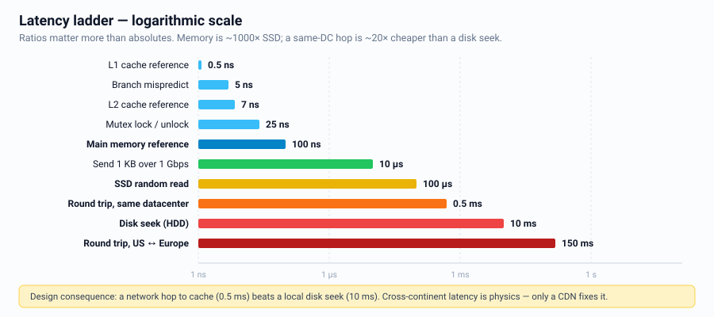
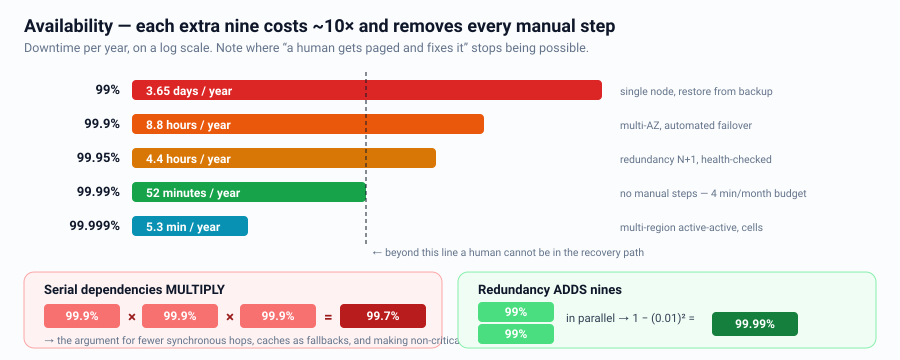

# Cheatsheet — Numbers & Estimation

Print this. Memorize the bold rows.

---

## Time & QPS conversions

| Period | Seconds |
|---|---|
| 1 hour | 3,600 |
| **1 day** | **86,400 ≈ 10^5** |
| 1 month | ~2.6 M |
| 1 year | ~31.5 M ≈ 3 × 10^7 |

| Daily volume | QPS |
|---|---|
| 100 K/day | ~1 |
| **1 M/day** | **~12** |
| 10 M/day | ~120 |
| 100 M/day | ~1,200 |
| **1 B/day** | **~12,000** |
| 10 B/day | ~120,000 |
| 100 B/day | ~1.2 M |

**Peak factor:** use 2–5x average. Default to **3x** and say so.

---

## Data sizes

| Item | Size |
|---|---|
| char / bool / tinyint | 1 B |
| int32 / float | 4 B |
| int64 / double / timestamp | 8 B |
| UUID | 16 B binary, 36 B as string |
| Typical DB row | 100 B – 1 KB |
| Tweet / short post | ~300 B |
| Chat message | ~200 B |
| JSON API response | 1–10 KB |
| Thumbnail | ~10 KB |
| Web page | ~1 MB |
| Photo | 1–5 MB |
| 1 min 1080p video | ~50 MB |
| 2 h HD movie | ~4 GB |

| Power of 2 | Value | Name |
|---|---|---|
| 2^10 | ~1,000 | KB |
| 2^20 | ~1 M | MB |
| 2^30 | ~1 B | GB |
| 2^40 | ~1 T | TB |
| 2^50 | ~1 P | PB |

---

## Latency numbers every engineer should know



| Operation | Time | Relative |
|---|---|---|
| L1 cache reference | 0.5 ns | 1x |
| Branch mispredict | 5 ns | |
| L2 cache reference | 7 ns | |
| Mutex lock/unlock | 25 ns | |
| **Main memory reference** | **100 ns** | 200x L1 |
| Compress 1 KB (Zippy) | 3 µs | |
| Send 1 KB over 1 Gbps | 10 µs | |
| **SSD random read** | **100 µs** | 1,000x memory |
| Read 1 MB sequentially from memory | 250 µs | |
| **Round trip within same datacenter** | **500 µs** | |
| Read 1 MB sequentially from SSD | 1 ms | |
| **Disk seek (HDD)** | **10 ms** | 100,000x memory |
| Read 1 MB sequentially from disk | 20 ms | |
| **Round trip CA → Netherlands → CA** | **150 ms** | |

**Derived rules:**
- Memory is ~1000x faster than SSD, SSD ~100x faster than HDD seek.
- A same-DC network hop (~0.5 ms) is cheaper than a disk seek (~10 ms) → distributed
  cache beats local disk.
- Cross-continent round trips are physics. Only a CDN/regional presence fixes them.

---

## Component capacities (safe interview defaults)

| Component | Capacity |
|---|---|
| App server (JSON API) | 1–5 K RPS |
| App server (WebSocket) | 10–100 K concurrent connections |
| NGINX / Envoy | 50–100 K+ RPS, 100 K+ connections |
| **PostgreSQL / MySQL (one primary)** | **~5–10 K writes/s, ~50 K cached reads/s** |
| Postgres useful connections | 100–500 (use a pooler) |
| **Redis (single node)** | **~100 K ops/s** (1 M+ pipelined) |
| Redis memory per node | 32–256 GB usable |
| **Cassandra (per node)** | **~10–50 K writes/s** |
| DynamoDB | Effectively unlimited with proper partitioning |
| **Kafka (per broker)** | **~100 MB/s+, ~1 M msg/s per cluster** |
| Elasticsearch (per node) | ~5–10 K docs/s indexing |
| S3 | 3,500 PUT/s, 5,500 GET/s **per prefix** |
| Single server | 64–256 GB RAM, 8–64 cores, 10 Gbps NIC |
| Typical HDD/SSD in a node | 1–20 TB |

Use these to justify sharding: *"We need 40 K writes/s and one Postgres primary gives
us ~8 K, so we need at least 5 shards — I'd start with 8 for headroom."*

---

## Availability



| SLA | Downtime/year | Downtime/month | Downtime/week |
|---|---|---|---|
| 99% | 3.65 d | 7.2 h | 1.68 h |
| 99.9% | 8.77 h | 43.8 min | 10.1 min |
| 99.95% | 4.38 h | 21.9 min | 5 min |
| **99.99%** | **52.6 min** | **4.38 min** | **1 min** |
| 99.999% | 5.26 min | 26 s | 6 s |

- **Serial:** `A × B × C` — chains reduce availability.
- **Parallel:** `1 − (1−A)^n` — redundancy increases it.
- Three 99.9% services in series → 99.7%.
- Two 99% components in parallel → 99.99%.

---

## Cost intuition (order of magnitude, cloud list prices)

| Resource | Ballpark |
|---|---|
| Object storage | ~$0.02 /GB-month |
| Object storage, archive tier | ~$0.001 /GB-month |
| Block storage (SSD) | ~$0.10 /GB-month |
| **Egress to internet** | **~$0.05–0.09 /GB** ← usually the biggest surprise |
| CDN egress | ~$0.02–0.08 /GB |
| Compute (2 vCPU / 8 GB) | ~$50–70 /month |
| Managed cache (32 GB) | ~$200–400 /month |
| Managed RDBMS (medium) | ~$300–1,000 /month |

**Key cost insight:** egress and inter-AZ traffic often exceed compute. That's an
argument for CDN hit rates, compression, AZ-local reads, and not shipping raw logs
everywhere.

---

## Estimation script (say it in this order)

```
1. DAU x actions/user/day = daily writes
2. / 10^5 = avg write QPS ;  x3 = peak
3. x read:write ratio = read QPS
4. record size x daily writes = storage/day ; x365 x3(replication) = storage/year
5. read QPS x response size = egress bandwidth
6. 20% of data = hot set = cache size
7. CONCLUSION: "therefore we need [shard / cache / CDN / async]"
```

---

## Sanity checks

- If your answer needs > 1,000 machines for a "medium" product, recheck the math.
- If storage per year exceeds a few PB, media is involved — separate it from the DB.
- If write QPS < 5 K, do **not** propose sharding; you'll look like you're
  pattern-matching instead of thinking.
- If read QPS > 50 K, a cache is almost certainly required.
- If p99 must be < 10 ms, the answer is in-memory and same-AZ.
