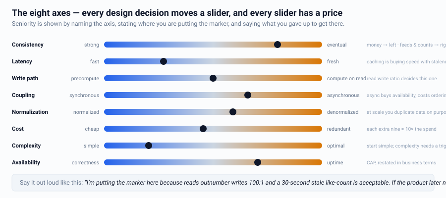
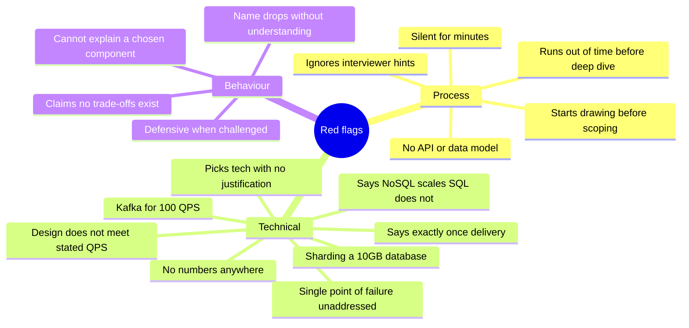
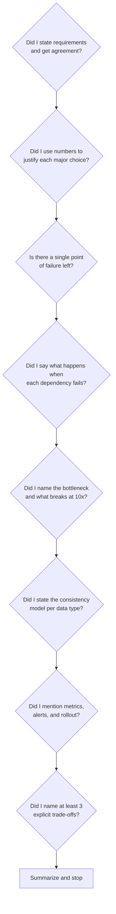

# Cheatsheet — Trade-off Phrases, Red Flags & Final Checklist

---

## The trade-off axes (every design decision sits on one)

Whenever you make a choice, name the axis and which side you picked. That single habit
is what "shows trade-off thinking" means.

---

## Phrase bank

### Framing a decision
- "There are two reasonable approaches here — X and Y. X optimizes for ___, Y for ___.
  Given the requirement that ___, I'll go with X."
- "This is a classic latency-vs-consistency trade-off. Since the product tolerates
  5 seconds of staleness, I'll take the latency win."
- "I'll start simple with ___ and I know exactly when I'd migrate: when ___ exceeds ___."

### Quantifying
- "One Postgres primary gives us roughly 8 K writes/s; we need 40 K, so we need at
  least 5 shards."
- "A 95% hit rate turns 200 K read QPS into 10 K reaching the database."
- "Media is 300x larger than the text, so it belongs in object storage, not the DB."

### Owning weaknesses
- "The weakness of this design is ___. I'd mitigate it with ___, and I'd detect it with
  the metric ___."
- "This adds operational complexity. It's worth it because ___ — otherwise I'd skip it."

### Handling being wrong
- "Good point — that breaks my assumption that ___. Let me revise: ___."
- "You're right, that would be a hot shard. Let me change the key to ___."

### Managing time
- "I've covered the high-level design. I could go deeper on the fan-out strategy or on
  the failure modes — which is more useful to you?"
- "Let me note that for later and keep moving through the core path."

### Closing strong
- "To summarize: the core constraints were ___; the key decisions were ___; the main
  risks are ___; and at 10x the first thing to break is ___."

---

## Red flags (things that lose offers)

### The specific claims that make interviewers wince
| Don't say | Say instead |
|---|---|
| "Exactly-once delivery" | "At-least-once + idempotent consumers = exactly-once effect" |
| "NoSQL is more scalable than SQL" | "This access pattern is a point lookup at 50 K writes/s, which is where a wide-column store fits better" |
| "CAP says pick two" | "During a partition you pick C or A; PACELC covers the normal case too" |
| "We'll use microservices" | "I'd start with a modular monolith and split when ___" |
| "Add a cache" (unprompted) | "Read:write is 50:1 and the hot set is 6 GB, so a cache gets us ___" |
| "It'll scale horizontally" | "The app tier is stateless so it scales linearly; the bottleneck moves to the DB, which I handle by ___" |

---

## The forgotten topics (mention one or two, stand out)

Most candidates never bring these up:

1. **Cost** — "This design costs roughly X; the cheaper variant gives up Y."
2. **Data migration** — "When we need to change the shard key, here's the zero-downtime
   plan."
3. **Backfill** — "New derived views need a backfill job; here's how I'd throttle it."
4. **Deletion & GDPR** — "Right-to-be-forgotten across caches, backups, and the event
   log — crypto-shredding solves the immutable parts."
5. **Testing the design** — "Shadow traffic and a load test before we cut over."
6. **Rollout** — "Canary at 1% with automated metric gates and feature flags."
7. **Multi-tenancy / noisy neighbours** — quotas and bulkheads.
8. **Clock skew** — "I don't rely on wall-clock ordering across nodes."
9. **Cold start / bootstrapping** — "The cache is empty on day one; here's the warmup."
10. **Team/ownership boundaries** — "These three services map to two teams; the contract
    between them is ___."

---

## Final 60-second self-check before you stop talking

---

## One-page master checklist

**Scope**
- [ ] 3–5 functional requirements agreed
- [ ] Explicit out-of-scope list
- [ ] NFRs quantified: scale, latency, consistency, availability, retention

**Estimation**
- [ ] Write QPS, read QPS, peak factor
- [ ] Storage/day and /year with replication
- [ ] Bandwidth and cache size
- [ ] A conclusion drawn from each number

**Design**
- [ ] 3–5 API endpoints with shapes, pagination, idempotency
- [ ] Data model with access patterns → store choice → indexes → shard key
- [ ] 8–12 box architecture, narrated as request paths
- [ ] Stateless app tier; state located deliberately

**Depth**
- [ ] One component deep-dived with alternatives compared
- [ ] Bottleneck identified and fixed; next bottleneck named
- [ ] Failure modes: node, AZ, region, dependency, hot key, overload
- [ ] Consistency model stated per data type

**Operations**
- [ ] Specific metrics and SLOs
- [ ] Deployment: canary, feature flags, rollback
- [ ] Migration/backfill plan
- [ ] Security basics: authz, encryption, rate limits, PII

**Communication**
- [ ] Managed time, checked in with the interviewer
- [ ] Named trade-offs explicitly
- [ ] Summarized at the end
