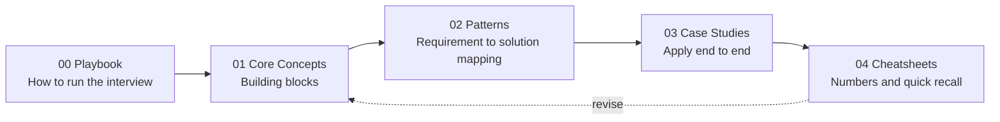

# HLD / System Design Prep — SDE2 & Senior

A structured, diagram-first guide to High Level Design interviews.

The goal of this repo is **not** to memorize 50 case studies. It is to build a
*mental index* so that when you hear a requirement, you immediately know which
concept/pattern to reach for and — more importantly — which trade-off you are making.

If you remember one thing, remember this:

---

## How to use this repo

| Order | Folder | What you get |
|---|---|---|
| 1 | [00-interview-playbook](00-interview-playbook) | The 45-min script, requirement gathering, estimation, SDE2 vs Senior bar |
| 2 | [01-core-concepts](01-core-concepts) | Every building block with diagrams + when to use / when NOT to use |
| 3 | [02-patterns](02-patterns) | **Signal → Pattern** decision trees. The "how do I know what to apply" part |
| 4 | [03-case-studies](03-case-studies) | Worked designs using the playbook |
| 5 | [04-cheatsheets](04-cheatsheets) | Latency numbers, capacity math, tech picker, red flags |

---

## Contents

### 00 — Interview Playbook
- [01 The interview framework](00-interview-playbook/01-interview-framework.md)
- [02 Requirements & back-of-envelope estimation](00-interview-playbook/02-requirements-and-estimation.md)
- [03 SDE2 vs Senior: what is actually graded](00-interview-playbook/03-sde2-vs-senior-bar.md)

### 01 — Core Concepts
- [01 Scalability & performance fundamentals](01-core-concepts/01-scalability-and-performance.md)
- [02 Load balancing & traffic management](01-core-concepts/02-load-balancing.md)
- [03 Caching](01-core-concepts/03-caching.md)
- [04 Databases & data modeling](01-core-concepts/04-databases-and-data-modeling.md)
- [05 Replication, partitioning & consistency](01-core-concepts/05-replication-partitioning-consistency.md)
- [06 Async messaging, queues & streams](01-core-concepts/06-async-messaging-and-streams.md)
- [07 API design & service communication](01-core-concepts/07-api-design-and-communication.md)
- [08 Blob storage, CDN & media pipelines](01-core-concepts/08-storage-cdn-and-media.md)
- [09 Search, indexing & analytics](01-core-concepts/09-search-and-analytics.md)
- [10 Reliability, resiliency & rate limiting](01-core-concepts/10-reliability-and-resiliency.md)
- [11 Observability, deployment & operations](01-core-concepts/11-observability-and-operations.md)
- [12 Security, auth & multi-tenancy](01-core-concepts/12-security-and-multitenancy.md)

### 02 — Patterns
- [00 Pattern selection guide (decision trees)](02-patterns/00-pattern-selection-guide.md)
- [01 Building blocks catalogue](02-patterns/01-building-blocks-catalogue.md)
- [02 Distributed systems patterns](02-patterns/02-distributed-systems-patterns.md)

### 03 — Case Studies
- [00 Index & reusable template](03-case-studies/00-index-and-template.md)
- [01 URL shortener](03-case-studies/01-url-shortener.md)
- [02 News feed](03-case-studies/02-news-feed.md)
- [03 Chat / messaging](03-case-studies/03-chat-messaging.md)

### 04 — Cheatsheets
- [01 Latency & capacity numbers](04-cheatsheets/01-numbers-and-estimation.md)
- [02 Technology picker](04-cheatsheets/02-technology-picker.md)
- [03 Trade-off phrases & red flags](04-cheatsheets/03-tradeoff-phrases-and-red-flags.md)

---

## The one-line summary of every HLD interview

> **Every scaling problem is solved by one of five moves:**
> *cache it, shard it, queue it, replicate it, or precompute it.*
> Your job is to explain **which one, why, and what it costs.**

---

## Suggested 3-week plan

| Week | Focus |
|---|---|
| 1 | Playbook + Core concepts 01–06. Do estimation drills daily. |
| 2 | Core concepts 07–12 + Patterns folder. Draw each diagram from memory. |
| 3 | 1 case study per day, timed at 45 min, out loud. Review cheatsheets before each. |
